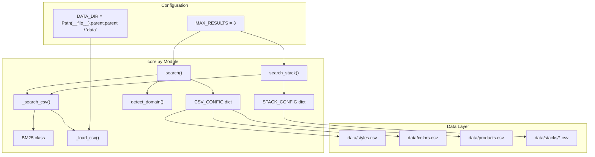
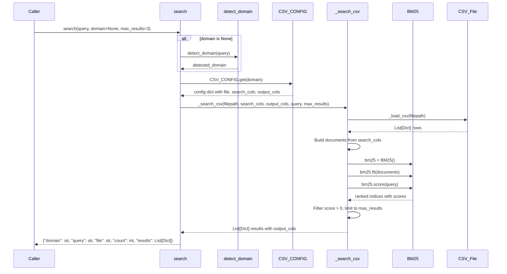
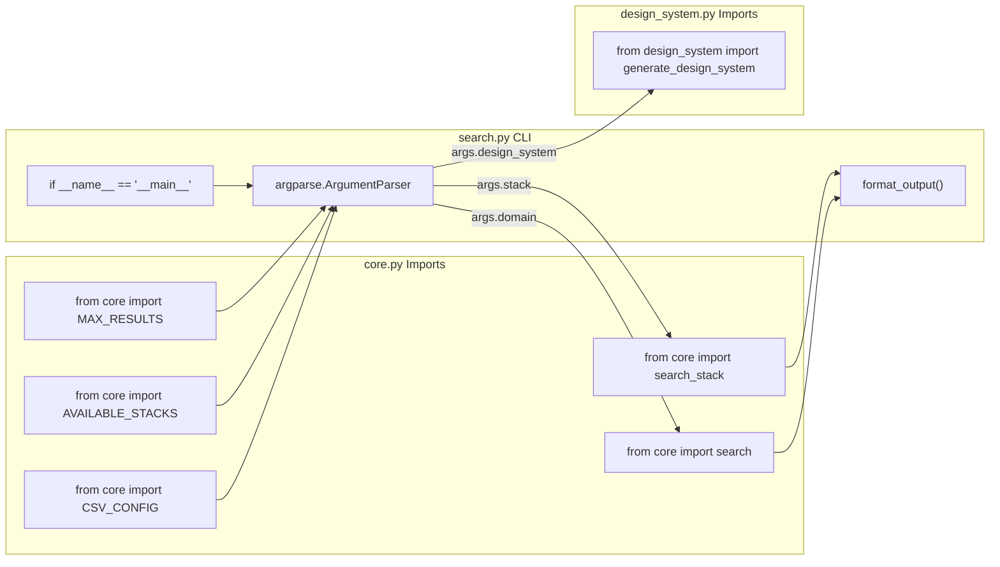

# Search Engine

<details>
<summary>Relevant source files</summary>

The following files were used as context for generating this wiki page:

- [.claude/skills/ui-ux-pro-max/scripts/core.py](.claude/skills/ui-ux-pro-max/scripts/core.py)
- [.claude/skills/ui-ux-pro-max/scripts/search.py](.claude/skills/ui-ux-pro-max/scripts/search.py)
- [cli/assets/scripts/search.py](cli/assets/scripts/search.py)
- [src/ui-ux-pro-max/data/stacks/flutter.csv](src/ui-ux-pro-max/data/stacks/flutter.csv)
- [src/ui-ux-pro-max/data/stacks/jetpack-compose.csv](src/ui-ux-pro-max/data/stacks/jetpack-compose.csv)
- [src/ui-ux-pro-max/data/stacks/shadcn.csv](src/ui-ux-pro-max/data/stacks/shadcn.csv)
- [src/ui-ux-pro-max/scripts/core.py](src/ui-ux-pro-max/scripts/core.py)
- [src/ui-ux-pro-max/scripts/search.py](src/ui-ux-pro-max/scripts/search.py)

</details>


The Search Engine is the core BM25-based retrieval system that powers all domain and stack queries in UI/UX Pro Max. It provides probabilistic ranking of design resources from CSV databases, automatic domain detection, and a unified interface for searching across 11 design domains and 16 technology stacks.

For details on the BM25 algorithm parameters and scoring implementation, see [BM25 Algorithm Implementation](#5.1). For command-line usage and flags, see [search.py CLI Interface](#5.2). For domain routing logic, see [Domain Detection and Configuration](#5.3).

## Architecture Overview

The search engine consists of three main components: the `BM25` class for probabilistic ranking, configuration dictionaries that map domains to CSV files, and search functions that orchestrate the retrieval pipeline.

**Core Components and Their Relationships**



Sources: [src/ui-ux-pro-max/scripts/core.py:1-254]()

## Configuration Dictionaries

The search engine uses two dictionaries to map logical domains to physical CSV files and define which columns to search and return.

### CSV_CONFIG Structure

The `CSV_CONFIG` dictionary defines 11 domain mappings (updated in v2.5.0) with `search_cols` (fields to index) and `output_cols` (fields to return):

| Domain | File | Search Columns | Output Columns | Use Case |
|--------|------|----------------|----------------|----------|
| `style` | `styles.csv` | Style Category, Keywords, Best For, Type, AI Prompt Keywords | 16 columns including Primary Colors, Effects, Framework Compatibility, Implementation Checklist | UI style recommendations |
| `color` | `colors.csv` | Product Type, Notes | Primary/Secondary/Accent/Background/Card/Muted/Border hex codes | Color palette selection |
| `chart` | `charts.csv` | Data Type, Keywords, Best Chart Type, Accessibility Notes | Chart type, library recommendation, interactivity, A11y fallback | Data visualization guidance |
| `landing` | `landing.csv` | Pattern Name, Keywords, Conversion Optimization, Section Order | Section order, CTA placement, color strategy | Landing page structure |
| `product` | `products.csv` | Product Type, Keywords, Primary Style Recommendation, Key Considerations | Style recommendations, color palette focus | Product-based style routing |
| `ux` | `ux-guidelines.csv` | Category, Issue, Description, Platform | Do/Don't, Code Examples, Severity | UX best practices |
| `typography` | `typography.csv` | Font Pairing Name, Category, Mood/Style Keywords, Best For, Heading/Body Font | Google Fonts URL, CSS Import, Tailwind Config | Font pairing selection |
| `icons` | `icons.csv` | Category, Icon Name, Keywords, Best For | Library, Import Code, Usage, Style | Icon recommendations |
| `react` | `react-performance.csv` | Category, Issue, Keywords, Description | Do/Don't, Code Examples, Severity | React-specific performance |
| `web` | `app-interface.csv` | Category, Issue, Keywords, Description | Do/Don't, Code Examples, Severity | Web interface guidelines |
| `google-fonts` | `google-fonts.csv` | Family, Category, Stroke, Classifications, Keywords | Styles, Variable Axes, Popularity Rank | Direct font metadata search |

Sources: [src/ui-ux-pro-max/scripts/core.py:17-73]()

### STACK_CONFIG Structure

The `STACK_CONFIG` dictionary maps 16 technology stacks to their CSV files. All stacks share common column definitions stored in `_STACK_COLS`:

```python
STACK_CONFIG = {
    "react": {"file": "stacks/react.csv"},
    "nextjs": {"file": "stacks/nextjs.csv"},
    "vue": {"file": "stacks/vue.csv"},
    # ... 13 more stacks including shadcn, jetpack-compose, flutter, laravel
}

_STACK_COLS = {
    "search_cols": ["Category", "Guideline", "Description", "Do", "Don't"],
    "output_cols": ["Category", "Guideline", "Description", "Do", "Don't", 
                    "Code Good", "Code Bad", "Severity", "Docs URL"]
}
```

**Available Stacks**: `react`, `nextjs`, `vue`, `svelte`, `astro`, `swiftui`, `react-native`, `flutter`, `nuxtjs`, `nuxt-ui`, `html-tailwind`, `shadcn`, `jetpack-compose`, `threejs`, `angular`, `laravel`.

Sources: [src/ui-ux-pro-max/scripts/core.py:75-98]()

## BM25 Implementation

The `BM25` class implements the BM25 (Best Match 25) probabilistic ranking algorithm with configurable parameters `k1=1.5` (term frequency saturation) and `b=0.75` (document length normalization).

### Class Structure

| Method | Purpose | Parameters | Returns |
|--------|---------|------------|---------|
| `__init__(k1, b)` | Initialize with tuning parameters | `k1=1.5`, `b=0.75` | None |
| `tokenize(text)` | Lowercase, split, filter stopwords | `text: str` | `List[str]` |
| `fit(documents)` | Build IDF index from corpus | `documents: List[str]` | None |
| `score(query)` | Rank all documents against query | `query: str` | `List[Tuple[int, float]]` |

**Tokenization Logic** ([src/ui-ux-pro-max/scripts/core.py:117-120]()):
- Remove non-alphanumeric characters: `re.sub(r'[^\w\s]', ' ', str(text).lower())`
- Filter tokens shorter than 3 characters
- Return lowercase tokens

**IDF Calculation** ([src/ui-ux-pro-max/scripts/core.py:138-139]()):
```python
self.idf[word] = log((self.N - freq + 0.5) / (freq + 0.5) + 1)
```
Where `N` is corpus size and `freq` is document frequency of term.

**BM25 Scoring Formula** ([src/ui-ux-pro-max/scripts/core.py:157-159]()):
```python
numerator = tf * (self.k1 + 1)
denominator = tf + self.k1 * (1 - self.b + self.b * doc_len / self.avgdl)
score += idf * numerator / denominator
```

Sources: [src/ui-ux-pro-max/scripts/core.py:104-164]()

## Search Functions

The module exposes primary search functions that orchestrate the retrieval pipeline.

### search() Function Flow



Sources: [src/ui-ux-pro-max/scripts/core.py:221-240]()

### search_stack() Function

The `search_stack()` function provides specialized search for technology stack guidelines:

```python
def search_stack(query, stack, max_results=MAX_RESULTS):
    """Search stack-specific guidelines"""
    if stack not in STACK_CONFIG:
        return {"error": f"Unknown stack: {stack}. Available: {', '.join(AVAILABLE_STACKS)}"}
    
    filepath = DATA_DIR / STACK_CONFIG[stack]["file"]
    results = _search_csv(filepath, _STACK_COLS["search_cols"], _STACK_COLS["output_cols"], query, max_results)
    
    return {
        "domain": "stack",
        "stack": stack,
        "query": query,
        "file": STACK_CONFIG[stack]["file"],
        "count": len(results),
        "results": results
    }
```

Sources: [src/ui-ux-pro-max/scripts/core.py:243-262]()

## Domain Detection System

The `detect_domain()` function uses keyword scoring to automatically route queries to the most appropriate domain.

**Keyword Mapping Examples** ([src/ui-ux-pro-max/scripts/core.py:203-214]()):

| Domain | Trigger Keywords |
|--------|------------------|
| `color` | color, palette, hex, #, rgb |
| `chart` | chart, graph, visualization, trend, bar, pie, heatmap |
| `landing` | landing, page, cta, conversion, hero, testimonial |
| `product` | saas, ecommerce, fintech, healthcare, gaming, crypto |
| `style` | style, design, ui, minimalism, glassmorphism, neumorphism |
| `ux` | ux, usability, accessibility, wcag, touch, scroll |
| `typography` | font, typography, heading, serif, sans |
| `icons` | icon, icons, lucide, heroicons, symbol |
| `react` | react, next.js, suspense, memo, usecallback, rsc |
| `web` | aria, focus, outline, semantic, virtualize, form |

**Scoring Algorithm** ([src/ui-ux-pro-max/scripts/core.py:216-218]()):
```python
scores = {domain: sum(1 for kw in keywords if kw in query_lower) 
          for domain, keywords in domain_keywords.items()}
best = max(scores, key=scores.get)
return best if scores[best] > 0 else "style"  # Default to style
```

Sources: [src/ui-ux-pro-max/scripts/core.py:199-219]()

## Integration with CLI

The `search.py` CLI script imports and orchestrates the core search functions.

**Module Imports and Function Delegation**



**Command-Line Arguments** ([src/ui-ux-pro-max/scripts/search.py:57-72]()):

| Argument | Type | Purpose | Example |
|----------|------|---------|---------|
| `query` | str | Search query (positional) | `"glassmorphism dark mode"` |
| `--domain`, `-d` | choice | Force specific domain | `--domain style` |
| `--stack`, `-s` | choice | Search stack guidelines | `--stack react` |
| `--max-results`, `-n` | int | Limit results (default: 3) | `-n 5` |
| `--json` | flag | Output JSON format | `--json` |
| `--design-system`, `-ds` | flag | Generate full design system | `--design-system` |
| `--persist` | flag | Save to filesystem (Master/Overrides) | `--persist` |
| `--page` | str | Create page override | `--page "dashboard"` |

Sources: [src/ui-ux-pro-max/scripts/search.py:1-115]()

## Usage Examples

### Domain Search
```bash
# Auto-detect domain
python3 search.py "glassmorphism dark mode"

# Force specific domain
python3 search.py "elegant serif" --domain typography

# JSON output
python3 search.py "saas dashboard" --domain product --json
```

### Stack Search
```bash
# Search React guidelines
python3 search.py "memo usecallback" --stack react

# Search Shadcn patterns
python3 search.py "dialog accessibility" --stack shadcn

# Search Flutter widgets
python3 search.py "stateless vs stateful" --stack flutter
```

Sources: [src/ui-ux-pro-max/scripts/search.py:5-15]()
