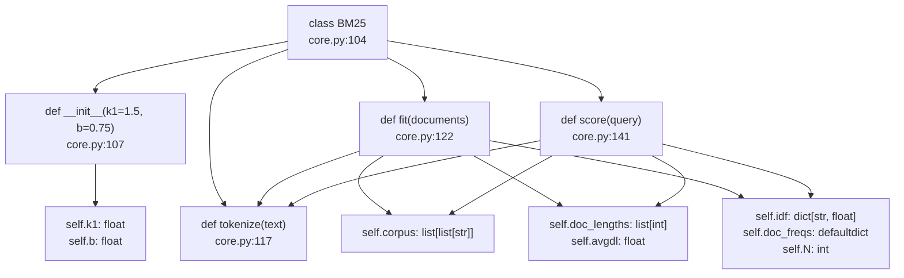
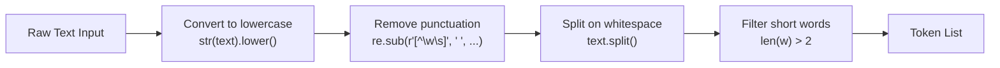
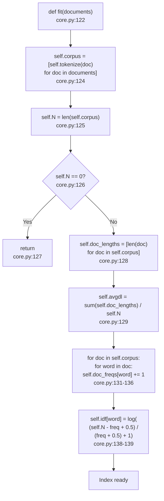
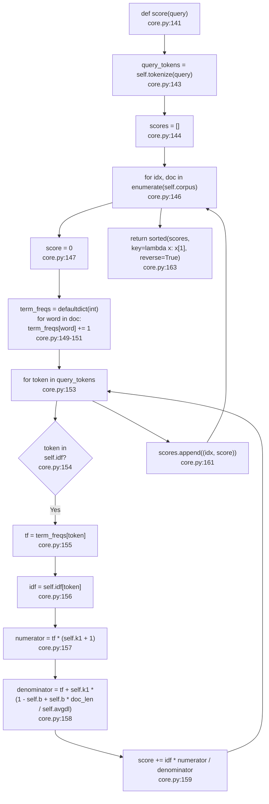
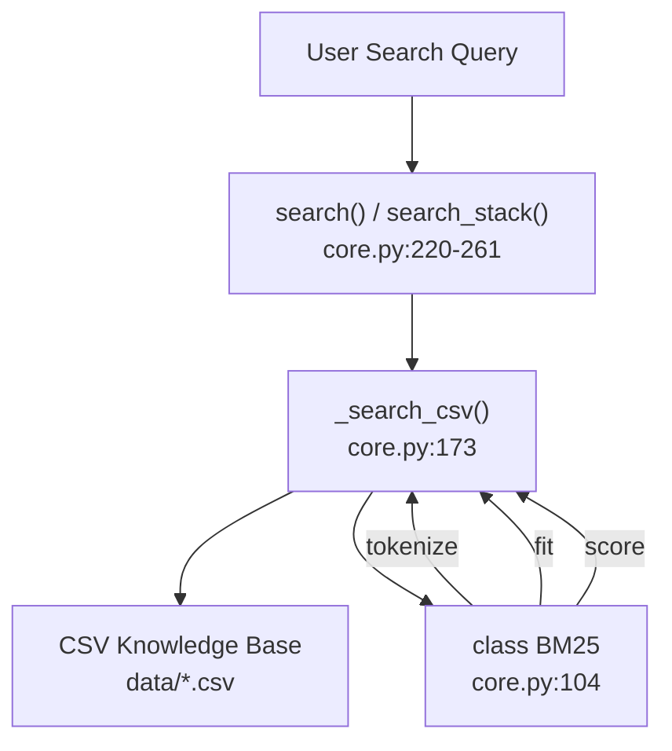

# BM25 Algorithm Implementation

<details>
<summary>Relevant source files</summary>

The following files were used as context for generating this wiki page:

- [.claude/skills/ui-ux-pro-max/scripts/core.py](.claude/skills/ui-ux-pro-max/scripts/core.py)
- [.claude/skills/ui-ux-pro-max/scripts/search.py](.claude/skills/ui-ux-pro-max/scripts/search.py)
- [cli/assets/scripts/core.py](cli/assets/scripts/core.py)
- [cli/assets/scripts/design_system.py](cli/assets/scripts/design_system.py)
- [cli/assets/scripts/search.py](cli/assets/scripts/search.py)
- [src/ui-ux-pro-max/data/stacks/flutter.csv](src/ui-ux-pro-max/data/stacks/flutter.csv)
- [src/ui-ux-pro-max/data/stacks/jetpack-compose.csv](src/ui-ux-pro-max/data/stacks/jetpack-compose.csv)
- [src/ui-ux-pro-max/data/stacks/shadcn.csv](src/ui-ux-pro-max/data/stacks/shadcn.csv)
- [src/ui-ux-pro-max/scripts/core.py](src/ui-ux-pro-max/scripts/core.py)
- [src/ui-ux-pro-max/scripts/design_system.py](src/ui-ux-pro-max/scripts/design_system.py)
- [src/ui-ux-pro-max/scripts/search.py](src/ui-ux-pro-max/scripts/search.py)

</details>


## Purpose and Scope

This document provides a technical explanation of the BM25 (Best Match 25) ranking algorithm implementation in the UI/UX Pro Max search engine. BM25 is a probabilistic information retrieval algorithm that ranks documents based on query term relevance, considering term frequency, document frequency, and document length normalization.

This page covers:
- The `BM25` class structure and state management.
- Tokenization and text preprocessing logic.
- Index building and IDF (Inverse Document Frequency) calculation.
- Document scoring algorithm and ranking mechanics.
- Configuration parameters `k1` and `b` and their effects on ranking.

For information about the CLI interface that invokes this algorithm, see [5.2](). For details on CSV data loading and domain configuration, see [5.3]().

---

## BM25 Class Structure

The BM25 algorithm is implemented as a stateful class in the `BM25` class located at [src/ui-ux-pro-max/scripts/core.py:104-156](). The class maintains an index of tokenized documents and pre-computed statistics required for efficient scoring.

### Class State Variables

| Variable | Type | Purpose |
|----------|------|---------|
| `k1` | float | Term frequency saturation parameter (default: 1.5) |
| `b` | float | Document length normalization parameter (default: 0.75) |
| `corpus` | list[list[str]] | Tokenized documents stored as lists of tokens |
| `doc_lengths` | list[int] | Length of each document in tokens |
| `avgdl` | float | Average document length across entire corpus |
| `idf` | dict[str, float] | IDF score for each unique term in corpus |
| `doc_freqs` | defaultdict[int] | Number of documents containing each term |
| `N` | int | Total number of documents in corpus |

**BM25 Class Architecture**



Sources: [src/ui-ux-pro-max/scripts/core.py:104-156]()

---

## Tokenization Process

The `tokenize` method [src/ui-ux-pro-max/scripts/core.py:117-120]() performs text preprocessing to convert raw text into a normalized list of tokens suitable for BM25 scoring.

### Tokenization Steps



### Implementation Details

The tokenization logic at [src/ui-ux-pro-max/scripts/core.py:117-120]() implements:

1. **Case normalization**: Converts all text to lowercase using `str(text).lower()`.
2. **Punctuation removal**: Uses regex `r'[^\w\s]'` to replace non-alphanumeric characters with spaces.
3. **Tokenization**: Splits text on whitespace using `.split()`.
4. **Short word filtering**: Removes tokens with 2 or fewer characters using list comprehension `[w for w in text.split() if len(w) > 2]`.

This filtering step eliminates common stop words and improves search relevance by focusing on substantive terms.

Sources: [src/ui-ux-pro-max/scripts/core.py:117-120]()

---

## Index Building and IDF Calculation

The `fit` method [src/ui-ux-pro-max/scripts/core.py:122-139]() builds the BM25 index by tokenizing all documents and computing IDF scores for each unique term.

**Index Building Flow in `fit()` Method**



### IDF Formula

The IDF calculation at [src/ui-ux-pro-max/scripts/core.py:139]() uses the standard BM25 IDF formula:

```
IDF(term) = log((N - df + 0.5) / (df + 0.5) + 1)
```

Where:
- `N` = total number of documents in corpus (`self.N`).
- `df` = number of documents containing the term (stored in `self.doc_freqs`).
- The `+0.5` smoothing prevents division by zero.
- The `+1` ensures non-negative IDF values.

### Document Frequency Counting

The implementation at [src/ui-ux-pro-max/scripts/core.py:131-136]() uses a `seen` set to ensure each term is counted only once per document:

```python
for doc in self.corpus:
    seen = set()
    for word in doc:
        if word not in seen:
            self.doc_freqs[word] += 1
            seen.add(word)
```

Sources: [src/ui-ux-pro-max/scripts/core.py:122-139]()

---

## Document Scoring Algorithm

The `score` method [src/ui-ux-pro-max/scripts/core.py:141-163]() computes BM25 relevance scores for all documents in the corpus against a query.

**Scoring Computation Flow in `score()` Method**



### BM25 Scoring Formula

The core scoring formula at [src/ui-ux-pro-max/scripts/core.py:157-159]() implements:

```
score(q, d) = Σ IDF(qi) * (tf(qi, d) * (k1 + 1)) / (tf(qi, d) + k1 * (1 - b + b * |d| / avgdl))
```

Where:
- `qi` = each query term.
- `d` = document being scored.
- `tf(qi, d)` = frequency of term qi in document d (`term_freqs[token]`).
- `|d|` = length of document d in tokens (`doc_len`).
- `avgdl` = average document length in corpus (`self.avgdl`).
- `k1`, `b` = tuning parameters (`self.k1`, `self.b`).

Sources: [src/ui-ux-pro-max/scripts/core.py:141-163]()

---

## Parameter Configuration

The BM25 algorithm uses two tuning parameters that control ranking behavior, set at [src/ui-ux-pro-max/scripts/core.py:107-109]().

### Parameter k1: Term Frequency Saturation

**Value**: 1.5 (default) [src/ui-ux-pro-max/scripts/core.py:107]()

**Effect**: Controls how quickly term frequency saturates. Higher values give more weight to repeated terms.

The formula contribution at [src/ui-ux-pro-max/scripts/core.py:157-158]():
```python
numerator = tf * (self.k1 + 1)
denominator = tf + self.k1 * (1 - self.b + self.b * doc_len / self.avgdl)
```

### Parameter b: Length Normalization

**Value**: 0.75 (default) [src/ui-ux-pro-max/scripts/core.py:107]()

**Effect**: Controls document length normalization. Higher values penalize longer documents more.

- When `b = 0`: No length normalization.
- When `b = 1`: Full length normalization.
- When `b = 0.75`: Balanced normalization (default).

Sources: [src/ui-ux-pro-max/scripts/core.py:107-109]()

---

## Integration with Search System

The `BM25` class is instantiated and used by the `_search_csv` function at [src/ui-ux-pro-max/scripts/core.py:173-195]() to rank design database entries.

**Natural Language to Code Entity Mapping**



### Document Construction

At [src/ui-ux-pro-max/scripts/core.py:181](), documents are constructed by concatenating values from specified search columns:

```python
documents = [" ".join(str(row.get(col, "")) for col in search_cols) for row in data]
```

For example, a style entry from `CSV_CONFIG["style"]` [src/ui-ux-pro-max/scripts/core.py:18-22]() might combine `"Style Category"`, `"Keywords"`, and `"Best For"`.

### Result Filtering

The implementation at [src/ui-ux-pro-max/scripts/core.py:189-193]() filters results to only include documents with positive scores:

```python
for idx, score in ranked[:max_results]:
    if score > 0:
        row = data[idx]
        results.append({col: row.get(col, "") for col in output_cols if col in row})
```

Sources: [src/ui-ux-pro-max/scripts/core.py:173-195]()

---

## Complete BM25 Workflow

**End-to-End BM25 Search Execution**

```mermaid
flowchart TD
    Start["Search Request<br/>(query, domain)"]
    LoadCSV["Load CSV data<br/>_load_csv(filepath)"]
    BuildDocs["Build documents<br/>from search_cols"]
    
    CreateBM25["Create BM25()<br/>k1=1.5, b=0.75"]
    FitIndex["fit(documents)"]
    
    SubFit1["Tokenize all docs"]
    SubFit2["Calculate avgdl"]
    SubFit3["Count doc_freqs"]
    SubFit4["Compute IDF scores"]
    
    ScoreQuery["score(query)"]
    
    SubScore1["Tokenize query"]
    SubScore2["For each document"]
    SubScore3["Calculate TF"]
    SubScore4["Apply BM25 formula"]
    SubScore5["Sort by score"]
    
    FilterResults["Filter score > 0<br/>Take top N"]
    FormatOutput["Extract output_cols<br/>Build result dicts"]
    Return["Return results"]
    
    Start --> LoadCSV
    LoadCSV --> BuildDocs
    BuildDocs --> CreateBM25
    CreateBM25 --> FitIndex
    
    FitIndex --> SubFit1
    SubFit1 --> SubFit2
    SubFit2 --> SubFit3
    SubFit3 --> SubFit4
    
    SubFit4 --> ScoreQuery
    
    ScoreQuery --> SubScore1
    SubScore1 --> SubScore2
    SubScore2 --> SubScore3
    SubScore3 --> SubScore4
    SubScore4 --> SubScore5
    
    SubScore5 --> FilterResults
    FilterResults --> FormatOutput
    FormatOutput --> Return
```



Sources: [src/ui-ux-pro-max/scripts/core.py:104-195]()
