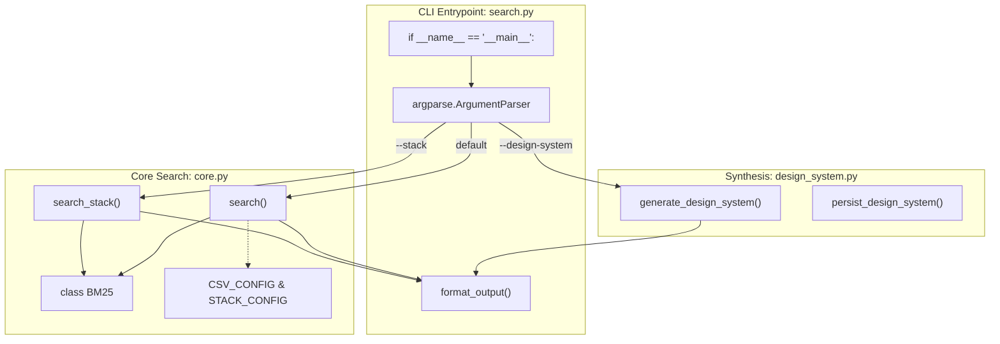
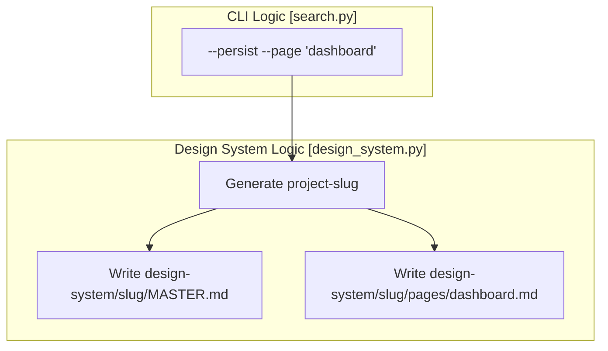

# search.py CLI Interface

<details>
<summary>Relevant source files</summary>

The following files were used as context for generating this wiki page:

- [.claude/skills/ui-ux-pro-max/scripts/core.py](.claude/skills/ui-ux-pro-max/scripts/core.py)
- [.claude/skills/ui-ux-pro-max/scripts/search.py](.claude/skills/ui-ux-pro-max/scripts/search.py)
- [cli/assets/scripts/search.py](cli/assets/scripts/search.py)
- [src/ui-ux-pro-max/data/stacks/flutter.csv](src/ui-ux-pro-max/data/stacks/flutter.csv)
- [src/ui-ux-pro-max/data/stacks/jetpack-compose.csv](src/ui-ux-pro-max/data/stacks/jetpack-compose.csv)
- [src/ui-ux-pro-max/data/stacks/shadcn.csv](src/ui-ux-pro-max/data/stacks/shadcn.csv)
- [src/ui-ux-pro-max/scripts/core.py](src/ui-ux-pro-max/scripts/core.py)
- [src/ui-ux-pro-max/scripts/search.py](src/ui-ux-pro-max/scripts/search.py)

</details>


## Purpose and Scope

The `search.py` script is the primary command-line interface for the UI/UX Pro Max search engine. It orchestrates the flow between user queries, the BM25 ranking algorithm, and the design database. It provides two main modes of operation: **Standard Search** (Domain or Stack-specific) and **Design System Generation** (using the reasoning engine).

This interface is designed to be called directly by AI agents (Claude, Cursor, etc.) or by developers via the terminal. It includes sophisticated output formatting to minimize token consumption while maximizing the relevance of design intelligence delivered to the LLM.

---

## Architecture and Data Flow

The `search.py` script acts as a controller that imports logic from `core.py` for search operations and `design_system.py` for complex synthesis.

**Diagram: CLI Logic and Code Entity Mapping**



**Sources:** [src/ui-ux-pro-max/scripts/search.py:20-21](), [src/ui-ux-pro-max/scripts/search.py:75-114]()

---

## Command-Line Arguments

The CLI supports a variety of flags to control search scope, output format, and persistence.

### Core Arguments

| Flag | Alias | Type | Description |
| :--- | :--- | :--- | :--- |
| `query` | N/A | Positional | The natural language search string (e.g., "minimalist fintech dashboard"). |
| `--domain` | `-d` | Choice | Filters search to a specific CSV (e.g., `style`, `color`, `ux`). |
| `--stack` | `-s` | Choice | Filters search to a specific technology stack (e.g., `react`, `shadcn`, `flutter`). |
| `--max-results`| `-n` | Int | Limits the number of returned rows (Default: 3). |
| `--json` | N/A | Flag | Returns raw JSON instead of formatted Markdown. |

**Sources:** [src/ui-ux-pro-max/scripts/search.py:57-62]()

### Design System & Persistence Flags

| Flag | Alias | Type | Description |
| :--- | :--- | :--- | :--- |
| `--design-system`| `-ds`| Flag | Triggers the `generate_design_system` pipeline. |
| `--project-name` | `-p` | String | Sets the project slug for file naming. |
| `--persist` | N/A | Flag | Saves the output to `MASTER.md` in the project directory. |
| `--page` | N/A | String | Creates a page-specific override file in `design-system/pages/`. |

**Sources:** [src/ui-ux-pro-max/scripts/search.py:64-70]()

---

## Implementation Details

### Domain and Stack Validation
The CLI dynamically populates its allowed choices for `--domain` and `--stack` by inspecting the configuration dictionaries in `core.py`.
- **Domains:** Derived from `CSV_CONFIG.keys()` [src/ui-ux-pro-max/scripts/search.py:59]()
- **Stacks:** Derived from `AVAILABLE_STACKS` [src/ui-ux-pro-max/scripts/search.py:60]()

### Output Formatting
The `format_output` function [src/ui-ux-pro-max/scripts/search.py:30-53]() is critical for AI performance. It performs the following:
1. **Header Generation:** Identifies the domain or stack and the source file used [src/ui-ux-pro-max/scripts/search.py:36-42]().
2. **Result Iteration:** Loops through the BM25 hits [src/ui-ux-pro-max/scripts/search.py:44]().
3. **Aggressive Truncation:** Any field value exceeding 300 characters is truncated with an ellipsis (`...`) to save context window space [src/ui-ux-pro-max/scripts/search.py:48-49]().
4. **Encoding Safety:** Forces UTF-8 for stdout to prevent crashes on Windows environments when handling emojis in the design data [src/ui-ux-pro-max/scripts/search.py:24-27]().

**Sources:** [src/ui-ux-pro-max/scripts/search.py:24-53]()

---

## Persistence: Master + Overrides Pattern

When the `--persist` flag is used, the CLI implements a hierarchical documentation strategy. This is handled by the `persist_design_system` function called from the main block.

**Diagram: File Persistence Flow**



If a user provides `--project-name "My App"`, the CLI converts this to `my-app` [src/ui-ux-pro-max/scripts/search.py:88](). It then creates a structure where `MASTER.md` contains global rules and specific page files contain localized overrides [src/ui-ux-pro-max/scripts/search.py:90-97]().

**Sources:** [src/ui-ux-pro-max/scripts/search.py:87-98]()

---

## Usage Examples

### 1. Simple Domain Search
```bash
python search.py "dark mode dashboard" --domain style --max-results 2
```

### 2. Stack-Specific Technical Search
```bash
python search.py "form validation" --stack react --json
```

### 3. Full Design System Generation with Persistence
```bash
python search.py "fintech mobile app" --design-system --persist --project-name "WealthWise" --page "onboarding"
```

**Sources:** [src/ui-ux-pro-max/scripts/search.py:5-15]()
