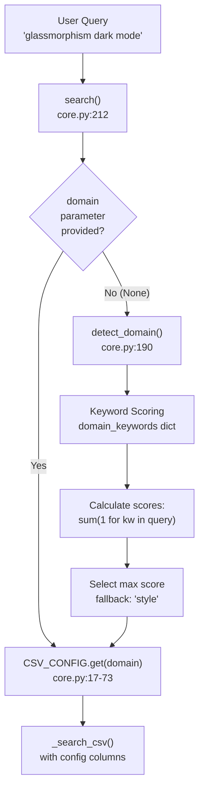
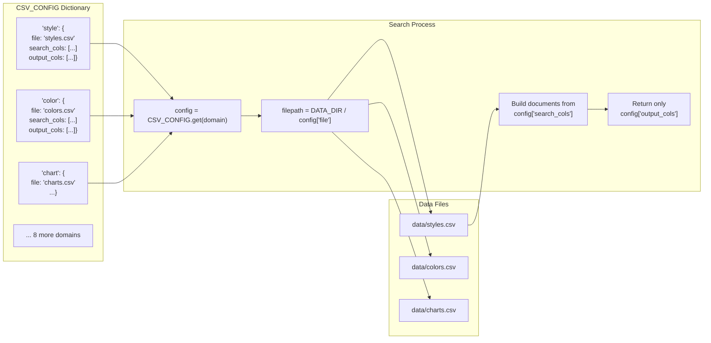
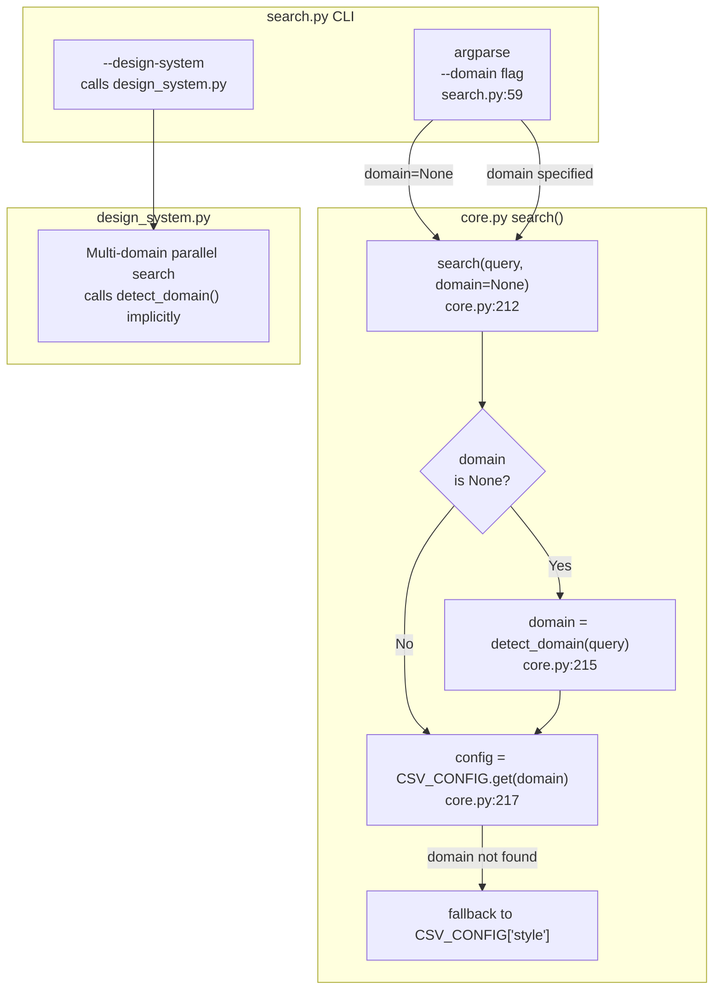

# Domain Detection and Configuration

<details>
<summary>Relevant source files</summary>

The following files were used as context for generating this wiki page:

- [.claude/skills/ui-ux-pro-max/scripts/core.py](.claude/skills/ui-ux-pro-max/scripts/core.py)
- [.claude/skills/ui-ux-pro-max/scripts/search.py](.claude/skills/ui-ux-pro-max/scripts/search.py)
- [CLAUDE.md](CLAUDE.md)
- [cli/assets/scripts/search.py](cli/assets/scripts/search.py)
- [src/ui-ux-pro-max/data/stacks/flutter.csv](src/ui-ux-pro-max/data/stacks/flutter.csv)
- [src/ui-ux-pro-max/data/stacks/jetpack-compose.csv](src/ui-ux-pro-max/data/stacks/jetpack-compose.csv)
- [src/ui-ux-pro-max/data/stacks/shadcn.csv](src/ui-ux-pro-max/data/stacks/shadcn.csv)
- [src/ui-ux-pro-max/scripts/core.py](src/ui-ux-pro-max/scripts/core.py)
- [src/ui-ux-pro-max/scripts/search.py](src/ui-ux-pro-max/scripts/search.py)

</details>


This document explains the automatic domain detection system that routes user queries to appropriate CSV databases, and the configuration dictionaries that define how domains map to files and columns. For information about the BM25 search algorithm itself, see [5.1 BM25 Algorithm Implementation](). For the command-line interface that uses domain detection, see [5.2 search.py CLI Interface]().

## Purpose and Scope

The domain detection system solves the problem of determining which CSV database to search when a user query doesn't explicitly specify a domain via the `--domain` flag [src/ui-ux-pro-max/scripts/search.py:59](). It uses keyword scoring to analyze natural language queries and automatically route them to the most relevant database (style, color, typography, chart, etc.) [src/ui-ux-pro-max/scripts/core.py:190-209](). The configuration system (`CSV_CONFIG` and `STACK_CONFIG`) defines the mappings between domain names, CSV files, and which columns to search or return [src/ui-ux-pro-max/scripts/core.py:17-92]().

---

## Domain Detection Flow

**Diagram: Query Routing Through Domain Detection**



**Sources:** [src/ui-ux-pro-max/scripts/core.py:190-231](), [src/ui-ux-pro-max/scripts/search.py:108-114]()

---

## The detect_domain Function

The `detect_domain()` function analyzes query text against predefined keyword lists for each domain and returns the domain with the highest score [src/ui-ux-pro-max/scripts/core.py:190]().

**Algorithm:**

1. Convert query to lowercase: `query_lower = query.lower()` [src/ui-ux-pro-max/scripts/core.py:192]().
2. Define `domain_keywords` dictionary with keyword lists per domain [src/ui-ux-pro-max/scripts/core.py:194-205]().
3. Score each domain: `sum(1 for kw in keywords if kw in query_lower)` [src/ui-ux-pro-max/scripts/core.py:207]().
4. Return domain with max score, or `"style"` if all scores are 0 [src/ui-ux-pro-max/scripts/core.py:208-209]().

**Implementation:**

```python
def detect_domain(query):
    """Auto-detect the most relevant domain from query"""
    query_lower = query.lower()
    
    domain_keywords = {
        "color": ["color", "palette", "hex", "#", "rgb"],
        "chart": ["chart", "graph", "visualization", ...],
        # ... 10 domains total
    }
    
    scores = {domain: sum(1 for kw in keywords if kw in query_lower) 
              for domain, keywords in domain_keywords.items()}
    best = max(scores, key=scores.get)
    return best if scores[best] > 0 else "style"
```

**Keyword Matching:** Uses simple substring matching (`in` operator), which means partial matches count (e.g., "dashboards" matches "dashboard") [src/ui-ux-pro-max/scripts/core.py:207]().

**Sources:** [src/ui-ux-pro-max/scripts/core.py:190-209]()

---

## Domain Keywords Mapping

**Table: All Domains and Their Detection Keywords**

| Domain | Keywords | Primary Use Case |
|--------|----------|------------------|
| `color` | color, palette, hex, #, rgb | Color scheme selection |
| `chart` | chart, graph, visualization, trend, bar, pie, scatter, heatmap, funnel | Data visualization type selection |
| `landing` | landing, page, cta, conversion, hero, testimonial, pricing, section | Landing page structure |
| `product` | saas, ecommerce, e-commerce, fintech, healthcare, gaming, portfolio, crypto, dashboard | Product category identification |
| `style` | style, design, ui, minimalism, glassmorphism, neumorphism, brutalism, dark mode, flat, aurora, prompt, css, implementation, variable, checklist, tailwind | UI style selection (fallback domain) |
| `ux` | ux, usability, accessibility, wcag, touch, scroll, animation, keyboard, navigation, mobile | UX best practices |
| `typography` | font, typography, heading, serif, sans | Font pairing selection |
| `icons` | icon, icons, lucide, heroicons, symbol, glyph, pictogram, svg icon | Icon library search |
| `react` | react, next.js, nextjs, suspense, memo, usecallback, useeffect, rerender, bundle, waterfall, barrel, dynamic import, rsc, server component | React performance patterns |
| `web` | aria, focus, outline, semantic, virtualize, autocomplete, form, input type, preconnect | Web interface guidelines |

**Sources:** [src/ui-ux-pro-max/scripts/core.py:194-205]()

---

## CSV Configuration Dictionary

The `CSV_CONFIG` dictionary maps each domain to its CSV file and column specifications [src/ui-ux-pro-max/scripts/core.py:17-73](). It defines:
- `file`: CSV filename in the `data/` directory.
- `search_cols`: Columns to concatenate for BM25 search [src/ui-ux-pro-max/scripts/core.py:104-162]().
- `output_cols`: Columns to return in results.

**Diagram: CSV_CONFIG Structure and Usage**



**Sources:** [src/ui-ux-pro-max/scripts/core.py:17-73](), [src/ui-ux-pro-max/scripts/core.py:217-231]()

---

## Domain-Specific Column Configurations

Each domain has optimized column configurations for searching and output [src/ui-ux-pro-max/scripts/core.py:17-73]():

**Style Domain:**
- **Search Columns:** `Style Category`, `Keywords`, `Best For`, `Type`, `AI Prompt Keywords` [src/ui-ux-pro-max/scripts/core.py:20]().
- **Output Columns:** 16 columns including CSS keywords, implementation checklist, design system variables [src/ui-ux-pro-max/scripts/core.py:21]().
- **File:** `styles.csv` [src/ui-ux-pro-max/scripts/core.py:19]().

**Color Domain:**
- **Search Columns:** `Product Type`, `Notes` [src/ui-ux-pro-max/scripts/core.py:25]().
- **Output Columns:** 18 columns including Primary, Secondary, Accent, Background, and Muted variants [src/ui-ux-pro-max/scripts/core.py:26]().
- **File:** `colors.csv` [src/ui-ux-pro-max/scripts/core.py:24]().

**Product Domain:**
- **Search Columns:** `Product Type`, `Keywords`, `Primary Style Recommendation`, `Key Considerations` [src/ui-ux-pro-max/scripts/core.py:40]().
- **Output Columns:** Includes style recommendations, landing patterns, and dashboard styles [src/ui-ux-pro-max/scripts/core.py:41]().
- **File:** `products.csv` [src/ui-ux-pro-max/scripts/core.py:39]().

**UX Domain:**
- **Search Columns:** `Category`, `Issue`, `Description`, `Platform` [src/ui-ux-pro-max/scripts/core.py:45]().
- **Output Columns:** Includes `Do`, `Don't`, `Code Example Good`, `Code Example Bad`, and `Severity` [src/ui-ux-pro-max/scripts/core.py:46]().
- **File:** `ux-guidelines.csv` [src/ui-ux-pro-max/scripts/core.py:44]().

**Typography Domain:**
- **Search Columns:** `Font Pairing Name`, `Category`, `Mood/Style Keywords`, `Best For`, `Heading Font`, `Body Font` [src/ui-ux-pro-max/scripts/core.py:50]().
- **Output Columns:** Includes Google Fonts URL, CSS Import, and Tailwind Config [src/ui-ux-pro-max/scripts/core.py:51]().
- **File:** `typography.csv` [src/ui-ux-pro-max/scripts/core.py:49]().

**Sources:** [src/ui-ux-pro-max/scripts/core.py:17-73]()

---

## Stack Configuration Dictionary

The `STACK_CONFIG` dictionary maps 16 technology stacks to their CSV files [src/ui-ux-pro-max/scripts/core.py:75-92](). All stacks share common column configurations defined in `_STACK_COLS` [src/ui-ux-pro-max/scripts/core.py:95-98]().

**Structure:**

```python
STACK_CONFIG = {
    "react":            {"file": "stacks/react.csv"},
    "nextjs":           {"file": "stacks/nextjs.csv"},
    "vue":              {"file": "stacks/vue.csv"},
    # ... 13 more stacks
}

_STACK_COLS = {
    "search_cols": ["Category", "Guideline", "Description", "Do", "Don't"],
    "output_cols": ["Category", "Guideline", "Description", "Do", "Don't", "Code Good", "Code Bad", "Severity", "Docs URL"]
}
```

**Available Stacks:**
- `react`, `nextjs`, `vue`, `svelte`, `astro`, `swiftui`, `react-native`, `flutter`, `nuxtjs`, `nuxt-ui`, `html-tailwind`, `shadcn`, `jetpack-compose`, `threejs`, `angular`, `laravel` [src/ui-ux-pro-max/scripts/core.py:75-92]().

**Key Difference:** Stack searches use the `search_stack()` function [src/ui-ux-pro-max/scripts/core.py:234](), which requires an explicit stack name and does not use `detect_domain()`.

**Sources:** [src/ui-ux-pro-max/scripts/core.py:75-100](), [src/ui-ux-pro-max/scripts/search.py:100-106]()

---

## Integration with Search Functions

**Diagram: Domain Detection Integration Points**



**Sources:** [src/ui-ux-pro-max/scripts/core.py:212-231](), [src/ui-ux-pro-max/scripts/search.py:56-114]()

---

## Fallback Behavior

**Default Domain:** If no keywords match (all scores = 0), the `detect_domain` function defaults to returning `"style"` [src/ui-ux-pro-max/scripts/core.py:209]().

**Invalid Domain:** If a manually specified domain doesn't exist in `CSV_CONFIG`, the `search()` function falls back to `"style"` [src/ui-ux-pro-max/scripts/core.py:217]():

```python
config = CSV_CONFIG.get(domain, CSV_CONFIG["style"])
```

**Rationale:** The `style` domain has the broadest keyword coverage and serves as the primary general-purpose design database for the UI/UX Pro Max system [src/ui-ux-pro-max/scripts/core.py:18-22]().

**Sources:** [src/ui-ux-pro-max/scripts/core.py:18-22](), [src/ui-ux-pro-max/scripts/core.py:209](), [src/ui-ux-pro-max/scripts/core.py:217]()

---

## Example Detection Scenarios

**Table: Query → Domain Detection Examples**

| Query | Matched Keywords | Domain | Score |
|-------|------------------|--------|-------|
| "glassmorphism dark mode" | "glassmorphism", "dark", "mode" | `style` | 3 |
| "SaaS dashboard color palette" | "saas", "dashboard", "color", "palette" | `product` OR `color` | 2 each (first wins) |
| "chart for sales trends" | "chart", "trend" | `chart` | 2 |
| "aria label accessibility" | "aria", "accessibility" | `ux` OR `web` | 2 each |
| "beautiful landing page" | "landing", "page" | `landing` | 2 |
| "font pairing elegant" | "font" | `typography` | 1 |
| "react useEffect waterfall" | "react", "useeffect", "waterfall" | `react` | 3 |

**Note:** When multiple domains have equal scores, Python's `max()` returns the first one encountered based on the dictionary order in `domain_keywords` [src/ui-ux-pro-max/scripts/core.py:208]().

**Sources:** [src/ui-ux-pro-max/scripts/core.py:194-209]()
