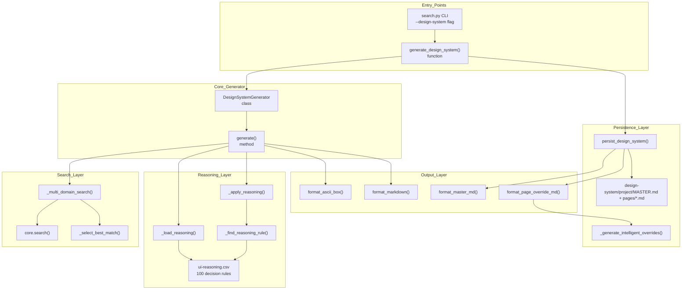
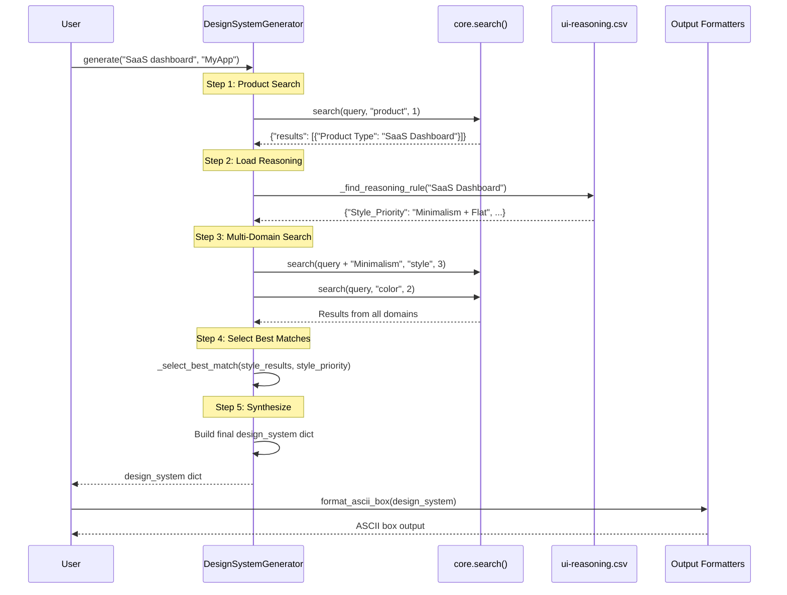

# Design System Generator

<details>
<summary>Relevant source files</summary>

The following files were used as context for generating this wiki page:

- [.claude/skills/ui-ux-pro-max/scripts/design_system.py](.claude/skills/ui-ux-pro-max/scripts/design_system.py)
- [cli/assets/scripts/core.py](cli/assets/scripts/core.py)
- [cli/assets/scripts/design_system.py](cli/assets/scripts/design_system.py)
- [src/ui-ux-pro-max/scripts/design_system.py](src/ui-ux-pro-max/scripts/design_system.py)

</details>


The Design System Generator is a module that aggregates multi-domain search results and applies reasoning rules to produce comprehensive design system recommendations. It synthesizes data from 5 knowledge domains (product categories, styles, colors, typography, landing patterns) and applies context-aware decision logic to generate project-specific design specifications with optional file persistence.

For information about the underlying search engine, see [Search Engine](#5). For information about the CLI interface, see [search.py CLI Interface](#5.2). For information about the Master + Overrides pattern implementation, see [Master + Overrides Pattern](#6.2).

**Sources:** [src/ui-ux-pro-max/scripts/design_system.py:1-14]()

## Architecture Overview

The Design System Generator operates as a coordinated pipeline between the BM25 search engine ([cli/assets/scripts/core.py:89-150]()), reasoning rules ([ui-reasoning.csv]()), and output formatters. The system accepts natural language queries and produces structured design specifications.

### Component Diagram



**Sources:** [src/ui-ux-pro-max/scripts/design_system.py:37-237](), [cli/assets/scripts/design_system.py:37-237]()

## DesignSystemGenerator Class

The `DesignSystemGenerator` class ([src/ui-ux-pro-max/scripts/design_system.py:37-236]()) orchestrates the entire generation process. It initializes with reasoning rules from `ui-reasoning.csv` and provides methods for multi-domain search, rule matching, and result synthesis.

### Class Structure

| Method | Purpose | Returns |
|--------|---------|---------|
| `__init__()` | Load reasoning rules from CSV | None |
| `_load_reasoning()` | Parse `ui-reasoning.csv` into list of dicts | `list[dict]` |
| `_multi_domain_search(query, style_priority)` | Execute parallel searches across 5 domains | `dict` |
| `_find_reasoning_rule(category)` | Match product category to reasoning rule | `dict` |
| `_apply_reasoning(category, search_results)` | Extract style priorities, anti-patterns, effects | `dict` |
| `_select_best_match(results, priority_keywords)` | Score results by keyword match | `dict` |
| `_extract_results(search_result)` | Unwrap results array from search dict | `list` |
| `generate(query, project_name)` | Main orchestrator method | `dict` |

**Sources:** [src/ui-ux-pro-max/scripts/design_system.py:37-163]()

### Configuration Constants

```python
# Search configuration defines domains and result limits
SEARCH_CONFIG = {
    "product": {"max_results": 1},
    "style": {"max_results": 3},
    "color": {"max_results": 2},
    "landing": {"max_results": 2},
    "typography": {"max_results": 2}
}

# Reasoning file location
REASONING_FILE = "ui-reasoning.csv"
```

The `SEARCH_CONFIG` dictionary ([src/ui-ux-pro-max/scripts/design_system.py:27-33]()) controls which domains are queried and how many results to retrieve from each. Product search returns only 1 result to identify the primary category, while style search returns 3 results to allow priority-based selection.

**Sources:** [src/ui-ux-pro-max/scripts/design_system.py:24-33]()

## Generation Pipeline

The generation process follows a 5-step pipeline that transforms a natural language query into a complete design system specification. For a detailed breakdown of the internal logic and keyword scoring, see [Generation Pipeline](#6.1).

### Pipeline Flow Diagram



**Sources:** [src/ui-ux-pro-max/scripts/design_system.py:163-236]()

## Master + Overrides Pattern

The system uses a hierarchical file structure to manage design guidelines. This allows for a global "Source of Truth" while permitting specific pages to deviate when necessary.

*   **MASTER.md**: Contains global rules for colors, typography, spacing, and standard components ([src/ui-ux-pro-max/scripts/design_system.py:542-802]()).
*   **pages/*.md**: Contains overrides for specific page types (e.g., "Dashboard", "Settings") generated via intelligent context detection ([src/ui-ux-pro-max/scripts/design_system.py:805-911]()).

For details on the Markdown structure and override logic, see [Master + Overrides Pattern](#6.2).

**Sources:** [src/ui-ux-pro-max/scripts/design_system.py:491-539]()

## Persistence and File Structure

The `persist_design_system` function ([src/ui-ux-pro-max/scripts/design_system.py:491-539]()) handles the physical creation of the design system directory. It generates a project slug, creates the necessary folder hierarchy, and writes the Markdown files.

### Intelligent Override Generation
Instead of using static templates, the system uses `_generate_intelligent_overrides` ([src/ui-ux-pro-max/scripts/design_system.py:914-1017]()) to perform targeted searches for the specific page being created. It detects the page type (e.g., "Authentication", "Dashboard") and infers layout rules based on search keywords.

For details on directory paths and the slug generation process, see [Persistence and File Structure](#6.3).

**Sources:** [src/ui-ux-pro-max/scripts/design_system.py:914-1052]()
