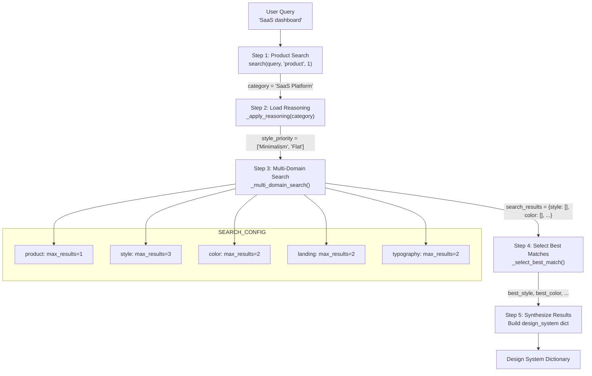
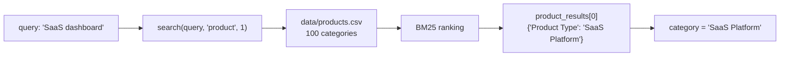
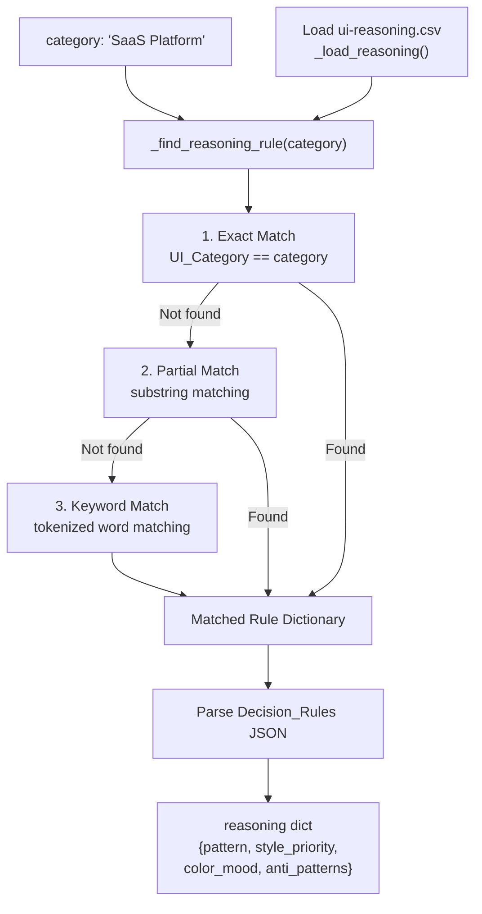
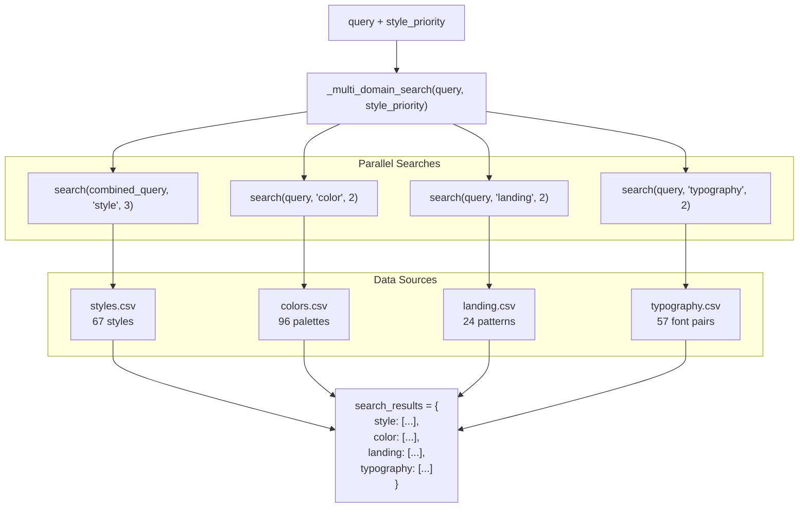
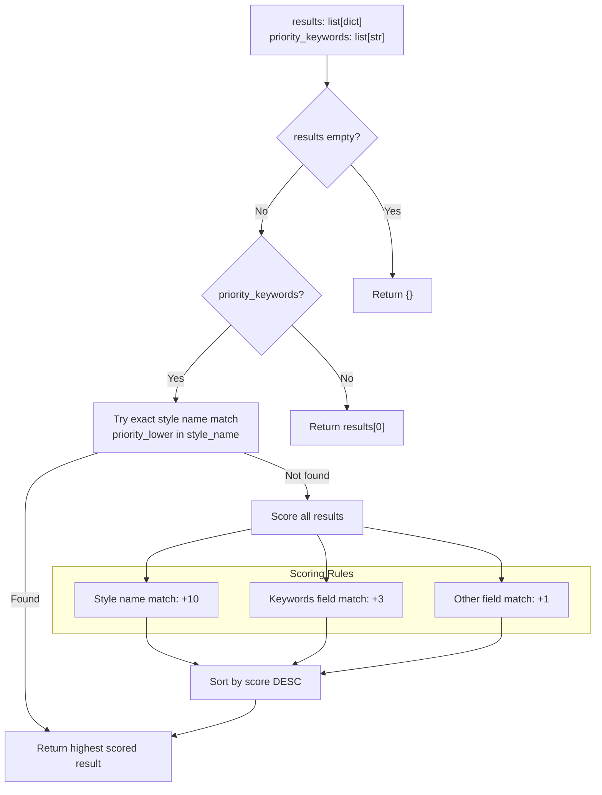
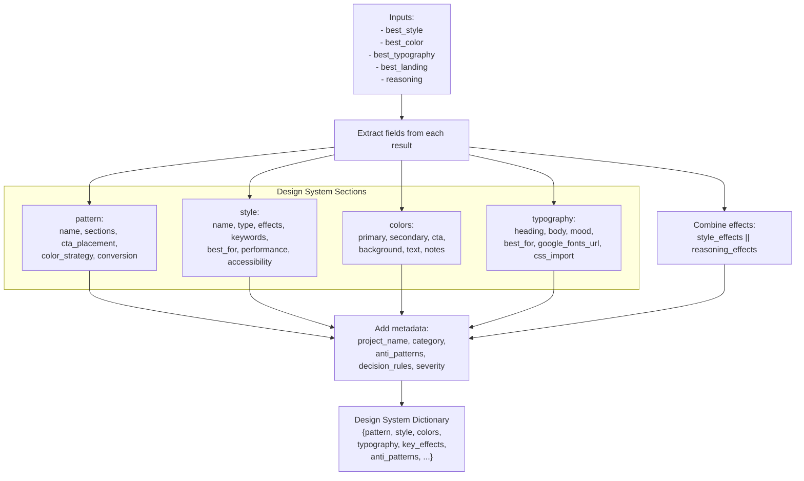
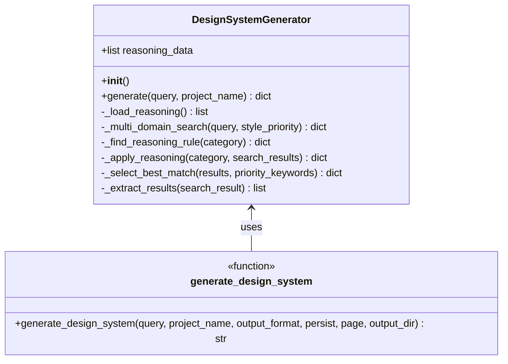
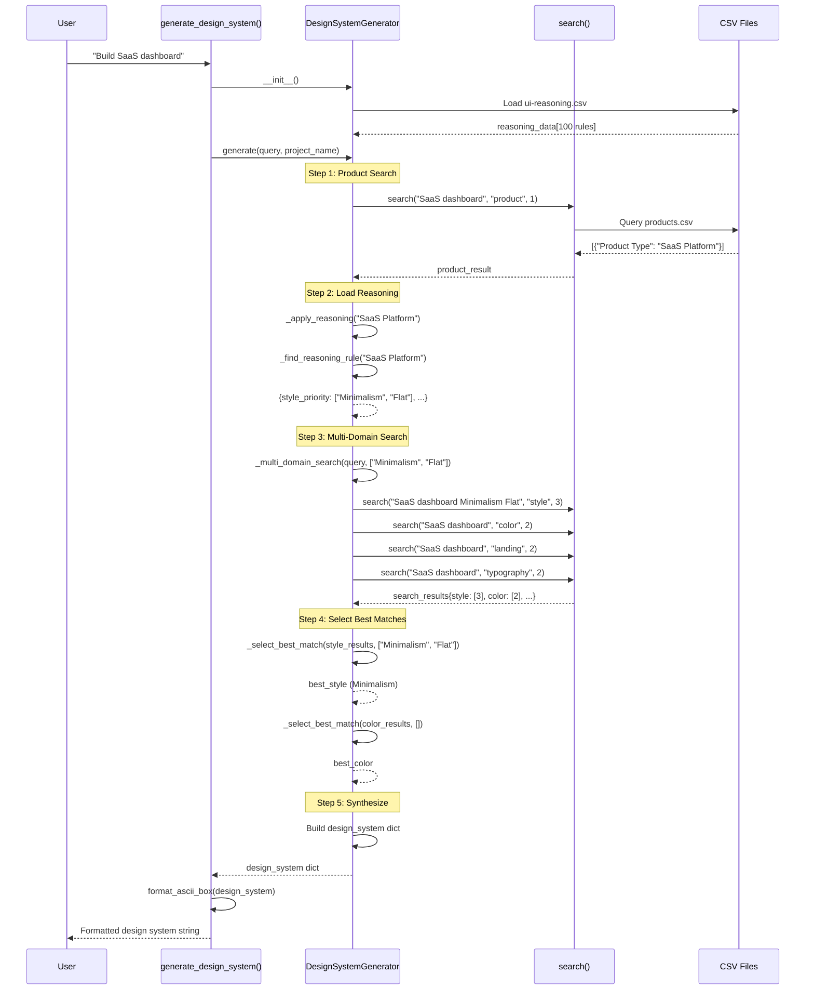

# Generation Pipeline

<details>
<summary>Relevant source files</summary>

The following files were used as context for generating this wiki page:

- [.claude/skills/ui-ux-pro-max/scripts/design_system.py](.claude/skills/ui-ux-pro-max/scripts/design_system.py)
- [cli/assets/scripts/core.py](cli/assets/scripts/core.py)
- [cli/assets/scripts/design_system.py](cli/assets/scripts/design_system.py)
- [src/ui-ux-pro-max/scripts/design_system.py](src/ui-ux-pro-max/scripts/design_system.py)

</details>


This document details the 5-step process executed by the `DesignSystemGenerator` class to produce comprehensive design system recommendations. The pipeline performs product categorization, loads reasoning rules, executes multi-domain searches, selects optimal matches, and synthesizes results into a structured design system.

For information about the persistence mechanism (Master + Overrides pattern), see [6.2](). For details on the search engine implementation, see [5]().

---

## Overview

The generation pipeline is implemented in the `DesignSystemGenerator` class and orchestrated by the `generate()` method. The process transforms a natural language query (e.g., "SaaS dashboard") into a comprehensive design system specification containing colors, typography, layout patterns, component specifications, and anti-patterns.

**Sources:** [src/ui-ux-pro-max/scripts/design_system.py:37-236](), [cli/assets/scripts/design_system.py:37-236]()

---

## Pipeline Architecture

### High-Level Flow



**Sources:** [src/ui-ux-pro-max/scripts/design_system.py:163-236](), [cli/assets/scripts/design_system.py:163-236]()

---

## Step 1: Product Search

The pipeline begins by identifying the product category through a single search in the `product` domain. This categorization determines which reasoning rules apply.

### Implementation



The product search is executed at [src/ui-ux-pro-max/scripts/design_system.py:166]() with:
```python
product_result = search(query, "product", 1)
product_results = product_result.get("results", [])
category = "General"
if product_results:
    category = product_results[0].get("Product Type", "General")
```

If no product match is found, the category defaults to `"General"`.

**Sources:** [src/ui-ux-pro-max/scripts/design_system.py:165-170](), [cli/assets/scripts/design_system.py:165-170]()

---

## Step 2: Load Reasoning

After obtaining the product category, the pipeline applies reasoning rules from `ui-reasoning.csv` to determine design priorities and constraints.

### Reasoning Rule Matching

The `_apply_reasoning()` method implements a three-tier matching strategy:



### Reasoning Data Structure

The reasoning rule returns a dictionary with the following structure:

| Field | Type | Purpose |
|-------|------|---------|
| `pattern` | string | Recommended page pattern (e.g., "Hero + Features + CTA") |
| `style_priority` | list[string] | Ordered list of style preferences (e.g., ["Minimalism", "Flat Design"]) |
| `color_mood` | string | Color palette mood (e.g., "Professional") |
| `typography_mood` | string | Typography mood (e.g., "Clean") |
| `key_effects` | string | Recommended effects and animations |
| `anti_patterns` | string | Design patterns to avoid (e.g., "Cluttered dashboards + Excessive animations") |
| `decision_rules` | dict | JSON-parsed decision rules for conditional logic |
| `severity` | string | Priority level: "LOW", "MEDIUM", or "HIGH" |

**Sources:** [src/ui-ux-pro-max/scripts/design_system.py:64-120](), [cli/assets/scripts/design_system.py:64-120]()

---

## Step 3: Multi-Domain Search

With style priorities established, the pipeline executes parallel searches across 5 design domains defined in `SEARCH_CONFIG`.

### Search Configuration

```python
SEARCH_CONFIG = {
    "product": {"max_results": 1},
    "style": {"max_results": 3},
    "color": {"max_results": 2},
    "landing": {"max_results": 2},
    "typography": {"max_results": 2}
}
```

### Multi-Domain Execution



### Style Search Enhancement

For the `style` domain, the pipeline augments the query with style priority keywords to improve relevance:

```python
if domain == "style" and style_priority:
    priority_query = " ".join(style_priority[:2]) if style_priority else query
    combined_query = f"{query} {priority_query}"
    results[domain] = search(combined_query, domain, config["max_results"])
```

This ensures that if reasoning rules suggest "Minimalism + Flat Design" for a SaaS platform, the style search prioritizes those styles.

**Sources:** [src/ui-ux-pro-max/scripts/design_system.py:27-33](), [src/ui-ux-pro-max/scripts/design_system.py:51-62]()

---

## Step 4: Select Best Matches

The pipeline selects the optimal result from each domain using priority-based scoring.

### Selection Algorithm

The `_select_best_match()` method implements a weighted scoring system:



### Example Scoring

For a query with `style_priority = ["Minimalism", "Flat Design"]` and 3 style results:

| Result | Style Category | Keywords | Score Calculation | Total Score |
|--------|----------------|----------|-------------------|-------------|
| Result 1 | "Minimalism" | "clean, simple, white space" | "Minimalism" in name (+10) | **10** |
| Result 2 | "Flat Design" | "minimal, flat, no gradients" | "Flat Design" in name (+10) | **10** |
| Result 3 | "Material Design" | "depth, shadows, responsive" | No matches | **0** |

Result 1 or 2 would be selected (first match wins in ties).

**Sources:** [src/ui-ux-pro-max/scripts/design_system.py:122-157](), [cli/assets/scripts/design_system.py:122-157]()

---

## Step 5: Synthesize Results

The final step aggregates selected results into a structured design system dictionary.

### Synthesis Process



### Field Mapping

The synthesis process maps CSV columns to design system fields:

**Pattern Section:**
```python
"pattern": {
    "name": best_landing.get("Pattern Name", reasoning.get("pattern")),
    "sections": best_landing.get("Section Order", "Hero > Features > CTA"),
    "cta_placement": best_landing.get("Primary CTA Placement", "Above fold"),
    "color_strategy": best_landing.get("Color Strategy", ""),
    "conversion": best_landing.get("Conversion Optimization", "")
}
```

**Colors Section:**
```python
"colors": {
    "primary": best_color.get("Primary (Hex)", "#2563EB"),
    "secondary": best_color.get("Secondary (Hex)", "#3B82F6"),
    "cta": best_color.get("CTA (Hex)", "#F97316"),
    "background": best_color.get("Background (Hex)", "#F8FAFC"),
    "text": best_color.get("Text (Hex)", "#1E293B"),
    "notes": best_color.get("Notes", "")
}
```

**Typography Section:**
```python
"typography": {
    "heading": best_typography.get("Heading Font", "Inter"),
    "body": best_typography.get("Body Font", "Inter"),
    "mood": best_typography.get("Mood/Style Keywords", reasoning.get("typography_mood")),
    "best_for": best_typography.get("Best For", ""),
    "google_fonts_url": best_typography.get("Google Fonts URL", ""),
    "css_import": best_typography.get("CSS Import", "")
}
```

**Sources:** [src/ui-ux-pro-max/scripts/design_system.py:191-236](), [cli/assets/scripts/design_system.py:191-236]()

---

## Class Structure and Entry Points

### DesignSystemGenerator Class



### Public API

The module exposes a single entry point function:

```python
def generate_design_system(
    query: str,
    project_name: str = None,
    output_format: str = "ascii",
    persist: bool = False,
    page: str = None,
    output_dir: str = None
) -> str
```

**Parameters:**
- `query`: Search query (e.g., "SaaS dashboard", "e-commerce luxury")
- `project_name`: Optional project name for output header
- `output_format`: `"ascii"` (default) or `"markdown"`
- `persist`: If `True`, save design system to `design-system/` folder (see [6.3]())
- `page`: Optional page name for page-specific override file
- `output_dir`: Optional output directory (defaults to current working directory)

**Returns:** Formatted design system string

**Sources:** [src/ui-ux-pro-max/scripts/design_system.py:462-487](), [cli/assets/scripts/design_system.py:462-487]()

---

## Data Flow Example

### Complete Pipeline Execution



**Sources:** [src/ui-ux-pro-max/scripts/design_system.py:163-236](), [cli/assets/scripts/design_system.py:163-236]()

---

## Configuration Constants

### SEARCH_CONFIG

Defines the number of results to retrieve from each domain:

| Domain | Max Results | Purpose |
|--------|-------------|---------|
| `product` | 1 | Single product categorization |
| `style` | 3 | Multiple style options for best match selection |
| `color` | 2 | Primary and alternative color palettes |
| `landing` | 2 | Primary and fallback landing patterns |
| `typography` | 2 | Primary and alternative font pairings |

**Sources:** [src/ui-ux-pro-max/scripts/design_system.py:27-33](), [cli/assets/scripts/design_system.py:27-33]()

### REASONING_FILE

Points to the reasoning rules CSV:
```python
REASONING_FILE = "ui-reasoning.csv"
```

This file is loaded relative to `DATA_DIR` from the `core` module.

**Sources:** [src/ui-ux-pro-max/scripts/design_system.py:25](), [cli/assets/scripts/design_system.py:25]()

---

## Error Handling and Fallbacks

The pipeline implements defensive fallbacks at each step:

### Step 1 Fallback
If no product match found:
```python
category = "General"
```

### Step 2 Fallback
If no reasoning rule found:
```python
return {
    "pattern": "Hero + Features + CTA",
    "style_priority": ["Minimalism", "Flat Design"],
    "color_mood": "Professional",
    "typography_mood": "Clean",
    "key_effects": "Subtle hover transitions",
    "anti_patterns": "",
    "decision_rules": {},
    "severity": "MEDIUM"
}
```

### Step 4 Fallback
If result list is empty:
```python
return {}
```

If no priority keywords:
```python
return results[0]  # Return first result
```

### Step 5 Fallback
Default hex color values:
```python
"primary": best_color.get("Primary (Hex)", "#2563EB"),
"secondary": best_color.get("Secondary (Hex)", "#3B82F6"),
# ... etc
```

**Sources:** [src/ui-ux-pro-max/scripts/design_system.py:92-102](), [src/ui-ux-pro-max/scripts/design_system.py:124-128](), [src/ui-ux-pro-max/scripts/design_system.py:217-221]()

---

## Integration with Search Engine

The pipeline depends on the `search()` function from the `core` module:

```python
from core import search, DATA_DIR
```

Each domain search invokes:
```python
search(query: str, domain: str, max_results: int) -> dict
```

The search function returns a dictionary with structure:
```python
{
    "query": str,
    "domain": str,
    "results": list[dict],
    "count": int
}
```

For detailed information about the BM25 search implementation, see [5.1]().

**Sources:** [src/ui-ux-pro-max/scripts/design_system.py:21](), [cli/assets/scripts/core.py:158-185]()
