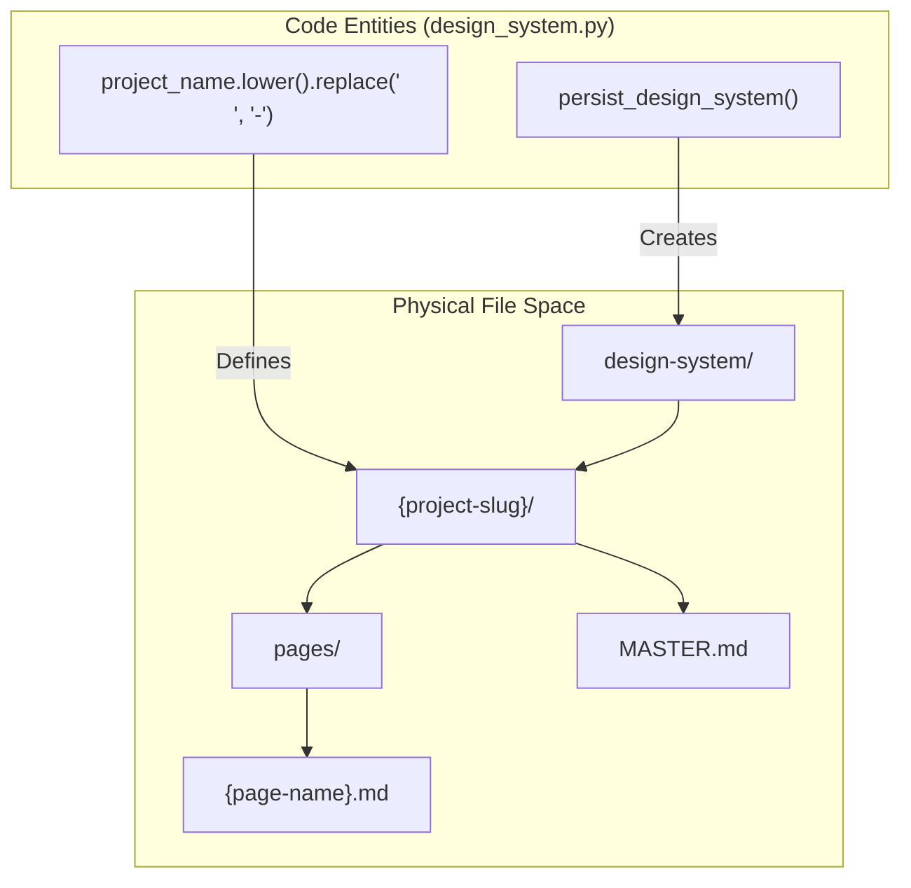
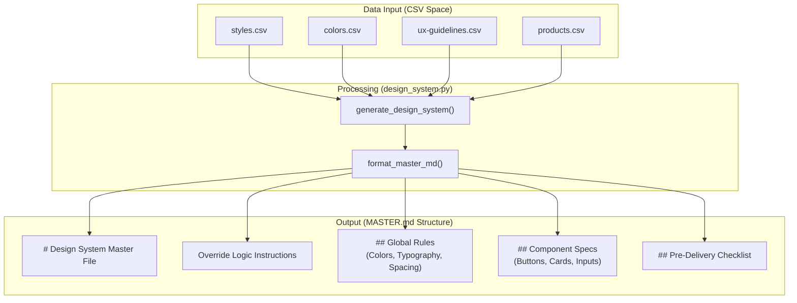
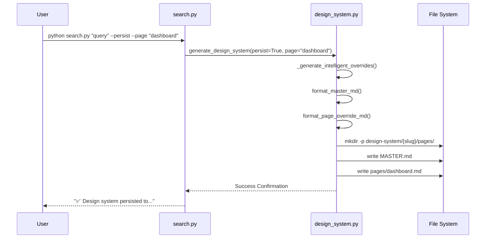

# Master + Overrides Pattern

Relevant source files

The following files were used as context for generating this wiki page:

- [.claude/skills/ui-ux-pro-max/SKILL.md](.claude/skills/ui-ux-pro-max/SKILL.md)
- [.claude/skills/ui-ux-pro-max/data/react-performance.csv](.claude/skills/ui-ux-pro-max/data/react-performance.csv)
- [.claude/skills/ui-ux-pro-max/scripts/core.py](.claude/skills/ui-ux-pro-max/scripts/core.py)
- [.claude/skills/ui-ux-pro-max/scripts/search.py](.claude/skills/ui-ux-pro-max/scripts/search.py)
- [src/ui-ux-pro-max/data/google-fonts.csv](src/ui-ux-pro-max/data/google-fonts.csv)

## Purpose and Scope

This document describes the **Master + Overrides pattern**, a hierarchical file structure system for persisting design systems to disk. The pattern implements a two-tier architecture where `MASTER.md` contains global design rules and `pages/*.md` files contain page-specific overrides. This enables consistent baseline design across a project while allowing contextual variations for specific pages (e.g., dashboards, checkout flows, landing pages).

The pattern is implemented primarily within the `design_system.py` module and exposed via the `search.py` CLI.

---

## Architecture Overview

### Directory Structure

When the `persist_design_system()` function is invoked, the system creates a project-specific directory hierarchy under a `design-system/` root. The project name is converted into a URL-friendly slug to define the project folder.

**Code Entity Space to File System Mapping**

**Sources:** [.claude/skills/ui-ux-pro-max/scripts/design_system.py:491-539](), [.claude/skills/ui-ux-pro-max/scripts/search.py:87-98]()

---

## File Structure and Content

### MASTER.md: Global Design Rules

The `MASTER.md` file serves as the global "Source of Truth" for the project's UI/UX standards. It contains the complete design system synthesized from multi-domain searches.

**Diagram: MASTER.md Content Generation**

**Sources:** [.claude/skills/ui-ux-pro-max/scripts/design_system.py:542-802](), [.claude/skills/ui-ux-pro-max/scripts/core.py:17-47]()

#### Logic and Precedence
The header of `MASTER.md` explicitly instructs AI assistants on how to handle the hierarchy:
> **LOGIC:** When building a specific page, first check `design-system/pages/[page-name].md`. If that file exists, its rules **override** this Master file.

**Sources:** [.claude/skills/ui-ux-pro-max/scripts/design_system.py:559-561]()

---

### pages/*.md: Page-Specific Overrides

Page-specific override files contain only the deviations from the master system. These are generated using `_generate_intelligent_overrides()`, which detects the specific page type (e.g., "Dashboard") and adjusts layout, density, and component rules accordingly.

**Page Type Detection Logic**
The system matches the user's page query against keyword clusters:

| Page Category | Keywords (Partial List) |
| :--- | :--- |
| **Dashboard** | `dashboard, admin, analytics, data, metrics` |
| **Checkout** | `checkout, payment, cart, purchase` |
| **Landing** | `landing, marketing, homepage, hero` |
| **Auth** | `login, signin, signup, register` |

**Sources:** [.claude/skills/ui-ux-pro-max/scripts/design_system.py:1020-1052]()

---

## Implementation and Data Flow

### Persistence Pipeline

The flow from a CLI command to a persisted file involves the interaction between `search.py` and `design_system.py`.

**Diagram: CLI to Persistence Flow**

**Sources:** [.claude/skills/ui-ux-pro-max/scripts/search.py:68-98](), [.claude/skills/ui-ux-pro-max/scripts/design_system.py:491-539]()

### Key Implementation Details

1.  **Project Slugification**: The project name provided via `--project-name` (or `-p`) is sanitized using `lower().replace(' ', '-')` to ensure safe file paths [[.claude/skills/ui-ux-pro-max/scripts/design_system.py:508]]().
2.  **Path Resolution**: The system uses `pathlib.Path` to resolve the `design-system` directory relative to the current working directory or a specified `--output-dir` [[.claude/skills/ui-ux-pro-max/scripts/design_system.py:504-514]]().
3.  **Intelligent Overrides**: The `_generate_intelligent_overrides` function performs supplementary searches in the `ux` and `landing` domains to extract context-specific layout rules (e.g., setting a wider `max-width` for dashboards vs. a narrower one for blog posts) [[.claude/skills/ui-ux-pro-max/scripts/design_system.py:914-1017]]().

---

## Usage for AI Assistants

When an AI assistant (like Claude or Cursor) interacts with a project using this pattern, it should follow this retrieval strategy:

1.  **Identify the target page** the user wants to build.
2.  **Locate the override file**: Look for `design-system/{project}/pages/{page}.md`.
3.  **Load the Master**: Read `design-system/{project}/MASTER.md`.
4.  **Merge**: Apply all rules from `MASTER.md`, but if a conflict exists with the page-specific file, the page-specific rule takes precedence.

**Sources:** [.claude/skills/ui-ux-pro-max/scripts/search.py:96-98](), [.claude/skills/ui-ux-pro-max/scripts/design_system.py:559-561]()
