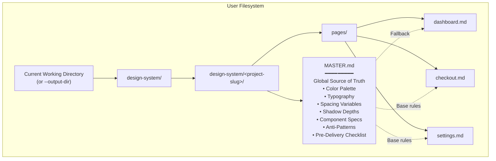
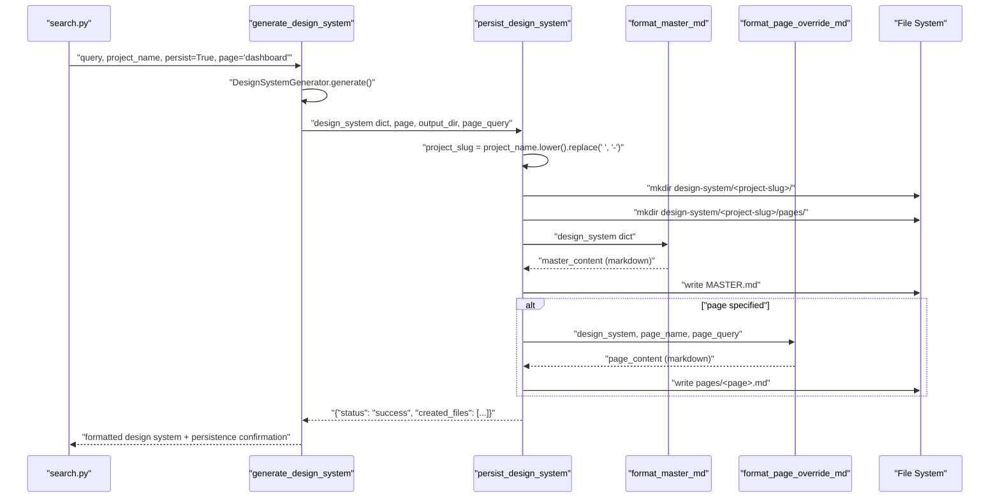
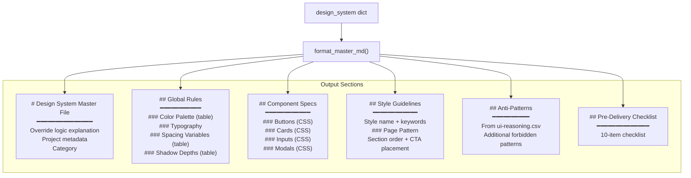
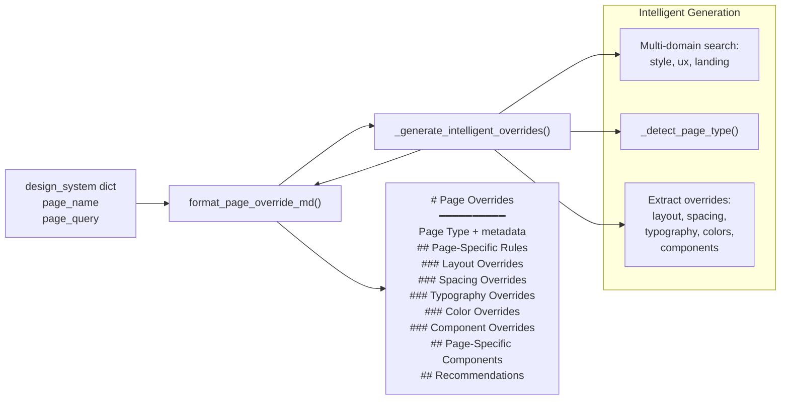
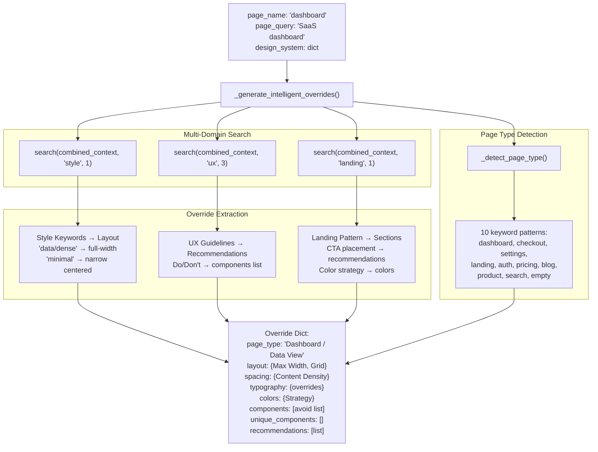
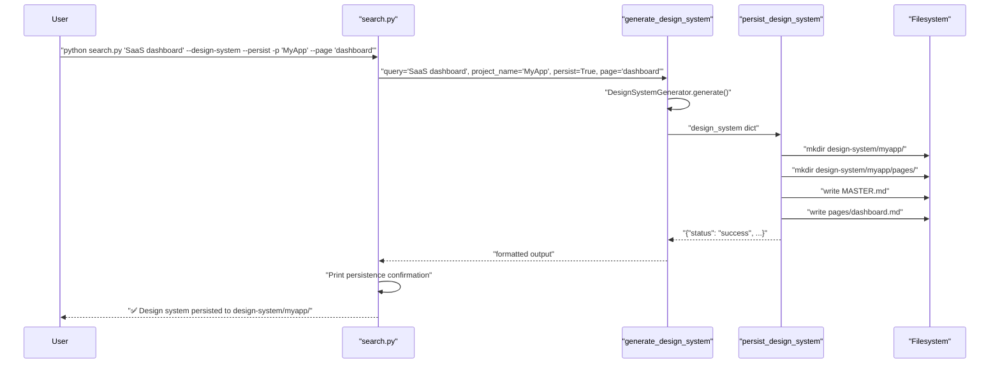
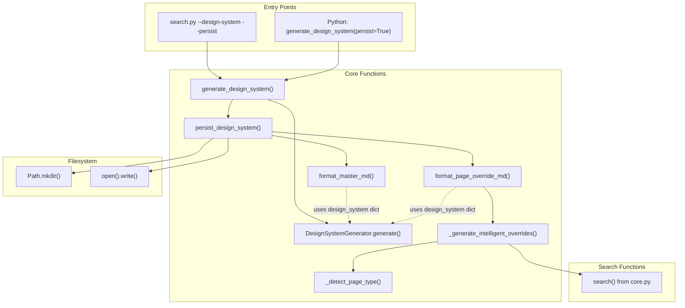

# Persistence and File Structure

<details>
<summary>Relevant source files</summary>

The following files were used as context for generating this wiki page:

- [.claude/skills/ui-ux-pro-max/scripts/design_system.py](.claude/skills/ui-ux-pro-max/scripts/design_system.py)
- [cli/assets/scripts/core.py](cli/assets/scripts/core.py)
- [cli/assets/scripts/design_system.py](cli/assets/scripts/design_system.py)
- [src/ui-ux-pro-max/scripts/design_system.py](src/ui-ux-pro-max/scripts/design_system.py)

</details>


This page documents the persistence mechanisms in the Design System Generator that save generated design systems to disk using the Master + Overrides pattern. This includes the `persist_design_system` function, directory structure creation, file formatters, and intelligent page override generation.

For the conceptual foundation of the Master + Overrides pattern, see **6.2 Master + Overrides Pattern**. For CLI usage of persistence flags, see **5.2 search.py CLI Interface**.

---

## Overview

The persistence system transforms in-memory design system dictionaries into a hierarchical file structure on disk. It creates project-specific folders under `design-system/<project-slug>/` and generates two types of markdown files:

| File Type | Path | Purpose |
|-----------|------|---------|
| **MASTER.md** | `design-system/<project>/MASTER.md` | Global design rules (colors, typography, spacing, components) |
| **Page Overrides** | `design-system/<project>/pages/<page>.md` | Page-specific deviations from MASTER.md |

The persistence system is invoked through the `--persist` flag in `search.py` and uses intelligent search-based content generation for page overrides.

**Sources:** [src/ui-ux-pro-max/scripts/design_system.py:490-539](), [.claude/skills/ui-ux-pro-max/scripts/design_system.py:490-539]()

---

## Persistence Architecture

### File Structure Output

Title: Persistence Directory Hierarchy


**Directory Structure Example:**

```
design-system/
└── my-saas-app/
    ├── MASTER.md              # Global design rules
    └── pages/
        ├── dashboard.md       # Dashboard-specific overrides
        ├── checkout.md        # Checkout-specific overrides
        └── settings.md        # Settings-specific overrides
```

**Sources:** [src/ui-ux-pro-max/scripts/design_system.py:491-539](), [.claude/skills/ui-ux-pro-max/scripts/design_system.py:491-539]()

---

## persist_design_system Function

### Function Signature and Flow

Title: Persistence Logic Sequence


**Sources:** [src/ui-ux-pro-max/scripts/design_system.py:491-539](), [.claude/skills/ui-ux-pro-max/scripts/design_system.py:491-539]()

### Function Implementation

The `persist_design_system` function accepts the following parameters:

| Parameter | Type | Description |
|-----------|------|-------------|
| `design_system` | `dict` | Generated design system dictionary from `DesignSystemGenerator.generate()` |
| `page` | `str` (optional) | Page name for creating page-specific override file |
| `output_dir` | `str` (optional) | Output directory (defaults to `Path.cwd()`) |
| `page_query` | `str` (optional) | Query string for intelligent page override generation |

**Returns:** Dictionary with status and created file paths:
```python
{
    "status": "success",
    "design_system_dir": "design-system/my-project",
    "created_files": [
        "design-system/my-project/MASTER.md",
        "design-system/my-project/pages/dashboard.md"
    ]
}
```

**Sources:** [src/ui-ux-pro-max/scripts/design_system.py:491-539](), [.claude/skills/ui-ux-pro-max/scripts/design_system.py:491-539]()

---

## Project Slug Generation

The project slug is generated from the `project_name` field in the design system dictionary:

```python
project_name = design_system.get("project_name", "default")
project_slug = project_name.lower().replace(' ', '-')
```

**Examples:**

| Project Name | Project Slug | Path |
|--------------|--------------|------|
| `"SaaS Dashboard"` | `"saas-dashboard"` | `design-system/saas-dashboard/` |
| `"E-commerce Luxury"` | `"e-commerce-luxury"` | `design-system/e-commerce-luxury/` |
| `"My Project"` | `"my-project"` | `design-system/my-project/` |
| `None` (default) | `"default"` | `design-system/default/` |

The project name originates from either:
1. The `--project-name` CLI flag in `search.py` [cli/assets/scripts/search.py:65]()
2. The query string uppercased (fallback) [src/ui-ux-pro-max/scripts/design_system.py:198]()

**Sources:** [src/ui-ux-pro-max/scripts/design_system.py:504-510](), [.claude/skills/ui-ux-pro-max/scripts/design_system.py:504-510]()

---

## Directory Creation

The persistence system creates directories using `Path.mkdir(parents=True, exist_ok=True)`:

```python
design_system_dir = base_dir / "design-system" / project_slug
pages_dir = design_system_dir / "pages"

design_system_dir.mkdir(parents=True, exist_ok=True)  # Create parent dirs if needed
pages_dir.mkdir(parents=True, exist_ok=True)
```

**Behavior:**
- `parents=True`: Creates all intermediate directories (e.g., `design-system/`)
- `exist_ok=True`: Does not raise error if directories already exist (idempotent)

This allows repeated invocations to update files without directory conflicts.

**Sources:** [src/ui-ux-pro-max/scripts/design_system.py:515-517](), [.claude/skills/ui-ux-pro-max/scripts/design_system.py:515-517]()

---

## MASTER.md Generation

### format_master_md Function

The `format_master_md` function transforms the design system dictionary into a structured markdown document with the following sections:

Title: Master File Content Generation


### Override Logic Header

The MASTER.md file begins with explicit instructions for AI assistants:

```markdown
> **LOGIC:** When building a specific page, first check `design-system/pages/[page-name].md`.
> If that file exists, its rules **override** this Master file.
> If not, strictly follow the rules below.
```

This is embedded to ensure AI assistants follow the hierarchical retrieval pattern.

**Sources:** [src/ui-ux-pro-max/scripts/design_system.py:559-561](), [.claude/skills/ui-ux-pro-max/scripts/design_system.py:559-561]()

### Component Specifications

Component specs are rendered as CSS code blocks with actual color values from the design system:

```css
/* Primary Button */
.btn-primary {
  background: #F97316;  /* From colors.cta */
  color: white;
  padding: 12px 24px;
  border-radius: 8px;
  font-weight: 600;
  transition: all 200ms ease;
  cursor: pointer;
}
```

The function injects colors dynamically using f-strings.

**Sources:** [src/ui-ux-pro-max/scripts/design_system.py:633-731](), [.claude/skills/ui-ux-pro-max/scripts/design_system.py:633-731]()

---

## Page Override Generation

### format_page_override_md Function

The `format_page_override_md` function generates page-specific override files with intelligent content. Unlike hardcoded templates, it uses search-based content generation.

Title: Page Override Content Generation


**Sources:** [src/ui-ux-pro-max/scripts/design_system.py:805-911](), [.claude/skills/ui-ux-pro-max/scripts/design_system.py:805-911]()

### Override Structure

Page override files document **only deviations** from MASTER.md:

```markdown
# Dashboard Page Overrides

> **PROJECT:** My SaaS App
> **Generated:** 2024-01-15 14:30:00
> **Page Type:** Dashboard / Data View

> ⚠️ **IMPORTANT:** Rules in this file **override** the Master file (`design-system/MASTER.md`).
> Only deviations from the Master are documented here. For all other rules, refer to the Master.

## Page-Specific Rules

### Layout Overrides
- **Max Width:** 1400px or full-width
- **Grid:** 12-column grid for data flexibility

### Spacing Overrides
- **Content Density:** High — optimize for information display
```

The "IMPORTANT" callout explicitly instructs AI assistants on the override semantics.

**Sources:** [src/ui-ux-pro-max/scripts/design_system.py:814-826](), [.claude/skills/ui-ux-pro-max/scripts/design_system.py:814-826]()

---

## Intelligent Override Generation

### _generate_intelligent_overrides Function

The `_generate_intelligent_overrides` function uses the existing BM25 search infrastructure to generate contextual overrides instead of hardcoded rules.

Title: Intelligent Override Inference


**Sources:** [src/ui-ux-pro-max/scripts/design_system.py:914-1017](), [.claude/skills/ui-ux-pro-max/scripts/design_system.py:914-1017]()

### Search-Based Override Logic

The function performs three parallel searches and extracts overrides:

**1. Style Search → Layout Inference**

```python
style_search = search(combined_context, "style", max_results=1)
style_results = style_search.get("results", [])

if style_results:
    keywords = style_results[0].get("Keywords", "")
    
    # Infer layout from keywords
    if any(kw in keywords.lower() for kw in ["data", "dense", "dashboard", "grid"]):
        layout["Max Width"] = "1400px or full-width"
        layout["Grid"] = "12-column grid for data flexibility"
        spacing["Content Density"] = "High — optimize for information display"
```

This logic appears in [src/ui-ux-pro-max/scripts/design_system.py:950-970]().

**2. UX Search → Recommendations**

```python
ux_search = search(combined_context, "ux", max_results=3)
ux_results = ux_search.get("results", [])

for ux in ux_results:
    category = ux.get("Category", "")
    do_text = ux.get("Do", "")
    dont_text = ux.get("Don't", "")
    if do_text:
        recommendations.append(f"{category}: {do_text}")
    if dont_text:
        components.append(f"Avoid: {dont_text}")
```

This extracts actionable guidance from `ux-guidelines.csv`.

**3. Landing Search → Section Structure**

```python
landing_search = search(combined_context, "landing", max_results=1)
landing_results = landing_search.get("results", [])

if landing_results:
    sections = landing_results[0].get("Section Order", "")
    cta_placement = landing_results[0].get("Primary CTA Placement", "")
    color_strategy = landing_results[0].get("Color Strategy", "")
    
    if sections:
        layout["Sections"] = sections
    if cta_placement:
        recommendations.append(f"CTA Placement: {cta_placement}")
```

**Sources:** [src/ui-ux-pro-max/scripts/design_system.py:926-995](), [.claude/skills/ui-ux-pro-max/scripts/design_system.py:926-995]()

---

## Page Type Detection

### _detect_page_type Function

The `_detect_page_type` function uses keyword pattern matching to classify pages. It uses a list of keyword-to-type mappings:

```python
page_patterns = [
    (["dashboard", "admin", "analytics", "data", "metrics", "stats", "monitor", "overview"], 
     "Dashboard / Data View"),
    (["checkout", "payment", "cart", "purchase", "order", "billing"], 
     "Checkout / Payment"),
    (["settings", "profile", "account", "preferences", "config"], 
     "Settings / Profile"),
    # ... 7 more patterns
]

for keywords, page_type in page_patterns:
    if any(kw in context_lower for kw in keywords):
        return page_type
```

If no pattern matches, it falls back to checking the style search results' "Best For" field, and finally returns `"General"` as default.

**Sources:** [src/ui-ux-pro-max/scripts/design_system.py:1020-1052](), [.claude/skills/ui-ux-pro-max/scripts/design_system.py:1020-1052]()

---

## CLI Integration

### search.py Persistence Flags

The `search.py` CLI exposes three flags for persistence:

| Flag | Type | Description |
|------|------|-------------|
| `--persist` | `action="store_true"` | Save design system to `design-system/<project>/MASTER.md` |
| `--page <name>` | `str` | Create page-specific override in `pages/<name>.md` |
| `--output-dir <path>` | `str` | Output directory (default: current directory) |

### Invocation Flow

Title: CLI to Persistence Flow


**Sources:** [cli/assets/scripts/search.py:68-98](), [src/ui-ux-pro-max/scripts/search.py:68-98]()

---

## Function Call Graph

Title: Persistence Module Dependencies


**Key Functions and Their Locations:**

| Function | File | Lines | Purpose |
|----------|------|-------|---------|
| `persist_design_system` | `design_system.py` | 491-539 | Main persistence orchestrator |
| `format_master_md` | `design_system.py` | 542-802 | Generate MASTER.md content |
| `format_page_override_md` | `design_system.py` | 805-911 | Generate page override content |
| `_generate_intelligent_overrides` | `design_system.py` | 914-1017 | Search-based override generation |
| `_detect_page_type` | `design_system.py` | 1020-1052 | Keyword-based page classification |
| `generate_design_system` | `design_system.py` | 462-487 | Entry point with persist flag |

**Sources:** [src/ui-ux-pro-max/scripts/design_system.py:462-1052](), [.claude/skills/ui-ux-pro-max/scripts/design_system.py:462-1052]()
