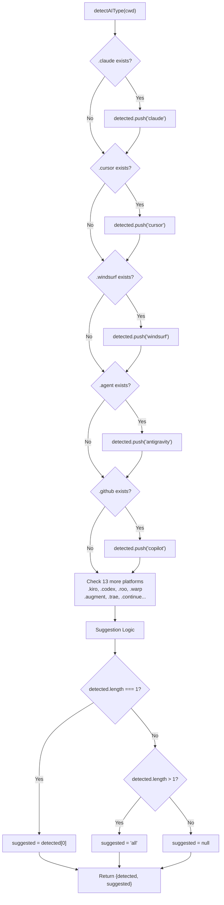
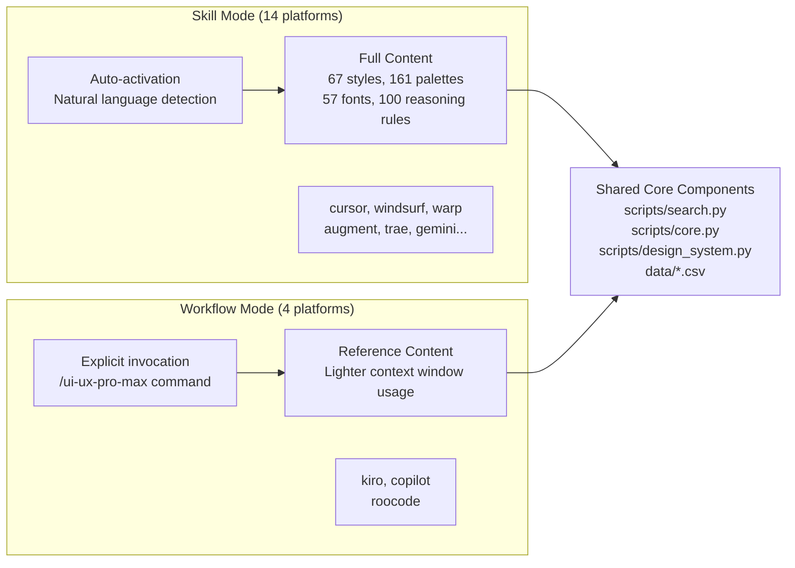

# Platform Integration

<details>
<summary>Relevant source files</summary>

The following files were used as context for generating this wiki page:

- [cli/assets/templates/platforms/agent.json](cli/assets/templates/platforms/agent.json)
- [cli/assets/templates/platforms/augment.json](cli/assets/templates/platforms/augment.json)
- [cli/assets/templates/platforms/copilot.json](cli/assets/templates/platforms/copilot.json)
- [cli/assets/templates/platforms/cursor.json](cli/assets/templates/platforms/cursor.json)
- [cli/assets/templates/platforms/kilocode.json](cli/assets/templates/platforms/kilocode.json)
- [cli/assets/templates/platforms/kiro.json](cli/assets/templates/platforms/kiro.json)
- [cli/assets/templates/platforms/roocode.json](cli/assets/templates/platforms/roocode.json)
- [cli/assets/templates/platforms/warp.json](cli/assets/templates/platforms/warp.json)
- [cli/assets/templates/platforms/windsurf.json](cli/assets/templates/platforms/windsurf.json)
- [cli/src/commands/init.ts](cli/src/commands/init.ts)
- [cli/src/commands/uninstall.ts](cli/src/commands/uninstall.ts)
- [skill.json](skill.json)
- [src/ui-ux-pro-max/templates/platforms/agent.json](src/ui-ux-pro-max/templates/platforms/agent.json)
- [src/ui-ux-pro-max/templates/platforms/augment.json](src/ui-ux-pro-max/templates/platforms/augment.json)
- [src/ui-ux-pro-max/templates/platforms/copilot.json](src/ui-ux-pro-max/templates/platforms/copilot.json)
- [src/ui-ux-pro-max/templates/platforms/cursor.json](src/ui-ux-pro-max/templates/platforms/cursor.json)
- [src/ui-ux-pro-max/templates/platforms/kilocode.json](src/ui-ux-pro-max/templates/platforms/kilocode.json)
- [src/ui-ux-pro-max/templates/platforms/kiro.json](src/ui-ux-pro-max/templates/platforms/kiro.json)
- [src/ui-ux-pro-max/templates/platforms/roocode.json](src/ui-ux-pro-max/templates/platforms/roocode.json)
- [src/ui-ux-pro-max/templates/platforms/warp.json](src/ui-ux-pro-max/templates/platforms/warp.json)
- [src/ui-ux-pro-max/templates/platforms/windsurf.json](src/ui-ux-pro-max/templates/platforms/windsurf.json)

</details>


The Platform Integration system enables UI/UX Pro Max to operate across 18 AI coding assistants through a template-based configuration mechanism. This system handles platform detection, configuration management, and file generation to create platform-specific installations from a single source of truth. For details on the CLI commands that drive this integration, see [CLI Commands](#2.1). For the template generation mechanism itself, see [Template Generation](#2.4).

## Supported Platforms

The system supports 18 AI coding assistant platforms, each identified by an `AIType` discriminator and mapped to specific directory structures via JSON configuration files:

| Platform | AIType | Root Directory | File Structure | Mode |
|----------|--------|----------------|----------------|------|
| Claude Code | `claude` | `.claude/` | `skills/ui-ux-pro-max/SKILL.md` | Skill |
| Cursor | `cursor` | `.cursor/` | `skills/ui-ux-pro-max/SKILL.md` | Skill |
| Windsurf | `windsurf` | `.windsurf/` | `skills/ui-ux-pro-max/SKILL.md` | Skill |
| Antigravity | `antigravity` | `.agent/` | `skills/ui-ux-pro-max/SKILL.md` | Skill |
| GitHub Copilot | `copilot` | `.github/` | `prompts/ui-ux-pro-max/PROMPT.md` | Workflow |
| Kiro | `kiro` | `.kiro/` | `steering/ui-ux-pro-max/SKILL.md` | Workflow |
| Codex CLI | `codex` | `.codex/` | `skills/ui-ux-pro-max/SKILL.md` | Skill |
| Roo Code | `roocode` | `.roo/` | `skills/ui-ux-pro-max/SKILL.md` | Workflow |
| Qoder | `qoder` | `.qoder/` | `skills/ui-ux-pro-max/SKILL.md` | Skill |
| Gemini CLI | `gemini` | `.gemini/` | `skills/ui-ux-pro-max/SKILL.md` | Skill |
| Trae | `trae` | `.trae/` | `skills/ui-ux-pro-max/SKILL.md` | Skill |
| OpenCode | `opencode` | `.opencode/` | `skills/ui-ux-pro-max/SKILL.md` | Skill |
| Continue | `continue` | `.continue/` | `skills/ui-ux-pro-max/SKILL.md` | Skill |
| CodeBuddy | `codebuddy` | `.codebuddy/` | `skills/ui-ux-pro-max/SKILL.md` | Skill |
| Warp | `warp` | `.warp/` | `skills/ui-ux-pro-max/SKILL.md` | Skill |
| Augment | `augment` | `.augment/` | `skills/ui-ux-pro-max/SKILL.md` | Skill |
| Kilocode | `kilocode` | `.kilocode/` | `skills/ui-ux-pro-max/SKILL.md` | Skill |

**Sources:** [cli/src/types/index.ts:1-62](), [cli/src/utils/detect.ts:10-65](), [src/ui-ux-pro-max/templates/platforms/warp.json:1-21](), [src/ui-ux-pro-max/templates/platforms/augment.json:1-21]()

## Platform Detection System

### detectAIType Function

The `detectAIType` function in `cli/src/utils/detect.ts` performs filesystem-based platform detection by scanning for platform-specific directories:



**Detection Algorithm:**

The detection follows a sequential filesystem check pattern:

1. **Parallel Directory Checks**: Uses `existsSync(join(cwd, platformDir))` for each platform defined in `AI_FOLDERS`.
2. **Detection Accumulation**: Builds an array of all detected platforms in the current working directory.
3. **Suggestion Logic**:
   - If exactly 1 platform detected → suggest that specific platform.
   - If multiple platforms detected → suggest `'all'`.
   - If no platforms detected → suggest `null`.

**Sources:** [cli/src/utils/detect.ts:10-65](), [cli/src/commands/init.ts:123-147]()

## Platform Configuration Schema

### PlatformConfig Interface

Each platform is defined by a JSON configuration file (e.g., `cursor.json`, `warp.json`) conforming to the `PlatformConfig` interface:

```typescript
interface PlatformConfig {
  platform: string;              // AIType identifier
  displayName: string;           // Human-readable name
  installType: InstallType;      // 'full' | 'reference'
  folderStructure: {
    root: string;                // Root directory (e.g., '.cursor')
    skillPath: string;           // Relative path to skill folder
    filename: string;            // Main file (SKILL.md or PROMPT.md)
  };
  scriptPath: string;            // Path to search.py for AI to execute
  frontmatter: Record<string, string> | null;  // YAML frontmatter (optional)
  sections: {
    quickReference: boolean;     // Include quick reference section
  };
  title: string;                 // Skill/Prompt title
  description: string;           // Detailed description
  skillOrWorkflow: string;       // 'Skill' | 'Workflow'
}
```

### Configuration Examples

**Skill Mode (Full Content):**
[src/ui-ux-pro-max/templates/platforms/cursor.json:1-21]()
```json
{
  "platform": "cursor",
  "displayName": "Cursor",
  "installType": "full",
  "folderStructure": {
    "root": ".cursor",
    "skillPath": "skills/ui-ux-pro-max",
    "filename": "SKILL.md"
  },
  "scriptPath": "skills/ui-ux-pro-max/scripts/search.py",
  "skillOrWorkflow": "Skill"
}
```

**Workflow Mode (Reference Content):**
[src/ui-ux-pro-max/templates/platforms/roocode.json:1-21]()
```json
{
  "platform": "roocode",
  "displayName": "Roo Code",
  "installType": "full",
  "folderStructure": {
    "root": ".roo",
    "skillPath": "skills/ui-ux-pro-max",
    "filename": "SKILL.md"
  },
  "scriptPath": "skills/ui-ux-pro-max/scripts/search.py",
  "skillOrWorkflow": "Workflow"
}
```

**Sources:** [src/ui-ux-pro-max/templates/platforms/cursor.json:1-21](), [src/ui-ux-pro-max/templates/platforms/roocode.json:1-21](), [src/ui-ux-pro-max/templates/platforms/kiro.json:1-21]()

## Skill Mode vs Workflow Mode

### Mode Comparison Diagram



### Mode Characteristics

| Aspect | Skill Mode | Workflow Mode |
|--------|------------|---------------|
| **Trigger** | Auto-activates on UI/UX keywords | Requires explicit slash command |
| **Platforms** | 14 platforms (Cursor, Windsurf, Warp, etc.) | 4 platforms (Kiro, Copilot, Roo Code) |
| **Content Size** | Full knowledge base | Lighter reference content |
| **installType** | `'full'` | `'full'` |
| **Usage Pattern** | `"Build landing page..."` | `/ui-ux-pro-max Build landing page...` |

For details, see [Skill vs Workflow Modes](#7.2).

**Sources:** [src/ui-ux-pro-max/templates/platforms/cursor.json:20](), [src/ui-ux-pro-max/templates/platforms/kiro.json:20](), [src/ui-ux-pro-max/templates/platforms/roocode.json:20]()

## Platform-Specific Variations

### Directory Structure Variations

The `folderStructure` object in platform configs determines the final installation path.

| Platform | Root Directory | Subdirectory | Filename |
|----------|----------------|--------------|----------|
| Cursor | `.cursor/` | `skills/` | `SKILL.md` |
| GitHub Copilot | `.github/` | `prompts/` | `PROMPT.md` |
| Kiro | `.kiro/` | `steering/` | `SKILL.md` |
| Roo Code | `.roo/` | `skills/` | `SKILL.md` |
| Warp | `.warp/` | `skills/` | `SKILL.md` |

**Sources:** [src/ui-ux-pro-max/templates/platforms/copilot.json:5-9](), [src/ui-ux-pro-max/templates/platforms/kiro.json:5-9](), [src/ui-ux-pro-max/templates/platforms/warp.json:5-9]()

### Frontmatter Variations

Specific platforms utilize YAML frontmatter for metadata and activation triggers. For example, `kiro.json` and `cursor.json` include descriptions and names in the `frontmatter` block to help the AI understand its capabilities.

[src/ui-ux-pro-max/templates/platforms/kiro.json:11-14]()
```json
"frontmatter": {
  "name": "ui-ux-pro-max",
  "description": "Comprehensive design guide for web and mobile applications..."
}
```

## Template Generation Flow

The `initCommand` in `cli/src/commands/init.ts` handles the installation by either downloading a legacy ZIP or using the modern template-based generation.

1. **Platform Selection**: User selects or CLI detects `AIType`.
2. **Template Loading**: CLI loads the base template and platform-specific JSON.
3. **Variable Injection**: Injects `title`, `description`, and `scriptPath` into the template.
4. **Filesystem Writing**: Creates directories and writes the generated Markdown file.
5. **Asset Copying**: Copies the `data/` and `scripts/` folders to the target location.

For details, see [Platform Configuration System](#7.1).

**Sources:** [cli/src/commands/init.ts:97-115](), [cli/src/commands/init.ts:153-183]()

## Claude Marketplace Integration

The skill is also distributed via the Claude Marketplace, allowing for direct installation into Claude Code.

- **plugin.json**: Defines the plugin structure for Claude.
- **marketplace.json**: Contains marketplace metadata, including keywords like `ui`, `ux`, and `design` for discovery.

For details, see [Claude Marketplace Integration](#7.3).

**Sources:** [skill.json:1-15](), [README.md:248-255]()
