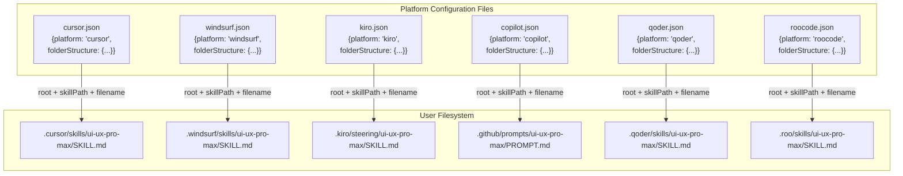
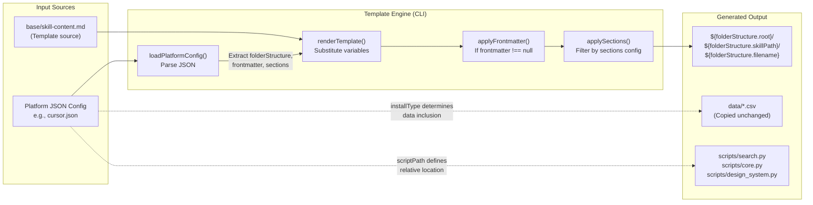

# Platform Configuration System

<details>
<summary>Relevant source files</summary>

The following files were used as context for generating this wiki page:

- [cli/assets/templates/platforms/agent.json](cli/assets/templates/platforms/agent.json)
- [cli/assets/templates/platforms/claude.json](cli/assets/templates/platforms/claude.json)
- [cli/assets/templates/platforms/codebuddy.json](cli/assets/templates/platforms/codebuddy.json)
- [cli/assets/templates/platforms/codex.json](cli/assets/templates/platforms/codex.json)
- [cli/assets/templates/platforms/continue.json](cli/assets/templates/platforms/continue.json)
- [cli/assets/templates/platforms/copilot.json](cli/assets/templates/platforms/copilot.json)
- [cli/assets/templates/platforms/cursor.json](cli/assets/templates/platforms/cursor.json)
- [cli/assets/templates/platforms/gemini.json](cli/assets/templates/platforms/gemini.json)
- [cli/assets/templates/platforms/kiro.json](cli/assets/templates/platforms/kiro.json)
- [cli/assets/templates/platforms/opencode.json](cli/assets/templates/platforms/opencode.json)
- [cli/assets/templates/platforms/roocode.json](cli/assets/templates/platforms/roocode.json)
- [cli/assets/templates/platforms/windsurf.json](cli/assets/templates/platforms/windsurf.json)
- [src/ui-ux-pro-max/templates/platforms/agent.json](src/ui-ux-pro-max/templates/platforms/agent.json)
- [src/ui-ux-pro-max/templates/platforms/claude.json](src/ui-ux-pro-max/templates/platforms/claude.json)
- [src/ui-ux-pro-max/templates/platforms/codebuddy.json](src/ui-ux-pro-max/templates/platforms/codebuddy.json)
- [src/ui-ux-pro-max/templates/platforms/codex.json](src/ui-ux-pro-max/templates/platforms/codex.json)
- [src/ui-ux-pro-max/templates/platforms/continue.json](src/ui-ux-pro-max/templates/platforms/continue.json)
- [src/ui-ux-pro-max/templates/platforms/copilot.json](src/ui-ux-pro-max/templates/platforms/copilot.json)
- [src/ui-ux-pro-max/templates/platforms/cursor.json](src/ui-ux-pro-max/templates/platforms/cursor.json)
- [src/ui-ux-pro-max/templates/platforms/gemini.json](src/ui-ux-pro-max/templates/platforms/gemini.json)
- [src/ui-ux-pro-max/templates/platforms/kiro.json](src/ui-ux-pro-max/templates/platforms/kiro.json)
- [src/ui-ux-pro-max/templates/platforms/opencode.json](src/ui-ux-pro-max/templates/platforms/opencode.json)
- [src/ui-ux-pro-max/templates/platforms/qoder.json](src/ui-ux-pro-max/templates/platforms/qoder.json)
- [src/ui-ux-pro-max/templates/platforms/roocode.json](src/ui-ux-pro-max/templates/platforms/roocode.json)
- [src/ui-ux-pro-max/templates/platforms/trae.json](src/ui-ux-pro-max/templates/platforms/trae.json)
- [src/ui-ux-pro-max/templates/platforms/windsurf.json](src/ui-ux-pro-max/templates/platforms/windsurf.json)

</details>


## Purpose and Scope

The Platform Configuration System defines how UI/UX Pro Max adapts to different AI coding assistants through JSON-based configuration files. Each platform (Cursor, Claude, Windsurf, GitHub Copilot, etc.) has unique requirements for directory structure, file naming, and metadata format. This system provides a declarative schema that the template generator reads to produce platform-specific installations.

The system supports 18 distinct platforms, including recent additions such as **warp**, **augment**, **trae**, **opencode**, **continue**, **codebuddy**, **qoder**, **codex**, and **gemini**.

For information about how these configurations distinguish between Skill Mode and Workflow Mode behavior, see [7.2 Skill vs Workflow Modes](). For details on how templates are processed and rendered, see [2.4 Template Generation]().

---

## Configuration File Schema

Each platform is defined by a JSON file in `src/ui-ux-pro-max/templates/platforms/` (source of truth) and `cli/assets/templates/platforms/` (bundled with CLI). The schema consists of the following top-level fields:

| Field | Type | Required | Description |
|-------|------|----------|-------------|
| `platform` | `string` | Yes | Internal identifier (e.g., `"cursor"`, `"trae"`) |
| `displayName` | `string` | Yes | Human-readable name (e.g., `"Cursor"`, `"Trae"`) |
| `installType` | `string` | Yes | Content mode: `"full"` or `"reference"` |
| `folderStructure` | `object` | Yes | Defines directory hierarchy (see below) |
| `scriptPath` | `string` | Yes | Relative path to `search.py` from project root |
| `frontmatter` | `object \| null` | Yes | YAML frontmatter for file header, or `null` if not needed |
| `sections` | `object` | Yes | Content sections to include (see below) |
| `title` | `string` | Yes | Skill/workflow title shown to user |
| `description` | `string` | Yes | Brief description of capabilities |
| `skillOrWorkflow` | `string` | Yes | Interaction mode: `"Skill"` or `"Workflow"` |

### folderStructure Object

```json
{
  "root": ".cursor",              // Top-level directory
  "skillPath": "skills/ui-ux-pro-max",  // Subdirectory path
  "filename": "SKILL.md"          // Primary file name
}
```

### sections Object

```json
{
  "quickReference": false  // Whether to include condensed reference content
}
```

### frontmatter Object (Optional)

```json
{
  "name": "ui-ux-pro-max",
  "description": "UI/UX design intelligence with searchable database"
}
```

**Sources:** [src/ui-ux-pro-max/templates/platforms/cursor.json:1-21](), [src/ui-ux-pro-max/templates/platforms/windsurf.json:1-21](), [src/ui-ux-pro-max/templates/platforms/qoder.json:1-21]()

---

## Platform Configuration Mapping

The following diagram shows how platform configuration files map to their respective filesystem structures across various AI assistants:

**Configuration to Filesystem Mapping**



**Sources:** [src/ui-ux-pro-max/templates/platforms/cursor.json:5-9](), [src/ui-ux-pro-max/templates/platforms/kiro.json:5-9](), [src/ui-ux-pro-max/templates/platforms/copilot.json:5-9](), [src/ui-ux-pro-max/templates/platforms/roocode.json:5-9]()

---

## Platform Comparison Table

The following table compares key configuration differences across a selection of the 18 supported platforms:

| Platform | `root` | `skillPath` | `filename` | `frontmatter` | `skillOrWorkflow` |
|----------|--------|-------------|------------|---------------|-------------------|
| Cursor | `.cursor` | `skills/ui-ux-pro-max` | `SKILL.md` | `null` | `Skill` |
| Windsurf | `.windsurf` | `skills/ui-ux-pro-max` | `SKILL.md` | `null` | `Skill` |
| Kiro | `.kiro` | `steering/ui-ux-pro-max` | `SKILL.md` | `null` | `Workflow` |
| GitHub Copilot | `.github` | `prompts/ui-ux-pro-max` | `PROMPT.md` | `null` | `Workflow` |
| Qoder | `.qoder` | `skills/ui-ux-pro-max` | `SKILL.md` | `{"name": "...", ...}` | `Skill` |
| Roo Code | `.roo` | `skills/ui-ux-pro-max` | `SKILL.md` | `null` | `Workflow` |
| Antigravity | `.agents` | `skills/ui-ux-pro-max` | `SKILL.md` | `null` | `Skill` |

**Key Observations:**

1. **Root Directory Variance:** Each platform uses a unique top-level directory (`.cursor`, `.windsurf`, `.kiro`, `.agents`, etc.) [src/ui-ux-pro-max/templates/platforms/agent.json:6]().
2. **Subdirectory Patterns:** Most use `skills/`, Kiro uses `steering/` [src/ui-ux-pro-max/templates/platforms/kiro.json:7](), Copilot uses `prompts/` [src/ui-ux-pro-max/templates/platforms/copilot.json:7]().
3. **Filename Convention:** Most use `SKILL.md`, GitHub Copilot uses `PROMPT.md` [src/ui-ux-pro-max/templates/platforms/copilot.json:8]().
4. **Frontmatter:** Platforms like Qoder require YAML frontmatter for identification [src/ui-ux-pro-max/templates/platforms/qoder.json:11-14]().
5. **Mode Distribution:** Modern agents like Cursor and Windsurf are Skill Mode; Kiro, Copilot, and Roo Code are Workflow Mode [src/ui-ux-pro-max/templates/platforms/cursor.json:20](), [src/ui-ux-pro-max/templates/platforms/roocode.json:20]().

**Sources:** [src/ui-ux-pro-max/templates/platforms/cursor.json:1-20](), [src/ui-ux-pro-max/templates/platforms/kiro.json:1-20](), [src/ui-ux-pro-max/templates/platforms/copilot.json:1-20](), [src/ui-ux-pro-max/templates/platforms/agent.json:1-20]()

---

## Template Processing Flow

The following diagram illustrates how the CLI tool reads platform configuration files and generates the final installation:

**Template Processing with Code Entities**



**Sources:** [cli/assets/templates/platforms/cursor.json:1-21](), [src/ui-ux-pro-max/templates/platforms/windsurf.json:1-21]()

---

## Field Reference

### platform
**Type:** `string` | **Example:** `"cursor"`, `"windsurf"`, `"copilot"`
Internal identifier used for programmatic platform detection. Must match the expected value in the `detectAIType` function.
**Sources:** [src/ui-ux-pro-max/templates/platforms/cursor.json:2](), [src/ui-ux-pro-max/templates/platforms/windsurf.json:2]()

### displayName
**Type:** `string` | **Example:** `"Cursor"`, `"GitHub Copilot"`, `"Roo Code"`
Human-readable name displayed in CLI output. Used in success messages like "Successfully installed for Cursor".
**Sources:** [src/ui-ux-pro-max/templates/platforms/cursor.json:3](), [cli/assets/templates/platforms/copilot.json:3]()

### installType
**Type:** `string` | **Values:** `"full"` | `"reference"`
Determines content depth. `"full"` includes the complete knowledge base (67 styles, 161 color palettes, etc.) [src/ui-ux-pro-max/templates/platforms/cursor.json:4]().

### folderStructure
**Type:** `object`
Defines the complete filesystem path where skill files are installed.
- **`root`**: Top-level directory (e.g., `.cursor`, `.github`).
- **`skillPath`**: Subdirectory path within `root` (e.g., `skills/ui-ux-pro-max`).
- **`filename`**: Primary markdown file name (e.g., `SKILL.md`).
**Sources:** [src/ui-ux-pro-max/templates/platforms/cursor.json:5-9](), [cli/assets/templates/platforms/copilot.json:5-9]()

### scriptPath
**Type:** `string` | **Example:** `"skills/ui-ux-pro-max/scripts/search.py"`
Relative path from project root to `search.py` executable. This path is documented in the generated skill file so the AI assistant knows how to invoke search commands.
**Sources:** [src/ui-ux-pro-max/templates/platforms/cursor.json:10](), [cli/assets/templates/platforms/copilot.json:10]()

### frontmatter
**Type:** `object | null`
YAML frontmatter block to prepend to generated markdown file. Required by platforms like Qoder that parse metadata from file headers [src/ui-ux-pro-max/templates/platforms/qoder.json:11-14]().

### sections
**Type:** `object`
Controls which content sections are included. `quickReference: false` includes full content with detailed explanations [src/ui-ux-pro-max/templates/platforms/cursor.json:15-17]().

### title & description
**Type:** `string`
Standardized skill identifier and summary of capabilities. The description highlights the inclusion of 67 styles, 161 color palettes, 57 font pairings, and 99 UX guidelines across 16 technology stacks [src/ui-ux-pro-max/templates/platforms/cursor.json:18-19]().

### skillOrWorkflow
**Type:** `string` | **Values:** `"Skill"` | `"Workflow"`
Categorizes platform interaction model. `"Skill"` (e.g., Cursor, Windsurf) auto-activates, while `"Workflow"` (e.g., Kiro, Copilot) requires explicit invocation [src/ui-ux-pro-max/templates/platforms/cursor.json:20](), [src/ui-ux-pro-max/templates/platforms/kiro.json:20]().

---

## Configuration File Locations

Platform configuration files exist in two locations:

| Location | Purpose | Sync Status |
|----------|---------|-------------|
| `src/ui-ux-pro-max/templates/platforms/*.json` | Source of truth for development | Primary |
| `cli/assets/templates/platforms/*.json` | Bundled with CLI distribution | Manually synced from `src/` |

When adding or modifying platform configurations, always edit files in `src/ui-ux-pro-max/templates/platforms/` first, then manually copy to `cli/assets/templates/platforms/`.

**Sources:** [src/ui-ux-pro-max/templates/platforms/cursor.json](), [cli/assets/templates/platforms/cursor.json]()
