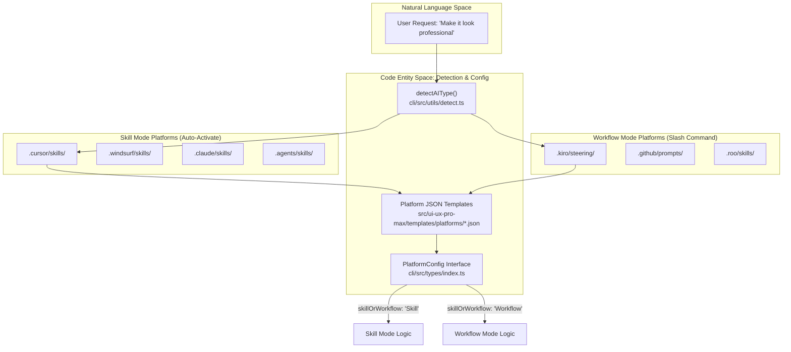
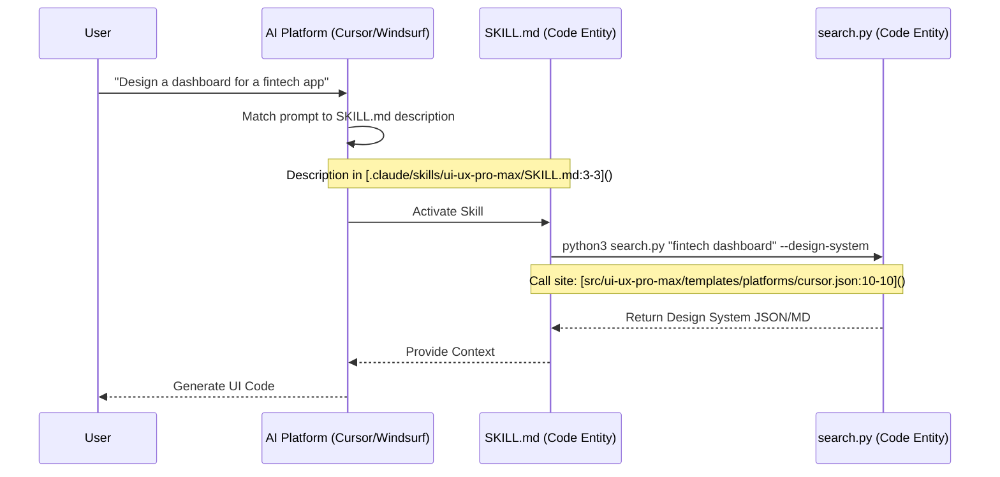
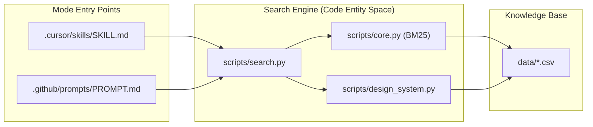

# Skill vs Workflow Modes

<details>
<summary>Relevant source files</summary>

The following files were used as context for generating this wiki page:

- [.claude/skills/ui-ux-pro-max/SKILL.md](.claude/skills/ui-ux-pro-max/SKILL.md)
- [.claude/skills/ui-ux-pro-max/data/react-performance.csv](.claude/skills/ui-ux-pro-max/data/react-performance.csv)
- [CLAUDE.md](CLAUDE.md)
- [src/ui-ux-pro-max/data/google-fonts.csv](src/ui-ux-pro-max/data/google-fonts.csv)
- [src/ui-ux-pro-max/templates/platforms/agent.json](src/ui-ux-pro-max/templates/platforms/agent.json)
- [src/ui-ux-pro-max/templates/platforms/copilot.json](src/ui-ux-pro-max/templates/platforms/copilot.json)
- [src/ui-ux-pro-max/templates/platforms/cursor.json](src/ui-ux-pro-max/templates/platforms/cursor.json)
- [src/ui-ux-pro-max/templates/platforms/kiro.json](src/ui-ux-pro-max/templates/platforms/kiro.json)
- [src/ui-ux-pro-max/templates/platforms/roocode.json](src/ui-ux-pro-max/templates/platforms/roocode.json)
- [src/ui-ux-pro-max/templates/platforms/windsurf.json](src/ui-ux-pro-max/templates/platforms/windsurf.json)

</details>


## Purpose and Scope

This document explains the two operational modes supported by UI/UX Pro Max: **Skill Mode** and **Workflow Mode**. These modes define how the design intelligence system integrates with different AI coding assistants, specifically their activation mechanisms, invocation patterns, and filesystem conventions.

For platform-specific configuration details, see [7.1 Platform Configuration System](). For how the CLI installs these modes, see [2.4 Template Generation]().

---

## Mode Overview

UI/UX Pro Max operates in two distinct modes depending on the capabilities and conventions of the AI platform as defined in the platform configuration files located in `src/ui-ux-pro-max/templates/platforms/`.

| Aspect | Skill Mode | Workflow Mode |
|--------|------------|---------------|
| **Activation** | Auto-detects UI/UX requests via NLP | Explicit slash command required |
| **Trigger Pattern** | Natural language (e.g., "Build a landing page") | Slash command (e.g., `/ui-ux-pro-max ...`) |
| **Install Type** | `full` | `full` |
| **Content Scope** | Complete knowledge base | Complete knowledge base |
| **User Friction** | Low (automatic) | Medium (manual invocation) |

**Sources:** [src/ui-ux-pro-max/templates/platforms/cursor.json:20-20](), [src/ui-ux-pro-max/templates/platforms/kiro.json:20-20](), [CLAUDE.md:7-8]()

---

## Platform Distribution by Mode

### Platform Distribution and Configuration Flow

The following diagram bridges the natural language intent to the code entities that manage platform detection and configuration.



**Sources:** [src/ui-ux-pro-max/templates/platforms/cursor.json:1-21](), [src/ui-ux-pro-max/templates/platforms/kiro.json:1-21](), [src/ui-ux-pro-max/templates/platforms/copilot.json:1-21](), [src/ui-ux-pro-max/templates/platforms/windsurf.json:1-21]()

---

## Skill Mode

### Characteristics

Skill Mode platforms support **automatic activation** when the AI assistant detects UI/UX-related intent. The AI platform's internal NLP engine matches the description provided in the `SKILL.md` frontmatter to the user's prompt.

**Key Implementation Details:**
*   **Metadata:** The `description` field in the frontmatter of `SKILL.md` (defined in `platforms/*.json`) acts as the trigger surface [src/ui-ux-pro-max/templates/platforms/cursor.json:11-14]().
*   **File Naming:** Typically uses `SKILL.md` [src/ui-ux-pro-max/templates/platforms/cursor.json:8-8]().

### Configuration Schema (Skill Mode)

Example from `cursor.json`:
```json
{
  "platform": "cursor",
  "installType": "full",
  "folderStructure": {
    "root": ".cursor",
    "skillPath": "skills/ui-ux-pro-max",
    "filename": "SKILL.md"
  },
  "skillOrWorkflow": "Skill"
}
```
**Sources:** [src/ui-ux-pro-max/templates/platforms/cursor.json:1-21]()

### Skill Mode Invocation Logic



**Sources:** [.claude/skills/ui-ux-pro-max/SKILL.md:1-4](), [src/ui-ux-pro-max/templates/platforms/cursor.json:10-10]()

---

## Workflow Mode

### Characteristics

Workflow Mode platforms require **explicit invocation** via a slash command (e.g., `/ui-ux-pro-max`). This is used for platforms where the AI does not automatically scan all project files for "skills" but instead relies on registered "prompts" or "workflows."

**Key Implementation Details:**
*   **Slash Command:** The name of the skill (e.g., `ui-ux-pro-max`) becomes the slash command [src/ui-ux-pro-max/templates/platforms/kiro.json:12-12]().
*   **Directory Naming:** Often uses platform-specific folders like `steering/` (Kiro) or `prompts/` (Copilot) [src/ui-ux-pro-max/templates/platforms/kiro.json:7-7](), [src/ui-ux-pro-max/templates/platforms/copilot.json:7-7]().

### Configuration Schema (Workflow Mode)

Example from `copilot.json`:
```json
{
  "platform": "copilot",
  "folderStructure": {
    "root": ".github",
    "skillPath": "prompts/ui-ux-pro-max",
    "filename": "PROMPT.md"
  },
  "skillOrWorkflow": "Workflow"
}
```
**Sources:** [src/ui-ux-pro-max/templates/platforms/copilot.json:1-21]()

---

## Installation and Filesystem Mapping

The CLI tool maps these modes to specific filesystem structures during the `init` command.

### Mode Comparison Table

| Platform | Mode | Root | Skill/Prompt Path | Filename |
| :--- | :--- | :--- | :--- | :--- |
| **Claude** | Skill | `.claude` | `skills/ui-ux-pro-max` | `SKILL.md` |
| **Cursor** | Skill | `.cursor` | `skills/ui-ux-pro-max` | `SKILL.md` |
| **Windsurf** | Skill | `.windsurf` | `skills/ui-ux-pro-max` | `SKILL.md` |
| **Kiro** | Workflow | `.kiro` | `steering/ui-ux-pro-max` | `SKILL.md` |
| **Copilot** | Workflow | `.github` | `prompts/ui-ux-pro-max` | `PROMPT.md` |
| **Roo Code** | Workflow | `.roo` | `skills/ui-ux-pro-max` | `SKILL.md` |

**Sources:** [src/ui-ux-pro-max/templates/platforms/cursor.json:5-9](), [src/ui-ux-pro-max/templates/platforms/kiro.json:5-9](), [src/ui-ux-pro-max/templates/platforms/copilot.json:5-9](), [src/ui-ux-pro-max/templates/platforms/roocode.json:5-9]()

---

## Technical Data Flow

Regardless of the mode, once the AI decides to use the toolkit, the data flow converges on the Python search engine.

### Common Execution Pipeline



**Sources:** [CLAUDE.md:38-40](), [src/ui-ux-pro-max/templates/platforms/cursor.json:10-10](), [src/ui-ux-pro-max/templates/platforms/kiro.json:10-10]()

### Implementation Notes
1.  **InstallType:** All current platform templates specify `"installType": "full"`, meaning they receive the entire `data/` and `scripts/` directories [src/ui-ux-pro-max/templates/platforms/agent.json:4-4]().
2.  **Frontmatter:** Skill Mode relies heavily on the `frontmatter` section in the JSON template to define the `description` that triggers the AI [src/ui-ux-pro-max/templates/platforms/cursor.json:11-14]().
3.  **Sections:** Some platforms (like Claude) can toggle a `quickReference` section, which adds a condensed rule table to the generated markdown [src/ui-ux-pro-max/templates/platforms/cursor.json:15-17]().

**Sources:** [src/ui-ux-pro-max/templates/platforms/cursor.json:1-21](), [src/ui-ux-pro-max/templates/platforms/agent.json:1-21](), [CLAUDE.md:73-76]()
