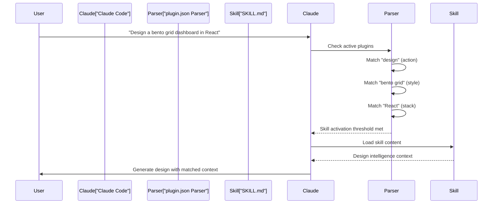

# Claude Marketplace Integration

<details>
<summary>Relevant source files</summary>

The following files were used as context for generating this wiki page:

- [.claude-plugin/marketplace.json](.claude-plugin/marketplace.json)
- [.claude-plugin/plugin.json](.claude-plugin/plugin.json)
- [cli/assets/templates/platforms/droid.json](cli/assets/templates/platforms/droid.json)
- [src/ui-ux-pro-max/templates/platforms/droid.json](src/ui-ux-pro-max/templates/platforms/droid.json)

</details>


This document describes the Claude Marketplace plugin distribution system for UI/UX Pro Max, covering the `plugin.json` and `marketplace.json` configuration files that enable direct installation through Claude's plugin directory. For general platform integration patterns across all 18 AI platforms, see [Platform Configuration System]().

## Purpose and Scope

The Claude Marketplace integration provides an alternative distribution channel for UI/UX Pro Max, enabling users to install the skill directly from Claude's plugin ecosystem without using the CLI tool. This integration is specific to the Claude Code platform and uses a two-file configuration system:

1.  **plugin.json** - Defines the plugin metadata and skill activation rules.
2.  **marketplace.json** - Provides marketplace-specific packaging and versioning.

Both files reside in the `.claude-plugin/` directory at the repository root.

---

## Plugin Configuration Architecture

The marketplace integration uses a dual-file structure where `plugin.json` defines the runtime behavior and `marketplace.json` handles distribution metadata.

### System Relationship Diagram

```mermaid
graph TB
    subgraph "Distribution_Channels"
        [NPM_uipro-cli] -- "uipro init" --> [Claude_JSON_Template]
        [Claude_Marketplace] -- "Direct Install" --> [Plugin_Files]
    end
    
    subgraph "Plugin_Files"
        [plugin.json]
        [marketplace.json]
    end
    
    subgraph "Claude_Skill_Directory"
        [SKILL_md]
        [data_CSV_Files]
        [search_py_Script]
    end

    [plugin.json] -- "points to" --> [SKILL_md]
    [Claude_JSON_Template] -- "defines" --> [SKILL_md]
    [SKILL_md] -- "uses" --> [data_CSV_Files]
    [SKILL_md] -- "executes" --> [search_py_Script]
```

**Sources:** [.claude-plugin/plugin.json:1-11](), [.claude-plugin/marketplace.json:1-35](), [src/ui-ux-pro-max/templates/platforms/droid.json:1-21]()

---

## plugin.json Structure

The `plugin.json` file defines the core plugin metadata and activation rules used by Claude Code.

### Field Specification

| Field | Type | Purpose | Example Value |
| :--- | :--- | :--- | :--- |
| `name` | string | Plugin identifier (kebab-case) | `"ui-ux-pro-max"` |
| `description` | string | Keyword-rich activation description | See keyword section below |
| `version` | string | Semantic version | `"2.5.0"` |
| `author.name` | string | Plugin author | `"nextlevelbuilder"` |
| `license` | string | SPDX license identifier | `"MIT"` |
| `keywords` | array | Searchable tags | `["ui", "ux", "design", ...]` |
| `skills` | array | Relative skill paths | `["./.claude/skills/ui-ux-pro-max"]` |

**Sources:** [.claude-plugin/plugin.json:1-11]()

### Description Keyword System

The `description` field implements a keyword-rich activation system that enables Claude to auto-detect when the skill should be invoked. As of version 2.5.0, the description includes expanded support for 15+ stacks and mobile frameworks.

#### Keyword Categories Table

| Category | Purpose | Examples |
| :--- | :--- | :--- |
| **Actions** | Trigger verbs | plan, build, create, design, implement, review, fix, improve, optimize, enhance, refactor, check |
| **Project Types** | Context detection | website, landing page, dashboard, admin panel, e-commerce, SaaS, portfolio, blog, mobile app |
| **UI Elements** | Component triggers | button, modal, navbar, sidebar, card, table, form, chart |
| **Style Keywords** | Design pattern detection | glassmorphism, claymorphism, minimalism, brutalism, neumorphism, bento grid, dark mode |
| **Technical Topics** | Specialized areas | color palette, accessibility, animation, layout, typography, font pairing, spacing, hover, shadow, gradient |
| **Integrations** | Framework mentions | shadcn/ui, Tailwind, Jetpack Compose, SwiftUI, Flutter |

**Sources:** [.claude-plugin/plugin.json:3-3](), [src/ui-ux-pro-max/templates/platforms/droid.json:13-13]()

### Activation Pattern Diagram



**Sources:** [.claude-plugin/plugin.json:3-3](), [.claude-plugin/plugin.json:10-10]()

---

## marketplace.json Structure

The `marketplace.json` file provides marketplace-specific metadata for plugin directory listings and version management.

### Root Schema

| Field | Type | Purpose | Value |
| :--- | :--- | :--- | :--- |
| `name` | string | Marketplace listing name | `"ui-ux-pro-max-skill"` |
| `id` | string | Unique marketplace identifier | `"ui-ux-pro-max-skill"` |
| `owner.name` | string | Publisher account | `"nextlevelbuilder"` |
| `metadata.description` | string | Short description | Resource counts (67 styles, 96 palettes, etc.) |
| `metadata.version` | string | Marketplace version | `"2.2.1"` |

**Sources:** [.claude-plugin/marketplace.json:1-10]()

### Plugin Array Schema

The `plugins` array contains the specific distribution configuration:

| Field | Type | Purpose | Value |
| :--- | :--- | :--- | :--- |
| `name` | string | Must match plugin.json | `"ui-ux-pro-max"` |
| `source` | string | Directory path | `"./"` |
| `description` | string | Long-form description | Full feature list including 13 stack guidelines |
| `category` | string | Marketplace category | `"design"` |
| `strict` | boolean | Validation mode | `false` |

**Sources:** [.claude-plugin/marketplace.json:11-33]()

---

## Comparison with CLI Platform Configuration

The marketplace integration differs from the CLI-based installation used for platforms like Droid (Factory).

### Configuration Comparison Table

| Aspect | CLI Installation (e.g., Droid) | Marketplace Installation |
| :--- | :--- | :--- |
| **Configuration Source** | `src/ui-ux-pro-max/templates/platforms/droid.json` | `.claude-plugin/plugin.json` |
| **Folder Structure** | `.factory/skills/ui-ux-pro-max` | `.claude/skills/ui-ux-pro-max` |
| **Install Type** | `"full"` | Marketplace symlink/copy |
| **Script Path** | `skills/ui-ux-pro-max/scripts/search.py` | Defined in skill content |
| **Skill/Workflow** | `"Skill"` | Defined by Marketplace |

**Sources:** [src/ui-ux-pro-max/templates/platforms/droid.json:1-21](), [cli/assets/templates/platforms/droid.json:1-21](), [.claude-plugin/plugin.json:10-10]()

---

## Keyword Optimization Strategy

The `description` and `keywords` fields use a dense keyword packing strategy to maximize skill activation accuracy across 15+ stacks.

### Resource Count Claims

The marketplace description includes specific resource counts that reflect the internal database:

| Claim | Actual Count / Scope |
| :--- | :--- |
| 67 styles | Glassmorphism, Claymorphism, etc. |
| 161 palettes | Expanded color database |
| 57 font pairings | Typography pairings |
| 25 charts | Chart types and guidelines |
| 15-16 stacks | React, Next.js, Vue, Svelte, Astro, SwiftUI, etc. |

**Sources:** [.claude-plugin/plugin.json:3-3](), [src/ui-ux-pro-max/templates/platforms/droid.json:13-13](), [.claude-plugin/marketplace.json:8-8]()

### Category and Strict Mode

The marketplace configuration includes classification fields to control visibility and matching behavior:

*   **Category**: Set to `"design"` to place the plugin in the design tools section.
*   **Strict**: Set to `false`, allowing Claude to activate the skill based on semantic similarity and natural language queries rather than requiring exact keyword matches.

**Sources:** [.claude-plugin/marketplace.json:31-32]()
