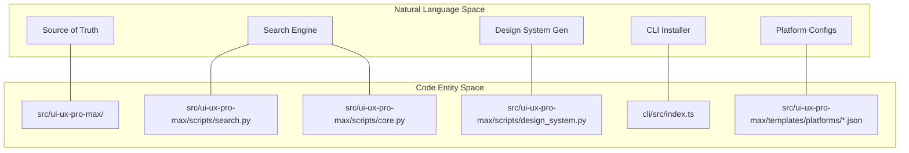
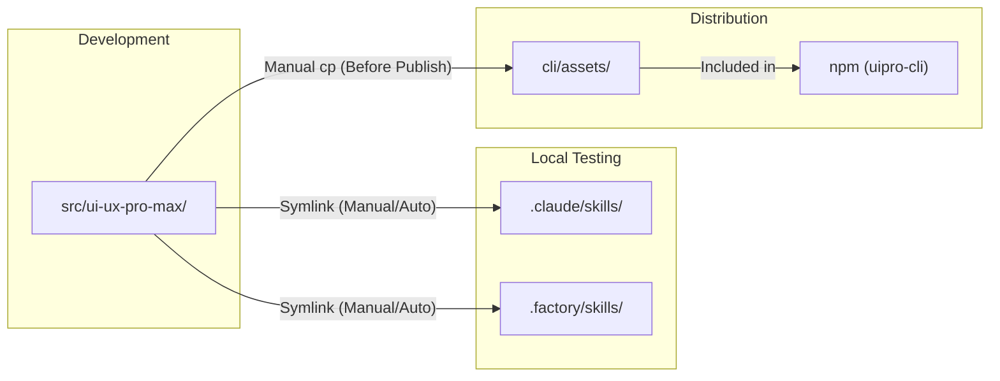

# Development Guide

Relevant source files

The following files were used as context for generating this wiki page:

- [CLAUDE.md](CLAUDE.md)
- [README.md](README.md)
- [cli/.npmignore](cli/.npmignore)
- [cli/README.md](cli/README.md)
- [cli/package.json](cli/package.json)
- [cli/src/index.ts](cli/src/index.ts)
- [cli/src/types/index.ts](cli/src/types/index.ts)
- [cli/src/utils/detect.ts](cli/src/utils/detect.ts)
- [cli/src/utils/extract.ts](cli/src/utils/extract.ts)
- [cli/src/utils/github.ts](cli/src/utils/github.ts)
- [cli/src/utils/template.ts](cli/src/utils/template.ts)

This document provides instructions for contributors who want to modify, test, and extend the UI/UX Pro Max system. It covers the development environment setup, codebase structure, file synchronization requirements, and key development workflows.

For specific tasks, see:
- [Source of Truth and Sync Rules](#8.1) — Explain the `src/ui-ux-pro-max/` source of truth and symlink architecture.
- [Adding New Platforms](#8.2) — Provide step-by-step instructions for adding support for new AI platforms via template JSON files.
- [Testing and Contributing](#8.3) — Document the Git workflow, local testing with `bun link`, and build/publish procedures.

## Prerequisites and Tools

The UI/UX Pro Max system requires the following development tools:

| Tool | Version | Purpose |
|------|---------|---------|
| Python | 3.x | Search engine and data processing |
| Node.js | 18+ | CLI tool runtime |
| Bun | Latest | TypeScript compilation and build |
| TypeScript | 5.7+ | CLI source language |
| Git | Any | Version control |

The CLI uses Bun as its build tool, specified in [cli/package.json:14]() with the build script `npm run build` which executes `bun build src/index.ts --outdir dist --target node`.

Sources: [cli/package.json:1-48](), [CLAUDE.md:87-89]()

## Repository Structure

The repository uses a **Source of Truth** pattern. All canonical data and logic reside in `src/ui-ux-pro-max/`. Local development environments use symlinks to this folder, while the CLI tool uses bundled copies for offline fallback.

### Codebase Entity Mapping

The following diagram bridges natural language concepts to specific code entities and file paths.

Sources: [CLAUDE.md:32-58](), [cli/src/index.ts:1-23]()

### Directory Layout

| Directory | Purpose | Type |
|-----------|---------|------|
| `src/ui-ux-pro-max/` | Single source of truth for all skill content | Source |
| `src/ui-ux-pro-max/data/` | CSV databases (Styles, Palettes, Fonts, etc.) | Data |
| `src/ui-ux-pro-max/scripts/` | Python logic (`search.py`, `core.py`, `design_system.py`) | Logic |
| `src/ui-ux-pro-max/templates/` | Templates for generating platform-specific skill files | Templates |
| `cli/src/` | TypeScript source code for `uipro-cli` | Tooling |
| `cli/assets/` | Bundled copies of data/scripts for offline fallback | Distribution |

Sources: [CLAUDE.md:32-58]()

## File Synchronization Rules

The system relies on a strict synchronization hierarchy. For details, see [Source of Truth and Sync Rules](#8.1).

### Sync Architecture Diagram

### Key Sync Rules
1. **Data & Scripts**: Edit only in `src/ui-ux-pro-max/`. Changes are available via symlinks in `.claude/` or `.shared/` [CLAUDE.md:68-71]().
2. **Templates**: Edit in `src/ui-ux-pro-max/templates/`. These are used by the CLI to generate files like `SKILL.md` [CLAUDE.md:73-76]().
3. **CLI Assets**: Before publishing to npm, you must manually sync `src/` to `cli/assets/` using `cp -r` commands [CLAUDE.md:78-83]().

Sources: [CLAUDE.md:61-86]()

## Development Workflows

### Adding New Platforms
The system is designed to be extensible. Adding a new AI assistant (e.g., "NewAI") involves creating a JSON configuration in `src/ui-ux-pro-max/templates/platforms/` and updating the `AIType` definitions in the CLI.

For a step-by-step walkthrough, see [Adding New Platforms](#8.2).

### CLI Tool Development
The CLI tool `uipro` is built with `commander` [cli/package.json:37]() and uses `bun` for high-performance execution during development.

- **Main Entry**: [cli/src/index.ts:1-83]()
- **Platform Detection**: [cli/src/utils/detect.ts:10-77]()
- **Template Rendering**: [cli/src/utils/template.ts:123-157]()

### Testing and Contributing
We follow a standard Git feature-branch workflow. All changes should be tested locally using `bun link` to verify the CLI installation logic across different `AIType` targets.

For details on PR requirements and testing procedures, see [Testing and Contributing](#8.3).

Sources: [CLAUDE.md:91-99](), [cli/package.json:13-17](), [cli/README.md:45-59]()
