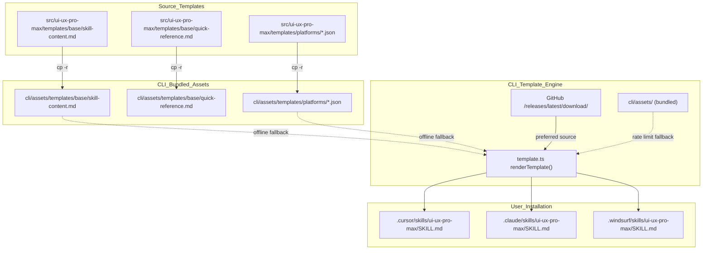
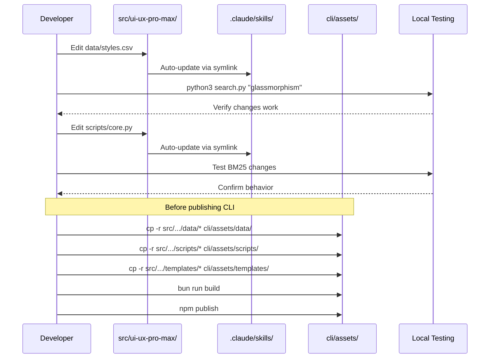

# Source of Truth and Sync Rules

<details>
<summary>Relevant source files</summary>

The following files were used as context for generating this wiki page:

- [.claude/skills/ui-ux-pro-max/data/_sync_all.py](.claude/skills/ui-ux-pro-max/data/_sync_all.py)
- [CLAUDE.md](CLAUDE.md)
- [cli/assets/data/_sync_all.py](cli/assets/data/_sync_all.py)
- [src/ui-ux-pro-max/data/_sync_all.py](src/ui-ux-pro-max/data/_sync_all.py)

</details>


## Purpose and Scope

This document defines the canonical source of truth for all UI/UX Pro Max assets and the synchronization rules required to maintain consistency across distribution channels. It covers the `src/ui-ux-pro-max/` directory structure, symlink architecture for immediate updates, and manual sync procedures for CLI bundled assets.

For template generation mechanics, see [Template Generation](). For build and publish workflows, see [Testing and Contributing]().

---

## Source of Truth: src/ui-ux-pro-max/

All canonical assets reside in `src/ui-ux-pro-max/`. This directory serves as the single source of truth for:

- **CSV databases** - 344+ design resources across 10 domains.
- **Python scripts** - BM25 search engine, design system generator.
- **Templates** - Base content and platform-specific configurations.

Any modifications to skill functionality, data, or platform support **must** be made in this directory first.

### Directory Structure

```
src/ui-ux-pro-max/
├── data/
│   ├── products.csv           # 161 product categories
│   ├── styles.csv             # 67 UI styles with AI prompts
│   ├── colors.csv             # 161 color palettes (synced to products)
│   ├── typography.csv         # 57 font pairings
│   ├── landing.csv            # 24 landing page patterns
│   ├── charts.csv             # 25 chart types
│   ├── ux-guidelines.csv      # 99 best practices
│   ├── icons.csv              # 100 Lucide icon mappings
│   ├── ui-reasoning.csv       # 161 JSON decision rules (synced to products)
│   ├── _sync_all.py           # Data maintenance script
│   └── stacks/                # 16 technology stack CSVs
│       ├── react.csv
│       ├── html-tailwind.csv
│       └── ...
├── scripts/
│   ├── search.py              # CLI entry point
│   ├── core.py                # BM25 search engine + CSV_CONFIG
│   └── design_system.py       # Multi-domain synthesis
└── templates/
    ├── base/
    │   ├── skill-content.md   # Common SKILL.md content
    │   └── quick-reference.md # Quick reference (Claude only)
    └── platforms/
        ├── claude.json        # Claude Code config
        ├── cursor.json        # Cursor config
        ├── windsurf.json      # Windsurf config
        └── ...                # 18+ platform configs
```

**Sources:** [src/ui-ux-pro-max/data/_sync_all.py:3-9](), [CLAUDE.md:32-56]()

---

## Symlink Architecture

### Overview

The repository uses symlinks to provide immediate updates without manual copying during development. When files in `src/ui-ux-pro-max/` are modified, symlinked locations reflect changes instantly.

**Figure 1: Symlink Architecture for Immediate Propagation**

```mermaid
graph TB
    subgraph "Source_of_Truth"
        ["src/ui-ux-pro-max/"]
        ["src/ui-ux-pro-max/data/"]
        ["src/ui-ux-pro-max/scripts/"]
        ["src/ui-ux-pro-max/templates/"]
    end
    
    subgraph "Symlinked_Locations_(Auto-Sync)"
        [".shared/ui-ux-pro-max/"]
        [".claude/skills/ui-ux-pro-max/"]
        ClaudeData[".claude/skills/ui-ux-pro-max/data/"]
        ClaudeScripts[".claude/skills/ui-ux-pro-max/scripts/"]
    end
    
    subgraph "Manual_Sync_Required"
        ["cli/assets/"]
        CLIData["cli/assets/data/"]
        CLIScripts["cli/assets/scripts/"]
        CLITemplates["cli/assets/templates/"]
    end
    
    ["src/ui-ux-pro-max/"] -.->|"symlink"| [".shared/ui-ux-pro-max/"]
    ["src/ui-ux-pro-max/"] -.->|"symlink"| [".claude/skills/ui-ux-pro-max/"]
    ["src/ui-ux-pro-max/data/"] -.->|"symlink"| ClaudeData
    ["src/ui-ux-pro-max/scripts/"] -.->|"symlink"| ClaudeScripts
    
    ["src/ui-ux-pro-max/data/"] -->|"cp -r (manual)"| CLIData
    ["src/ui-ux-pro-max/scripts/"] -->|"cp -r (manual)"| CLIScripts
    ["src/ui-ux-pro-max/templates/"] -->|"cp -r (manual)"| CLITemplates
```

**Sources:** [CLAUDE.md:54-56](), [CLAUDE.md:63-64]()

### Symlinked Locations

| Location | Target | Purpose |
|----------|--------|---------|
| `.shared/ui-ux-pro-max/` | `src/ui-ux-pro-max/` | Shared reference directory |
| `.claude/skills/ui-ux-pro-max/` | `src/ui-ux-pro-max/` | Claude Code skill installation |
| `.claude/skills/ui-ux-pro-max/data/` | `src/ui-ux-pro-max/data/` | CSV databases for search |
| `.claude/skills/ui-ux-pro-max/scripts/` | `src/ui-ux-pro-max/scripts/` | Python scripts |

These symlinks enable:
- **Real-time development** - Edit CSV or Python files, see changes immediately.
- **No duplication** - Single copy of data/scripts on disk.
- **Atomic updates** - Changes visible to Claude Code without reinstallation.

**Sources:** [CLAUDE.md:54-55](), [CLAUDE.md:69-71]()

---

## CLI Bundled Assets

### Why Manual Sync is Required

The `uipro-cli` package bundles assets at `cli/assets/` for offline installations and rate-limit fallback. These bundled assets are **not** symlinked because:

1. **npm packaging** - Symlinks do not package correctly for npm distribution.
2. **Cross-platform** - Windows, macOS, and Linux have inconsistent symlink support.
3. **Offline mode** - CLI must function without internet access using local files.

### Assets Directory Structure

```
cli/assets/                     # ~564KB bundled fallback
├── data/                       # Copy of src/ui-ux-pro-max/data/
│   ├── products.csv
│   ├── styles.csv
│   └── ...
├── scripts/                    # Copy of src/ui-ux-pro-max/scripts/
│   ├── search.py
│   ├── core.py
│   └── design_system.py
└── templates/                  # Copy of src/ui-ux-pro-max/templates/
    ├── base/
    └── platforms/
```

**Sources:** [CLAUDE.md:49-52]()

### When to Sync CLI Assets

Sync is required **before** publishing to npm when:

- ✅ CSV databases modified (`data/*.csv`, `data/stacks/*.csv`).
- ✅ Python scripts updated (`scripts/*.py`).
- ✅ Template content changed (`templates/base/*.md`).
- ✅ Platform configs added/modified (`templates/platforms/*.json`).

Sync is **not** required for:
- ❌ CLI TypeScript code changes (`cli/src/`).
- ❌ Documentation updates.
- ❌ Test file modifications.

**Sources:** [CLAUDE.md:77-83]()

---

## Sync Procedures

### Manual Sync Commands

Run these commands from the repository root before publishing `uipro-cli`:

```bash
# Sync all CLI assets
cp -r src/ui-ux-pro-max/data/* cli/assets/data/
cp -r src/ui-ux-pro-max/scripts/* cli/assets/scripts/
cp -r src/ui-ux-pro-max/templates/* cli/assets/templates/
```

### Data Maintenance Sync

The codebase includes a maintenance script `_sync_all.py` used to keep `colors.csv` and `ui-reasoning.csv` aligned 1:1 with `products.csv`. This script handles product renames, removals, and renumbering.

**Sources:** [src/ui-ux-pro-max/data/_sync_all.py:3-9]()

---

## Template System Sync

**Figure 2: Template Generation vs Bundled Assets**



**Sources:** [CLAUDE.md:42-52](), [CLAUDE.md:78-82]()

### Template Modifications

When editing templates in `src/ui-ux-pro-max/templates/`:

1. **Base templates** (`base/skill-content.md`, `base/quick-reference.md`)
   - These define common content rendered into `SKILL.md` for all platforms.
   - Use `{{VARIABLE}}` placeholders for dynamic content.
2. **Platform configs** (`platforms/*.json`)
   - Define `folderStructure`, `scriptPath`, `installType`, and `sections`.
   - Each JSON controls how templates render for specific platforms.
3. **No manual sync to reference folders**
   - `.cursor/`, `.windsurf/`, and `.claude/` (when not symlinked) are CLI-generated.
   - Never edit these directly - they are overwritten by `uipro init`.

**Sources:** [CLAUDE.md:73-76](), [CLAUDE.md:85]()

---

## Development Workflow

**Figure 3: Edit-Sync-Test Cycle**



**Sources:** [CLAUDE.md:61-84](), [CLAUDE.md:91-98]()

### Step-by-Step Workflow

| Step | Action | Auto-Sync? | Notes |
|------|--------|-----------|-------|
| 1 | Edit CSV in `src/ui-ux-pro-max/data/` | ✅ Yes | Symlinks update `.claude/`, `.shared/` |
| 2 | Test via `python3 search.py` | N/A | Use symlinked locations |
| 3 | Edit Python in `src/ui-ux-pro-max/scripts/` | ✅ Yes | Immediate reflection |
| 4 | Modify templates in `src/ui-ux-pro-max/templates/` | ✅ Yes | Templates auto-available |
| 5 | Sync to CLI: `cp -r src/.../* cli/assets/` | ❌ No | **Manual required** |
| 6 | Build CLI: `bun run build` | N/A | Bundles assets into dist/ |
| 7 | Publish: `npm publish` | N/A | Uploads to npm registry |

**Sources:** [CLAUDE.md:67-85]()

---

## Anti-Patterns to Avoid

### ❌ Editing CLI Assets Directly

**Wrong:**
```bash
# Never edit bundled assets
vim cli/assets/data/styles.csv
vim cli/assets/scripts/core.py
```

**Correct:**
```bash
# Always edit source of truth
vim src/ui-ux-pro-max/data/styles.csv
vim src/ui-ux-pro-max/scripts/core.py

# Then sync to CLI before publishing
cp -r src/ui-ux-pro-max/data/* cli/assets/data/
cp -r src/ui-ux-pro-max/scripts/* cli/assets/scripts/
```

### ❌ Manually Editing Generated Skill Files

**Wrong:**
```bash
# Never edit CLI-generated files
vim .cursor/skills/ui-ux-pro-max/SKILL.md
vim .windsurf/skills/ui-ux-pro-max/SKILL.md
```

**Correct:**
```bash
# Edit base templates instead
vim src/ui-ux-pro-max/templates/base/skill-content.md

# Or platform config
vim src/ui-ux-pro-max/templates/platforms/cursor.json

# Regenerate via CLI
uipro init --ai cursor --force
```

**Sources:** [CLAUDE.md:61-85]()

---

## File Change Impact Matrix

| File Modified | Symlink Update | CLI Sync Required | Regeneration Needed |
|---------------|----------------|-------------------|---------------------|
| `src/ui-ux-pro-max/data/*.csv` | ✅ Auto | ✅ Yes | ❌ No |
| `src/ui-ux-pro-max/scripts/*.py` | ✅ Auto | ✅ Yes | ❌ No |
| `src/ui-ux-pro-max/templates/base/*.md` | ✅ Auto | ✅ Yes | ✅ Yes (`uipro init --force`) |
| `src/ui-ux-pro-max/templates/platforms/*.json` | ✅ Auto | ✅ Yes | ✅ Yes (`uipro init --force`) |
| `cli/src/*.ts` | N/A | ❌ No | ❌ No |
| `.claude/skills/ui-ux-pro-max/SKILL.md` | N/A | ❌ No | ⚠️ Don't edit (CLI-generated) |

**Legend:**
- **Symlink Update** - Changes immediately visible via symlinks.
- **CLI Sync Required** - Must run `cp -r` before `npm publish`.
- **Regeneration Needed** - Must run `uipro init --force` to see changes locally.

**Sources:** [CLAUDE.md:63-85]()

---

## Summary

**Key Principles:**

1. **Single Source of Truth** - All modifications happen in `src/ui-ux-pro-max/`.
2. **Symlinks for Development** - `.claude/` and `.shared/` auto-update for rapid iteration.
3. **Manual Sync for Distribution** - CLI bundled assets require `cp -r` before `npm publish`.
4. **Template-Based Generation** - Never edit generated skill files directly; modify templates instead.

**Critical Rule:** Before publishing `uipro-cli` to npm, always sync `src/ui-ux-pro-max/` to `cli/assets/`.

**Sources:** [CLAUDE.md:61-84]()
