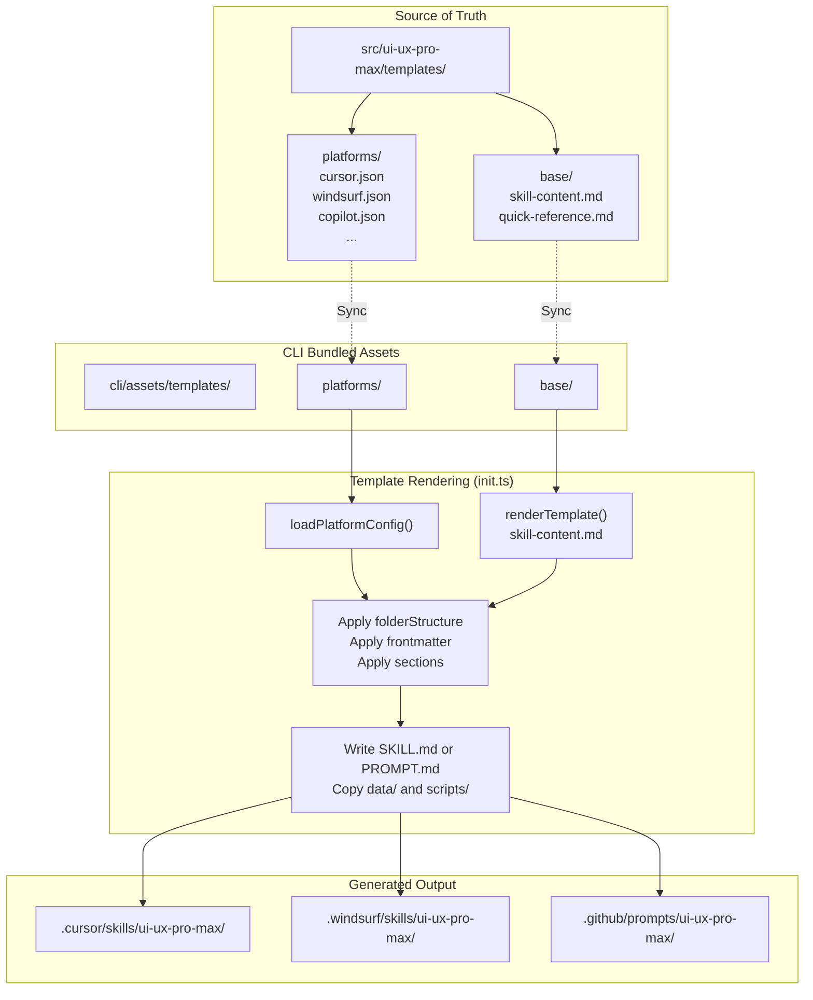
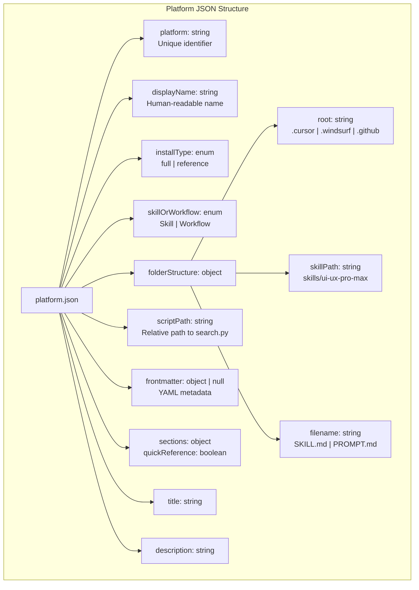
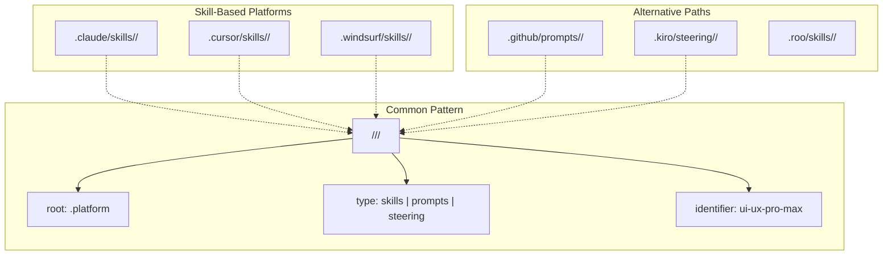
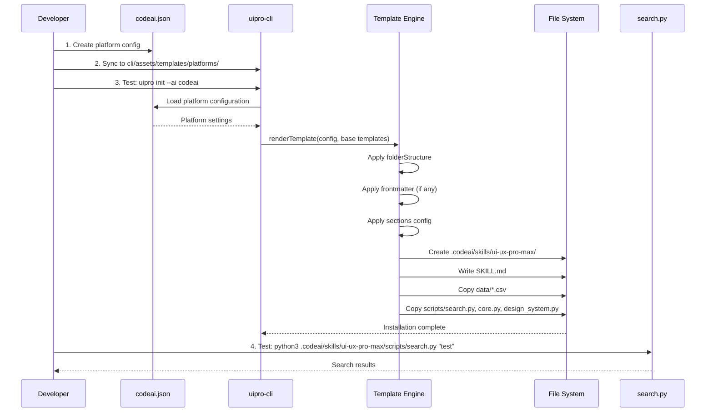

# Adding New Platforms

<details>
<summary>Relevant source files</summary>

The following files were used as context for generating this wiki page:

- [CLAUDE.md](CLAUDE.md)
- [cli/assets/templates/platforms/agent.json](cli/assets/templates/platforms/agent.json)
- [cli/assets/templates/platforms/copilot.json](cli/assets/templates/platforms/copilot.json)
- [cli/assets/templates/platforms/cursor.json](cli/assets/templates/platforms/cursor.json)
- [cli/assets/templates/platforms/kiro.json](cli/assets/templates/platforms/kiro.json)
- [cli/assets/templates/platforms/roocode.json](cli/assets/templates/platforms/roocode.json)
- [cli/assets/templates/platforms/windsurf.json](cli/assets/templates/platforms/windsurf.json)
- [src/ui-ux-pro-max/templates/platforms/agent.json](src/ui-ux-pro-max/templates/platforms/agent.json)
- [src/ui-ux-pro-max/templates/platforms/copilot.json](src/ui-ux-pro-max/templates/platforms/copilot.json)
- [src/ui-ux-pro-max/templates/platforms/cursor.json](src/ui-ux-pro-max/templates/platforms/cursor.json)
- [src/ui-ux-pro-max/templates/platforms/kiro.json](src/ui-ux-pro-max/templates/platforms/kiro.json)
- [src/ui-ux-pro-max/templates/platforms/roocode.json](src/ui-ux-pro-max/templates/platforms/roocode.json)
- [src/ui-ux-pro-max/templates/platforms/windsurf.json](src/ui-ux-pro-max/templates/platforms/windsurf.json)

</details>


This document provides step-by-step instructions for adding support for new AI coding assistant platforms to the UI/UX Pro Max system. The template-based configuration system allows adding platforms by creating a single JSON configuration file that defines the platform's folder structure, file naming conventions, and integration mode.

For information about the platform integration architecture and Skill vs Workflow modes, see [Platform Configuration System](#7.1). For details on the CLI template generation system, see [Template Generation](#2.4).

---

## Platform Configuration System

The system uses a template-based approach where each AI platform is defined by a JSON configuration file. The CLI tool reads these configurations during installation to generate platform-specific folder structures and content files.

### Configuration Architecture

**Template System Architecture**



**Sources:** [CLAUDE.md:32-56](), [src/ui-ux-pro-max/templates/platforms/cursor.json:1-18]()

### Platform Configuration Locations

| Location | Purpose | Sync Required |
|----------|---------|---------------|
| `src/ui-ux-pro-max/templates/platforms/` | Source of truth for platform configs | Manual sync to CLI |
| `cli/assets/templates/platforms/` | Bundled configs for offline installation | Yes (from src/) |
| Platform folders (`.cursor/`, `.windsurf/`, etc.) | Generated output during `uipro init` | Auto-generated |

**Sources:** [CLAUDE.md:32-56](), [CLAUDE.md:64-85]()

---

## Platform JSON Schema

Each platform configuration file defines how the CLI generates the platform-specific integration. The JSON schema includes folder paths, file naming, metadata requirements, and content sections.

### Complete Schema Reference

**Platform Configuration JSON Schema**



**Sources:** [src/ui-ux-pro-max/templates/platforms/cursor.json:1-21](), [src/ui-ux-pro-max/templates/platforms/kiro.json:1-21]()

### Field Specifications

| Field | Type | Required | Purpose | Examples |
|-------|------|----------|---------|----------|
| `platform` | string | Yes | Unique identifier for CLI detection | `"cursor"`, `"windsurf"`, `"copilot"` |
| `displayName` | string | Yes | Human-readable platform name | `"Cursor"`, `"GitHub Copilot"` |
| `installType` | enum | Yes | Content mode: `"full"` or `"reference"` | `"full"` for complete knowledge base |
| `folderStructure.root` | string | Yes | Top-level directory | `".cursor"`, `".github"`, `".windsurf"` |
| `folderStructure.skillPath` | string | Yes | Skill subdirectory path | `"skills/ui-ux-pro-max"`, `"prompts/ui-ux-pro-max"` |
| `folderStructure.filename` | string | Yes | Primary content file name | `"SKILL.md"`, `"PROMPT.md"` |
| `scriptPath` | string | Yes | Relative path to `search.py` | `"skills/ui-ux-pro-max/scripts/search.py"` |
| `frontmatter` | object \| null | No | YAML metadata for file header | `{"name": "ui-ux-pro-max"}` or `null` |
| `sections.quickReference` | boolean | Yes | Include Claude-specific quick reference | `false` (only `true` for Claude) |
| `title` | string | Yes | Skill/workflow title | `"ui-ux-pro-max"` |
| `description` | string | Yes | Brief description for AI platform | 1-2 sentence summary |
| `skillOrWorkflow` | enum | Yes | Integration mode: `"Skill"` or `"Workflow"` | `"Skill"` for auto-activate |

**Sources:** [src/ui-ux-pro-max/templates/platforms/cursor.json:1-21](), [src/ui-ux-pro-max/templates/platforms/copilot.json:1-21]()

### Skill Mode vs Workflow Mode

| Aspect | Skill Mode | Workflow Mode |
|--------|------------|---------------|
| **Activation** | Auto-activate on UI/UX keywords | Explicit slash command invocation |
| **Content** | Full knowledge base (`installType: "full"`) | Quick reference (`installType: "reference"`) |
| **Example Platforms** | Cursor, Windsurf, Agent | Kiro, GitHub Copilot, Roo Code |
| **skillOrWorkflow** | `"Skill"` | `"Workflow"` |

**Sources:** [src/ui-ux-pro-max/templates/platforms/cursor.json:20](), [src/ui-ux-pro-max/templates/platforms/kiro.json:20](), [src/ui-ux-pro-max/templates/platforms/roocode.json:20]()

---

## Step-by-Step: Adding a New Platform

This section walks through creating a new platform configuration for a hypothetical AI coding assistant called "CodeAI".

### Step 1: Create Platform JSON Configuration

Create a new file in the templates directory with the platform identifier as the filename.

**File:** `src/ui-ux-pro-max/templates/platforms/codeai.json`

```json
{
  "platform": "codeai",
  "displayName": "CodeAI",
  "installType": "full",
  "folderStructure": {
    "root": ".codeai",
    "skillPath": "skills/ui-ux-pro-max",
    "filename": "SKILL.md"
  },
  "scriptPath": "skills/ui-ux-pro-max/scripts/search.py",
  "frontmatter": null,
  "sections": {
    "quickReference": false
  },
  "title": "ui-ux-pro-max",
  "description": "Comprehensive design guide for web and mobile applications. Contains 67 styles, 161 color palettes, 57 font pairings, 99 UX guidelines, and 25 chart types across 16 technology stacks.",
  "skillOrWorkflow": "Skill"
}
```

**Key decisions:**

| Decision | Value | Rationale |
|----------|-------|-----------|
| `platform` | `"codeai"` | Must match directory detection pattern |
| `folderStructure.root` | `".codeai"` | Platform's configuration directory |
| `folderStructure.skillPath` | `"skills/ui-ux-pro-max"` | Platform's skill subdirectory convention |
| `folderStructure.filename` | `"SKILL.md"` | Use `"PROMPT.md"` for Copilot-like platforms |
| `installType` | `"full"` | Include complete knowledge base |
| `skillOrWorkflow` | `"Skill"` | Use `"Workflow"` if requires explicit invocation |
| `frontmatter` | `null` | Add YAML object if platform requires metadata |

**Sources:** [src/ui-ux-pro-max/templates/platforms/cursor.json:1-21](), [src/ui-ux-pro-max/templates/platforms/copilot.json:1-21]()

### Step 2: Determine Folder Structure

Research the target platform's conventions for skill/workflow files:

**Platform Folder Conventions**



**Sources:** [src/ui-ux-pro-max/templates/platforms/cursor.json:5-9](), [src/ui-ux-pro-max/templates/platforms/copilot.json:5-9](), [src/ui-ux-pro-max/templates/platforms/kiro.json:5-9]()

### Step 3: Configure Filename and Frontmatter

Different platforms expect different file naming conventions and metadata formats.

**Filename Conventions**

| Platform Type | Filename | Frontmatter Required |
|---------------|----------|---------------------|
| Skills (Claude, Cursor, Windsurf) | `SKILL.md` | No |
| GitHub Copilot Prompts | `PROMPT.md` | No (but `name` and `description` fields used) |
| Kiro Steering | `SKILL.md` | Yes (`name`, `description`) |

**Example with frontmatter:**

```json
{
  "frontmatter": {
    "name": "ui-ux-pro-max",
    "description": "Comprehensive design guide for web and mobile applications."
  }
}
```

This generates YAML frontmatter in the output file:

```markdown
---
name: ui-ux-pro-max
description: Comprehensive design guide for web and mobile applications.
---

# Rest of content...
```

**Sources:** [src/ui-ux-pro-max/templates/platforms/cursor.json:11-14](), [src/ui-ux-pro-max/templates/platforms/kiro.json:11-14]()

### Step 4: Set scriptPath Correctly

The `scriptPath` field defines the relative path from the project root to `search.py`. This path must match your `folderStructure` configuration.

**Path Construction Pattern:**

```
scriptPath = folderStructure.skillPath + "/scripts/search.py"
```

**Examples:**

| Root | Skill Path | Script Path |
|------|------------|-------------|
| `.cursor` | `skills/ui-ux-pro-max` | `skills/ui-ux-pro-max/scripts/search.py` |
| `.github` | `prompts/ui-ux-pro-max` | `prompts/ui-ux-pro-max/scripts/search.py` |
| `.kiro` | `steering/ui-ux-pro-max` | `steering/ui-ux-pro-max/scripts/search.py` |

**Sources:** [src/ui-ux-pro-max/templates/platforms/cursor.json:5-10](), [src/ui-ux-pro-max/templates/platforms/kiro.json:5-10]()

---

## Testing the New Platform

After creating the platform configuration, test the CLI generation process and verify the output structure.

### Local Testing Workflow

**CLI Testing Flow**



**Sources:** [CLAUDE.md:32-56](), [CLAUDE.md:78-85]()

### Step 1: Sync Configuration to CLI Assets

Before testing, synchronize the new platform configuration to the CLI bundled assets:

```bash
# Copy new platform config
cp src/ui-ux-pro-max/templates/platforms/codeai.json \
   cli/assets/templates/platforms/codeai.json
```

**Sources:** [CLAUDE.md:78-83]()

### Step 2: Test CLI Installation

Run the CLI tool with the new platform identifier:

```bash
# Test with explicit platform flag
uipro init --ai codeai
```

**Sources:** [CLAUDE.md:78-85]()

### Step 3: Verify Folder Structure

Check that the generated folder structure matches the configuration:

```bash
tree .codeai/skills/ui-ux-pro-max/
```

**Expected structure:**

```
.codeai/skills/ui-ux-pro-max/
├── SKILL.md                    # Main content file
├── data/                       # CSV databases
│   ├── products.csv
│   ├── styles.csv
│   └── ...
└── scripts/
    ├── search.py               # CLI entry point
    ├── core.py                 # BM25 search engine
    └── design_system.py        # Design system generator
```

**Sources:** [CLAUDE.md:32-58]()

---

## Synchronization Requirements

When adding a new platform configuration, you must synchronize the JSON file from the source of truth to the CLI bundled assets.

### Sync Commands

When adding or modifying platform configurations:

```bash
# Sync new platform configuration
cp src/ui-ux-pro-max/templates/platforms/codeai.json \
   cli/assets/templates/platforms/codeai.json

# Sync all assets if necessary
cp -r src/ui-ux-pro-max/data/* cli/assets/data/
cp -r src/ui-ux-pro-max/scripts/* cli/assets/scripts/
cp -r src/ui-ux-pro-max/templates/* cli/assets/templates/
```

**Sources:** [CLAUDE.md:78-83]()

### Sync Checklist

| File Type | Source Location | Destination | Frequency |
|-----------|----------------|-------------|-----------|
| Platform JSON | `src/ui-ux-pro-max/templates/platforms/*.json` | `cli/assets/templates/platforms/` | When added/modified |
| Base templates | `src/ui-ux-pro-max/templates/base/*.md` | `cli/assets/templates/base/` | When modified |
| Data CSVs | `src/ui-ux-pro-max/data/` | `cli/assets/data/` | When data updated |
| Python scripts | `src/ui-ux-pro-max/scripts/` | `cli/assets/scripts/` | When logic updated |

**Sources:** [CLAUDE.md:64-85]()
