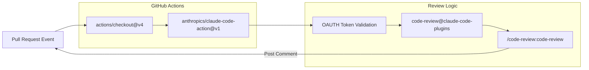
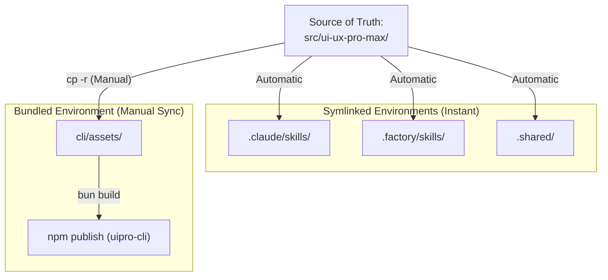

# Testing and Contributing

Relevant source files

The following files were used as context for generating this wiki page:

- [.github/workflows/claude-code-review.yml](.github/workflows/claude-code-review.yml)
- [.github/workflows/claude.yml](.github/workflows/claude.yml)
- [CLAUDE.md](CLAUDE.md)
- [LICENSE](LICENSE)
- [cli/.gitignore](cli/.gitignore)
- [cli/bun.lock](cli/bun.lock)
- [cli/src/commands/update.ts](cli/src/commands/update.ts)
- [cli/src/commands/versions.ts](cli/src/commands/versions.ts)

## Overview

The UI/UX Pro Max system utilizes a decentralized development workflow where the **Source of Truth** resides in `src/ui-ux-pro-max/`. This page documents the Git branching strategy, local development setup using `bun`, and the manual synchronization process required to maintain consistency across the CLI tool, AI platform directories, and the npm distribution.

**Related Pages:** [2.1 CLI Commands](), [8.1 Source of Truth and Sync Rules](), [8.2 Adding New Platforms]()

---

## Git Workflow and Branching

Direct pushes to the `main` branch are prohibited to ensure stability. Contributors must follow a standard Feature Branch workflow facilitated by the GitHub CLI (`gh`) or standard Git commands.

### Branch Naming Conventions

| Prefix | Purpose | Example |
| :--- | :--- | :--- |
| `feat/` | New features or platforms | `feat/add-gemini-support` |
| `fix/` | Bug fixes in scripts or CLI | `fix/bm25-tokenization` |
| `data/` | Updates to CSV databases | `data/update-react-stack` |
| `docs/` | Documentation or wiki updates | `docs/testing-guide` |

### Contribution Process

1.  **Create Branch**: `git checkout -b feat/<feature-name>` [CLAUDE.md:95-95]()
2.  **Commit Changes**: Follow conventional commits (e.g., `feat: add support for Augment AI`) [CLAUDE.md:96-96]()
3.  **Push Branch**: `git push -u origin <branch>` [CLAUDE.md:97-97]()
4.  **Create Pull Request**: `gh pr create` [CLAUDE.md:98-98]()

**Sources:** [CLAUDE.md:91-99]()

---

## Automated Code Review

The repository integrates **Claude Code Review** via GitHub Actions. This workflow automatically triggers on pull requests to provide AI-powered feedback.

### Review Pipeline

The review process utilizes the `CLAUDE_CODE_OAUTH_TOKEN` secret and targets the specific PR number using the prompt: `/code-review:code-review ${github.repository}/pull/${github.event.pull_request.number}` [.github/workflows/claude-code-review.yml:38-41]().

**Sources:** [.github/workflows/claude-code-review.yml:1-45](), [.github/workflows/claude.yml:1-51]()

---

## Local Development and CLI Testing

The `uipro-cli` is built using TypeScript and the Bun runtime. Testing requires linking the local package to simulate global installation.

### Environment Setup

1.  **Navigate to CLI**: `cd cli`
2.  **Install Dependencies**: `bun install` [cli/bun.lock:1-19]()
3.  **Link Package**: `bun link` (This makes the `uipro` command available globally via the `bin` configuration in `package.json`).

### Build and Test Loop

| Action | Command | File Impact |
| :--- | :--- | :--- |
| **Development** | `bun run src/index.ts <args>` | Direct execution of TS source |
| **Build** | `bun build src/index.ts --outdir dist --target node` | Generates `dist/index.js` |
| **Production Test** | `uipro init --ai claude` | Tests the linked `dist` output |

**Sources:** [cli/bun.lock:1-77](), [cli/src/commands/update.ts:1-36]()

---

## The Synchronization Requirement

Because the CLI tool bundles assets for offline use, and AI platforms use symlinks to the source, a manual synchronization step is required before any release or significant test.

### Sync Workflow

The `cli/assets/` directory must be manually updated to reflect changes in the core logic or data.

### Sync Commands

Run these commands from the root before publishing the CLI:
1.  `cp -r src/ui-ux-pro-max/data/* cli/assets/data/` [CLAUDE.md:80-80]()
2.  `cp -r src/ui-ux-pro-max/scripts/* cli/assets/scripts/` [CLAUDE.md:81-81]()
3.  `cp -r src/ui-ux-pro-max/templates/* cli/assets/templates/` [CLAUDE.md:82-82]()

**Sources:** [CLAUDE.md:62-86]()

---

## Build and Publish Procedures

### Version Management

The CLI supports checking and listing versions via GitHub integration.

-   **Check Versions**: `uipro versions` calls `fetchReleases()` to list all tagged GitHub releases [cli/src/commands/versions.ts:6-10]().
-   **Update Logic**: `uipro update` fetches the latest release tag and triggers a forced `initCommand` to overwrite local files with the latest assets [cli/src/commands/update.ts:12-28]().

### Release Checklist

1.  **Validate Data**: Ensure all CSVs in `src/ui-ux-pro-max/data/` follow the standard schema.
2.  **Run Sync**: Execute the `cp` commands to update `cli/assets/`.
3.  **Verify Build**: Run `bun run build` in the `cli/` directory.
4.  **Tag Release**: Create a new Git tag (e.g., `v2.5.0`).
5.  **Publish NPM**: `npm publish` from the `cli/` folder.

**Sources:** [cli/src/commands/versions.ts:1-43](), [cli/src/commands/update.ts:1-37](), [LICENSE:1-21]()
