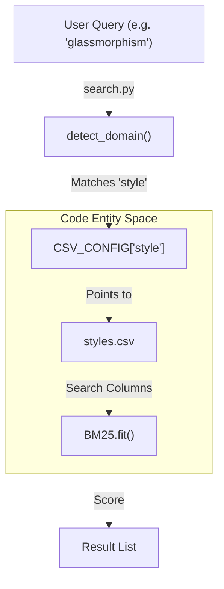
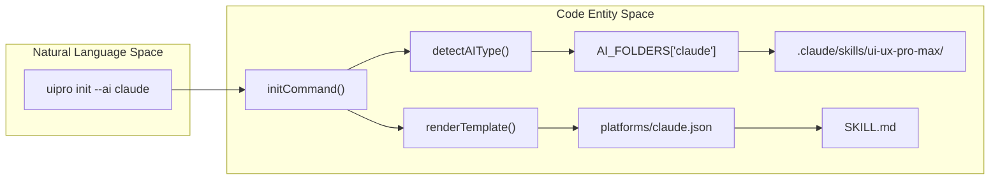

# Glossary

Relevant source files

The following files were used as context for generating this wiki page:

- [.claude-plugin/plugin.json](.claude-plugin/plugin.json)
- [.claude/skills/ui-ux-pro-max/scripts/core.py](.claude/skills/ui-ux-pro-max/scripts/core.py)
- [.claude/skills/ui-ux-pro-max/scripts/search.py](.claude/skills/ui-ux-pro-max/scripts/search.py)
- [CLAUDE.md](CLAUDE.md)
- [README.md](README.md)
- [cli/.npmignore](cli/.npmignore)
- [cli/README.md](cli/README.md)
- [cli/assets/scripts/search.py](cli/assets/scripts/search.py)
- [cli/assets/templates/platforms/augment.json](cli/assets/templates/platforms/augment.json)
- [cli/assets/templates/platforms/droid.json](cli/assets/templates/platforms/droid.json)
- [cli/assets/templates/platforms/kilocode.json](cli/assets/templates/platforms/kilocode.json)
- [cli/assets/templates/platforms/warp.json](cli/assets/templates/platforms/warp.json)
- [cli/package.json](cli/package.json)
- [cli/src/commands/init.ts](cli/src/commands/init.ts)
- [cli/src/commands/uninstall.ts](cli/src/commands/uninstall.ts)
- [cli/src/index.ts](cli/src/index.ts)
- [cli/src/types/index.ts](cli/src/types/index.ts)
- [cli/src/utils/detect.ts](cli/src/utils/detect.ts)
- [cli/src/utils/extract.ts](cli/src/utils/extract.ts)
- [cli/src/utils/github.ts](cli/src/utils/github.ts)
- [cli/src/utils/template.ts](cli/src/utils/template.ts)
- [skill.json](skill.json)
- [src/ui-ux-pro-max/data/stacks/flutter.csv](src/ui-ux-pro-max/data/stacks/flutter.csv)
- [src/ui-ux-pro-max/data/stacks/jetpack-compose.csv](src/ui-ux-pro-max/data/stacks/jetpack-compose.csv)
- [src/ui-ux-pro-max/data/stacks/shadcn.csv](src/ui-ux-pro-max/data/stacks/shadcn.csv)
- [src/ui-ux-pro-max/scripts/core.py](src/ui-ux-pro-max/scripts/core.py)
- [src/ui-ux-pro-max/scripts/search.py](src/ui-ux-pro-max/scripts/search.py)
- [src/ui-ux-pro-max/templates/platforms/augment.json](src/ui-ux-pro-max/templates/platforms/augment.json)
- [src/ui-ux-pro-max/templates/platforms/droid.json](src/ui-ux-pro-max/templates/platforms/droid.json)
- [src/ui-ux-pro-max/templates/platforms/kilocode.json](src/ui-ux-pro-max/templates/platforms/kilocode.json)
- [src/ui-ux-pro-max/templates/platforms/warp.json](src/ui-ux-pro-max/templates/platforms/warp.json)

This page defines codebase-specific terms, jargon, and technical concepts used within the UI/UX Pro Max system. It serves as a reference for onboarding engineers to understand the mapping between domain language and the underlying implementation.

## Core System Concepts

### BM25
The primary ranking algorithm used by the search engine to determine the relevance of design guidelines to a user's query. It improves upon simple keyword matching by considering term frequency and document length normalization.
*   **Implementation**: Defined in the `BM25` class within `src/ui-ux-pro-max/scripts/core.py`.
*   **Parameters**: Uses constants `k1=1.5` and `b=0.75` [src/ui-ux-pro-max/scripts/core.py:107-109]().
*   **Logic**: Includes a `tokenize` method for text normalization and an `idf` calculation for term weighting [src/ui-ux-pro-max/scripts/core.py:117-140]().

### Skill vs. Workflow
The system operates in two distinct modes depending on the AI assistant's capabilities:
*   **Skill Mode**: A persistent capability where the AI has full access to the `search.py` script and can auto-activate based on context. Typically used by Claude Code and Cursor.
*   **Workflow Mode**: A "slash command" or reference-based interaction where the AI refers to a `SKILL.md` file to understand how to manually invoke the search tools.
*   **Configuration**: Controlled by the `skillOrWorkflow` property in platform JSON files [cli/src/types/index.ts:41]().

### Master + Overrides
A hierarchical persistence pattern for design systems.
*   **MASTER.md**: The global source of truth for a project's design system, containing core colors, typography, and styles [src/ui-ux-pro-max/scripts/search.py:68]().
*   **Overrides**: Page-specific Markdown files located in `design-system/pages/`. These contain rules that take precedence over the Master file for specific views (e.g., `dashboard.md`) [src/ui-ux-pro-max/scripts/search.py:93-97]().

### Symlink Architecture
During development, the project uses symbolic links to ensure that changes in the "Source of Truth" (`src/ui-ux-pro-max/`) are immediately reflected in the local AI assistant directories (e.g., `.claude/skills/`).
*   **Source of Truth**: `src/ui-ux-pro-max/` [CLAUDE.md:64]().
*   **Links**: `.claude/skills/ui-ux-pro-max/` and `.shared/ui-ux-pro-max/` are symlinks to the `src/` directory [CLAUDE.md:54-56]().

---

## Technical Entities

### AIType
A TypeScript union type representing all supported AI assistants.
*   **Definition**: `claude | cursor | windsurf | antigravity | copilot | kiro | roocode | codex | qoder | gemini | trae | opencode | continue | codebuddy | droid | kilocode | warp | augment | all` [cli/src/types/index.ts:1]().
*   **Usage**: Used for platform detection and targeted installation [cli/src/utils/detect.ts:10]().

### Platform Config
JSON files that define how the skill should be installed and formatted for a specific AI platform.
*   **Location**: `src/ui-ux-pro-max/templates/platforms/` [CLAUDE.md:43]().
*   **Schema**: Includes `folderStructure`, `installType`, `frontmatter`, and `scriptPath` [cli/src/types/index.ts:25-42]().

### CSV_CONFIG & STACK_CONFIG
Global dictionaries in the Python core that map search domains and technology stacks to their respective data files and metadata.
*   **CSV_CONFIG**: Maps domains like `style`, `color`, and `ux` to CSV files and specifies which columns are searchable vs. which are for output [src/ui-ux-pro-max/scripts/core.py:17-73]().
*   **STACK_CONFIG**: Maps technology stacks (e.g., `react`, `tailwind`) to specific guideline files [src/ui-ux-pro-max/scripts/core.py:75-92]().

### Project Slug
A URL-friendly string generated from the project name, used as the directory name for persisted design systems.
*   **Logic**: Converts the name to lowercase and replaces spaces with hyphens [src/ui-ux-pro-max/scripts/search.py:88]().

### InstallType
Determines the depth of the installation.
*   **full**: Installs the complete search engine and datasets.
*   **reference**: Installs only the documentation and instructions for the AI to use the system [cli/src/types/index.ts:3]().

---

## Logic & Engines

### Design System Generator
The reasoning engine that synthesizes multiple domain searches into a cohesive design recommendation.
*   **Entry Point**: `generate_design_system` function in `src/ui-ux-pro-max/scripts/design_system.py` [src/ui-ux-pro-max/scripts/search.py:76]().
*   **Workflow**: Analyzes product requirements, loads reasoning rules, and performs multi-domain searches (Style + Color + Typography) [README.md:96-103]().

### Reasoning Engine
A logic layer that maps product categories to specific design attributes using `ui-reasoning.csv`. It contains ~161 rules for making design decisions [README.md:5]().

### detect_domain
A function within the search engine that automatically routes a user's query to the most relevant database if no specific domain is provided.
*   **Implementation**: Found in `src/ui-ux-pro-max/scripts/core.py`.
*   **Mechanism**: Uses keyword scoring to differentiate between a "color" query and a "typography" query [CLAUDE.md:60]().

### Severity Levels
Used in `ux` and `stack` guidelines to indicate the importance of a specific rule.
*   **Values**: `Low`, `Medium`, `High`.
*   **Usage**: Defined in the `Severity` column of CSV files [src/ui-ux-pro-max/scripts/core.py:46, 97]().

---

## System Mapping Diagrams

### From Query to Data (Search Engine Flow)
This diagram bridges the Natural Language query to the Python internal configurations.

**Sources**: [src/ui-ux-pro-max/scripts/search.py:109](), [src/ui-ux-pro-max/scripts/core.py:17-22](), [src/ui-ux-pro-max/scripts/core.py:104-141]()

### From CLI to Filesystem (Installation Flow)
This diagram maps the CLI commands to the platform-specific directory structures.

**Sources**: [cli/src/index.ts:26-44](), [cli/src/types/index.ts:49-68](), [cli/src/utils/detect.ts:10-15](), [cli/src/commands/init.ts]()

---

## Domain & Stack Glossary Table

| Term | Category | Description | File Pointer |
| :--- | :--- | :--- | :--- |
| `product` | Domain | Recommendations for SaaS, e-commerce, portfolios | `products.csv` |
| `style` | Domain | Visual styles (Glassmorphism, Minimalism) | `styles.csv` |
| `ux` | Domain | Best practices and anti-patterns | `ux-guidelines.csv` |
| `html-tailwind` | Stack | Standard web stack with Tailwind CSS | `stacks/html-tailwind.csv` |
| `shadcn` | Stack | React components based on Radix UI | `stacks/shadcn.csv` |
| `frontmatter` | Config | Metadata headers for platform-specific files | `PlatformConfig.frontmatter` |
| `anti-patterns` | Concept | Design choices to avoid (e.g., emojis as icons) | `README.md:78-82` |

**Sources**: [src/ui-ux-pro-max/scripts/core.py:17-92](), [cli/src/types/index.ts:35](), [README.md:78-82]()
