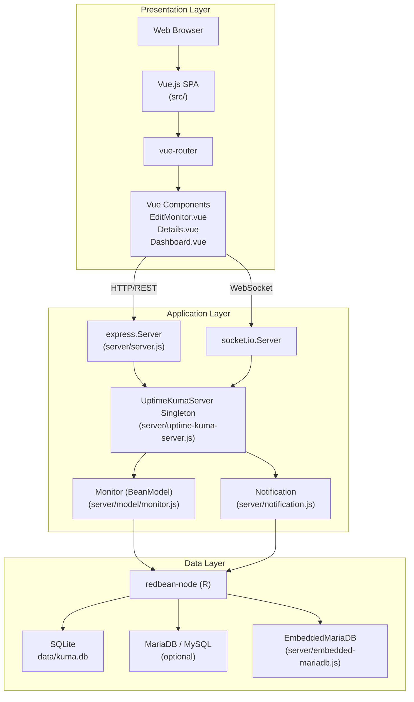
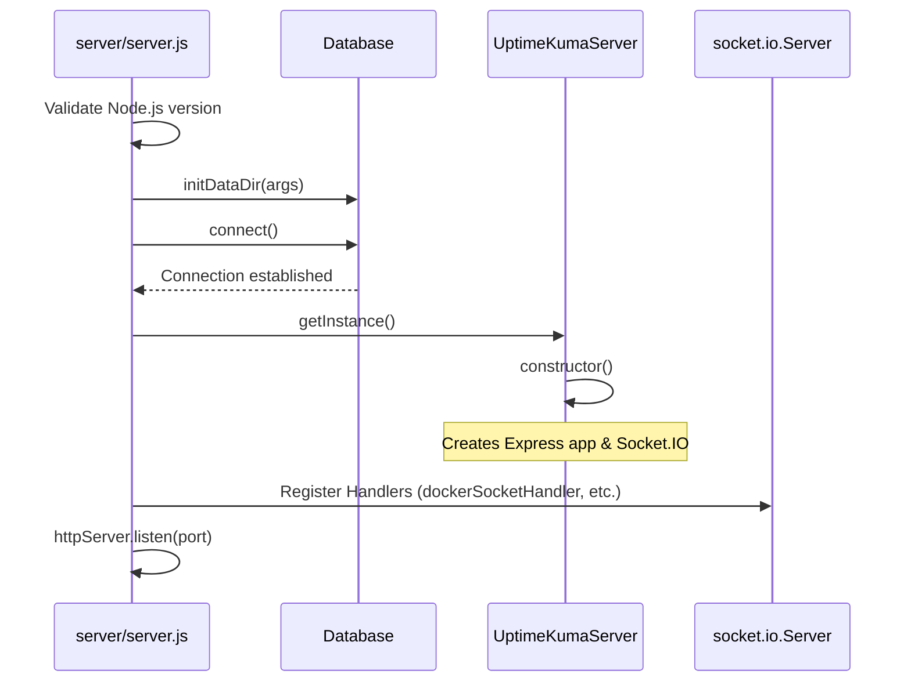
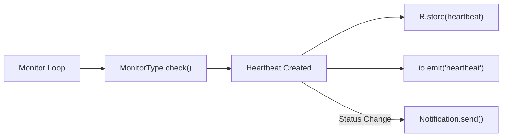

# Overview

Relevant source files

The following files were used as context for generating this wiki page:

- [.github/ISSUE_TEMPLATE/ask_for_help.yml](.github/ISSUE_TEMPLATE/ask_for_help.yml)
- [.github/ISSUE_TEMPLATE/bug_report.yml](.github/ISSUE_TEMPLATE/bug_report.yml)
- [.github/ISSUE_TEMPLATE/config.yml](.github/ISSUE_TEMPLATE/config.yml)
- [.github/ISSUE_TEMPLATE/feature_request.yml](.github/ISSUE_TEMPLATE/feature_request.yml)
- [.github/ISSUE_TEMPLATE/security_issue.yml](.github/ISSUE_TEMPLATE/security_issue.yml)
- [.github/PULL_REQUEST_TEMPLATE.md](.github/PULL_REQUEST_TEMPLATE.md)
- [CODE_OF_CONDUCT.md](CODE_OF_CONDUCT.md)
- [CONTRIBUTING.md](CONTRIBUTING.md)
- [README.md](README.md)
- [SECURITY.md](SECURITY.md)
- [package-lock.json](package-lock.json)
- [package.json](package.json)
- [server/database.js](server/database.js)
- [server/model/monitor.js](server/model/monitor.js)
- [server/server.js](server/server.js)
- [server/uptime-kuma-server.js](server/uptime-kuma-server.js)
- [server/util-server.js](server/util-server.js)
- [src/pages/EditMonitor.vue](src/pages/EditMonitor.vue)

This document provides a comprehensive overview of Uptime Kuma, introducing its purpose, architecture, core components, and technology stack. It serves as the entry point for understanding how the system works at a high level.

For detailed information about specific subsystems, see:
- Installation and deployment: [Installation and Deployment](#1.1)
- Detailed architecture breakdown: [Architecture Overview](#2)
- Monitor system internals: [Monitor System](#3)
- Notification system: [Notification System](#4)

## Purpose and Scope

Uptime Kuma is an easy-to-use self-hosted monitoring tool designed to track the uptime and availability of web services, servers, and network resources [README.md:5-7](). The system provides real-time monitoring, alerting via 90+ notification providers, public status pages, and multi-language support for 50+ languages [README.md:24-36]().

**Core Capabilities:**
- **Diverse Monitoring**: Supports HTTP(s), TCP, Ping, DNS, Docker, Databases (MySQL, PostgreSQL, MongoDB, etc.), Game Servers, and specialized types like Globalping and Steam [src/pages/EditMonitor.vue:39-113]().
- **Real-time Alerting**: Sends notifications through 90+ providers including Telegram, Discord, Slack, and Email when services go down or recover [README.md:28-28]().
- **Status Visibility**: Display public-facing status pages with custom branding, CSS, and domain mapping [README.md:31-32]().
- **Operational Tools**: Support for maintenance windows, incident management, and certificate expiry tracking [server/server.js:185-185](), [server/model/monitor.js:101-105]().
- **Security**: Authenticate users with optional 2FA (TOTP) and manage access via API keys [README.md:36-36](), [server/server.js:186-186]().

**Sources:** [README.md:1-160](), [package.json:1-134](), [src/pages/EditMonitor.vue:30-114]()

---

## Three-Tier Architecture

Uptime Kuma follows a traditional three-tier architecture with clear separation between presentation, application logic, and data storage layers.

**Sources:** [server/server.js:95-126](), [server/uptime-kuma-server.js:22-44](), [server/database.js:20-55](), [CONTRIBUTING.md:11-17]()

---

## System Entry Points

### Server Initialization

The application starts from `server/server.js`, which serves as the main entry point [package.json:25-25]().

1. **Environment & Version Check**: Validates Node.js version requirements (>= 20.4.0) and loads `.env` [server/server.js:15-38]().
2. **Database Setup**: Initializes the data directory (default `./data/`) and connects to the database via `Database.initDataDir()` and subsequent connection logic [server/database.js:135-162](), [server/server.js:125-126]().
3. **Singleton Initialization**: Creates the `UptimeKumaServer` singleton instance which manages the Express `app` and `io` (Socket.IO) server [server/server.js:95-98]().
4. **Middleware & Handlers**: Configures Express middleware and registers Socket.IO handlers for various modules like `statusPageSocketHandler`, `dockerSocketHandler`, and `maintenanceSocketHandler` [server/server.js:173-195]().
5. **Start**: Begins listening on the configured port (default 3001) [server/server.js:144-144]().

**Sources:** [server/server.js:1-195](), [server/uptime-kuma-server.js:68-100](), [server/database.js:135-162]()

### Frontend Initialization

The Vue.js application is built with Vite [package.json:28-28]() and served from the `dist/` directory in production [CONTRIBUTING.md:15-17]().

1. **Routing**: `vue-router` handles client-side navigation between views such as `Dashboard`, `Settings`, and `EditMonitor` [package-lock.json:163-163]().
2. **State Management**: Global state is primarily managed through the `$root` object in Vue components, providing access to system info and socket status [src/pages/EditMonitor.vue:50-51]().
3. **Communication**: Uses `socket.io-client` for real-time bidirectional data flow with the backend [package-lock.json:84-84]().

**Sources:** [CONTRIBUTING.md:11-29](), [src/pages/EditMonitor.vue:1-60](), [package.json:28-28]()

---

## Core Components and Their Responsibilities

### UptimeKumaServer Class

The `UptimeKumaServer` class (singleton) is the central orchestrator of the backend logic [server/uptime-kuma-server.js:22-27]().

| Property | Type | Description |
|----------|------|-------------|
| `monitorList` | `Object` | Active monitor instances indexed by ID [server/uptime-kuma-server.js:33-33]() |
| `app` | `express.Application` | The Express server instance [server/uptime-kuma-server.js:42-42]() |
| `io` | `socket.io.Server` | The Socket.IO server for real-time events [server/uptime-kuma-server.js:44-44]() |
| `monitorTypeList` | `Object` | Registry of monitor type implementations (e.g., `RealBrowserMonitorType`, `MqttMonitorType`) [server/uptime-kuma-server.js:55-55]() |

**Sources:** [server/uptime-kuma-server.js:22-135]()

### Monitor Class

The `Monitor` class extends `BeanModel` (RedBean ORM) and handles the data structure and serialization of monitoring tasks [server/model/monitor.js:76-76]().

- **Serialization**: `toJSON()` and `toPublicJSON()` handle data transformation for internal and public consumption [server/model/monitor.js:85-117]().
- **Status States**: Tracks monitor status using constants: `DOWN` (0), `UP` (1), `PENDING` (2), and `MAINTENANCE` (3) [server/model/monitor.js:70-75]().
- **Certificate Tracking**: Manages TLS/SSL certificate expiry checks and notifications [server/model/monitor.js:101-105]().

**Sources:** [server/model/monitor.js:70-193]()

---

## Technology Stack

### Backend Dependencies
- **Express**: Web framework for the REST API and static file serving [package.json:92-92]().
- **Socket.IO**: Real-time bidirectional communication [package-lock.json:83-83]().
- **RedBean-Node**: ORM for database interactions [package-lock.json:80-80]().
- **Knex**: Database migration management [package.json:112-112]().
- **SQLite3 / MySQL / MariaDB**: Supported database engines [package.json:74-120]().

### Frontend Dependencies
- **Vue 3**: Core frontend framework [package-lock.json:154-154]().
- **Vite**: Build tool and development server [package-lock.json:152-152]().
- **Bootstrap 5**: UI styling framework [package-lock.json:120-120]().
- **Chart.js**: Visualization for heartbeat history and ping latency [package-lock.json:121-121]().

**Sources:** [package.json:71-168](), [package-lock.json:7-168]()

---

## Data Flow: Monitor Execution

The monitoring loop is the heart of the application.

1. **Interval Trigger**: The server executes monitoring tasks based on the `interval` property of the monitor [server/model/monitor.js:150-150]().
2. **Execution**: The logic for the specific type (e.g., `ping`, `dns`, `mqtt`) is executed [server/uptime-kuma-server.js:113-135]().
3. **Persistence**: A heartbeat record is generated and stored via RedBean ORM [server/model/monitor.js:57-57]().
4. **Real-time Update**: The result is pushed to connected clients via Socket.IO events like `sendHeartbeatList` [server/server.js:165-165]().
5. **Alerting**: If the service status changes (e.g., UP to DOWN), the `Notification` system triggers alerts to configured providers [server/model/monitor.js:48-48]().

**Sources:** [server/model/monitor.js:1-193](), [server/uptime-kuma-server.js:113-135](), [server/server.js:163-172]()

---

## Summary

Uptime Kuma is a robust, self-hosted solution that bridges a modern Vue.js frontend with a Node.js backend. Its architecture is designed for high-frequency monitoring with immediate feedback via WebSockets and extensive integration with third-party notification services.

For the next steps, see:
- [Installation and Deployment](#1.1) to get your instance running.
- [Architecture Overview](#2) for a deep dive into the code structure.
