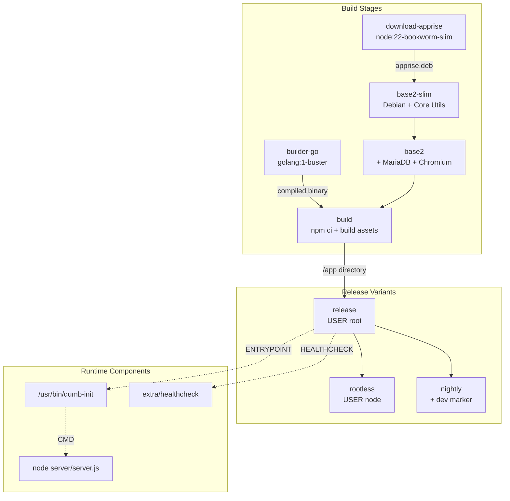
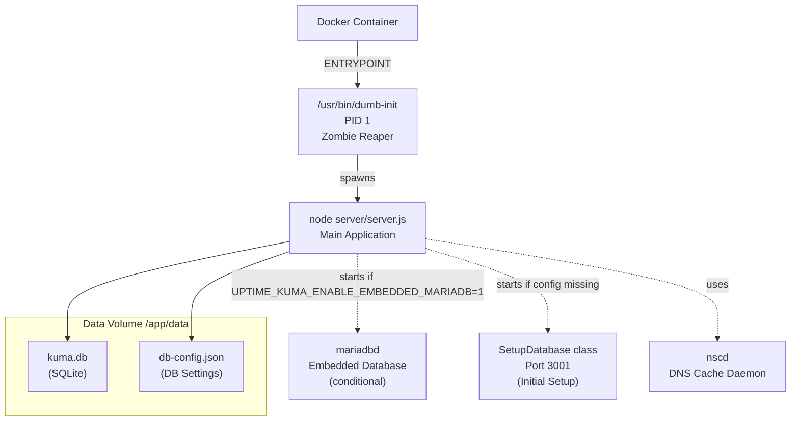
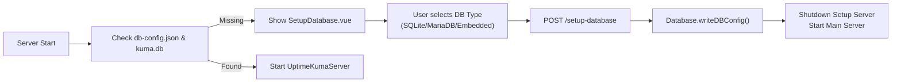

# Installation and Deployment

<details>
<summary>Relevant source files</summary>

The following files were used as context for generating this wiki page:

- [.dockerignore](.dockerignore)
- [.editorconfig](.editorconfig)
- [.github/ISSUE_TEMPLATE/ask_for_help.yml](.github/ISSUE_TEMPLATE/ask_for_help.yml)
- [.github/ISSUE_TEMPLATE/bug_report.yml](.github/ISSUE_TEMPLATE/bug_report.yml)
- [.github/ISSUE_TEMPLATE/config.yml](.github/ISSUE_TEMPLATE/config.yml)
- [.github/ISSUE_TEMPLATE/feature_request.yml](.github/ISSUE_TEMPLATE/feature_request.yml)
- [.github/ISSUE_TEMPLATE/security_issue.yml](.github/ISSUE_TEMPLATE/security_issue.yml)
- [.github/PULL_REQUEST_TEMPLATE.md](.github/PULL_REQUEST_TEMPLATE.md)
- [.gitignore](.gitignore)
- [CODE_OF_CONDUCT.md](CODE_OF_CONDUCT.md)
- [CONTRIBUTING.md](CONTRIBUTING.md)
- [README.md](README.md)
- [SECURITY.md](SECURITY.md)
- [docker/builder-go.dockerfile](docker/builder-go.dockerfile)
- [docker/debian-base.dockerfile](docker/debian-base.dockerfile)
- [docker/dockerfile](docker/dockerfile)
- [extra/download-apprise.mjs](extra/download-apprise.mjs)
- [extra/healthcheck.go](extra/healthcheck.go)
- [server/embedded-mariadb.js](server/embedded-mariadb.js)
- [server/setup-database.js](server/setup-database.js)
- [server/utils/array-with-key.js](server/utils/array-with-key.js)
- [server/utils/limit-queue.js](server/utils/limit-queue.js)
- [server/utils/simple-migration-server.js](server/utils/simple-migration-server.js)
- [src/pages/SetupDatabase.vue](src/pages/SetupDatabase.vue)

</details>


This page covers the installation and deployment options for Uptime Kuma, including Docker-based deployments, non-Docker installations, environment configuration, and data directory management.

---

## Installation Methods

Uptime Kuma supports three primary installation methods: Docker Compose (recommended), Docker command, and non-Docker Node.js installation. All methods expose the application on port `3001` by default [docker/dockerfile:39]().

### Docker Compose Installation

The simplest installation method uses Docker Compose with a minimal configuration file.

**Installation Steps:**

```bash
mkdir uptime-kuma
cd uptime-kuma
curl -o compose.yaml https://raw.githubusercontent.com/louislam/uptime-kuma/master/compose.yaml
docker compose up -d
```

The application will be available at `http://localhost:3001` or `http://your-ip:3001` [README.md:49]().

> **⚠️ WARNING:** File systems like **NFS (Network File System)** are **NOT** supported. The volume must map to a local directory or Docker volume to ensure database integrity [README.md:51-52]().

**Sources:** [README.md:40-52]()

---

### Docker Run Command

For single-container deployment without Docker Compose:

```bash
docker run -d --restart=always -p 3001:3001 -v uptime-kuma:/app/data --name uptime-kuma louislam/uptime-kuma:2
```

**Restricting to Localhost Only:**

```bash
docker run ... -p 127.0.0.1:3001:3001 ...
```

This binds the application only to the loopback interface, preventing external network access [README.md:62-66]().

**Sources:** [README.md:54-66](), [docker/dockerfile:39-42]()

---

### Docker Image Variants and Tags

Uptime Kuma provides multiple Docker image variants to support different deployment scenarios. The standard image is built on `node:22-bookworm-slim` [docker/debian-base.dockerfile:2]().

| Tag | Description | Base Image | Use Case |
|-----|-------------|------------|----------|
| `2` | Standard release (default) | `base2` (with MariaDB & Chromium) | Production deployments with full features |
| `2-slim` | Slim release | `base2-slim` (minimal dependencies) | Lightweight deployments using SQLite only |
| `2-rootless` | Rootless standard | `base2` with `USER node` | Security-hardened deployments |
| `2-slim-rootless` | Rootless slim | `base2-slim` with `USER node` | Minimal + security-hardened |
| `next` | Development/Beta | Latest from `master` | Testing upcoming features |

**Supported Tags Matrix:**

The standard tags (`2`, `2-slim`) run with `dumb-init` as PID 1 [docker/dockerfile:41](). Rootless variants execute as the `node` user (UID 1000) for enhanced security [docker/dockerfile:47-48]().

**Sources:** [docker/dockerfile:29-57](), [docker/debian-base.dockerfile:1-73](), [SECURITY.md:33-47]()

---

### Non-Docker Installation

For environments where Docker is not available, Uptime Kuma can be installed directly using Node.js.

**Requirements:**
- **Platform**: Major Linux distros (Debian, Ubuntu, etc.) or Windows 10/Server 2012 R2+ [README.md:72-74]().
- **Node.js**: >= 20.4 [README.md:77]().
- **Git**: Required for cloning [README.md:78]().
- **PM2**: Recommended for background execution [README.md:79]().

**Installation Steps:**

```bash
git clone https://github.com/louislam/uptime-kuma.git
cd uptime-kuma
npm run setup

# Recommended: Run with PM2
pm2 start server/server.js --name uptime-kuma
```

**Sources:** [README.md:68-95]()

---

## Docker Build Architecture

The Docker images use a multi-stage build process to optimize image size and separate build-time from runtime dependencies.



**Build Stage Details:**

1. **download-apprise**: Fetches the Apprise `.deb` package using `cheerio` and `semver` [docker/debian-base.dockerfile:1-8]().
2. **base2-slim**: Installs core system utilities (sqlite3, iputils-ping, dumb-init, curl, nscd, cloudflared) [docker/debian-base.dockerfile:12-55]().
3. **base2**: Extends slim image with MariaDB server and Chromium for real browser monitoring [docker/debian-base.dockerfile:67-78]().
4. **builder-go**: Compiles the healthcheck binary using `extra/build-healthcheck.js` [docker/builder-go.dockerfile:1-23]().
5. **build**: Executes `npm ci --omit=dev` to install production dependencies [docker/dockerfile:13-21]().

**Sources:** [docker/debian-base.dockerfile:1-78](), [docker/dockerfile:1-57](), [docker/builder-go.dockerfile:1-23]()

---

## Runtime Architecture

The following diagram shows the runtime process structure and key system components:



**Process Management:**

- **dumb-init**: Serves as PID 1 to properly handle zombie processes and signal forwarding [docker/dockerfile:41]().
- **Main Application**: Node.js process running `server/server.js` [docker/dockerfile:42]().
- **nscd**: DNS caching daemon for better performance [docker/debian-base.dockerfile:33]().
- **SetupDatabase**: A standalone express app used to configure the database when `db-config.json` is missing [server/setup-database.js:39-43]().

**Sources:** [docker/dockerfile:29-42](), [docker/debian-base.dockerfile:24-35](), [server/setup-database.js:39-60]()

---

## Environment Variables

Uptime Kuma supports configuration through environment variables, including Docker secrets via `_FILE` variants for database credentials [server/setup-database.js:19-36]().

### Core Configuration

| Variable | Default | Description |
|----------|---------|-------------|
| `UPTIME_KUMA_IS_CONTAINER` | `1` | Indicates Docker environment [docker/dockerfile:34]() |
| `UPTIME_KUMA_ENABLE_EMBEDDED_MARIADB` | `1` | Enable embedded MariaDB in `base2` [docker/debian-base.dockerfile:72]() |

### Database Configuration

The `SetupDatabase` class reads these variables to override or generate `db-config.json` [server/setup-database.js:98-111]().

| Variable | Description |
|----------|-------------|
| `UPTIME_KUMA_DB_TYPE` | `sqlite`, `mariadb`, or `embedded-mariadb` |
| `UPTIME_KUMA_DB_HOSTNAME` | MariaDB host address |
| `UPTIME_KUMA_DB_PORT` | MariaDB port |
| `UPTIME_KUMA_DB_USERNAME` | Database user (supports `_FILE`) |
| `UPTIME_KUMA_DB_PASSWORD` | Database password (supports `_FILE`) |
| `UPTIME_KUMA_DB_SOCKET` | Path to MariaDB Unix socket |
| `UPTIME_KUMA_DB_SSL` | Set to `true` for SSL connections |

**Sources:** [server/setup-database.js:19-112](), [docker/dockerfile:34](), [docker/debian-base.dockerfile:72]()

---

## Healthcheck System

Uptime Kuma implements a healthcheck to ensure the container is responding to requests.

### Healthcheck Logic

The system uses a compiled Go binary `extra/healthcheck` [docker/dockerfile:40](). 

The check logic follows this flow:
1. Executes the binary located at `extra/healthcheck` [docker/dockerfile:40]().
2. The binary is built via `extra/build-healthcheck.js` which handles platform-specific compilation [docker/builder-go.dockerfile:21]().
3. Default intervals are 60s with 5 retries [docker/dockerfile:40]().

**Sources:** [docker/dockerfile:40](), [docker/builder-go.dockerfile:16-23]()

---

## Database Setup Workflow

When no database configuration is found, the server launches the `SetupDatabase` server [server/setup-database.js:43]().



The setup interface (`SetupDatabase.vue`) allows users to configure:
- **Language**: Localized setup process [src/pages/SetupDatabase.vue:22-28]().
- **Database Type**: SQLite, external MariaDB, or Embedded MariaDB [src/pages/SetupDatabase.vue:35-66]().
- **Credentials**: Hostname, port, username, and password for external databases [src/pages/SetupDatabase.vue:81-131]().

**Sources:** [server/setup-database.js:43-112](), [src/pages/SetupDatabase.vue:1-156]()
