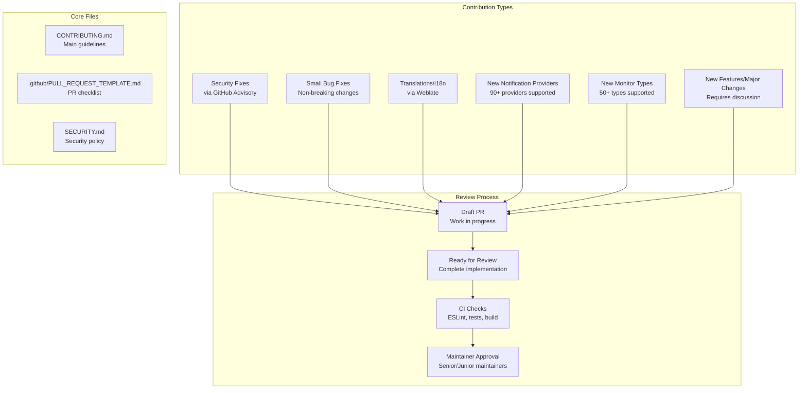
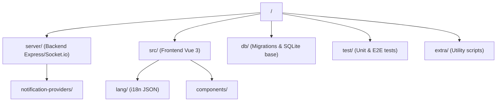

# Contributing Guidelines

Relevant source files

The following files were used as context for generating this wiki page:

- [.eslintrc.js](.eslintrc.js)
- [.github/ISSUE_TEMPLATE/ask_for_help.yml](.github/ISSUE_TEMPLATE/ask_for_help.yml)
- [.github/ISSUE_TEMPLATE/bug_report.yml](.github/ISSUE_TEMPLATE/bug_report.yml)
- [.github/ISSUE_TEMPLATE/config.yml](.github/ISSUE_TEMPLATE/config.yml)
- [.github/ISSUE_TEMPLATE/feature_request.yml](.github/ISSUE_TEMPLATE/feature_request.yml)
- [.github/ISSUE_TEMPLATE/security_issue.yml](.github/ISSUE_TEMPLATE/security_issue.yml)
- [.github/PULL_REQUEST_TEMPLATE.md](.github/PULL_REQUEST_TEMPLATE.md)
- [.github/workflows/ai-slop.yml](.github/workflows/ai-slop.yml)
- [.github/workflows/conflict-labeler.yml](.github/workflows/conflict-labeler.yml)
- [.github/workflows/mark-as-draft-on-requesting-changes.yml](.github/workflows/mark-as-draft-on-requesting-changes.yml)
- [.github/workflows/new-contributor-pr.yml](.github/workflows/new-contributor-pr.yml)
- [.github/workflows/pr-description-check.yml](.github/workflows/pr-description-check.yml)
- [.github/workflows/pr-title.yml](.github/workflows/pr-title.yml)
- [.stylelintrc](.stylelintrc)
- [CODE_OF_CONDUCT.md](CODE_OF_CONDUCT.md)
- [CONTRIBUTING.md](CONTRIBUTING.md)
- [README.md](README.md)
- [SECURITY.md](SECURITY.md)

This document provides comprehensive guidelines for contributing to the Uptime Kuma project, covering the pull request process, development standards, and review procedures. It outlines different contribution types and their specific requirements for extending the system with new monitors and notification providers.

## Overview

Uptime Kuma follows a structured contribution process designed to maintain code quality while efficiently managing maintainer time. The project is built with `vue3` (frontend) and `express.js` (backend), communicating primarily via WebSockets using `socket.io` [CONTRIBUTING.md:11-13]().

### Contribution Workflow

Sources: [CONTRIBUTING.md:1-13](), [CONTRIBUTING.md:32-36](), [.github/PULL_REQUEST_TEMPLATE.md:9-34]()

---

## Contribution Categories

### Security Fixes
Security vulnerabilities must be reported through GitHub Security Advisories rather than public pull requests. Publicly disclosing vulnerabilities via issues or PRs is strictly prohibited to protect the community [SECURITY.md:15-18]().

**Process:**
1. Submit a [GitHub Security Advisory](https://github.com/louislam/uptime-kuma/security/advisories/new) [SECURITY.md:8-9]().
2. Create an empty security issue using the [Security Issue Template](https://github.com/louislam/uptime-kuma/issues/new?template=security_issue.yml) to notify maintainers [SECURITY.md:10-12]().

Sources: [CONTRIBUTING.md:44-57](), [SECURITY.md:8-18](), [.github/ISSUE_TEMPLATE/security_issue.yml:1-55]()

### Small Bug Fixes
- Keep PRs as small as possible (fix only one thing at a time) [CONTRIBUTING.md:67-68]().
- Test that the code performs as claimed [CONTRIBUTING.md:69-69]().
- Junior maintainers may merge these if they are uncontroversial [CONTRIBUTING.md:71-72]().

### Translations (i18n)
Uptime Kuma uses Weblate for localization.
- **New Strings**: Add all translatable strings to `src/lang/en.json` only [CONTRIBUTING.md:77-80]().
- **Weblate**: Once merged to `master`, strings are synced to Weblate for community translation [CONTRIBUTING.md:80-82]().
- **Restrictions**: Do not include other languages in your PR to avoid merge conflicts with Weblate [CONTRIBUTING.md:80-80]().

Sources: [CONTRIBUTING.md:77-92]()

---

## Extension Patterns

### Adding New Notification Providers
To implement a new provider, you must modify both backend and frontend registries.

| Component | File Path | Role |
| :--- | :--- | :--- |
| **Logic** | `server/notification-providers/PROVIDER.js` | Core logic for sending the notification [CONTRIBUTING.md:98-99](). |
| **Backend Registry** | `server/notification.js` | Register the provider class [CONTRIBUTING.md:117-119](). |
| **UI Component** | `src/components/notifications/PROVIDER.vue` | Configuration form for the provider [CONTRIBUTING.md:124-125](). |
| **UI Registry** | `src/components/notifications/index.js` | Register the Vue component [CONTRIBUTING.md:134-136](). |
| **Dialog** | `src/components/NotificationDialog.vue` | Add to the regional or global provider list [CONTRIBUTING.md:121-123](). |

**Implementation Requirements:**
- Wrap `axios` calls in a `try-catch` block and use `this.throwGeneralAxiosError(error)` [CONTRIBUTING.md:108-115]().
- Use `HiddenInput` for secrets (API keys, passwords) [CONTRIBUTING.md:127-127]().
- Provide screenshots in the PR for: `UP`, `DOWN`, Certificate Expiry, and the "Test" button [CONTRIBUTING.md:143-149]().

Sources: [CONTRIBUTING.md:94-150]()

### Adding New Monitor Types
New monitor types follow a pluggable pattern in the backend.

**Backend Requirements:**
- Implement the monitor logic in `server/monitor-types/`.
- The `check()` function must return a heartbeat object or throw an error with a descriptive message [CONTRIBUTING.md:188-191]().
- Register the type in the monitor registry [CONTRIBUTING.md:183-183]().

**Frontend Requirements:**
- Update `src/pages/EditMonitor.vue` to include the new type in the selection and provide necessary configuration fields [CONTRIBUTING.md:185-185]().
- Use `HiddenInput` for sensitive fields and provide helpful placeholders [CONTRIBUTING.md:195-201]().

Sources: [CONTRIBUTING.md:178-207]()

---

## Code Quality and Standards

### Development Environment
- **Node.js**: Version >= 20.4 is required [README.md:77-77]().
- **Package Manager**: Use `npm`. Run `npm run setup` for first-time initialization [README.md:84-84]().
- **Linting**: ESLint and Stylelint are used for code quality [.eslintrc.js:1-113](), [.stylelintrc:1-18]().
- **Strict JSDoc**: Functions and methods require JSDoc documentation [.eslintrc.js:78-86]().

### Project Structure

Sources: [CONTRIBUTING.md:19-30]()

### Pull Request Requirements
The `PULL_REQUEST_TEMPLATE.md` defines a mandatory checklist for all contributors:
- **No AI Slop**: Do not submit unreviewed code generated by LLMs. You must be able to explain every line [.github/PULL_REQUEST_TEMPLATE.md:2-7](), [.github/PULL_REQUEST_TEMPLATE.md:24-25]().
- **Self-Review**: Code must be self-tested and commented (JSDoc preferred) [.github/PULL_REQUEST_TEMPLATE.md:27-28]().
- **Automated Tests**: Update or add tests where appropriate [.github/PULL_REQUEST_TEMPLATE.md:29-29]().
- **Breaking Changes**: Must be explicitly called out [.github/PULL_REQUEST_TEMPLATE.md:23-23]().

---

## Automated Validation and CI

Uptime Kuma employs several GitHub Actions to ensure code quality:

| Workflow | Purpose | Key Checks |
| :--- | :--- | :--- |
| **AI Slop Detection** | Integrity | Automatically flags and closes PRs identified as unreviewed AI-generated content [.github/workflows/ai-slop.yml:1-61](). |
| **PR Metadata** | Standards | Validates PR titles follow Conventional Commits [.github/workflows/pr-title.yml:43-54](). |
| **Template Check** | Process | Closes PRs that do not include the mandatory template phrase [.github/workflows/pr-description-check.yml:1-56](). |
| **Change Management** | Workflow | Automatically marks PRs as drafts when changes are requested [.github/workflows/mark-as-draft-on-requesting-changes.yml:1-71](). |

**Specific Validation Logic:**
- **AI Slop**: Authors who submit unreviewed AI content may face permanent bans [.github/workflows/ai-slop.yml:54-54]().
- **Draft Status**: The system uses the GitHub CLI to move PRs back to draft status when a review state is `changes_requested` [.github/workflows/mark-as-draft-on-requesting-changes.yml:45-51]().

Sources: [.github/workflows/ai-slop.yml:1-61](), [.github/workflows/pr-title.yml:1-54](), [.github/workflows/pr-description-check.yml:1-56](), [.github/workflows/mark-as-draft-on-requesting-changes.yml:1-71]()
