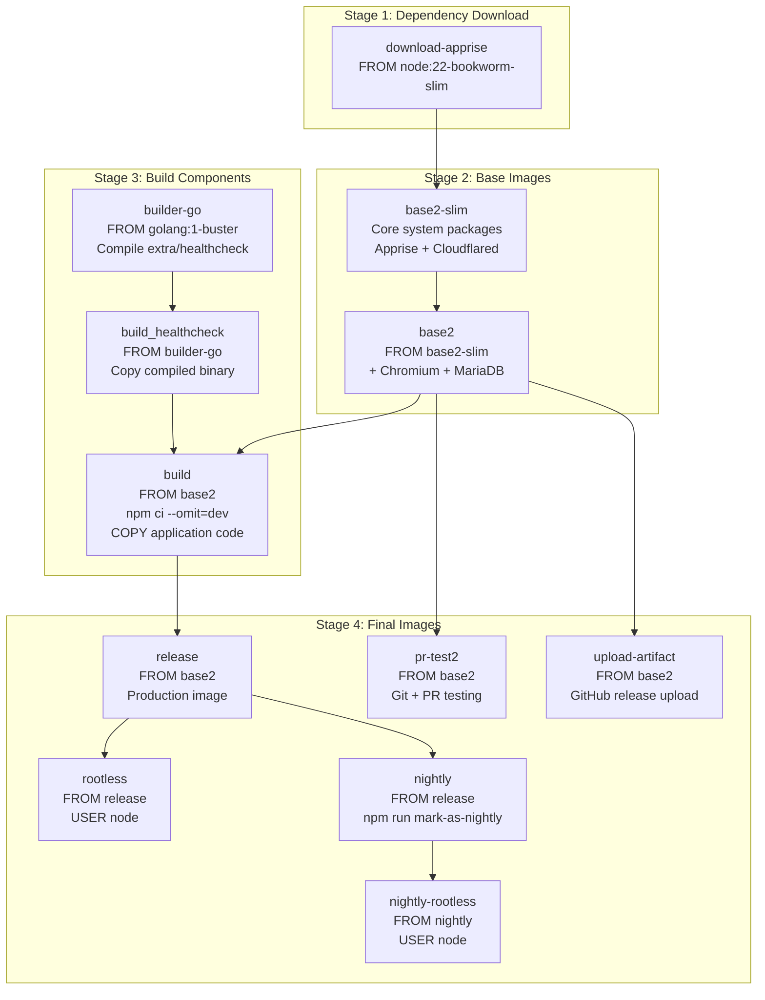
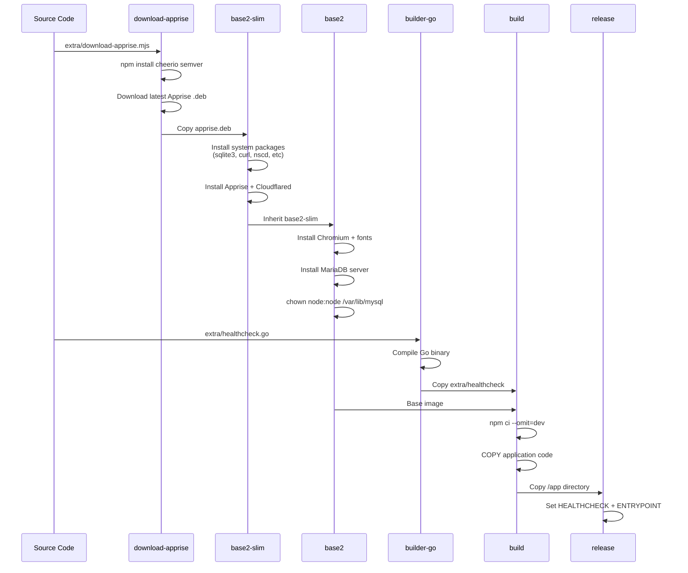
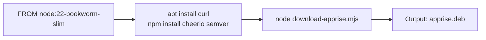
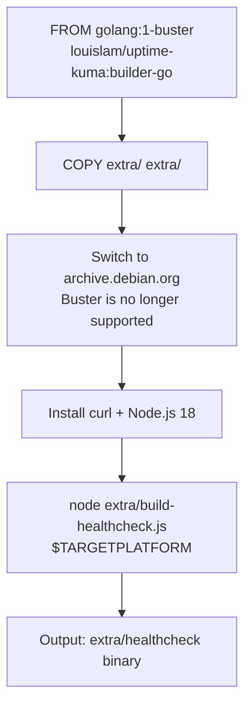
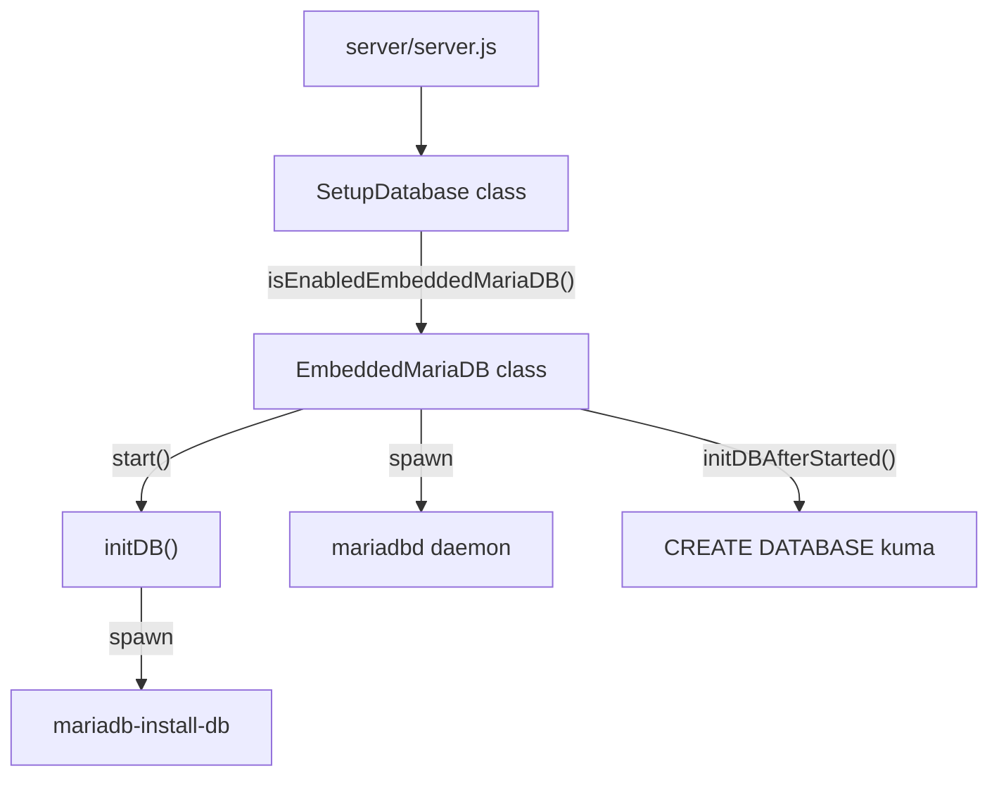
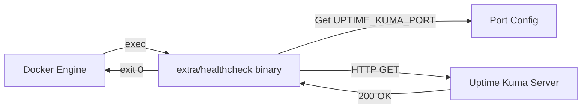

# Docker Build System

<details>
<summary>Relevant source files</summary>

The following files were used as context for generating this wiki page:

- [.dockerignore](.dockerignore)
- [.editorconfig](.editorconfig)
- [.gitignore](.gitignore)
- [docker/builder-go.dockerfile](docker/builder-go.dockerfile)
- [docker/debian-base.dockerfile](docker/debian-base.dockerfile)
- [docker/dockerfile](docker/dockerfile)
- [extra/download-apprise.mjs](extra/download-apprise.mjs)
- [extra/healthcheck.go](extra/healthcheck.go)
- [extra/healthcheck.js](extra/healthcheck.js)
- [server/embedded-mariadb.js](server/embedded-mariadb.js)
- [server/setup-database.js](server/setup-database.js)
- [server/utils/array-with-key.js](server/utils/array-with-key.js)
- [server/utils/limit-queue.js](server/utils/limit-queue.js)
- [server/utils/simple-migration-server.js](server/utils/simple-migration-server.js)
- [src/pages/SetupDatabase.vue](src/pages/SetupDatabase.vue)

</details>


This document describes the Docker multi-stage build system used to construct Uptime Kuma container images. The build process uses multiple specialized stages to optimize image size, enable multi-architecture builds, and produce several image variants for different use cases.

For information about deploying Docker images, see [Installation and Deployment](#1.1). For general contribution guidelines, see [Contributing Guidelines](#10.1).

## Build System Overview

The Docker build system consists of three main Dockerfiles that work together to create optimized container images:

| Dockerfile | Purpose | Key Outputs |
|------------|---------|-------------|
| `docker/debian-base.dockerfile` | Base system images with dependencies | `base2-slim`, `base2` |
| `docker/builder-go.dockerfile` | Go healthcheck binary compilation | `builder-go` image with compiled `extra/healthcheck` |
| `docker/dockerfile` | Application build and final images | `release`, `rootless`, `nightly`, `pr-test2` |

### Complete Build Stage Hierarchy



Sources: [docker/dockerfile:1-119](), [docker/debian-base.dockerfile:1-73](), [docker/builder-go.dockerfile:1-23]()

## Build Process Flow

The complete build flow from source code to final images involves multiple stages that optimize for layer caching and minimize final image size:

### Dependency Resolution and Base Construction



Sources: [docker/debian-base.dockerfile:2-73](), [docker/builder-go.dockerfile:5-22](), [docker/dockerfile:8-42]()

## Base Image Stages

The base images are constructed in separate stages within `docker/debian-base.dockerfile` to enable reuse and optimization.

### Stage: `download-apprise`

This stage downloads the Apprise notification library `.deb` package using a Node.js script:



The `extra/download-apprise.mjs` script:
1. Fetches the Debian packages page [docker/debian-base.dockerfile:8-8]()
2. Parses available Apprise versions using `cheerio` [docker/debian-base.dockerfile:7-7]()
3. Downloads the latest compatible `.deb` file [docker/debian-base.dockerfile:8-8]()
4. Saves to `/app/apprise.deb` [docker/debian-base.dockerfile:41-41]()

Sources: [docker/debian-base.dockerfile:2-8]()

### Stage: `base2-slim`

The slim base image includes core utilities without heavy dependencies:

| Package | Purpose | Size Impact |
|---------|---------|-------------|
| `sqlite3` | Database CLI tool for debugging | Small [docker/debian-base.dockerfile:26-26]() |
| `iputils-ping` | ICMP ping monitoring | Small [docker/debian-base.dockerfile:28-28]() |
| `util-linux` | Provides `setpriv` | Small [docker/debian-base.dockerfile:29-29]() |
| `dumb-init` | PID 1 init system, prevents zombies | Minimal [docker/debian-base.dockerfile:30-30]() |
| `curl` | HTTP requests, debugging | Small [docker/debian-base.dockerfile:31-31]() |
| `ca-certificates` | SSL certificate validation | Small [docker/debian-base.dockerfile:27-27]() |
| `sudo` | Run nscd as non-root | Minimal [docker/debian-base.dockerfile:32-32]() |
| `nscd` | DNS caching daemon | Small [docker/debian-base.dockerfile:33-33]() |
| `apprise` | 90+ notification providers | Medium [docker/debian-base.dockerfile:43-43]() |
| `python3-paho-mqtt` | MQTT support for Apprise | Small [docker/debian-base.dockerfile:43-43]() |
| `cloudflared` | Cloudflare Tunnel client | Medium [docker/debian-base.dockerfile:52-52]() |

The stage also copies custom configuration files:
- `docker/etc/nscd.conf` - DNS cache configuration [docker/debian-base.dockerfile:58-58]()
- `docker/etc/sudoers` - Permissions for nscd startup [docker/debian-base.dockerfile:59-59]()

Additionally, it manually installs Let's Encrypt Gen Y root certificates to ensure modern SSL compatibility on Debian Bookworm [docker/debian-base.dockerfile:61-65]().

Sources: [docker/debian-base.dockerfile:12-65]()

### Stage: `base2`

The full base image adds resource-intensive components for advanced features:

```dockerfile
FROM louislam/uptime-kuma:base2-slim AS base2
ENV UPTIME_KUMA_ENABLE_EMBEDDED_MARIADB=1
RUN apt update && \
    apt --yes --no-install-recommends install chromium fonts-indic fonts-noto fonts-noto-cjk mariadb-server && \
    rm -rf /var/lib/apt/lists/* && \
    apt --yes autoremove && \
    chown -R node:node /var/lib/mysql
```

**Added Components:**
- **Chromium**: Headless browser for screenshot monitoring and web content checks [docker/debian-base.dockerfile:74-74]()
- **Fonts**: International font support (Indic, Noto, CJK) for proper rendering [docker/debian-base.dockerfile:74-74]()
- **MariaDB Server**: Embedded database option for production use [docker/debian-base.dockerfile:74-74]()

The MariaDB data directory `/var/lib/mysql` is owned by the `node` user to support both root and rootless containers [docker/debian-base.dockerfile:77-77]().

Sources: [docker/debian-base.dockerfile:67-78]()

## Application Build Stages

### Stage: `build_healthcheck`

The healthcheck binary is compiled separately using a Go builder image:



The build uses a specific `builder-go` image [docker/dockerfile:8-8](). For ARM v7 builds, it is recommended to build the binary on the host first to avoid slow emulation [docker/dockerfile:5-5]().

Sources: [docker/builder-go.dockerfile:1-23](), [docker/dockerfile:8-9]()

### Stage: `build`

The main application build stage installs Node.js dependencies and copies application code:

```dockerfile
FROM louislam/uptime-kuma:base2 AS build
USER node
WORKDIR /app

ENV PUPPETEER_SKIP_CHROMIUM_DOWNLOAD=1
COPY --chown=node:node .npmrc .npmrc
COPY --chown=node:node package.json package.json
COPY --chown=node:node package-lock.json package-lock.json
RUN npm ci --omit=dev
COPY . .
COPY --chown=node:node --from=build_healthcheck /app/extra/healthcheck /app/extra/healthcheck
RUN mkdir ./data
```

**Build optimizations:**
- `USER node` - Build as non-root for security [docker/dockerfile:14-14]()
- `PUPPETEER_SKIP_CHROMIUM_DOWNLOAD=1` - Use system Chromium, skip download [docker/dockerfile:17-17]()
- `npm ci --omit=dev` - Install production dependencies only [docker/dockerfile:21-21]()
- Separate `package*.json` COPY before code - Leverage Docker layer caching [docker/dockerfile:19-20]()
- Copy healthcheck binary from `build_healthcheck` stage [docker/dockerfile:23-23]()

Sources: [docker/dockerfile:13-24]()

## Embedded MariaDB and Healthcheck

### Embedded MariaDB Implementation

When `UPTIME_KUMA_ENABLE_EMBEDDED_MARIADB` is set to `1` [docker/debian-base.dockerfile:72-72](), the server uses the `EmbeddedMariaDB` class to manage a local database instance.



The `EmbeddedMariaDB` class handles:
- **Initialization**: Runs `mariadb-install-db` if data directory `/app/data/mariadb` is missing [server/embedded-mariadb.js:149-170]().
- **Process Management**: Spawns `mariadbd` with custom socket and PID file paths [server/embedded-mariadb.js:94-101]().
- **Permissions**: Ensures directories are owned by UID 1000 [server/embedded-mariadb.js:172-196]().
- **Setup**: Creates the `kuma` database once the daemon is ready for connections [server/embedded-mariadb.js:203-214]().

Sources: [server/embedded-mariadb.js:9-215](), [server/setup-database.js:126-128]()

### Healthcheck Mechanism

Uptime Kuma uses a compiled Go binary for container health checks [extra/healthcheck.go:1-90]().



**Key Healthcheck Logic:**
- **Protocol Detection**: Uses `https` if `UPTIME_KUMA_SSL_KEY` and `UPTIME_KUMA_SSL_CERT` are defined, otherwise `http` [extra/healthcheck.go:64-69]().
- **K8s Compatibility**: Detects Kubernetes environment by checking if `UPTIME_KUMA_PORT` has a `tcp://` prefix [extra/healthcheck.go:21-23]().
- **Status Reporting**: Exits with code 0 on successful response, allowing Docker to mark the container as healthy [extra/healthcheck.go:88-90]().

During migrations, the `SimpleMigrationServer` handles requests to prevent healthcheck failures while the main server is not yet listening [server/utils/simple-migration-server.js:8-9]().

Sources: [extra/healthcheck.go:18-90](), [docker/dockerfile:40-40](), [server/utils/simple-migration-server.js:8-9]()

## Final Image Variants

The build system produces multiple image variants from the `build` stage.

### Production Images

#### `release` (Default)
The main production image uses `dumb-init` as the entrypoint to handle signal forwarding and process reaping [docker/dockerfile:41-41](). It runs `node server/server.js` as the primary command [docker/dockerfile:42-42]().

#### `rootless`
A security-hardened variant that switches to the `node` user for execution [docker/dockerfile:47-48]().

### Development and CI Images

#### `nightly` and `nightly-rootless`
These variants run `npm run mark-as-nightly` to identify the build as a development snapshot [docker/dockerfile:53-57]().

#### `pr-test2`
A specialized image for testing pull requests. It installs `git` and the GitHub CLI, clones the repository, and runs `npm run start-pr-test` [docker/dockerfile:62-90]().

#### `upload-artifact`
Used to package the `dist` directory into a tarball and upload it as a GitHub release asset using `extra/upload-github-release-asset.sh` [docker/dockerfile:95-118]().

Sources: [docker/dockerfile:29-118]()
