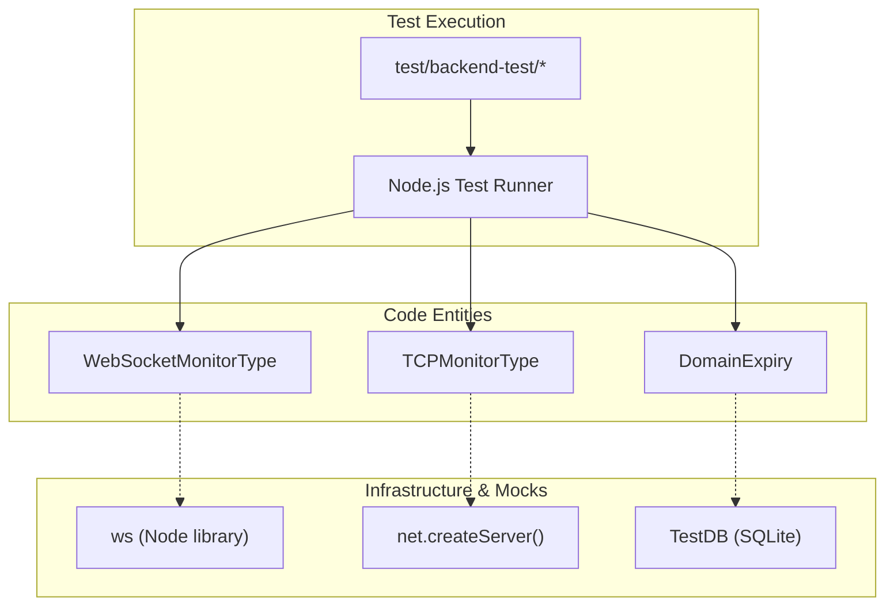
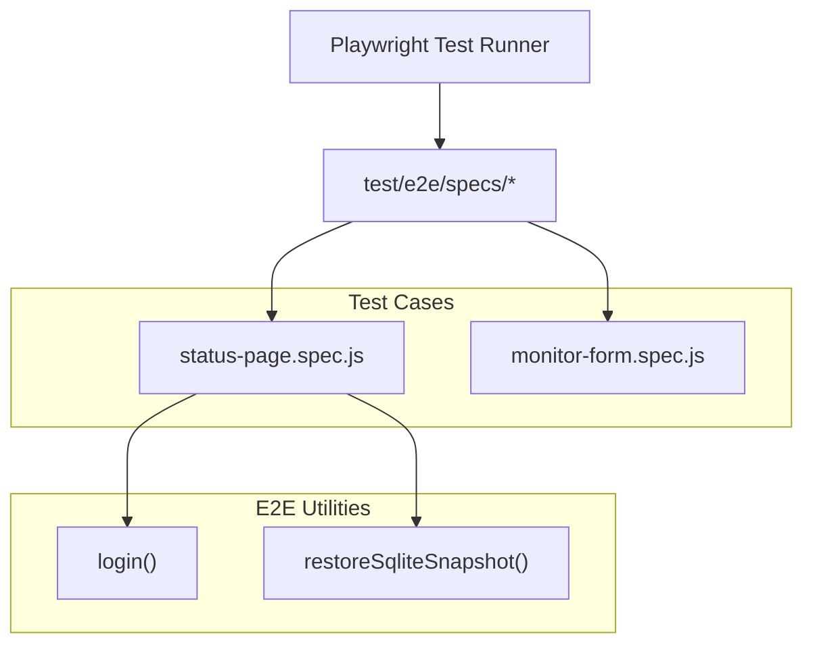

# Code Quality and Testing

Relevant source files

The following files were used as context for generating this wiki page:

- [.github/dependabot.yml](.github/dependabot.yml)
- [.github/workflows/auto-test.yml](.github/workflows/auto-test.yml)
- [.github/workflows/autofix.yml](.github/workflows/autofix.yml)
- [.github/workflows/close-incorrect-issue.yml](.github/workflows/close-incorrect-issue.yml)
- [.github/workflows/codeql-analysis.yml](.github/workflows/codeql-analysis.yml)
- [.github/workflows/prevent-file-change.yml](.github/workflows/prevent-file-change.yml)
- [.github/workflows/release-nightly.yml](.github/workflows/release-nightly.yml)
- [.github/workflows/stale-bot.yml](.github/workflows/stale-bot.yml)
- [.github/workflows/validate.yml](.github/workflows/validate.yml)
- [config/playwright.config.js](config/playwright.config.js)
- [db/knex_init_db.js](db/knex_init_db.js)
- [db/knex_migrations/2025-02-15-2312-add-wstest.js](db/knex_migrations/2025-02-15-2312-add-wstest.js)
- [db/knex_migrations/2025-02-17-2142-generalize-analytics.js](db/knex_migrations/2025-02-17-2142-generalize-analytics.js)
- [db/knex_migrations/2026-02-07-0000-disable-domain-expiry-unsupported-tlds.js](db/knex_migrations/2026-02-07-0000-disable-domain-expiry-unsupported-tlds.js)
- [db/knex_migrations/2026-06-19-1411-add-rybbit-analytics-type.js](db/knex_migrations/2026-06-19-1411-add-rybbit-analytics-type.js)
- [db/old_migrations/patch-fix-kafka-producer-booleans.sql](db/old_migrations/patch-fix-kafka-producer-booleans.sql)
- [db/old_migrations/patch-monitor-tls-info-add-fk.sql](db/old_migrations/patch-monitor-tls-info-add-fk.sql)
- [extra/check-knex-filenames.mjs](extra/check-knex-filenames.mjs)
- [extra/check-package-json.mjs](extra/check-package-json.mjs)
- [extra/close-incorrect-issue.js](extra/close-incorrect-issue.js)
- [extra/rdap-dns.json](extra/rdap-dns.json)
- [server/analytics/analytics.js](server/analytics/analytics.js)
- [server/analytics/google-analytics.js](server/analytics/google-analytics.js)
- [server/analytics/matomo-analytics.js](server/analytics/matomo-analytics.js)
- [server/analytics/plausible-analytics.js](server/analytics/plausible-analytics.js)
- [server/analytics/rybbit-analytics.js](server/analytics/rybbit-analytics.js)
- [server/analytics/umami-analytics.js](server/analytics/umami-analytics.js)
- [server/model/domain_expiry.js](server/model/domain_expiry.js)
- [server/monitor-types/websocket-upgrade.js](server/monitor-types/websocket-upgrade.js)
- [src/components/EditMonitorConditions.vue](src/components/EditMonitorConditions.vue)
- [test/backend-test/monitors/test-grpc.js](test/backend-test/monitors/test-grpc.js)
- [test/backend-test/monitors/test-mqtt.js](test/backend-test/monitors/test-mqtt.js)
- [test/backend-test/monitors/test-mssql.js](test/backend-test/monitors/test-mssql.js)
- [test/backend-test/monitors/test-postgres.js](test/backend-test/monitors/test-postgres.js)
- [test/backend-test/monitors/test-rabbitmq.js](test/backend-test/monitors/test-rabbitmq.js)
- [test/backend-test/monitors/test-tcp.js](test/backend-test/monitors/test-tcp.js)
- [test/backend-test/monitors/test-websocket.js](test/backend-test/monitors/test-websocket.js)
- [test/backend-test/notification-providers/mock-webhook.js](test/backend-test/notification-providers/mock-webhook.js)
- [test/backend-test/test-domain.js](test/backend-test/test-domain.js)
- [test/backend-test/test-status-page.js](test/backend-test/test-status-page.js)
- [test/backend-test/test-util.js](test/backend-test/test-util.js)
- [test/e2e/specs/domain-expiry-notification.spec.js](test/e2e/specs/domain-expiry-notification.spec.js)
- [test/e2e/specs/example.spec.js](test/e2e/specs/example.spec.js)
- [test/e2e/specs/monitor-form.spec.js](test/e2e/specs/monitor-form.spec.js)
- [test/e2e/specs/setup-process.once.js](test/e2e/specs/setup-process.once.js)
- [test/e2e/specs/status-page.spec.js](test/e2e/specs/status-page.spec.js)
- [test/e2e/util-test.js](test/e2e/util-test.js)

This document describes the comprehensive code quality and testing infrastructure for Uptime Kuma. It covers the test suite execution, linting and formatting tools, CI/CD workflows, security scanning, and validation rules that ensure code quality and prevent regressions.

## Test Infrastructure

Uptime Kuma uses a multi-layered testing approach with backend unit tests and end-to-end browser tests to ensure functionality across multiple platforms and Node.js versions.

### Test Execution Commands

The test suite can be executed locally using the following npm scripts:

| Command | Purpose | Requirements |
|---------|---------|--------------|
| `npm test` | Run all tests | Requires `npm run build` first |
| `npm run test-backend` | Run backend unit tests only | Requires `npm run build` first |
| `npm run test-e2e` | Run Playwright E2E tests | Requires Playwright installation |

**Sources:** [.github/workflows/auto-test.yml:60-61](), [.github/workflows/auto-test.yml:153-154]()

### Backend Test Suite

Backend tests use Node.js's built-in test runner and are located in the `test/backend-test/` directory. These tests focus on server-side functionality including database operations, monitoring logic, and API endpoints.

#### Backend Test Architecture
The backend tests often utilize specialized containers or mocks to verify external integrations without requiring a full production environment.

**Key Backend Test Components:**
- **Protocol Validation:** `test-tcp.js` creates local TCP servers using `net.createServer()` to verify `TCPMonitorType` behavior under reachable and unreachable conditions [test/backend-test/monitors/test-tcp.js:40-52]().
- **Domain Expiry Logic:** `test-domain.js` validates the `DomainExpiry` model, checking TLD parsing via `tldts` and RDAP server discovery [test/backend-test/test-domain.js:34-47](). It uses `TestDB` to provide a clean RedBean environment [test/backend-test/test-domain.js:15-27]().
- **WebSocket Testing:** `test-websocket.js` (referenced) and the `WebSocketMonitorType` implementation use the `ws` library to simulate handshakes and status code validation [server/monitor-types/websocket-upgrade.js:121-152]().

**Sources:** [test/backend-test/monitors/test-tcp.js:1-120](), [test/backend-test/test-domain.js:1-172](), [server/monitor-types/websocket-upgrade.js:25-51]()

### End-to-End Test Suite

E2E tests use Playwright (version ~1.39.0) to simulate real user interactions in a browser environment. These tests verify complete user workflows including authentication, monitor creation, and status page functionality.

**Key E2E Features:**
- **State Management:** Tests use `restoreSqliteSnapshot()` to ensure a clean database state before each test run [test/e2e/specs/status-page.spec.js:6]().
- **UI Validation:** The `status-page.spec.js` validates the creation of status pages, including complex UI elements like `Vue-Multiselect` for monitor selection and analytics configuration [test/e2e/specs/status-page.spec.js:68-112]().
- **Visual Regression:** Tests utilize `screenshot()` to capture UI states during execution for debugging [test/e2e/specs/status-page.spec.js:70]().

**Sources:** [.github/workflows/auto-test.yml:122-155](), [test/e2e/specs/status-page.spec.js:1-144]()

### Test Matrix

The CI/CD pipeline executes tests across multiple operating systems and Node.js versions to ensure compatibility:

| Operating System | Node.js Versions | Test Type |
|-----------------|------------------|-----------|
| `macos-latest` | 20, 24 | Build + Backend |
| `ubuntu-22.04` | 20, 24, 25 | Build + Backend |
| `windows-latest` | 20, 24 | Build + Backend |
| `ubuntu-22.04-arm` | 20, 24 | Build + Backend + E2E |
| `linux/arm/v7` (QEMU) | 20, 22 | Production install only (`npm ci --production`) |

**Sources:** [.github/workflows/auto-test.yml:19-29](), [.github/workflows/auto-test.yml:67-96]()

## Code Quality Tools

Uptime Kuma enforces strict code quality standards using multiple linting and formatting tools.

### Linting and Formatting
- **ESLint:** Enforces JavaScript/TypeScript code quality. The CI runs `npm run lint:prod` which fails on any warnings [/.github/workflows/auto-test.yml:120]().
- **Prettier:** Provides consistent code formatting across the entire codebase via `npm run fmt` [/.github/workflows/autofix.yml:43]().
- **Autofix:** The `autofix.yml` workflow automatically attempts to resolve linting issues and formatting violations on PRs [/.github/workflows/autofix.yml:34-44]().

**Sources:** [.github/workflows/auto-test.yml:97-121](), [.github/workflows/autofix.yml:1-50]()

## Validation Scripts

The repository includes several custom scripts to validate project metadata and database integrity.

### check-knex-filenames.mjs
This script ensures that all Knex database migrations follow a strict chronological naming convention: `YYYY-MM-DD-HHmm-description.js`.
- It validates the timestamp format and ensures new migrations are added sequentially [extra/check-knex-filenames.mjs]().

### check-package-json.mjs
Validates the `package.json` file to ensure consistency in dependencies and scripts, preventing common errors in package configuration [extra/check-package-json.mjs]().

**Sources:** [extra/check-knex-filenames.mjs:1-73](), [extra/check-package-json.mjs:1-10]()

## CI/CD Pipeline Architecture

The CI/CD pipeline consists of several specialized workflows:

1. **Auto Test (`auto-test.yml`):** The primary gatekeeper. Runs the full test matrix, linters, and Playwright E2E tests [/.github/workflows/auto-test.yml:1-155]().
2. **CodeQL Analysis (`codeql-analysis.yml`):** Performs security scanning for JavaScript, TypeScript, and Go using GitHub's CodeQL engine [/.github/workflows/codeql-analysis.yml:1-46](). It also includes `zizmor` for GitHub Actions security [/.github/workflows/codeql-analysis.yml:46-60]().
3. **Autofix (`autofix.yml`):** Automatically fixes linting and formatting issues, and runs TypeScript compilation checks [/.github/workflows/autofix.yml:34-48]().
4. **Stale Bot (`stale-bot.yml`):** Automatically manages inactive issues and PRs, specifically targeting `help` and `cannot-reproduce` labels [/.github/workflows/stale-bot.yml:1-48]().
5. **Nightly Release (`release-nightly.yml`):** Automates daily builds and deployments to Docker Hub and GHCR for the `nightly` tag [/.github/workflows/release-nightly.yml:1-62]().

**Sources:** [.github/workflows/auto-test.yml:1-155](), [.github/workflows/codeql-analysis.yml:1-60](), [.github/workflows/autofix.yml:1-50](), [.github/workflows/stale-bot.yml:1-48](), [.github/workflows/release-nightly.yml:1-62]()
