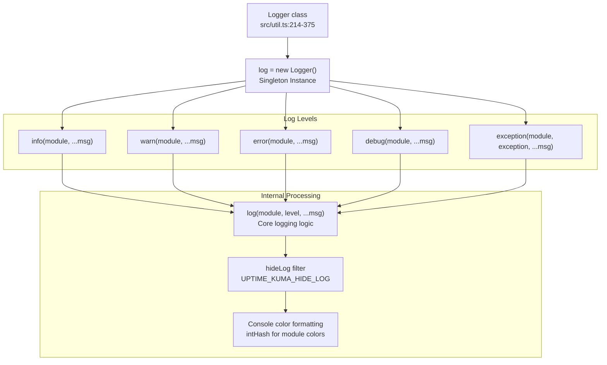
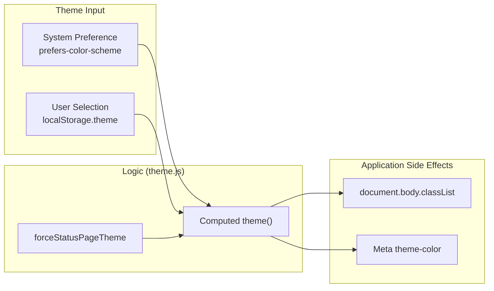

# Utility Functions and Helpers

<details>
<summary>Relevant source files</summary>

The following files were used as context for generating this wiki page:

- [src/mixins/datetime.js](src/mixins/datetime.js)
- [src/mixins/public.js](src/mixins/public.js)
- [src/mixins/theme.js](src/mixins/theme.js)
- [src/pages/Entry.vue](src/pages/Entry.vue)
- [src/util-frontend.js](src/util-frontend.js)
- [src/util.js](src/util.js)
- [src/util.ts](src/util.ts)
- [tsconfig.json](tsconfig.json)

</details>


## Purpose and Scope

This page documents the shared utility functions, helper classes, and constants provided by the `src/util.ts` and `src/util.js` files, as well as server-side and frontend-specific helpers. These utilities are used throughout both the frontend (Vue.js) and backend (Node.js) codebases to provide common functionality such as logging, random number generation, date/time manipulation, JSON query evaluation, and status management.

**Sources:** [src/util.ts:1-770](), [src/util.js:1-471]()

## Architecture Overview

The utility system follows a dual-file architecture where `src/util.ts` is the source file and `src/util.js` is the compiled output used by the backend. Additionally, `src/util-frontend.js` provides browser-specific utilities like timezone listing, toast configuration, and theme management via mixins.

### Utility Entity Map
This diagram maps logical utility concepts to their specific code entities and file locations.

```mermaid
graph TB
    subgraph "Shared Utilities (src/util.ts / src/util.js)"
        LoggerClass["Logger Class<br/>log.info/warn/error/debug"]
        RandomGen["Random Generation<br/>getCryptoRandomInt<br/>genSecret"]
        TimeUtil["Time/Date Utils<br/>utcToLocal<br/>parseTimeObject"]
        JsonQuery["JSON Query<br/>evaluateJsonQuery"]
        Constants["Constants<br/>UP/DOWN/PENDING<br/>SQL_DATETIME_FORMAT"]
    end
    
    subgraph "Frontend Helpers (src/util-frontend.js)"
        TZList["timezoneList()<br/>Sorted @vvo/tzdb list"]
        ToastCfg["loadToastSettings()<br/>vue-toastification config"]
        LocaleSet["setPageLocale()<br/>HTML lang/dir attributes"]
        ResURL["getResBaseURL()<br/>Dev/Prod API resolution"]
    end

    subgraph "Vue Mixins"
        DTMixin["datetime.js<br/>toUTC/toDayjs"]
        ThemeMixin["theme.js<br/>system/userTheme logic"]
    end

    LoggerClass --- [src/util.ts:214-375]()
    TZList --- [src/util-frontend.js:30-61]()
    JsonQuery --- [src/util.ts:654-748]()
    DTMixin --- [src/mixins/datetime.js:7-141]()
```

**Sources:** [src/util.ts:1-770](), [src/util-frontend.js:1-266](), [src/mixins/datetime.js:1-141]()

## Logger System

The `Logger` class provides a centralized logging system with support for multiple log levels, colored console output, module identification, and selective log suppression via environment variables.

### Logger Class Structure



**Sources:** [src/util.ts:214-375](), [src/util.js:142-236]()

### Logger Usage

The logger supports environment-based configuration to suppress specific log messages:

| Feature | Description | Environment Variable |
|---------|-------------|---------------------|
| Log Suppression | Hide specific module/level combinations | `UPTIME_KUMA_HIDE_LOG=debug_monitor,info_server` [src/util.ts:224-227]() |
| Debug Logs | Only shown in development mode or if explicitly enabled | Checks `isDev` flag [src/util.ts:22]() |
| Module Colors | Consistent color per module name | Uses `intHash()` for color selection [src/util.ts:118-138]() |
| Exception Logging | Specialized formatting for Error objects | `log.exception(module, error, msg)` [src/util.ts:359-373]() |

**Sources:** [src/util.ts:224-247](), [src/util.ts:359-373]()

## Random Number Generation

The utility module provides both standard and cryptographically secure random number generation, with platform-specific implementations for browser (`window.crypto`) and Node.js (`require("crypto")`).

| Function | Description | Implementation Detail |
|----------|-------------|-----------------------|
| `getRandomInt(min, max)` | Standard pseudo-random integer | Uses `Math.random()` [src/util.ts:442-444]() |
| `getCryptoRandomInt(min, max)` | Secure random integer | Uses `getRandomBytes()` adapter [src/util.ts:467-471]() |
| `genSecret(length)` | Alphanumeric secret string | Defaults to 64 chars [src/util.ts:518-538]() |

**Sources:** [src/util.ts:442-538]()

## Time and Date Utilities

Uptime Kuma uses `dayjs` for all time operations. Shared helpers manage conversions between UTC (storage) and local (display) time.

### Shared Time Helpers (`src/util.ts`)

- `utcToLocal(dateTime, format)`: Converts UTC SQL string to local time [src/util.ts:555-566]().
- `localToUTC(dateTime, format)`: Converts local time string to UTC for database storage [src/util.ts:574-585]().
- `isoToUTCDateTime(isoString)`: Parses ISO strings to standard SQL UTC format [src/util.ts:607-610]().

### Frontend Time Mixin (`src/mixins/datetime.js`)

The `datetime` mixin provides reactive timezone handling for Vue components. It defaults to `auto` (browser detection) but respects `localStorage.timezone` [src/mixins/datetime.js:10-11]().

| Method | Purpose |
|--------|---------|
| `toUTC(value)` | Converts any input to UTC string using the active timezone [src/mixins/datetime.js:21-23]() |
| `datetime(value)` | Formats as `YYYY-MM-DD HH:mm:ss` [src/mixins/datetime.js:40-42]() |
| `unixToDayjs(value)` | Converts Unix timestamp to a timezone-aware Dayjs object [src/mixins/datetime.js:58-60]() |

**Sources:** [src/util.ts:555-610](), [src/mixins/datetime.js:7-141]()

## JSON Query Evaluation

The `evaluateJsonQuery(json, query)` function provides JSONata-based querying of JSON data, used primarily for validating HTTP response bodies in monitors.

### Comparison Logic
The function supports various operators by constructing JSONata expressions:
- **Equality**: `$.value = $.expected` [src/util.ts:681]()
- **Greater Than**: `$number($.value) > $number($.expected)` [src/util.ts:705]()
- **Contains**: `$contains($.value, $.expected)` [src/util.ts:725]()

**Sources:** [src/util.ts:654-748]()

## Frontend Utilities and UI Helpers

### `src/util-frontend.js`
- **Timezone Listing**: `timezoneList()` generates a sorted list of all IANA timezones with their current UTC offsets using `@vvo/tzdb` [src/util-frontend.js:30-61]().
- **Base URL Resolution**: `getResBaseURL()` handles API routing, including logic for GitHub Codespaces and local dev containers [src/util-frontend.js:78-87]().
- **Duration Formatting**: `TimeDurationFormatter` class uses `Intl.DurationFormat` (if available) or `Intl.RelativeTimeFormat` to convert seconds into localized strings like "2 days, 4 hours" [src/util-frontend.js:192-266]().

### Theme Management (`src/mixins/theme.js`)
The theme mixin manages the application's visual state (light/dark/auto). It watches `localStorage.theme` and updates the `<body>` class and the `#theme-color` meta tag [src/mixins/theme.js:35-65]().



**Sources:** [src/util-frontend.js:30-266](), [src/mixins/theme.js:1-109]()

## Status and Configuration Constants

Uptime Kuma relies on standardized numeric constants for monitor and status page states to ensure consistency between the Node.js backend and Vue.js frontend.

### Monitor Statuses
- `DOWN`: 0 [src/util.ts:32]()
- `UP`: 1 [src/util.ts:33]()
- `PENDING`: 2 [src/util.ts:34]()
- `MAINTENANCE`: 3 [src/util.ts:35]()

### Status Page States
- `STATUS_PAGE_ALL_DOWN`: 0 [src/util.ts:37]()
- `STATUS_PAGE_ALL_UP`: 1 [src/util.ts:38]()
- `STATUS_PAGE_PARTIAL_DOWN`: 2 [src/util.ts:39]()
- `STATUS_PAGE_MAINTENANCE`: 4 [src/util.ts:40]()

### Badge Constants
The `badgeConstants` object defines default visual styles for SVG badges, including colors for different states and default expiration thresholds (14 days for warning, 7 days for critical) [src/util.ts:145-163]().

**Sources:** [src/util.ts:32-40](), [src/util.ts:145-163]()
