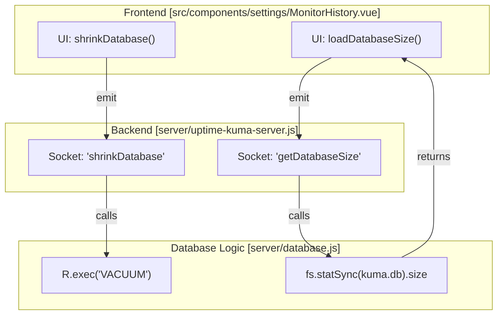
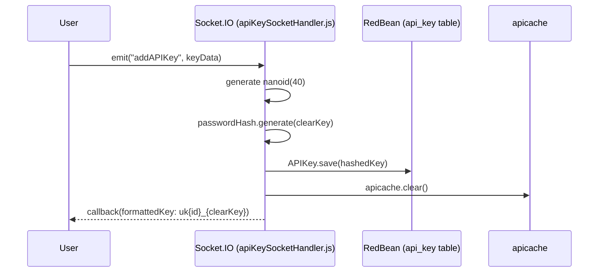

# Data Management and Backup

Relevant source files

The following files were used as context for generating this wiki page:

- [db/knex_migrations/2023-12-21-0000-stat-ping-min-max.js](db/knex_migrations/2023-12-21-0000-stat-ping-min-max.js)
- [db/knex_migrations/2023-12-22-0000-hourly-uptime.js](db/knex_migrations/2023-12-22-0000-hourly-uptime.js)
- [server/auth.js](server/auth.js)
- [server/check-version.js](server/check-version.js)
- [server/image-data-uri.js](server/image-data-uri.js)
- [server/jobs.js](server/jobs.js)
- [server/jobs/clear-old-data.js](server/jobs/clear-old-data.js)
- [server/jobs/incremental-vacuum.js](server/jobs/incremental-vacuum.js)
- [server/notification-providers/nostr.js](server/notification-providers/nostr.js)
- [server/prometheus.js](server/prometheus.js)
- [server/rate-limiter.js](server/rate-limiter.js)
- [server/socket-handlers/api-key-socket-handler.js](server/socket-handlers/api-key-socket-handler.js)
- [server/uptime-calculator.js](server/uptime-calculator.js)
- [src/components/Login.vue](src/components/Login.vue)
- [src/components/TwoFADialog.vue](src/components/TwoFADialog.vue)
- [src/components/settings/About.vue](src/components/settings/About.vue)
- [src/components/settings/General.vue](src/components/settings/General.vue)
- [src/components/settings/MonitorHistory.vue](src/components/settings/MonitorHistory.vue)
- [src/components/settings/Security.vue](src/components/settings/Security.vue)
- [src/i18n.js](src/i18n.js)
- [test/backend-test/README.md](test/backend-test/README.md)
- [test/backend-test/test-uptime-calculator.js](test/backend-test/test-uptime-calculator.js)

**Purpose and Scope**: This page covers Uptime Kuma's data management features including data retention policies, database maintenance (shrinking), statistics clearing, and backup export/import. It details the underlying directory structure and the aggregate statistics tables (`stat_minutely`, `stat_hourly`, `stat_daily`) used for long-term data visualization and performance optimization.

---

## Data Directory Structure

Uptime Kuma centralizes all persistent data within a single directory, configurable via the `DATA_DIR` environment variable. By default, this is the `./data` folder relative to the installation directory.

| Path | Purpose |
|:---|:---|
| `kuma.db` | The primary SQLite database file (if using SQLite). |
| `db-config.json` | Configuration file specifying the database type (SQLite or MariaDB/MySQL) and connection details. |
| `upload/` | Stores user-uploaded assets, such as status page favicons or logos. |
| `screenshots/` | Stores screenshots captured by "Real Browser" monitors. |
| `docker-tls/` | Stores TLS certificates and keys for connecting to remote Docker hosts. |

**Sources**: [server/database.js:137-140](), [server/database.js:173-192](), [server/database.js:144-148](), [server/database.js:151-154](), [server/database.js:156-159]()

---

## Aggregate Statistics Tables

To maintain performance while providing long-term uptime and response time history, Uptime Kuma utilizes three aggregate tables. These tables store pre-calculated statistics managed by the `UptimeCalculator` class [server/uptime-calculator.js:10-202]().

### Table Schema and Granularity

| Table | Resolution | Data Retention | Purpose |
|:---|:---|:---|:---|
| `stat_minutely` | 1 Minute | 24 Hours | High-resolution recent history for the dashboard. |
| `stat_hourly` | 1 Hour | 30 Days | Medium-resolution history for 24h/30d views. |
| `stat_daily` | 24 Hours | Configurable | Low-resolution history for yearly/all-time views. |

Each table contains the following key fields:
- `monitor_id`: Reference to the monitor [server/uptime-calculator.js:129]().
- `timestamp`: The start of the time bucket (Unix timestamp) [server/uptime-calculator.js:150]().
- `up`: Number of successful heartbeats in the interval [server/uptime-calculator.js:136]().
- `down`: Number of failed heartbeats in the interval [server/uptime-calculator.js:137]().
- `ping`: Average response time during that period [server/uptime-calculator.js:138]().
- `pingMin` / `pingMax`: The range of response times [server/uptime-calculator.js:139-140]().

**Sources**: [server/uptime-calculator.js:34-47](), [server/uptime-calculator.js:129-202](), [db/knex_migrations/2023-12-21-0000-stat-ping-min-max.js](), [db/knex_migrations/2023-12-22-0000-hourly-uptime.js]()

---

## Data Retention and Cleanup

### Retention Policies
Uptime Kuma manages database growth through a configurable retention period (`keepDataPeriodDays`). This setting determines how long raw heartbeat and daily stats are kept before being purged [src/components/settings/MonitorHistory.vue:4-16]().

- **Infinite Retention**: Setting the period to `0` disables automatic deletion [src/components/settings/MonitorHistory.vue:6]().
- **Default**: If not set, the system defaults to 365 days [server/jobs/clear-old-data.js:7]().

### Background Jobs
The `initBackgroundJobs` function schedules maintenance tasks using the `Cron` library [server/jobs.js:25-39]().

1.  **`clear-old-data`**: Runs daily at 03:14 [server/jobs.js:9](). It deletes heartbeats older than the retention period and daily stats older than the same period [server/jobs/clear-old-data.js:44-49]().
2.  **`incremental-vacuum`**: Runs every 5 minutes to maintain SQLite performance [server/jobs.js:15]().

**Sources**: [server/jobs.js:6-19](), [server/jobs/clear-old-data.js:13-60](), [src/components/settings/MonitorHistory.vue:1-24]()

---

## Database Maintenance (SQLite)

For SQLite deployments, Uptime Kuma provides tools to reclaim disk space and optimize the database file.

### Shrinking (VACUUM)
The "Shrink Database" feature triggers a manual `VACUUM` through the `shrinkDatabase` Socket.IO event [src/components/settings/MonitorHistory.vue:111-120](). This rebuilds the database file to defragment it [src/components/settings/MonitorHistory.vue:31-38]().

### Implementation Flow

**Sources**: [src/components/settings/MonitorHistory.vue:95-120](), [server/jobs/incremental-vacuum.js](), [server/jobs.js:14-18]()

---

## Backup: Export and Import

Uptime Kuma supports a configuration-only backup system. This includes monitors, notifications, proxies, and settings, but excludes historical heartbeat data.

### Export and Import Logic
The backup system is managed via Socket.IO handlers.
- **Export**: Aggregates configuration beans into a JSON structure.
- **Import**: Allows users to "Overwrite" or "Keep Both" configurations.

### Security and API Keys
When API keys are used, they are stored as hashed values [server/socket-handlers/api-key-socket-handler.js:23](). The full key is only visible to the user at creation time [server/socket-handlers/api-key-socket-handler.js:32-45]().

**Sources**: [server/socket-handlers/api-key-socket-handler.js:16-52](), [server/auth.js:37-63](), [server/settings.js]()

---

## Statistics Clearing

Users can reset their monitoring history without deleting the monitor configurations.

- **Clear All Statistics**: The `clearStatistics` method on the root Vue instance triggers a backend operation that truncates the `heartbeat`, `event`, and `stat_` tables [src/components/settings/MonitorHistory.vue:134-142]().
- **Database Size Tracking**: The UI tracks the current size of the SQLite file via `getDatabaseSize` to show the impact of clearing data [src/components/settings/MonitorHistory.vue:95-105]().

**Sources**: [src/components/settings/MonitorHistory.vue:40-52](), [src/components/settings/MonitorHistory.vue:134-142](), [server/database.js]()
