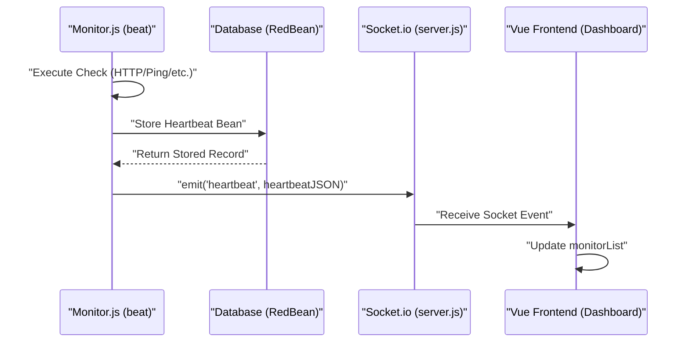

# Glossary

<details>
<summary>Relevant source files</summary>

The following files were used as context for generating this wiki page:

- [.github/workflows/autofix.yml](.github/workflows/autofix.yml)
- [.github/workflows/release-nightly.yml](.github/workflows/release-nightly.yml)
- [db/knex_migrations/2023-12-21-0000-stat-ping-min-max.js](db/knex_migrations/2023-12-21-0000-stat-ping-min-max.js)
- [db/knex_migrations/2023-12-22-0000-hourly-uptime.js](db/knex_migrations/2023-12-22-0000-hourly-uptime.js)
- [db/knex_migrations/2026-02-07-0000-disable-domain-expiry-unsupported-tlds.js](db/knex_migrations/2026-02-07-0000-disable-domain-expiry-unsupported-tlds.js)
- [extra/rdap-dns.json](extra/rdap-dns.json)
- [package-lock.json](package-lock.json)
- [package.json](package.json)
- [server/database.js](server/database.js)
- [server/model/domain_expiry.js](server/model/domain_expiry.js)
- [server/model/monitor.js](server/model/monitor.js)
- [server/model/status_page.js](server/model/status_page.js)
- [server/notification-providers/egosms.js](server/notification-providers/egosms.js)
- [server/notification-providers/nostr.js](server/notification-providers/nostr.js)
- [server/notification-providers/vkteams.js](server/notification-providers/vkteams.js)
- [server/notification.js](server/notification.js)
- [server/routers/api-router.js](server/routers/api-router.js)
- [server/routers/status-page-router.js](server/routers/status-page-router.js)
- [server/server.js](server/server.js)
- [server/socket-handlers/status-page-socket-handler.js](server/socket-handlers/status-page-socket-handler.js)
- [server/uptime-calculator.js](server/uptime-calculator.js)
- [server/uptime-kuma-server.js](server/uptime-kuma-server.js)
- [server/util-server.js](server/util-server.js)
- [src/components/NotificationDialog.vue](src/components/NotificationDialog.vue)
- [src/components/notifications/EgoSMS.vue](src/components/notifications/EgoSMS.vue)
- [src/components/notifications/VKTeams.vue](src/components/notifications/VKTeams.vue)
- [src/components/notifications/index.js](src/components/notifications/index.js)
- [src/lang/en.json](src/lang/en.json)
- [src/pages/EditMonitor.vue](src/pages/EditMonitor.vue)
- [src/pages/StatusPage.vue](src/pages/StatusPage.vue)
- [src/util.js](src/util.js)
- [src/util.ts](src/util.ts)
- [test/backend-test/README.md](test/backend-test/README.md)
- [test/backend-test/notification-providers/mock-webhook.js](test/backend-test/notification-providers/mock-webhook.js)
- [test/backend-test/test-domain.js](test/backend-test/test-domain.js)
- [test/backend-test/test-uptime-calculator.js](test/backend-test/test-uptime-calculator.js)
- [test/backend-test/test-util.js](test/backend-test/test-util.js)
- [test/e2e/specs/domain-expiry-notification.spec.js](test/e2e/specs/domain-expiry-notification.spec.js)
- [tsconfig.json](tsconfig.json)

</details>


This glossary provides definitions for codebase-specific terminology, domain concepts, and architectural patterns used within Uptime Kuma. It is intended to assist onboarding engineers in navigating the logic and data structures of the application.

## Monitoring Terminology

### Heartbeat / Beat
A **heartbeat** (often referred to as a **beat**) represents a single check performed by a monitor at a specific point in time. It records the status of the target, the response time (ping), and any error messages.
*   **Implementation**: Heartbeats are stored in the `heartbeat` table and represented by the `heartbeat` bean in RedBean ORM.
*   **Important Beat**: A heartbeat is marked as "important" if the status changes (e.g., UP to DOWN) or if it is the first beat of a monitor [server/routers/api-router.js:100-102]().
*   **Data Flow**: The server logic triggers the check, creates a heartbeat record, and emits it via Socket.io [server/routers/api-router.js:127-129]().

### Upside Down Mode
A configuration where the logic of a monitor is inverted. If the target is reachable and returns a success result, the status is marked as **DOWN**. If the target is unreachable or fails, it is marked as **UP**.
*   **Usage**: Useful for monitoring services that *should* be offline or inaccessible for security reasons [src/lang/en.json:106]().
*   **Code Reference**: Handled in the `determineStatus` utility during the monitor execution lifecycle [server/routers/api-router.js:88]().

### Push Monitor
A passive monitor type where Uptime Kuma does not initiate the check. Instead, an external service or script "pushes" its status to Uptime Kuma by calling a specific API endpoint.
*   **Endpoint**: `GET/POST /api/push/:pushToken` [server/routers/api-router.js:47]().
*   **Logic**: The server validates the `pushToken`, creates a heartbeat, and calculates uptime based on the arrival frequency [server/routers/api-router.js:62-94]().

### HeartbeatBar
A custom Vue component used to visualize the history of a monitor's heartbeats as a series of colored vertical lines (green for UP, red for DOWN, orange for PENDING, etc.).
*   **Theming**: Users can choose different themes for the bar, such as "Brough" or "Vibrant" [src/lang/en.json:134-137]().

## Architecture Terms

### UptimeKumaServer (Singleton)
The central management class for the backend. It follows the Singleton pattern to ensure only one instance of the Express app and Socket.io server exists.
*   **Role**: Manages the lifecycle of the HTTP server, initializes socket handlers, and holds global state like the JWT secret [server/uptime-kuma-server.js]().
*   **Access**: Retrieved via `UptimeKumaServer.getInstance()` [server/server.js:96]().

### RedBean ORM (R)
Uptime Kuma uses `redbean-node` as its primary ORM. It provides a "zero-configuration" approach to database interaction where the schema can be automatically inferred or modified during development.
*   **Usage**: Referred to as `R` throughout the backend [server/database.js:3]().
*   **Models**: Custom logic for entities like `Monitor` or `User` is implemented by extending `BeanModel` [server/model/monitor.js:76]().

### Knex Migrations
While RedBean handles simple schema updates, complex changes (like adding foreign keys or table restructuring) are handled via **Knex.js** migrations.
*   **Path**: `db/knex_migrations/` [server/database.js:128]().
*   **Execution**: Migrations are run during server startup to ensure the database schema is up to date [server/database.js:115]().

### System Architecture Overview
The following diagram maps natural language concepts to their specific code entities.

**Diagram: System Entity Mapping**
```mermaid
graph TD
    subgraph "NaturalLanguageSpace"
        ["Monitor Definition"]
        ["Health Check Event"]
        ["Web UI State"]
        ["Database Storage"]
    end

    subgraph "CodeEntitySpace"
        ["Monitor Definition"] --> |"Defined in"| E["server/model/monitor.js (Class Monitor)"]
        ["Health Check Event"] --> |"Represented by"| F["heartbeat table / bean"]
        ["Web UI State"] --> |"Managed by"| G["src/main.js ($root)"]
        ["Database Storage"] --> |"Accessed via"| H["server/database.js (R / RedBean)"]
    end
```
Sources: [server/model/monitor.js:76](), [server/database.js:20](), [server/server.js:95]().

## UI and Frontend Patterns

### Shadow Box
A common CSS class (`.shadow-box`) used throughout the application to wrap UI elements in a consistent card-like container with a shadow and rounded corners.
*   **Usage**: Frequently seen in forms like the Monitor Editor [src/pages/EditMonitor.vue:6]().

### Slug
A URL-friendly identifier used for Status Pages. It allows users to access a status page via a custom path like `/status/my-service`.
*   **Configuration**: Set in the Status Page editor [src/pages/StatusPage.vue:7-12]().

### DATA_DIR
The environment variable or argument that defines where Uptime Kuma stores its persistent data (SQLite database, uploaded icons, logs, etc.).
*   **Default**: `./data/` [server/database.js:137]().
*   **Subdirectories**: Includes `upload/` for images and `screenshots/` for Real Browser monitors [server/database.js:144-153]().

## Notification Concepts

### Provider
A specific integration for sending alerts (e.g., Telegram, Discord, Slack). Each provider is a class that implements a `send()` method.
*   **Registry**: All providers are initialized and stored in the `Notification` class [server/notification.js:108-111]().
*   **Discovery**: Providers are categorized into groups like `chatPlatforms`, `pushServices`, and `incidentManagement` for the UI [src/components/NotificationDialog.vue:25-69]().

### Liquid Templates
A templating engine used to allow users to customize notification messages.
*   **Library**: `liquidjs` [package.json:114]().
*   **Usage**: Enables dynamic content in notification bodies based on monitor state.

## Infrastructure and Advanced Concepts

### RDAP (Registration Data Access Protocol)
Used for domain expiry monitoring. It is the successor to WHOIS and provides structured data about domain registrations.
*   **Implementation**: Handled via the `DomainExpiry` model [server/model/monitor.js:65]().
*   **Notification**: Triggers alerts when domains are close to expiration [server/model/monitor.js:157]().

### Stat Tables
To optimize the loading of charts and global statistics, Uptime Kuma aggregates heartbeat data into "stat" tables.
*   **Tables**: `stat_minutely`, `stat_hourly`, `stat_daily`.
*   **Aggregation**: Background jobs calculate average ping and uptime percentages over these intervals to avoid querying millions of rows from the `heartbeat` table [db/knex_migrations/2023-12-22-0000-hourly-uptime.js:1-20]().

### Monitor Lifecycle and Data Flow
The following diagram illustrates the flow of data from a monitor check to the user interface.

**Diagram: Monitor Execution and UI Update Flow**

Sources: [server/model/monitor.js:127-129](), [server/routers/api-router.js:127](), [server/server.js:97]().

## Key Files and Constants

| Term | File / Path | Description |
| :--- | :--- | :--- |
| **UP** | `src/util.js` | Constant representing status 1 [server/model/monitor.js:6]() |
| **DOWN** | `src/util.js` | Constant representing status 0 [server/model/monitor.js:7]() |
| **PENDING** | `src/util.js` | Constant representing status 2 [server/model/monitor.js:8]() |
| **MAINTENANCE** | `src/util.js` | Constant representing status 3 [server/model/monitor.js:9]() |
| **apicache** | `server/modules/apicache.js` | Middleware used to cache API responses for badges and status pages [server/routers/api-router.js:24]() |

Sources: [server/model/monitor.js:1-10](), [server/routers/api-router.js:1-24](), [server/database.js:1-50]().
