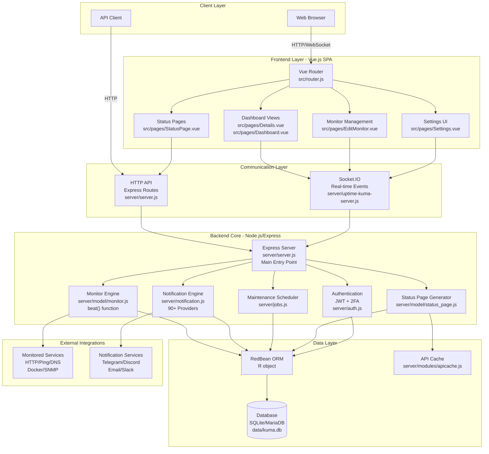
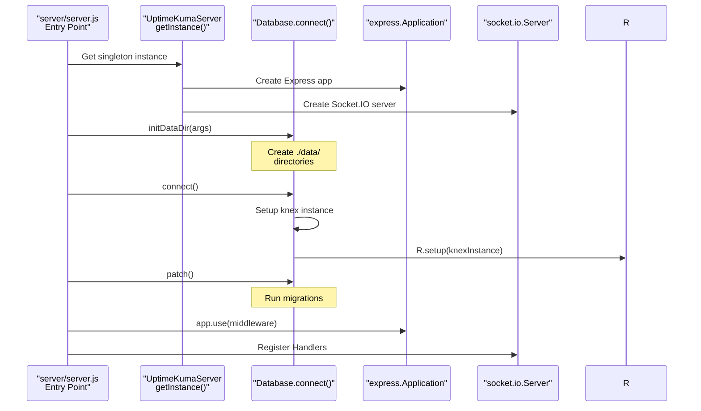
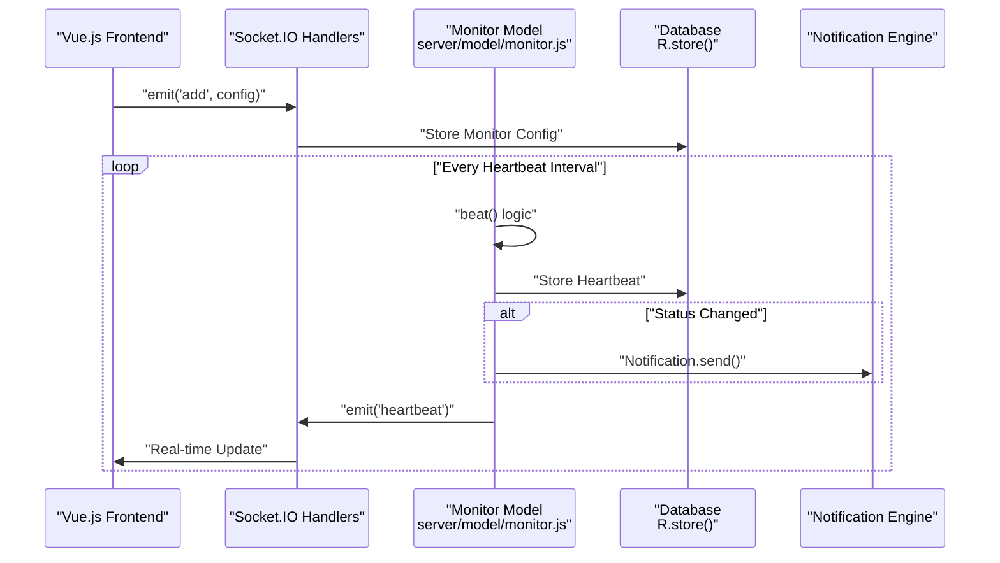
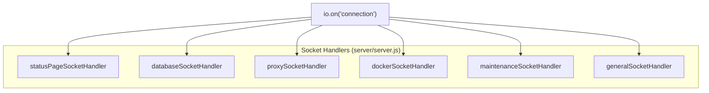

# Architecture Overview

Relevant source files

The following files were used as context for generating this wiki page:

- [.github/ISSUE_TEMPLATE/ask_for_help.yml](.github/ISSUE_TEMPLATE/ask_for_help.yml)
- [.github/ISSUE_TEMPLATE/bug_report.yml](.github/ISSUE_TEMPLATE/bug_report.yml)
- [.github/ISSUE_TEMPLATE/config.yml](.github/ISSUE_TEMPLATE/config.yml)
- [.github/ISSUE_TEMPLATE/feature_request.yml](.github/ISSUE_TEMPLATE/feature_request.yml)
- [.github/ISSUE_TEMPLATE/security_issue.yml](.github/ISSUE_TEMPLATE/security_issue.yml)
- [.github/PULL_REQUEST_TEMPLATE.md](.github/PULL_REQUEST_TEMPLATE.md)
- [CODE_OF_CONDUCT.md](CODE_OF_CONDUCT.md)
- [CONTRIBUTING.md](CONTRIBUTING.md)
- [README.md](README.md)
- [SECURITY.md](SECURITY.md)
- [package-lock.json](package-lock.json)
- [package.json](package.json)
- [server/database.js](server/database.js)
- [server/model/monitor.js](server/model/monitor.js)
- [server/server.js](server/server.js)
- [server/uptime-kuma-server.js](server/uptime-kuma-server.js)
- [server/util-server.js](server/util-server.js)
- [src/pages/EditMonitor.vue](src/pages/EditMonitor.vue)

## Purpose and Scope

This document describes the high-level architecture of Uptime Kuma, explaining how the system's major components are organized and how they interact. It covers the three-tier architecture (frontend, communication layer, backend), the singleton server orchestrator, and the flow of data through the system.

For detailed information about specific subsystems, see:
- **Server backend implementation**: [Server Architecture](#2.1)
- **Vue.js frontend structure**: [Frontend Architecture](#2.2)
- **Socket.IO communication patterns**: [Real-Time Communication](#2.3)
- **Database and persistence**: [Database Layer](#2.4)

---

## Three-Tier Architecture

Uptime Kuma follows a classic three-tier architecture with clear separation of concerns:

### System Architecture Diagram

**Key Architectural Characteristics:**

- **Frontend Tier**: Vue 3 SPA using composition API with Vue Router for client-side routing, communicating via both HTTP REST endpoints and WebSocket for real-time updates [CONTRIBUTING.md:11-14]().
- **Communication Tier**: Dual-channel approach with Express HTTP routes for stateless operations and Socket.IO WebSocket for real-time bidirectional communication [server/server.js:97-99]().
- **Backend Tier**: Node.js/Express server with specialized engines for monitoring, notifications, maintenance scheduling, and status page generation [server/server.js:100-137]().
- **Data Tier**: RedBean-Node ORM abstracts SQLite (default) and MariaDB (optional) databases with Knex-based migrations [server/database.js:3-15]().

**Sources:** [server/server.js:75-135](), [server/uptime-kuma-server.js:22-100](), [CONTRIBUTING.md:11-18](), [package.json:71-115]()

---

## Core Components and Class Hierarchy

The following table maps high-level system concepts to concrete code entities:

| System Component | Primary Class/Module | File Path | Key Responsibilities |
|-----------------|---------------------|-----------|---------------------|
| **Server Orchestrator** | `UptimeKumaServer` | [server/uptime-kuma-server.js:22-73]() | Singleton managing Express, Socket.IO, monitor lists, JWT secrets. |
| **HTTP Server** | `express.Application` | [server/server.js:78-98]() | Express app instance serving REST API and static files. |
| **WebSocket Server** | `socket.io.Server` | [server/uptime-kuma-server.js:44]() | Real-time bidirectional communication with clients. |
| **Monitor Engine** | `Monitor` (extends `BeanModel`) | [server/model/monitor.js:76-117]() | Monitor configuration, execution (`beat()`), status tracking. |
| **Database Abstraction** | `Database` (static class) | [server/database.js:20-60]() | Connection management, migrations, SQLite/MariaDB support. |
| **ORM Layer** | `R` (RedBean-Node) | [server/database.js:3]() | Object-relational mapping, query builder. |
| **Notification Dispatcher** | `Notification` | [server/notification.js]() | 90+ provider integrations, sending alerts on status changes. |

**Sources:** [server/uptime-kuma-server.js:22-73](), [server/model/monitor.js:76](), [server/database.js:20](), [server/server.js:78-135]()

---

## Server Initialization Flow

The initialization sequence begins in [server/server.js:95-137]() where the database is set up, followed by [server/server.js:192]() where `SetupDatabase` handles initial configuration.

**Sources:** [server/server.js:1-200](), [server/uptime-kuma-server.js:78-100](), [server/database.js:135-162]()

---

## Component Interaction Patterns

### Monitor Execution Cycle

Each `Monitor` instance runs independently. The following sequence shows the high-level flow:

**Key Implementation Details:**

- Heartbeats are stored using RedBean-Node [server/model/monitor.js:46-47]().
- Real-time updates are broadcast via Socket.IO handlers registered in [server/server.js:163-194]().
- The `Monitor` model handles status logic including `UP`, `DOWN`, and `MAINTENANCE` states [server/model/monitor.js:70-75]().

**Sources:** [server/model/monitor.js:70-120](), [server/server.js:163-194]()

### Socket.IO Event Handling

Socket.IO events follow a handler registration pattern where specific modules manage logic for different domains:

**Sources:** [server/server.js:173-194]()

---

## Data Persistence Layer

### RedBean-Node ORM Integration

Uptime Kuma uses RedBean-Node as its ORM, exposed through the `R` object:

| Operation | Usage Example in Code |
|-----------|----------------------|
| **Read** | [server/util-server.js:43]() - `R.findOne("setting", ...)` |
| **Create** | [server/util-server.js:46]() - `R.dispense("setting")` |
| **Update** | [server/util-server.js:51]() - `await R.store(bean)` |

**Sources:** [server/database.js:1-15](), [server/model/monitor.js:46-47](), [server/util-server.js:42-53]()

---

## Technology Stack Summary

| Layer | Technology | Version | Configuration File |
|-------|-----------|---------|-------------------|
| **Runtime** | Node.js | `>= 20.4.0` | [package.json:10]() |
| **Backend Framework** | Express | `~4.22.1` | [package.json:92]() |
| **WebSocket** | Socket.IO | `~4.8.3` | [package.json:83]() |
| **Database** | SQLite | `15.1.6` | [package.json:14]() |
| **ORM** | RedBean-Node | `~0.3.3` | [package.json:80]() |
| **Frontend Framework** | Vue 3 | `~3.5.28` | [package.json:154]() |
| **Frontend Build** | Vite | `~5.4.21` | [package.json:152]() |

**Sources:** [package.json:1-170]()

---

## Entry Points and Request Routing

### Backend Entry Point

The application starts at [server/server.js:1]() which:
1. Loads environment variables via `dotenv` [server/server.js:15]().
2. Validates Node.js version [server/server.js:21-46]().
3. Initializes the `UptimeKumaServer` singleton [server/server.js:96]().

### Frontend Entry Point

The Vue 3 SPA initializes via `vite` [package.json:22]() and uses components like `EditMonitor.vue` [src/pages/EditMonitor.vue]() to provide the user interface.

**Sources:** [server/server.js:1-100](), [package.json:22-28](), [src/pages/EditMonitor.vue:30-114]()

---

## Key Design Patterns

### Singleton Pattern
The `UptimeKumaServer` class implements the singleton pattern [server/uptime-kuma-server.js:68-73](), ensuring a single orchestrator for all backend activities.

### Active Record Pattern
The `Monitor` class extends `BeanModel` [server/model/monitor.js:76](), allowing database records to behave as objects with logic for status checks and JSON serialization [server/model/monitor.js:85-117]().

**Sources:** [server/uptime-kuma-server.js:68-73](), [server/model/monitor.js:76-117]()
