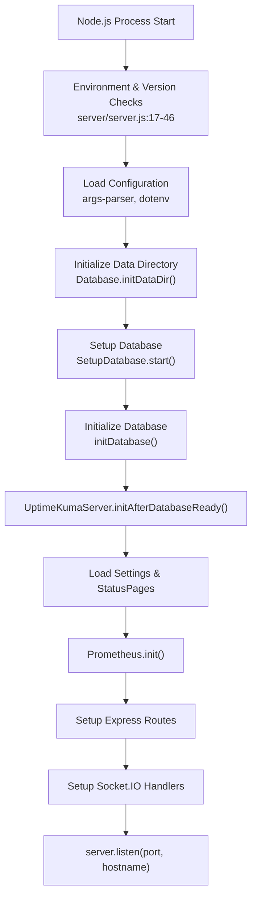
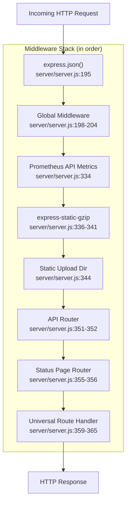
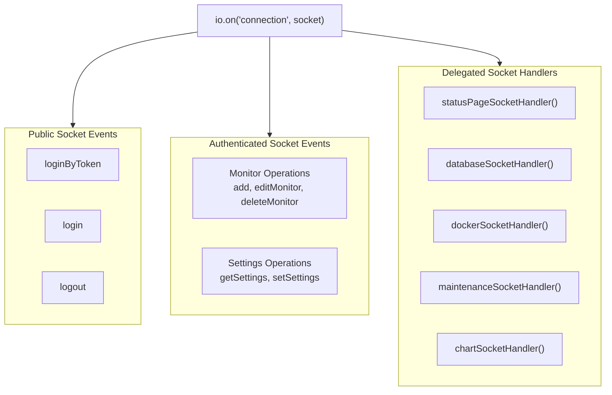

# Server Architecture

<details>
<summary>Relevant source files</summary>

The following files were used as context for generating this wiki page:

- [package-lock.json](package-lock.json)
- [package.json](package.json)
- [server/auth.js](server/auth.js)
- [server/database.js](server/database.js)
- [server/image-data-uri.js](server/image-data-uri.js)
- [server/jobs.js](server/jobs.js)
- [server/jobs/clear-old-data.js](server/jobs/clear-old-data.js)
- [server/jobs/incremental-vacuum.js](server/jobs/incremental-vacuum.js)
- [server/model/monitor.js](server/model/monitor.js)
- [server/prometheus.js](server/prometheus.js)
- [server/rate-limiter.js](server/rate-limiter.js)
- [server/server.js](server/server.js)
- [server/socket-handlers/api-key-socket-handler.js](server/socket-handlers/api-key-socket-handler.js)
- [server/socket-handlers/cloudflared-socket-handler.js](server/socket-handlers/cloudflared-socket-handler.js)
- [server/socket-handlers/database-socket-handler.js](server/socket-handlers/database-socket-handler.js)
- [server/socket-handlers/general-socket-handler.js](server/socket-handlers/general-socket-handler.js)
- [server/socket-handlers/proxy-socket-handler.js](server/socket-handlers/proxy-socket-handler.js)
- [server/uptime-kuma-server.js](server/uptime-kuma-server.js)
- [server/util-server.js](server/util-server.js)
- [src/components/settings/ReverseProxy.vue](src/components/settings/ReverseProxy.vue)
- [src/pages/EditMonitor.vue](src/pages/EditMonitor.vue)

</details>


This page details the Express.js-based server architecture of Uptime Kuma, including the main entry point at [server/server.js](), the `UptimeKumaServer` singleton class, middleware configuration, routing setup, and core backend initialization sequence. The server provides both HTTP/WebSocket endpoints for the frontend and manages all backend operations including monitoring, notifications, and data persistence.

Related pages: [Frontend Architecture](2.2), [Real-Time Communication](2.3), [Database Layer](2.4)

## Server Entry Point and Initialization

The server bootstraps from [server/server.js](), which serves as the main entry point. The initialization sequence performs critical checks and setup before starting the HTTP server and Socket.IO communication layer.

### Startup Sequence



**Initialization Steps:**

1.  **Node.js Version Validation** ([server/server.js:18-46]()): Checks Node.js version against requirements in [package.json:9-11]() and exits if using banned versions.
2.  **Environment Setup** ([server/server.js:15-68]()): Loads `.env` file via `dotenv`, sets `NODE_ENV`, and configures WebSocket origin checking parameters.
3.  **Data Directory Creation** ([server/server.js:211]()): Creates the `./data/` directory structure, including subdirectories for uploads and screenshots, via `Database.initDataDir()` ([server/database.js:135-162]()).
4.  **Database Selection** ([server/server.js:214-218]()): `SetupDatabase` checks for `db-config.json` and prepares the connection parameters.
5.  **Database Connection** ([server/server.js:221-226]()): Establishes the database connection using RedBean Node (`R`) and runs migrations.
6.  **Post-Database Init** ([server/server.js:229]()): `UptimeKumaServer.initAfterDatabaseReady()` loads existing monitors and maintenances into memory.
7.  **Route Registration** ([server/server.js:236-365]()): Sets up Express middleware, static file serving, and API routes.
8.  **Socket.IO Setup** ([server/server.js:367-368]()): Registers Socket.IO event handlers for real-time communication.
9.  **Server Start** ([server/server.js:1228-1258]()): Binds the HTTP/HTTPS server to the configured port and hostname.

**Sources:** [server/server.js:1-226](), [server/database.js:135-162](), [server/uptime-kuma-server.js:189-232]()

## Core Server Components

The server architecture centers on the `UptimeKumaServer` singleton instance which manages the Express application, HTTP/HTTPS server, and Socket.IO server.

### Component Overview

```mermaid
graph TB
    subgraph ServerJS["server/server.js"]
        server["const server = UptimeKumaServer.getInstance()"]
        io["const io = server.io"]
        app["const app = server.app"]
    end
    
    subgraph UKS["UptimeKumaServer Class"]
        constructor["constructor()"]
        appProperty["this.app: express()"]
        httpServer["this.httpServer: http.Server | https.Server"]
        ioProperty["this.io: socket.io Server"]
        monitorList["this.monitorList: {}"]
        maintenanceList["this.maintenanceList: {}"]
        jwtSecret["this.jwtSecret: string"]
        indexHTML["this.indexHTML: string"]
    end
    
    subgraph Express["Express Application"]
        middleware["Middleware Stack"]
        router["Route Handlers"]
        static["Static File Serving"]
    end
    
    subgraph SocketIO["Socket.IO Server"]
        socketHandlers["Event Handlers"]
        rooms["User Rooms"]
        auth["Authentication"]
    end
    
    subgraph DB_Layer["Database Layer"]
        R_ORM["R (RedBean Node)"]
        Knex_Builder["Knex Query Builder"]
    end
    
    server --> UKS
    io --> ioProperty
    app --> appProperty
    
    constructor --> appProperty
    constructor --> httpServer
    constructor --> ioProperty
    
    appProperty --> Express
    httpServer --> Express
    ioProperty --> SocketIO
    
    Express --> DB_Layer
    SocketIO --> DB_Layer
```

**Sources:** [server/server.js:95-98](), [server/uptime-kuma-server.js:22-73](), [server/uptime-kuma-server.js:78-183]()

## Express Application Setup

The Express application is configured with middleware and routes in [server/server.js]() after the `UptimeKumaServer` instance is created.

### Middleware Stack



**Middleware Components:**

| Middleware | Purpose | Source |
| :--- | :--- | :--- |
| `express.json()` | Parse JSON request bodies | [server/server.js:195]() |
| Global Middleware | Set security headers (`X-Frame-Options`, remove `X-Powered-By`) | [server/server.js:198-204]() |
| `prometheusAPIMetrics()` | Expose Prometheus metrics at `/metrics` with `apiAuth` | [server/server.js:334]() |
| `expressStaticGzip()` | Serve compressed frontend assets from `dist/` | [server/server.js:336-341]() |
| Static Upload | Serve uploaded files from `./data/upload/` | [server/server.js:344]() |
| API Router | Handle API endpoints at `/api/*` | [server/server.js:351-352]() |
| Status Page Router | Handle status page requests at `/status/*` | [server/server.js:355-356]() |
| Universal Handler | Catch-all to serve `index.html` for frontend routing | [server/server.js:359-365]() |

**Sources:** [server/server.js:195-365](), [server/uptime-kuma-server.js:86-110]()

### Route Structure

The server defines routes across multiple modules:

*   **Entry Page Logic** ([server/server.js:243-265]()): Checks if the incoming hostname matches `StatusPage.domainMappingList`. If a match is found, it redirects to the status page; otherwise, it redirects to the configured entry page (defaulting to `/dashboard`).
*   **Robots.txt** ([server/server.js:321-328]()): Serves a dynamic `robots.txt` based on the `allowIndexing` setting.
*   **API Routes**: Handled by [server/routers/api-router.js](), including push monitors, badges, and heartbeat data.
*   **Status Page Routes**: Handled by [server/routers/status-page-router.js](), serving the public-facing status pages.

**Sources:** [server/server.js:243-365](), [server/uptime-kuma-server.js:41-44]()

## UptimeKumaServer Class

The `UptimeKumaServer` class ([server/uptime-kuma-server.js:22-73]()) implements the singleton pattern to coordinate all server operations. It is instantiated once and accessed via `UptimeKumaServer.getInstance()`.

### Class Properties and Methods

**Core Properties:**

```javascript
// From server/uptime-kuma-server.js
class UptimeKumaServer {
    static instance = null;           // Singleton instance
    monitorList = {};                 // Active monitors by ID [server/uptime-kuma-server.js:33]
    maintenanceList = {};             // Active maintenances by ID [server/uptime-kuma-server.js:39]
    entryPage = "dashboard";          // Default entry page [server/uptime-kuma-server.js:41]
    app = undefined;                  // Express application [server/uptime-kuma-server.js:42]
    httpServer = undefined;           // HTTP/HTTPS server [server/uptime-kuma-server.js:43]
    io = undefined;                   // Socket.IO server [server/uptime-kuma-server.js:44]
    indexHTML = "";                   // Cached index.html [server/uptime-kuma-server.js:50]
    static monitorTypeList = {};      // Registered monitor types [server/uptime-kuma-server.js:55]
    jwtSecret = null;                 // JWT signing secret [server/uptime-kuma-server.js:61]
}
```

**Key Methods:**

| Method | Purpose | Returns |
| :--- | :--- | :--- |
| `getInstance()` | Get or create singleton instance | `UptimeKumaServer` |
| `constructor()` | Initialize Express, HTTP server, Socket.IO, and monitor types | `void` |
| `initAfterDatabaseReady()` | Load monitors and maintenances from database | `Promise<void>` |
| `getUserAgent()` | Get Uptime-Kuma user agent string for axios | `string` |

**Sources:** [server/uptime-kuma-server.js:22-135](), [server/uptime-kuma-server.js:189-232]()

### Constructor and Server Creation

The constructor ([server/uptime-kuma-server.js:78-183]()) performs critical initialization:

1.  **Axios Configuration**: Sets a default `User-Agent` ([server/uptime-kuma-server.js:80]()) and a 5-minute timeout ([server/uptime-kuma-server.js:83]()).
2.  **Server Setup**: Creates an Express instance and wraps it in an HTTP or HTTPS server based on the `isSSL` configuration ([server/uptime-kuma-server.js:87-100]()).
3.  **Frontend Caching**: Reads and caches `dist/index.html` ([server/uptime-kuma-server.js:103]()).
4.  **Monitor Type Registration**: Populates `UptimeKumaServer.monitorTypeList` with instances of various monitor types such as `real-browser`, `dns`, `mqtt`, and `globalping` ([server/uptime-kuma-server.js:113-134]()).
5.  **Socket.IO Configuration**: Initializes the Socket.IO server with CORS settings for development and a custom `allowRequest` callback for origin validation ([server/uptime-kuma-server.js:144-182]()).

**Sources:** [server/uptime-kuma-server.js:78-183](), [server/config.js:15-16]()

## Socket.IO Event Handlers

Socket.IO event handlers are registered in [server/server.js:367-1226](). The server delegates specific logic to specialized handlers.

### Socket Handler Organization



**Event Handler Delegation:**

*   **`statusPageSocketHandler`**: Manages status page CRUD and mapping ([server/server.js:173]()).
*   **`dockerSocketHandler`**: Manages Docker host configurations ([server/server.js:184]()).
*   **`maintenanceSocketHandler`**: Handles maintenance window scheduling ([server/server.js:185]()).
*   **`chartSocketHandler`**: Retrieves heartbeat data for frontend visualizations ([server/server.js:193]()).

**Sources:** [server/server.js:173-193](), [server/server.js:367-1226]()

### Authentication Flow

Socket authentication uses JWT tokens and supports TOTP-based 2FA:

1.  **`login`** ([server/server.js:429-507]()): Validates username and password via `auth.login` ([server/auth.js:15-34]()). If 2FA is enabled, it requires a TOTP token verified via `notp` ([server/server.js:92]()).
2.  **`loginByToken`** ([server/server.js:380-427]()): Allows re-authentication using a stored JWT. It verifies the token against `jwtSecret` and refreshes the session.
3.  **`afterLogin`**: A helper function called after successful authentication to join the user to their private room and emit initial data (monitors, notifications, settings).

**Sources:** [server/server.js:380-507](), [server/util-server.js:42-62](), [server/auth.js:15-34]()

## Monitor Management System

The monitor management system is built around the `Monitor` class ([server/model/monitor.js]()), which extends `BeanModel` from RedBean Node.

### Monitor Lifecycle

*   **Initialization**: When the server starts, `initAfterDatabaseReady()` ([server/uptime-kuma-server.js:189]()) loads all monitors from the database.
*   **Execution**: Active monitors run a `beat()` loop. The frequency is determined by the `interval` property (minimum 20 seconds).
*   **Heartbeat Generation**: Each check generates a `heartbeat` bean containing status (UP, DOWN, PENDING, MAINTENANCE) and response time.
*   **Status Flip**: The `flipStatus` utility is used to determine if a monitor has changed state, triggering notifications if necessary.

**Monitor Types Table (Partial):**

| Type | Description | Implementation Class |
| :--- | :--- | :--- |
| `http` | Standard HTTP(s) checks | `Monitor` (internal logic) |
| `real-browser` | Playwright-based browser engine check | `RealBrowserMonitorType` |
| `dns` | DNS record resolution | `DnsMonitorType` |
| `docker` | Container status via Docker API | `DockerHost` integration |
| `push` | Passive monitor receiving HTTP pings | `Push` logic in `api-router` |

**Sources:** [server/model/monitor.js:76-207](), [server/uptime-kuma-server.js:113-135](), [server/uptime-kuma-server.js:189-232]()
