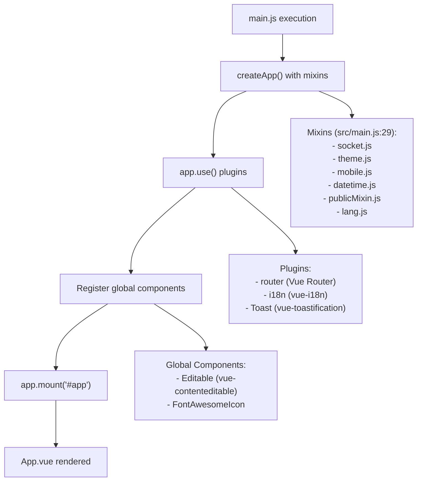
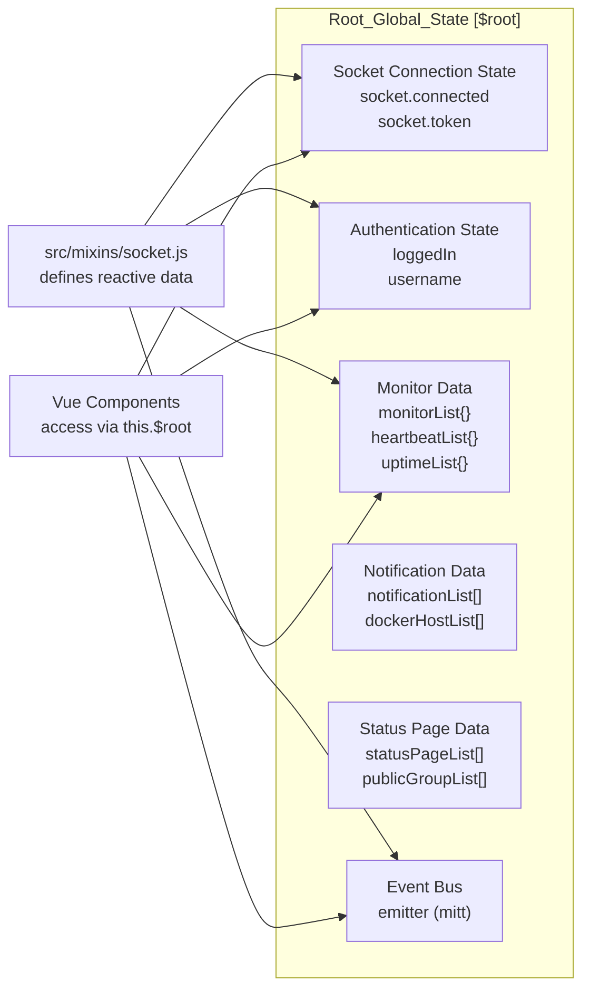
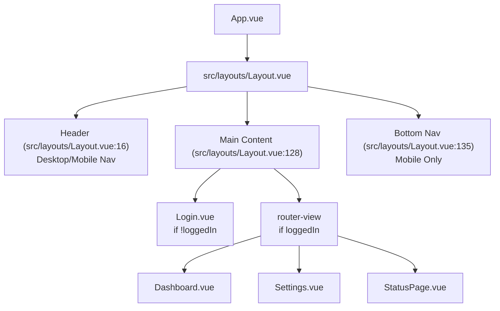
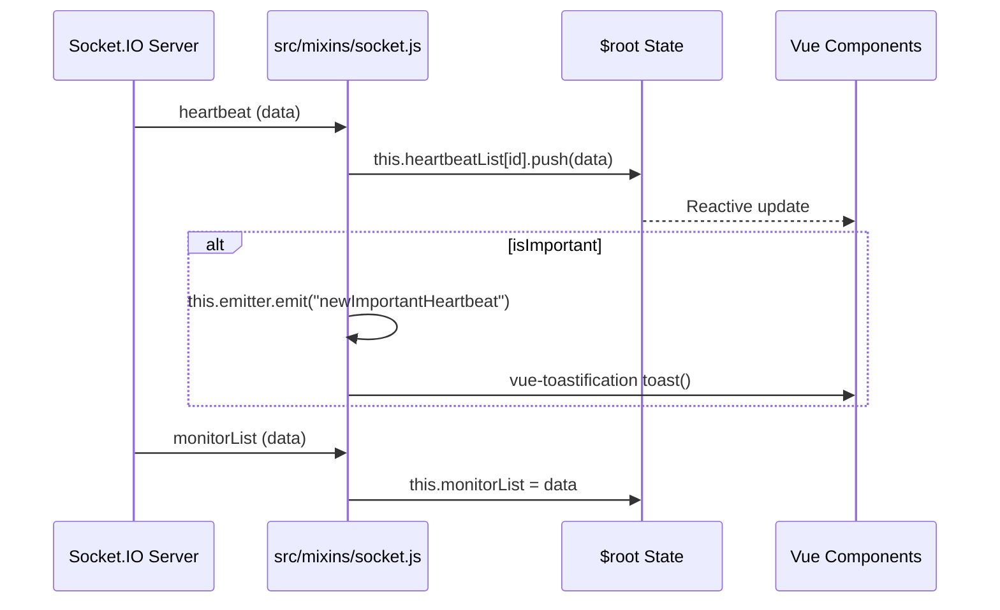

# Frontend Architecture

<details>
<summary>Relevant source files</summary>

The following files were used as context for generating this wiki page:

- [config/vite.config.js](config/vite.config.js)
- [index.html](index.html)
- [public/apple-touch-icon-precomposed.png](public/apple-touch-icon-precomposed.png)
- [public/apple-touch-icon.png](public/apple-touch-icon.png)
- [public/favicon.ico](public/favicon.ico)
- [public/icon-192x192.png](public/icon-192x192.png)
- [public/icon-512x512.png](public/icon-512x512.png)
- [public/manifest.json](public/manifest.json)
- [server/notification-providers/Webpush.js](server/notification-providers/Webpush.js)
- [src/components/PublicGroupList.vue](src/components/PublicGroupList.vue)
- [src/components/notifications/Webpush.vue](src/components/notifications/Webpush.vue)
- [src/icon.js](src/icon.js)
- [src/layouts/Layout.vue](src/layouts/Layout.vue)
- [src/main.js](src/main.js)
- [src/mixins/socket.js](src/mixins/socket.js)
- [src/pages/Settings.vue](src/pages/Settings.vue)
- [src/router.js](src/router.js)
- [src/util-frontend.js](src/util-frontend.js)
- [src/util.js](src/util.js)
- [src/util.ts](src/util.ts)
- [tsconfig.json](tsconfig.json)

</details>


This document describes the Vue.js single-page application (SPA) that powers the Uptime Kuma web interface. It covers the application structure, component hierarchy, global state management patterns, routing configuration, and real-time communication mechanisms.

For information about the Socket.IO real-time communication protocol, see [Real-Time Communication](2.3). For backend server architecture, see [Server Architecture](2.1).

---

## Technology Stack

Uptime Kuma's frontend is built using the following core technologies:

| Technology | Purpose | Version/Details |
|------------|---------|-----------------|
| **Vue.js 3** | UI framework | Primarily using Options API with mixins [src/main.js:28-36]() |
| **Vue Router** | Client-side routing | Web History mode [src/router.js:1]() |
| **Socket.IO Client** | Real-time communication | Bidirectional state sync [src/mixins/socket.js:120]() |
| **Bootstrap 5** | CSS framework | Responsive layouts and components [src/main.js:1]() |
| **Font Awesome** | Icon library | SVG icon system [src/icon.js:1-106]() |
| **vue-toastification** | Toast notifications | Configurable timeouts [src/util-frontend.js:134-148]() |
| **dayjs** | Time manipulation | Extended with UTC and Timezone [src/main.js:19-26]() |

**Sources**: [src/main.js:1-45](), [src/icon.js:1-106](), [src/router.js:1-190](), [src/util-frontend.js:134-148]()

---

## Application Bootstrap and Entry Point

### Main Application Initialization

The application entry point is located at [src/main.js:1-60](), which configures and mounts the Vue application. It integrates several mixins that provide global functionality across the entire component tree.

Title: Frontend Bootstrap Flow


**Sources**: [src/main.js:28-45](), [src/mixins/socket.js:74-76]()

### Mixin Architecture

The application uses Vue mixins to inject shared functionality into the root component. These mixins add reactive data properties and methods to `$root`, effectively serving as the application's global state and service layer.

| Mixin | File | Primary Responsibilities |
|-------|------|-------------------------|
| `socket` | [src/mixins/socket.js]() | Socket.IO connection, global state management, API methods |
| `theme` | `src/mixins/theme.js` | Dark/light theme detection and switching |
| `mobile` | `src/mixins/mobile.js` | Mobile device detection via `$root.isMobile` |
| `datetime` | `src/mixins/datetime.js` | Date formatting utilities and dayjs extensions |
| `publicMixin` | `src/mixins/public.js` | Utilities for public status pages and group lists |
| `lang` | `src/mixins/lang.js` | Language/locale utilities and RTL support |

**Sources**: [src/main.js:29](), [src/mixins/socket.js:29-72]()

---

## Global State Management ($root Pattern)

Uptime Kuma uses a **centralized global state pattern** via `$root` instead of Vuex or Pinia. All reactive data is stored in the root component (initialized via mixins) and accessed by child components through `this.$root`.

### State Structure

Title: Global State Architecture ($root)


**Sources**: [src/mixins/socket.js:30-72]()

### Key Global State Properties

From [src/mixins/socket.js:30-72](), the `$root` state maintains high-level application data:

```javascript
data() {
    return {
        socket: {
            token: null,
            connected: false,
            initedSocketIO: false,
        },
        loggedIn: false,
        monitorList: {},           // Map of monitor objects indexed by ID
        heartbeatList: {},         // Arrays of heartbeats per monitor ID
        notificationList: [],      // Configured notification providers
        statusPageList: [],        // Available public status pages
        emitter: mitt(),           // Global event bus for cross-component signaling
    };
}
```

**Sources**: [src/mixins/socket.js:33-70]()

---

## Component Hierarchy and Layout

### Layout Structure

The main application shell is [src/layouts/Layout.vue](), which handles the conditional rendering of the header, navigation, and the primary `router-view`.

Title: Main Application Layout Hierarchy


**Sources**: [src/layouts/Layout.vue:1-155](), [src/main.js:35]()

### Settings Organization

The settings interface uses a nested routing pattern. [src/pages/Settings.vue:20-50]() manages a sidebar menu (`settings-menu`) and a nested `router-view` for specific settings categories.

- **Sub-menus**: Categories like `general`, `appearance`, `notifications`, `security`, etc. [src/pages/Settings.vue:86-125]()
- **Responsive Behavior**: On mobile, the menu and content are toggled based on the `currentPage` computed property [src/pages/Settings.vue:78-84]().
- **Data Loading**: Settings are fetched from the server via the `getSettings` socket event [src/pages/Settings.vue:156]().

**Sources**: [src/pages/Settings.vue:20-50](), [src/pages/Settings.vue:86-125](), [src/pages/Settings.vue:156]()

---

## Routing System

Routing is managed by `vue-router` in [src/router.js](). It defines a nested structure where the main `Layout` wraps most authenticated routes.

| Route Path | Component | Description |
|------------|-----------|-------------|
| `/dashboard` | `DashboardHome` | Overview of all monitors [src/router.js:53]() |
| `/dashboard/:id` | `Details` | Detailed status and charts for a monitor [src/router.js:62]() |
| `/add` | `EditMonitor` | Monitor creation form [src/router.js:74]() |
| `/settings` | `Settings` | Application settings container [src/router.js:87]() |
| `/status/:slug` | `StatusPage` | Public-facing status page [src/router.js:185]() |

**Sources**: [src/router.js:35-188]()

---

## Real-Time Data Flow

### Socket.IO Integration

The `socket` mixin initializes the connection in its `created` hook [src/mixins/socket.js:74-76](). It listens for various events from the server and updates the `$root` state accordingly.

Title: Real-Time Data Flow (Server to UI)


**Sources**: [src/mixins/socket.js:120-210](), [src/mixins/socket.js:75-76]()

### Public Group List Management

The `PublicGroupList.vue` component handles the display and ordering of monitors on status pages. It uses `vuedraggable` to allow administrators to reorder monitors and groups [src/components/PublicGroupList.vue:3-47]().

- **State Sync**: Uses `$root.publicGroupList` for reactive updates [src/components/PublicGroupList.vue:3]().
- **Status Display**: Renders monitor status using the `Status` or `Uptime` components based on configuration [src/components/PublicGroupList.vue:73-77]().

**Sources**: [src/components/PublicGroupList.vue:1-125]()

---

## Internationalization and Styling

### Internationalization (i18n)

The application uses `vue-i18n` for multi-language support. The current locale is detected and set on the HTML element for accessibility and RTL support.

- **Locale Management**: `setPageLocale()` sets the `lang` and `dir` attributes on the `<html>` element [src/util-frontend.js:67-71]().
- **Directionality**: Supports both LTR and RTL layouts [src/util-frontend.js:70]().

**Sources**: [src/util-frontend.js:67-71](), [src/main.js:39]()

### Shared Utilities

Uptime Kuma shares constants and utility functions between the frontend and backend via [src/util.ts]().

- **Status Constants**: `UP` (1), `DOWN` (0), `PENDING` (2), `MAINTENANCE` (3) [src/util.ts:32-35]().
- **Formatting**: Helpers for date/time formatting and status flipping [src/util.ts:170-203]().

**Sources**: [src/util.ts:32-203](), [src/util.js:1-150]()
