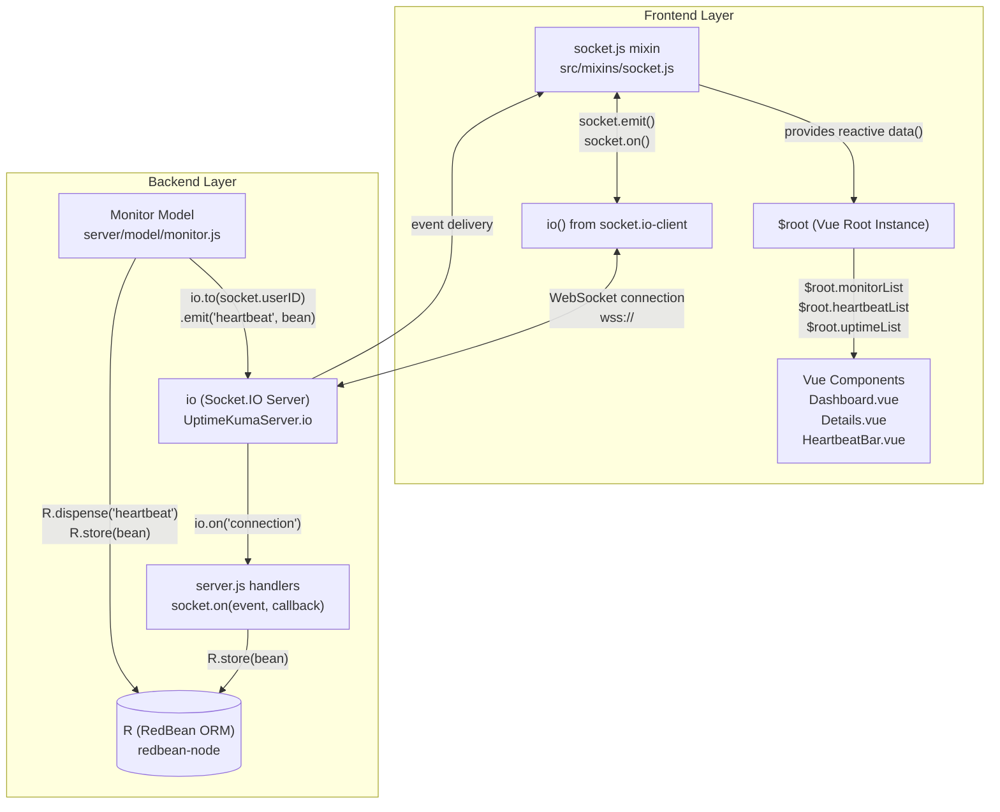
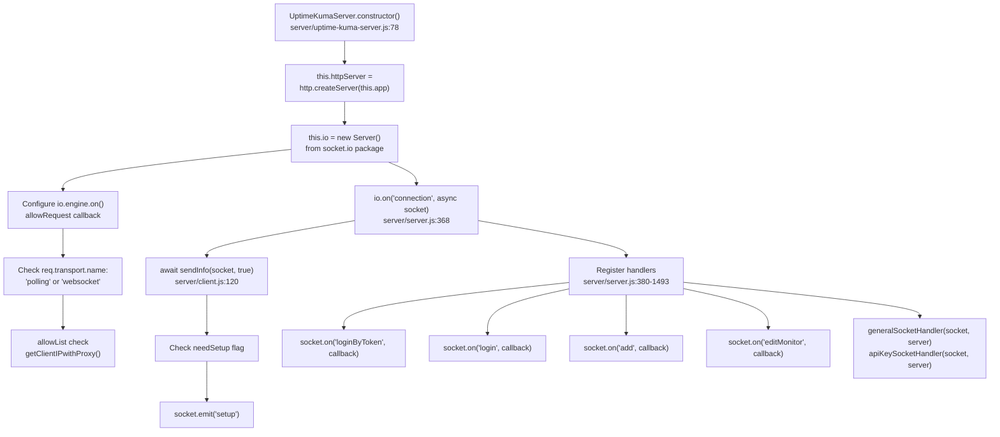
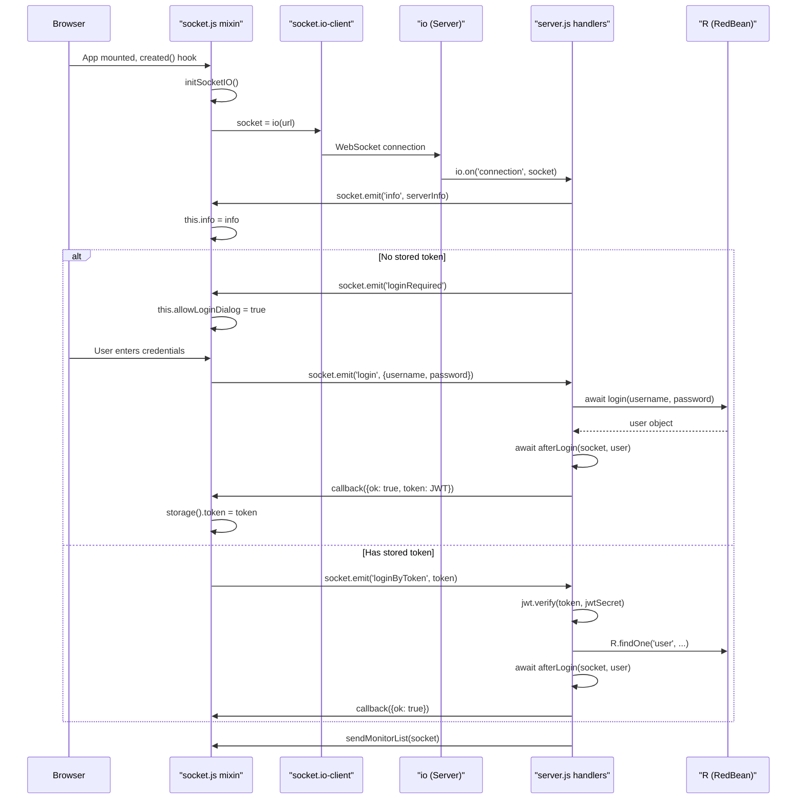
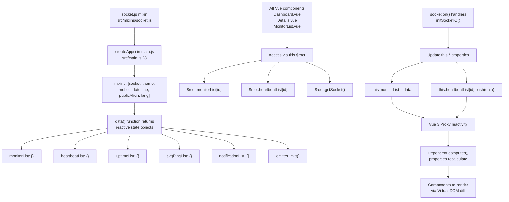

# Real-Time Communication

Relevant source files

The following files were used as context for generating this wiki page:

- [package-lock.json](package-lock.json)
- [package.json](package.json)
- [server/database.js](server/database.js)
- [server/model/monitor.js](server/model/monitor.js)
- [server/server.js](server/server.js)
- [server/socket-handlers/cloudflared-socket-handler.js](server/socket-handlers/cloudflared-socket-handler.js)
- [server/socket-handlers/database-socket-handler.js](server/socket-handlers/database-socket-handler.js)
- [server/socket-handlers/general-socket-handler.js](server/socket-handlers/general-socket-handler.js)
- [server/socket-handlers/proxy-socket-handler.js](server/socket-handlers/proxy-socket-handler.js)
- [server/uptime-kuma-server.js](server/uptime-kuma-server.js)
- [server/util-server.js](server/util-server.js)
- [src/components/PublicGroupList.vue](src/components/PublicGroupList.vue)
- [src/components/settings/ReverseProxy.vue](src/components/settings/ReverseProxy.vue)
- [src/icon.js](src/icon.js)
- [src/layouts/Layout.vue](src/layouts/Layout.vue)
- [src/main.js](src/main.js)
- [src/mixins/socket.js](src/mixins/socket.js)
- [src/pages/EditMonitor.vue](src/pages/EditMonitor.vue)
- [src/pages/Settings.vue](src/pages/Settings.vue)
- [src/router.js](src/router.js)

This page describes the Socket.IO-based real-time communication architecture in Uptime Kuma, including the socket mixin pattern, event-driven state management, and bidirectional data flow between frontend and backend. For related topics, see [Server Architecture](2.1) and [Frontend Architecture](2.2).

## Overview

Uptime Kuma uses Socket.IO as its primary communication layer, establishing a persistent WebSocket connection between the Vue 3 frontend and Node.js backend. The architecture implements a global socket mixin pattern where all state is managed in the Vue root instance (`$root`) and automatically synchronized via Socket.IO events.

**Key architectural patterns:**
- **Global Socket Mixin**: A single `socket.js` mixin applied to all Vue components provides centralized state management. [src/mixins/socket.js:29-71]()
- **Event-Driven State**: Server events (`heartbeat`, `monitorList`, etc.) automatically update reactive state objects. [src/mixins/socket.js:147-214]()
- **Room-Based Targeting**: Socket.IO rooms ensure users only receive data for their own monitors. [server/util-server.js:1038]()
- **Persistent Connection**: A single WebSocket connection handles all real-time updates, eliminating polling. [src/mixins/socket.js:120]()

Sources:
- [src/mixins/socket.js:29-71]()
- [server/uptime-kuma-server.js:144-180]()
- [src/main.js:28-43]()

**Diagram: Socket.IO Communication Architecture**

Sources:
- [src/mixins/socket.js:29-71]()
- [server/uptime-kuma-server.js:144-145]()
- [server/server.js:97]()
- [server/model/monitor.js:76-108]()

## Socket.IO Server Initialization

The Socket.IO server is initialized in the `UptimeKumaServer` singleton class, which manages the WebSocket connection lifecycle and event routing. [server/uptime-kuma-server.js:144]()

**Diagram: Socket.IO Server Setup**

Sources:
- [server/uptime-kuma-server.js:85-100]()
- [server/uptime-kuma-server.js:144-180]()
- [server/server.js:368-395]()

### Connection Lifecycle

**Diagram: Socket Connection and Authentication Flow**

Sources:
- [src/mixins/socket.js:85-121]()
- [src/mixins/socket.js:137-145]()
- [server/server.js:368-395]()
- [server/server.js:397-478]()

### Room-Based Event Targeting

Socket.IO rooms ensure that users only receive events for monitors they have access to. When a user authenticates, they join a room identified by their `userID`. [server/util-server.js:1038]()

**Key room operations:**

| Operation | Code Symbol | Location | Purpose |
|-----------|-------------|----------|---------|
| Join room after login | `socket.join(socket.userID)` | [server/util-server.js:1038]() | User joins their personal room identified by userID |
| Emit to specific user | `io.to(socket.userID).emit(event, data)` | [server/client.js:17-30]() | Send data only to users in specified room |
| Leave room on logout | `socket.leave(socket.userID)` | [server/server.js:515]() | User leaves their personal room |

Sources:
- [server/util-server.js:1021-1041]()
- [server/server.js:481-493]()

## Socket Mixin Pattern

Uptime Kuma implements a global mixin pattern where all Vue components share state through a single `socket.js` mixin that maintains reactive data in the root Vue instance. [src/main.js:36]()

**Diagram: Socket Mixin State Management**

Sources:
- [src/mixins/socket.js:29-71]()
- [src/main.js:28-43]()

### Global State Structure

The socket mixin defines reactive state objects accessible via `$root`: [src/mixins/socket.js:29-71]()

| State Object | Type | Updated By Socket Event | Defined At |
|--------------|------|------------------------|------------|
| `monitorList` | `Object` | `monitorList`, `updateMonitorIntoList`, `deleteMonitorFromList` | [src/mixins/socket.js:44]() |
| `heartbeatList` | `Object` | `heartbeat`, `heartbeatList` | [src/mixins/socket.js:48]() |
| `uptimeList` | `Object` | `uptime` | [src/mixins/socket.js:50]() |
| `avgPingList` | `Object` | `avgPing` | [src/mixins/socket.js:49]() |
| `notificationList` | `Array` | `notificationList` | [src/mixins/socket.js:53]() |
| `maintenanceList` | `Object` | `maintenanceList` | [src/mixins/socket.js:46]() |

Sources:
- [src/mixins/socket.js:40-53]()

## Bidirectional Event Flow

Socket.IO events provide bidirectional communication. All event handlers are registered in `socket.js` mixin's `initSocketIO()` method. [src/mixins/socket.js:122-266]()

### Server-to-Client Events

The server emits events to update client state.

| Event Name | Handler Location | Purpose |
|------------|------------------|---------|
| `info` | [src/mixins/socket.js:122]() | Server metadata and version |
| `monitorList` | [src/mixins/socket.js:147]() | Full monitor list on initial load |
| `heartbeat` | [src/mixins/socket.js:204]() | Real-time heartbeat update |
| `statusPageList` | [src/mixins/socket.js:181]() | List of configured status pages |

Sources:
- [src/mixins/socket.js:122-214]()

### Client-to-Server Events

Components emit events to the server using `this.$root.getSocket().emit()`.

| Event Name | Parameters | Server Handler | Purpose |
|------------|------------|----------------|---------|
| `getSettings` | `callback` | [server/server.js:1487]() | Retrieve application settings |
| `setSettings` | `settings, password, callback` | [server/server.js:1493]() | Update application settings |
| `add` | `monitor` | [server/server.js:713]() | Create a new monitor |
| `editMonitor` | `monitor` | [server/server.js:757]() | Update an existing monitor |

Sources:
- [server/server.js:713-1493]()
- [src/pages/Settings.vue:156]()

## WebSocket Connection Management

The `socket.io-client` library handles connection lifecycle including reconnection logic. [src/mixins/socket.js:120]()

**Connection State Tracking:**

| Property | Type | Purpose |
|----------|------|---------|
| `socket.connected` | `boolean` | WebSocket connection status |
| `socket.firstConnect` | `boolean` | First connection not yet made |
| `socket.connectCount` | `number` | Total connection attempts |

**Reconnection UI:**
The Layout component displays connection status when the socket is lost. [src/layouts/Layout.vue:3-13]()

Sources:
- [src/mixins/socket.js:33-39]()
- [src/layouts/Layout.vue:3-13]()
