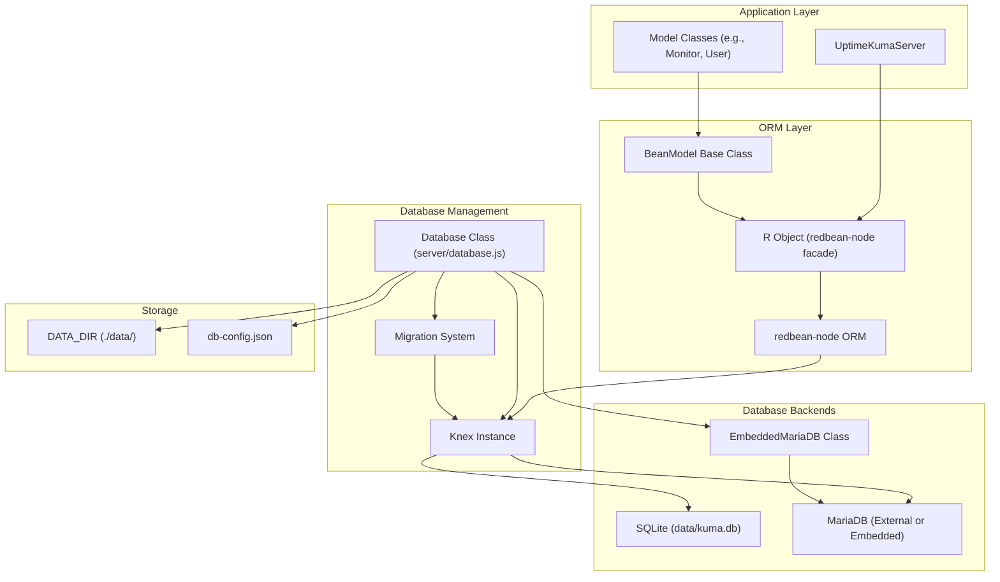
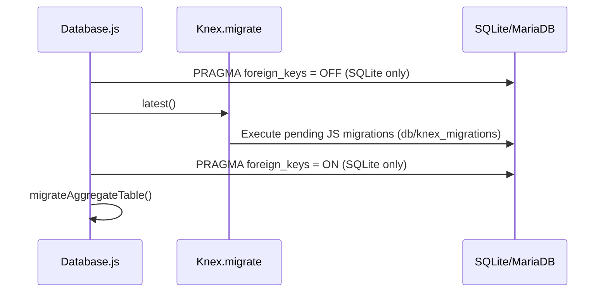

# Database Layer

<details>
<summary>Relevant source files</summary>

The following files were used as context for generating this wiki page:

- [db/knex_init_db.js](db/knex_init_db.js)
- [db/knex_migrations/2025-02-17-2142-generalize-analytics.js](db/knex_migrations/2025-02-17-2142-generalize-analytics.js)
- [db/knex_migrations/2026-06-19-1411-add-rybbit-analytics-type.js](db/knex_migrations/2026-06-19-1411-add-rybbit-analytics-type.js)
- [db/old_migrations/patch-fix-kafka-producer-booleans.sql](db/old_migrations/patch-fix-kafka-producer-booleans.sql)
- [db/old_migrations/patch-monitor-tls-info-add-fk.sql](db/old_migrations/patch-monitor-tls-info-add-fk.sql)
- [docker/builder-go.dockerfile](docker/builder-go.dockerfile)
- [docker/debian-base.dockerfile](docker/debian-base.dockerfile)
- [docker/dockerfile](docker/dockerfile)
- [extra/download-apprise.mjs](extra/download-apprise.mjs)
- [package-lock.json](package-lock.json)
- [package.json](package.json)
- [server/analytics/analytics.js](server/analytics/analytics.js)
- [server/analytics/google-analytics.js](server/analytics/google-analytics.js)
- [server/analytics/matomo-analytics.js](server/analytics/matomo-analytics.js)
- [server/analytics/plausible-analytics.js](server/analytics/plausible-analytics.js)
- [server/analytics/rybbit-analytics.js](server/analytics/rybbit-analytics.js)
- [server/analytics/umami-analytics.js](server/analytics/umami-analytics.js)
- [server/database.js](server/database.js)
- [server/embedded-mariadb.js](server/embedded-mariadb.js)
- [server/model/monitor.js](server/model/monitor.js)
- [server/server.js](server/server.js)
- [server/setup-database.js](server/setup-database.js)
- [server/uptime-kuma-server.js](server/uptime-kuma-server.js)
- [server/util-server.js](server/util-server.js)
- [server/utils/array-with-key.js](server/utils/array-with-key.js)
- [server/utils/limit-queue.js](server/utils/limit-queue.js)
- [server/utils/simple-migration-server.js](server/utils/simple-migration-server.js)
- [src/pages/EditMonitor.vue](src/pages/EditMonitor.vue)
- [src/pages/SetupDatabase.vue](src/pages/SetupDatabase.vue)
- [test/backend-test/test-status-page.js](test/backend-test/test-status-page.js)
- [test/e2e/specs/status-page.spec.js](test/e2e/specs/status-page.spec.js)

</details>


The Database Layer provides data persistence and management for Uptime Kuma. It handles database initialization, connection management, schema migrations, and data access through an ORM abstraction. This layer supports both SQLite (default) and MariaDB backends with a unified interface.

---

## Database Architecture Overview

The following diagram illustrates the relationship between the application models, the RedBean ORM facade, and the underlying database backends.

**Code Entity Mapping**


**Sources:** [server/database.js:20-60](), [server/uptime-kuma-server.js:22-135](), [server/server.js:95-125](), [package.json:74-80]()

---

## Supported Database Types

Uptime Kuma supports three database backend configurations defined in `db-config.json`.

| Database Type | Identifier | Use Case |
|--------------|------------|----------|
| SQLite | `"sqlite"` | Default single-file database. |
| MariaDB (External) | `"mariadb"` | Production deployments using an external server. |
| MariaDB (Embedded) | `"embedded-mariadb"` | Docker deployments with a built-in MariaDB instance. |

### Database Initialization Flow

The database type is determined during the setup phase by checking environment variables or existing configuration files. If no configuration is found, the `SetupDatabase` class triggers a standalone Express app to collect database credentials.

```mermaid
graph TD
    [Start] --> CheckEnv{"UPTIME_KUMA_DB_TYPE set?"}
    CheckEnv -->|Yes| UseEnv["Override with Env Vars"]
    CheckEnv -->|No| CheckConfig{"db-config.json exists?"}
    
    CheckConfig -->|Yes| ReadConfig["Read db-config.json"]
    CheckConfig -->|No| CheckKumaDB{"kuma.db exists?"}
    
    CheckKumaDB -->|Yes| Mig1X["Generate SQLite config (1.X Migration)"]
    CheckKumaDB -->|No| NeedSetup["SetupDatabase Class: Show UI"]
    
    ReadConfig --> Connect["Database.connect()"]
    UseEnv --> Connect
    Mig1X --> Connect
```

**Sources:** [server/setup-database.js:43-112](), [server/database.js:170-184](), [server/server.js:191-192]()

---

## RedBean-Node ORM

Uptime Kuma uses **RedBean-Node** as its Object-Relational Mapping layer. It allows for a "schema-less" development experience while maintaining a structured database.

### The R Object
The global `R` object is the primary entry point for database operations. It is initialized in `server/database.js` using a Knex instance.

**Key Operations:**
*   **dispense**: `R.dispense("monitor")` creates a new record object [server/database.js:46]().
*   **store**: `await R.store(bean)` persists changes to the database [server/database.js:51]().
*   **findOne**: `await R.findOne("setting", "key = ?", [key])` retrieves a single record [server/util-server.js:43]().
*   **find**: `await R.find("stat_minutely", "monitor_id = ?", [id])` retrieves multiple records [server/uptime-calculator.js:129]().

### BeanModel
Models such as `Monitor` and `User` extend the `BeanModel` class, which allows them to wrap database records with business logic.

**Sources:** [server/model/monitor.js:76-108](), [server/database.js:3-15](), [package.json:80-80]()

---

## Migration System

Uptime Kuma uses a dual-stage migration system to handle schema updates.

### 1. Legacy SQL Patches (Deprecated)
Early versions used raw SQL files for migrations. These are still tracked in `Database.patchList` for compatibility but are largely superseded by Knex. The last file converted to a Knex migration was `patch-monitor-tls-info-add-fk.sql`.
**Sources:** [server/database.js:71-116]()

### 2. Knex Migrations
Modern migrations are written as JavaScript files in `db/knex_migrations/`. These use the Knex schema builder to ensure cross-database compatibility (SQLite and MariaDB).

**Migration Execution Logic:**


**Sources:** [server/database.js:401-438](), [server/database.js:128]()

---

## Embedded MariaDB

In Docker environments, Uptime Kuma can manage its own MariaDB instance. This is enabled via the `UPTIME_KUMA_ENABLE_EMBEDDED_MARIADB=1` environment variable. The `EmbeddedMariaDB` class handles the lifecycle of the MariaDB process, including initialization of the data directory and starting the daemon.

**Sources:** [server/embedded-mariadb.js:10-25](), [docker/debian-base.dockerfile:72-78](), [server/server.js:191-191]()

---

## Data Models and Aggregation

### Aggregate Tables
To improve performance for charts and statistics, Uptime Kuma aggregates heartbeat data into three specialized tables:
*   `stat_minutely`: Recent 24-hour data [server/uptime-calculator.js:34]().
*   `stat_hourly`: Recent 30-day data [server/uptime-calculator.js:41]().
*   `stat_daily`: 1-year history [server/uptime-calculator.js:47]().

### UptimeCalculator
The `UptimeCalculator` class manages the lifecycle of these statistics, loading them into a `LimitQueue` for fast access and updating them whenever a new heartbeat is recorded.

**Sources:** [server/uptime-calculator.js:10-65](), [server/uptime-calculator.js:123-203]()

---

## Data Directory Structure

The `Database` class initializes several subdirectories within the data folder (defaulting to `./data/`).

| Directory | Code Reference | Purpose |
|-----------|----------------|---------|
| `upload/` | `Database.uploadDir` | Stores user-uploaded assets like status page logos. |
| `screenshots/` | `Database.screenshotDir` | Stores screenshots generated by "Real Browser" monitors. |
| `docker-tls/` | `Database.dockerTLSDir` | Stores certificates for connecting to remote Docker hosts. |

**Sources:** [server/database.js:135-162]()

---

## Database Connection Management

### SQLite Optimization
For SQLite, the system applies several `PRAGMA` settings to handle high-frequency heartbeat writes:
*   `journal_mode = WAL`: Enables Write-Ahead Logging [server/database.js:364]().
*   `synchronous = NORMAL`: Balances data safety with write speed [server/database.js:365]().

### MariaDB Connection
MariaDB connections utilize the `mysql2` driver. The system handles database creation automatically if the specified database does not exist in the configuration. It also supports SSL connections and CA certificate verification for remote MariaDB instances.

**Sources:** [server/database.js:244-292](), [server/database.js:354-376](), [server/setup-database.js:108-110]()
