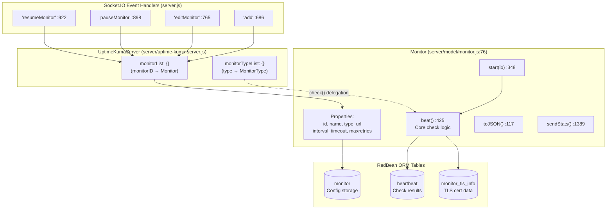
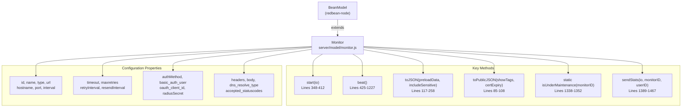
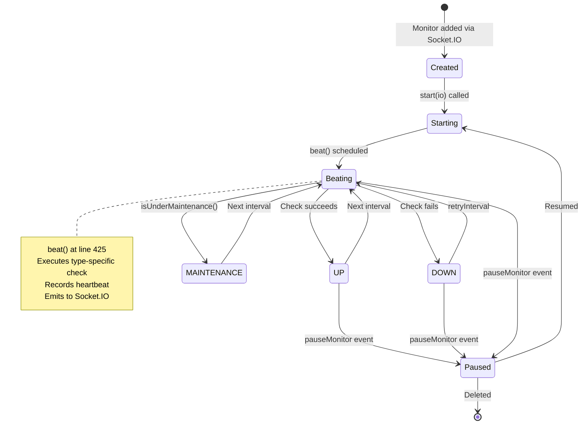
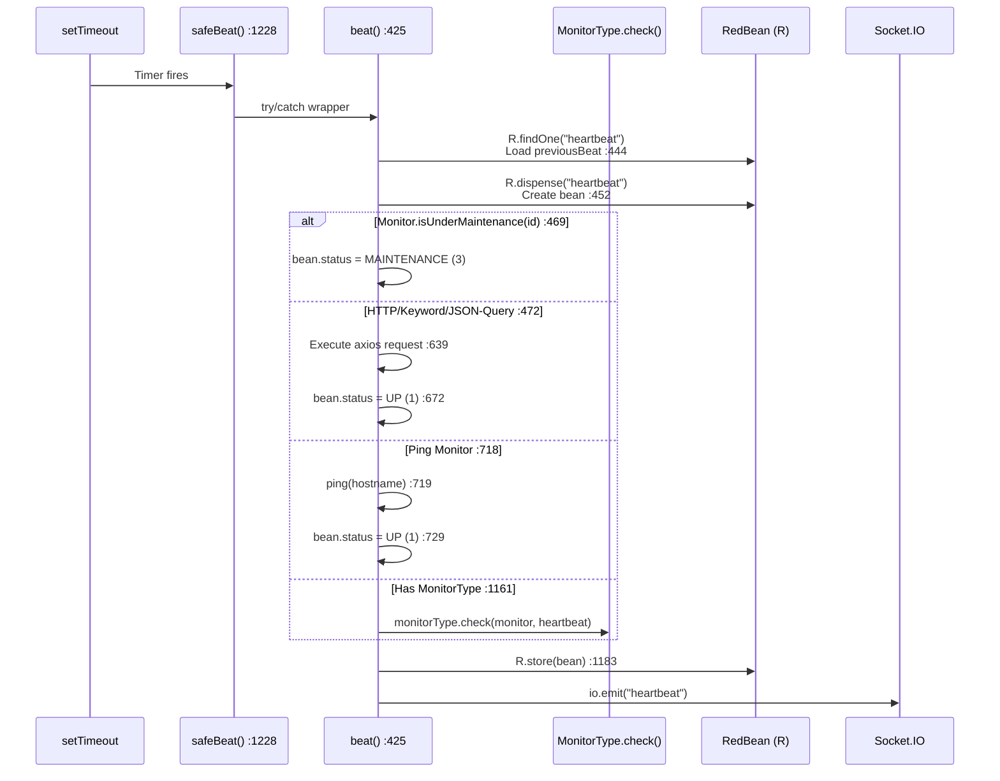

# Monitor System

Relevant source files

The following files were used as context for generating this wiki page:

- [package-lock.json](package-lock.json)
- [package.json](package.json)
- [server/database.js](server/database.js)
- [server/model/monitor.js](server/model/monitor.js)
- [server/server.js](server/server.js)
- [server/uptime-kuma-server.js](server/uptime-kuma-server.js)
- [server/util-server.js](server/util-server.js)
- [src/assets/app.scss](src/assets/app.scss)
- [src/assets/vars.scss](src/assets/vars.scss)
- [src/components/HeartbeatBar.vue](src/components/HeartbeatBar.vue)
- [src/pages/Dashboard.vue](src/pages/Dashboard.vue)
- [src/pages/DashboardHome.vue](src/pages/DashboardHome.vue)
- [src/pages/Details.vue](src/pages/Details.vue)
- [src/pages/EditMonitor.vue](src/pages/EditMonitor.vue)

The Monitor System is the core functionality of Uptime Kuma that performs periodic checks on services and tracks their availability status. This document covers the `Monitor` model class, monitor lifecycle management, status tracking, and the integration between monitors and the server orchestration layer.

For information about specific monitor types and their implementations, see [Monitor Types](#3.1). For details on how check results are stored and streamed to clients, see [Heartbeat System](#3.3). For maintenance scheduling, see [Maintenance Windows](#3.4). For advanced response evaluation and the `beat()` logic, see [Monitor Execution Lifecycle](#3.2). For domain and certificate monitoring, see [Domain and Certificate Expiry Monitoring](#3.5).

---

## Monitor Architecture

The Monitor System consists of the `Monitor` model class (defined in [server/model/monitor.js:76-1614]()), which encapsulates monitoring logic, and the `UptimeKumaServer` orchestrator, which maintains the active monitor list in `monitorList` and coordinates execution. Each monitor runs on its own timer using `setTimeout`, and checks are performed by the `beat()` function.

### Core Components Diagram

**Sources:** [server/model/monitor.js:76-1614](), [server/uptime-kuma-server.js:22-135](), [server/server.js:686-950]()

---

## Monitor Model Structure

The `Monitor` class extends `BeanModel` from RedBean-Node ORM and represents a single monitoring configuration. Each monitor instance is stored in the `monitor` database table and loaded into the `UptimeKumaServer.monitorList` when active.

### Monitor Class Hierarchy

**Sources:** [server/model/monitor.js:76-1614]()

### Core Monitor Properties

| Property | Type | Description | Default |
|----------|------|-------------|---------|
| `id` | integer | Primary key identifier | Auto-increment |
| `name` | string | Display name for the monitor | Required |
| `type` | string | Monitor type (http, ping, port, etc.) | Required |
| `url` | string | Target URL for HTTP-based monitors | Type-dependent |
| `interval` | integer | Check interval in seconds | 60 |
| `timeout` | integer | Check timeout in milliseconds | interval * 0.8 |
| `maxretries` | integer | Retries before marking as DOWN | 0 |
| `retryInterval` | integer | Retry check interval in seconds | interval |
| `active` | boolean | Whether monitor is running | true |
| `weight` | integer | Display order weight | 2000 |

**Sources:** [server/model/monitor.js:127-210](), [src/pages/EditMonitor.vue:31-114]()

---

## Monitor Lifecycle and Execution

Monitors follow a timer-based execution model where the `beat()` function runs at configured intervals. The lifecycle is managed by `UptimeKumaServer` and involves state transitions between UP, DOWN, PENDING, and MAINTENANCE.

### Monitor State Machine

**Sources:** [server/model/monitor.js:348-1227](), [server/server.js:898-950]()

### Beat Execution Flow

The `beat()` function at [server/model/monitor.js:425]() is the core execution loop. It performs type-specific checks, records results as `heartbeat` beans, and manages retry logic. The function is wrapped in `safeBeat()` at line 1228 for error handling and rescheduling.

**Sources:** [server/model/monitor.js:425-1227](), [server/model/monitor.js:1228-1336]()

---

## Monitor Status States

Uptime Kuma uses four distinct status states to represent monitor health. These are defined as constants and stored in the `heartbeat.status` field.

### Status Constants

| Constant | Value | Description | Assignment Location |
|----------|-------|-------------|---------------------|
| `DOWN` | 0 | Check failed or timed out | [server/model/monitor.js:455]() (default) |
| `UP` | 1 | Check succeeded | [server/model/monitor.js:672]() (HTTP) |
| `PENDING` | 2 | Initial state, no checks yet | [server/model/monitor.js:8]() |
| `MAINTENANCE` | 3 | Monitor in maintenance window | [server/model/monitor.js:471]() |

**Sources:** [server/model/monitor.js:6-9](), [server/model/monitor.js:455](), [server/model/monitor.js:469-471]()

---

## Monitor Type Registry

Monitor types are registered in `UptimeKumaServer.monitorTypeList` at [server/uptime-kuma-server.js:113-134]() and provide type-specific implementation logic.

| Type Key | Class | Implementation |
|----------|-------|----------------|
| `"real-browser"` | `RealBrowserMonitorType` | Playwright-based checks |
| `"dns"` | `DnsMonitorType` | DNS resolution checks |
| `"mqtt"` | `MqttMonitorType` | MQTT broker connectivity |
| `"group"` | `GroupMonitorType` | Monitor aggregation |
| `"manual"` | `ManualMonitorType` | Manual status setting |
| `"globalping"` | `GlobalpingMonitorType` | Distributed probe network |
| `"system-service"` | `SystemServiceMonitorType` | Systemd/Windows service monitoring |
| `"websocket-upgrade"`| `WebSocketMonitorType` | WebSocket connection checks |

**Sources:** [server/uptime-kuma-server.js:113-134](), [server/model/monitor.js:1161-1178]()

---

## Monitor Management via Socket.IO

Monitors are managed through Socket.IO events handled in [server/server.js:686-1019](). The `monitorList` in `UptimeKumaServer` maintains active instances.

| Event | Handler Location | Action |
|-------|------------------|--------|
| `'add'` | [server/server.js:686]() | Creates new monitor and starts it |
| `'editMonitor'` | [server/server.js:765]() | Updates configuration and restarts |
| `'pauseMonitor'` | [server/server.js:898]() | Stops the heartbeat timer |
| `'resumeMonitor'` | [server/server.js:922]() | Re-activates the heartbeat timer |
| `'deleteMonitor'` | [server/server.js:952]() | Removes from DB and memory |

**Sources:** [server/server.js:686-1019](), [server/uptime-kuma-server.js:33]()

---

## Monitor Data Serialization

Monitors are serialized to JSON via `toJSON()` and `toPublicJSON()` at [server/model/monitor.js:85-258](). Sensitive fields like `basic_auth_pass`, `databaseConnectionString`, and `pushToken` are excluded from public views to ensure security.

**Sources:** [server/model/monitor.js:85-258]()
