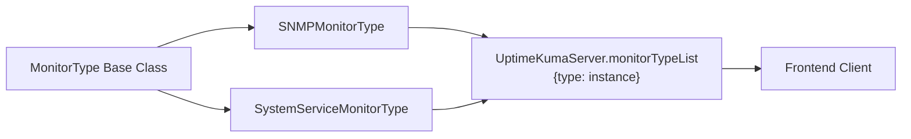
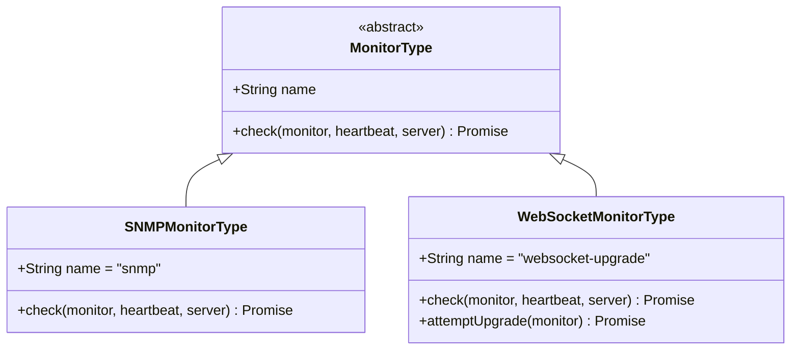
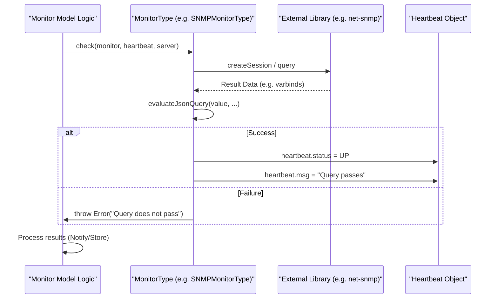

# Monitor Types

Relevant source files

The following files were used as context for generating this wiki page:

- [db/knex_migrations/2024-04-26-0000-snmp-monitor.js](db/knex_migrations/2024-04-26-0000-snmp-monitor.js)
- [db/knex_migrations/2025-02-15-2312-add-wstest.js](db/knex_migrations/2025-02-15-2312-add-wstest.js)
- [db/knex_migrations/2025-12-17-0000-add-globalping-monitor.js](db/knex_migrations/2025-12-17-0000-add-globalping-monitor.js)
- [db/knex_migrations/2026-01-02-0713-gamedig-v4-to-v5.js](db/knex_migrations/2026-01-02-0713-gamedig-v4-to-v5.js)
- [db/knex_migrations/2026-05-20-0000-add-bearer-token.js](db/knex_migrations/2026-05-20-0000-add-bearer-token.js)
- [db/knex_migrations/2026-05-25-0000-add-gamedig-token.js](db/knex_migrations/2026-05-25-0000-add-gamedig-token.js)
- [server/monitor-types/dns.js](server/monitor-types/dns.js)
- [server/monitor-types/gamedig.js](server/monitor-types/gamedig.js)
- [server/monitor-types/globalping.js](server/monitor-types/globalping.js)
- [server/monitor-types/group.js](server/monitor-types/group.js)
- [server/monitor-types/manual.js](server/monitor-types/manual.js)
- [server/monitor-types/mongodb.js](server/monitor-types/mongodb.js)
- [server/monitor-types/monitor-type.js](server/monitor-types/monitor-type.js)
- [server/monitor-types/mqtt.js](server/monitor-types/mqtt.js)
- [server/monitor-types/mssql.js](server/monitor-types/mssql.js)
- [server/monitor-types/mysql.js](server/monitor-types/mysql.js)
- [server/monitor-types/postgres.js](server/monitor-types/postgres.js)
- [server/monitor-types/rabbitmq.js](server/monitor-types/rabbitmq.js)
- [server/monitor-types/real-browser-monitor-type.js](server/monitor-types/real-browser-monitor-type.js)
- [server/monitor-types/sip-options.js](server/monitor-types/sip-options.js)
- [server/monitor-types/snmp.js](server/monitor-types/snmp.js)
- [server/monitor-types/system-service.js](server/monitor-types/system-service.js)
- [server/monitor-types/tailscale-ping.js](server/monitor-types/tailscale-ping.js)
- [server/monitor-types/tcp.js](server/monitor-types/tcp.js)
- [server/monitor-types/websocket-upgrade.js](server/monitor-types/websocket-upgrade.js)
- [server/notification-providers/apprise.js](server/notification-providers/apprise.js)
- [src/components/Confirm.vue](src/components/Confirm.vue)
- [src/components/CopyableInput.vue](src/components/CopyableInput.vue)
- [src/components/HiddenInput.vue](src/components/HiddenInput.vue)
- [test/backend-test/monitors/test-gamedig.js](test/backend-test/monitors/test-gamedig.js)
- [test/backend-test/monitors/test-grpc.js](test/backend-test/monitors/test-grpc.js)
- [test/backend-test/monitors/test-mqtt.js](test/backend-test/monitors/test-mqtt.js)
- [test/backend-test/monitors/test-mssql.js](test/backend-test/monitors/test-mssql.js)
- [test/backend-test/monitors/test-mysql.js](test/backend-test/monitors/test-mysql.js)
- [test/backend-test/monitors/test-postgres.js](test/backend-test/monitors/test-postgres.js)
- [test/backend-test/monitors/test-rabbitmq.js](test/backend-test/monitors/test-rabbitmq.js)
- [test/backend-test/monitors/test-tcp.js](test/backend-test/monitors/test-tcp.js)
- [test/backend-test/monitors/test-websocket.js](test/backend-test/monitors/test-websocket.js)
- [test/backend-test/test-globalping.js](test/backend-test/test-globalping.js)
- [test/backend-test/test-system-service.js](test/backend-test/test-system-service.js)

This page documents the supported monitor types in Uptime Kuma, their categories, configuration options, and implementation architecture. Monitor types define how Uptime Kuma probes external services to determine their availability status.

---

## Monitor Type Categories

Uptime Kuma organizes monitors into several primary categories based on their operational characteristics:

```mermaid
graph TB
    MonitorTypes["Monitor Types"]
    
    General["General Monitor Type<br/>(Active Probing)"]
    Passive["Passive Monitor Type<br/>(Push-based)"]
    Specific["Specific Monitor Type<br/>(Specialized Services)"]
    
    MonitorTypes --> General
    MonitorTypes --> Passive
    MonitorTypes --> Specific
    
    General --> HTTP["HTTP(s)"]
    General --> TCPPort["TCP Port"]
    General --> Ping["Ping"]
    General --> DNS["DNS"]
    General --> SMTP["SMTP"]
    General --> SNMP["SNMP"]
    General --> Keyword["HTTP(s) - Keyword"]
    General --> JsonQuery["HTTP(s) - Json Query"]
    General --> GrpcKeyword["gRPC(s) - Keyword"]
    General --> Docker["Docker Container"]
    General --> SystemService["System Service"]
    General --> RealBrowser["HTTP(s) - Browser Engine"]
    General --> WebsocketUpgrade["Websocket Upgrade"]
    General --> Group["Group"]
    General --> TLS["TLS Certificate"]
    
    Passive --> Push["Push"]
    Passive --> Manual["Manual"]
    
    Specific --> Globalping["Globalping"]
    Specific --> Steam["Steam Game Server"]
    Specific --> GameDig["GameDig"]
    Specific --> MQTT["MQTT"]
    Specific --> RabbitMQ["RabbitMQ"]
    Specific --> KafkaProducer["Kafka Producer"]
    Specific --> SQLServer["Microsoft SQL Server"]
    Specific --> Postgres["PostgreSQL"]
    Specific --> MySQL["MySQL/MariaDB"]
    Specific --> MongoDB["MongoDB"]
    Specific --> Radius["Radius"]
    Specific --> Redis["Redis"]
    Specific --> SipOptions["SIP Options Ping"]
    Specific --> TailscalePing["Tailscale Ping"]
```

**Sources:** [server/monitor-types/monitor-type.js:1-10](), [server/monitor-types/snmp.js:5-6](), [server/monitor-types/system-service.js:6-7]()

---

## Monitor Type Registry and Architecture

Uptime Kuma implements a plugin-style monitor type system where each type extends a base class and registers itself in the system.

### Type Registration

Monitor types are defined as classes extending `MonitorType` [server/monitor-types/monitor-type.js:1-10]().

**Sources:** [server/monitor-types/snmp.js:5-6](), [server/monitor-types/system-service.js:6-7](), [server/monitor-types/websocket-upgrade.js:25-26]()

### Monitor Type Implementation Pattern

Each monitor type implements the `check()` method, which is the core execution logic:

**Sources:** [server/monitor-types/snmp.js:5-11](), [server/monitor-types/websocket-upgrade.js:25-31](), [server/monitor-types/system-service.js:6-17]()

---

## Core Monitor Types

### HTTP/HTTPS-Based Monitors

#### HTTP(s) Monitor (`http`)
The primary monitor for web services. Validates HTTP status codes and response times.

#### HTTP(s) - Browser Engine Monitor (`real-browser`)
Uses Playwright to render pages with a real Chrome/Chromium browser [server/monitor-types/real-browser-monitor-type.js:2-10]().
- **Features:** Full JS execution and screenshot capture.
- **Execution:** Can run locally using auto-detected executables [server/monitor-types/real-browser-monitor-type.js:182-190]() or via a `RemoteBrowser` [server/monitor-types/real-browser-monitor-type.js:101-106]().
- **Installation:** In container environments, it can trigger `apt install chromium` if missing [server/monitor-types/real-browser-monitor-type.js:148-174]().

---

### Network & Infrastructure Monitors

#### DNS Monitor (`dns`)
Queries DNS records using `node:dns/promises` [server/monitor-types/dns.js:9]().
- **Logic:** Resolves hostnames via `resolveDnsResolverServers` [server/monitor-types/dns.js:117-164]().
- **Validation:** Supports conditions for record values (A, AAAA, TXT, CNAME, CAA, MX, NS, SOA, SRV) [server/monitor-types/dns.js:30-88]().

#### SNMP Monitor (`snmp`)
Monitors network devices using the `net-snmp` library [server/monitor-types/snmp.js:3]().
- **Configuration:** Supports SNMP v1, v2c, and v3 (currently `noAuthNoPriv`) [server/monitor-types/snmp.js:18-35]().
- **Validation:** Evaluates OID values using `evaluateJsonQuery` [server/monitor-types/snmp.js:63-77]().

#### Websocket Upgrade Monitor (`websocket-upgrade`)
Tests the HTTP-to-WebSocket handshake process [server/monitor-types/websocket-upgrade.js:121-153]().
- **Configuration:** Allows subprotocols and custom accepted status codes [server/monitor-types/websocket-upgrade.js:126-127]().
- **Authentication:** Supports Basic Auth, Bearer Token, OAuth2 Client Credentials, and mTLS [server/monitor-types/websocket-upgrade.js:59-113]().
- **Compliance:** Option to ignore `Sec-WebSocket-Accept` header for non-compliant servers [server/monitor-types/websocket-upgrade.js:137-143]().

#### System Service Monitor (`system-service`)
Checks if a local system service is running [server/monitor-types/system-service.js:17-29]().
- **Linux:** Uses `systemctl is-active` [server/monitor-types/system-service.js:46-62]().
- **Windows:** Uses PowerShell `Get-Service` [server/monitor-types/system-service.js:71-105]().
- **Security:** Validates service names against strict alphanumeric patterns to prevent command injection [server/monitor-types/system-service.js:41-44](), [server/monitor-types/system-service.js:74-76]().

---

### Database Monitors

These monitors execute connectivity checks and optional queries.

| Type | Driver/Library | Logic |
|------|----------------|-------|
| `mysql` | `mysql2` | Supports `mysqlQuerySingleValue` for condition validation [server/monitor-types/mysql.js:110-158](). |
| `postgres` | `pg` | Connection string and optional query execution. |
| `mongodb` | `mongodb` | Connection string validation via the `mongodb` driver. |

---

### Specialized Service Monitors

#### GameDig Monitor (`gamedig`)
Uses the `gamedig` library to query game server status (e.g., player count, map) [server/monitor-types/gamedig.js:3]().
- **Logic:** Calls `GameDig.query()` with the specified game type and host [server/monitor-types/gamedig.js:13-19]().

#### MQTT Monitor (`mqtt`)
Connects to MQTT brokers and validates messages [server/monitor-types/mqtt.js:3]().
- **Validation:** Supports Keyword matching [server/monitor-types/mqtt.js:61-68](), JSONata queries [server/monitor-types/mqtt.js:77-88](), or the Conditions system [server/monitor-types/mqtt.js:99-127]().

#### Globalping Monitor (`globalping`)
Integrates with Globalping distributed probes to check targets from multiple worldwide locations [server/monitor-types/globalping.js]().

---

### Passive & Manual Monitors

#### Push Monitor (`push`)
Expects a heartbeat signal via an HTTP API endpoint within the defined interval.

#### Manual Monitor (`manual`)
A monitor where the status is set manually by the user, useful for tracking external incidents or maintenance [server/monitor-types/manual.js]().

---

## Data Flow: Monitor Execution

The following diagram illustrates how the core system interacts with specific `MonitorType` implementations during a check cycle.

**Sources:** [server/monitor-types/snmp.js:11-83](), [server/monitor-types/websocket-upgrade.js:31-51](), [server/monitor-types/system-service.js:17-29]()

---

## Monitor Configuration Mapping

Monitor configuration is stored in the `monitor` table. Key fields used by different types include:

| Database Column | Monitor Type(s) | Description |
|-----------------|-----------------|-------------|
| `snmp_oid` | `snmp` | OID to query [db/knex_migrations/2024-04-26-0000-snmp-monitor.js:3]() |
| `snmp_version` | `snmp` | 1, 2c, or 3 [db/knex_migrations/2024-04-26-0000-snmp-monitor.js:4]() |
| `system_service_name` | `system-service` | Name of the service to monitor [server/monitor-types/system-service.js:18]() |
| `wsSubprotocol` | `websocket-upgrade` | Optional subprotocols for handshake [server/monitor-types/websocket-upgrade.js:126]() |
| `databaseQuery` | `mysql`, `postgres` | Query to execute for health check [server/monitor-types/mysql.js:20]() |

**Sources:** [db/knex_migrations/2024-04-26-0000-snmp-monitor.js:1-15](), [server/monitor-types/system-service.js:17-29](), [server/monitor-types/mysql.js:19-62]()
