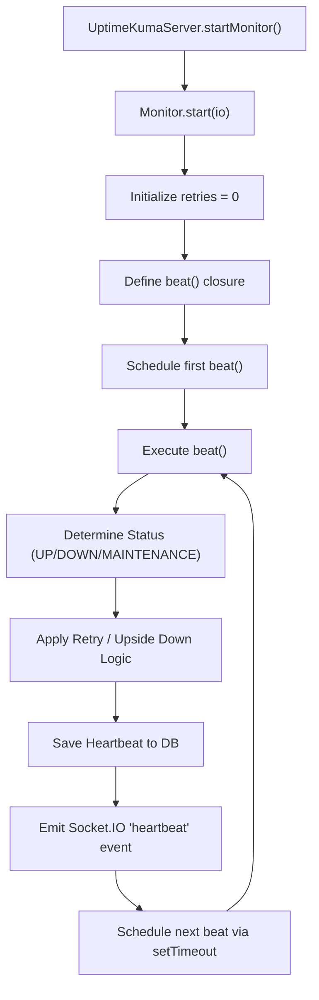
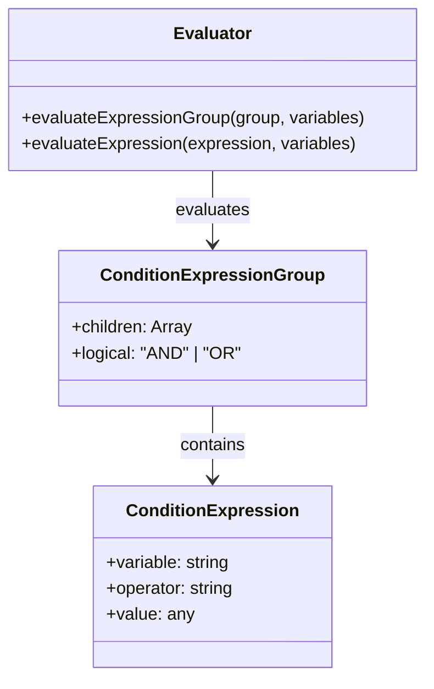
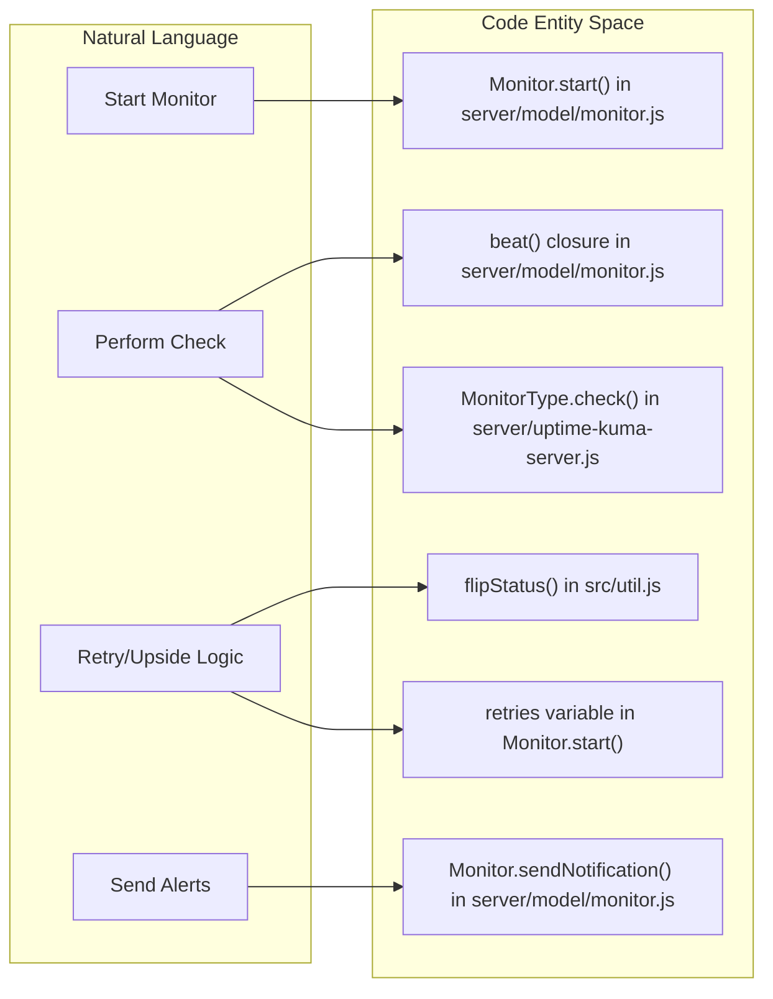

# Monitor Execution Lifecycle

Relevant source files

The following files were used as context for generating this wiki page:

- [config/playwright.config.js](config/playwright.config.js)
- [package-lock.json](package-lock.json)
- [package.json](package.json)
- [server/database.js](server/database.js)
- [server/model/monitor.js](server/model/monitor.js)
- [server/server.js](server/server.js)
- [server/uptime-kuma-server.js](server/uptime-kuma-server.js)
- [server/util-server.js](server/util-server.js)
- [src/components/EditMonitorConditions.vue](src/components/EditMonitorConditions.vue)
- [src/pages/EditMonitor.vue](src/pages/EditMonitor.vue)
- [src/util.js](src/util.js)
- [src/util.ts](src/util.ts)
- [test/backend-test/monitor-conditions/test-evaluator.js](test/backend-test/monitor-conditions/test-evaluator.js)
- [test/backend-test/monitor-conditions/test-operators.js](test/backend-test/monitor-conditions/test-operators.js)
- [test/e2e/specs/example.spec.js](test/e2e/specs/example.spec.js)
- [test/e2e/specs/monitor-form.spec.js](test/e2e/specs/monitor-form.spec.js)
- [test/e2e/specs/setup-process.once.js](test/e2e/specs/setup-process.once.js)
- [test/e2e/util-test.js](test/e2e/util-test.js)
- [tsconfig.json](tsconfig.json)

This page details the monitor execution flow in Uptime Kuma, from the initial creation and startup through the core `beat()` function, status determination logic, retry mechanisms, and the advanced condition evaluation system.

## Overview

The monitor execution lifecycle is managed by the `Monitor` class (a RedBean `BeanModel`). Each active monitor runs its own independent execution loop using a recursive `setTimeout` pattern, ensuring that checks are performed at the configured intervals without blocking the main event loop.

**Sources:** [server/model/monitor.js:348-424](), [server/uptime-kuma-server.js:29-33]()

---

## Monitor Startup and Initialization

Monitors are started via the `start(io)` method. This typically occurs when the server boots, when a user resumes a paused monitor, or when a new monitor is created.

### Initialization Steps
1.  **Retry Counter**: A local `retries` variable is initialized to `0` within the `start` function's scope [server/model/monitor.js:350]().
2.  **Prometheus**: A `Prometheus` instance is created for the monitor to track metrics like response time and status [server/model/monitor.js:352]().
3.  **Previous State**: The monitor attempts to load the most recent heartbeat from the database to determine the starting `downCount` and `retries` state [server/model/monitor.js:374-378]().
4.  **Interval Validation**: The monitor ensures the interval is within the allowed bounds (`MIN_INTERVAL_SECOND` to `MAX_INTERVAL_SECOND`) [server/model/monitor.js:356-367]().

**Sources:** [server/model/monitor.js:348-380](), [src/util.js:32-33]()

---

## The Beat Cycle

The `beat()` function is an asynchronous closure defined inside `start()`. It encapsulates the entire logic for a single check.

### Execution Flow
1.  **Maintenance Check**: Before any network activity, the monitor checks if it is currently within a maintenance window. If so, it sets the status to `MAINTENANCE` and skips the check [server/model/monitor.js:469-471]().
2.  **Type-Specific Logic**: The monitor branches based on `this.type`.
    *   **HTTP/Keyword**: Uses `axios` to perform requests [server/model/monitor.js:472-717]().
    *   **Ping**: Uses the `@louislam/ping` wrapper [server/model/monitor.js:718-729]().
    *   **Registry Types**: For newer types (e.g., `dns`, `postgres`, `mqtt`), it calls the `.check()` method of the corresponding class registered in `UptimeKumaServer.monitorTypeList` [server/uptime-kuma-server.js:113-134]().
3.  **Result Recording**: A new `heartbeat` bean is dispensed, populated with the result (ping time, status, message), and stored in the database [server/model/monitor.js:452-456](), [server/model/monitor.js:1037]().

**Sources:** [server/model/monitor.js:425-1037](), [server/uptime-kuma-server.js:112-135]()

---

## Status Determination and Logic

### Upside Down Mode
In "Upside Down" mode (`this.upsideDown === true`), the logic is inverted. A successful connection results in a `DOWN` status, while a failure results in `UP`. This is implemented using the `flipStatus()` utility [src/util.js:116-125]().
*   If a check succeeds but `upsideDown` is active, status is flipped to `DOWN` [server/model/monitor.js:458-460]().
*   If a check fails (catch block), status is flipped to `UP` [server/model/monitor.js:1033-1035]().

### Retry Logic
Uptime Kuma implements a "Max Retries" system to prevent false positives.
*   **Failure**: If a check fails and `retries < maxretries`, the monitor increments `retries` and schedules the next beat using `retryInterval` instead of the normal `interval` [server/model/monitor.js:1055-1065]().
*   **Success after Failure**: If a check succeeds while `retries > 0`, it decrements `retries` until it reaches 0 [server/model/monitor.js:1048-1053]().
*   **Important Beats**: A heartbeat is only marked as `important` (triggering notifications) when the status officially changes after retries are exhausted [server/model/monitor.js:1023]().

**Sources:** [server/model/monitor.js:1044-1070](), [src/util.js:116-125]()

---

## Monitor Conditions System

For advanced response evaluation (e.g., DNS record matching or JSON path validation), Uptime Kuma uses a structured condition system. This is managed via the `EditMonitorConditions.vue` component in the frontend [src/components/EditMonitorConditions.vue:1-5]().

### Data Model and Evaluation
The system allows users to define logical groups of conditions (AND/OR).
*   **Condition Groups**: Managed by `ConditionExpressionGroup`.
*   **Individual Expressions**: Defined as `ConditionExpression`.
*   **Operators**: Supports operations like `contains`, `equals`, `startsWith`, etc.

The logic is evaluated on the backend during the `beat()` cycle for specific monitor types like DNS or HTTP with JSON Query [server/model/monitor.js:187-188]().

### Evaluation Process
The evaluation logic bridges variables (like response body or DNS records) with user-defined expressions.

**Sources:** [src/pages/EditMonitor.vue:187-188](), [test/e2e/specs/monitor-form.spec.js:24-46]()

---

## Code Entity Mapping

This diagram bridges the natural language concepts to the specific code entities that implement them.

**Sources:** [server/model/monitor.js:348](), [server/model/monitor.js:425](), [src/util.js:116](), [server/uptime-kuma-server.js:113-135]()

---

## Summary of Key Execution Functions

| Function | File | Description |
| :--- | :--- | :--- |
| `start(io)` | `server/model/monitor.js` | Initializes the monitor's recursive execution loop. |
| `beat()` | `server/model/monitor.js` | The core async function that performs a single monitoring check. |
| `safeBeat()` | `server/model/monitor.js` | Wrapper around `beat()` that catches top-level errors to prevent loop crashes. |
| `evaluateJsonQuery()` | `src/util.js` | Evaluates JSONPath/JSONata expressions for `json-query` monitors. |
| `isUnderMaintenance()` | `server/model/monitor.js` | Static method to check if a monitor should skip its beat due to maintenance. |

**Sources:** [server/model/monitor.js:348](), [server/model/monitor.js:425](), [server/model/monitor.js:1089](), [src/util.js:14](), [server/model/monitor.js:1682]()
