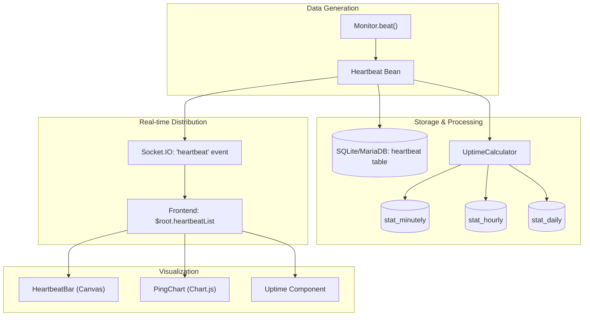
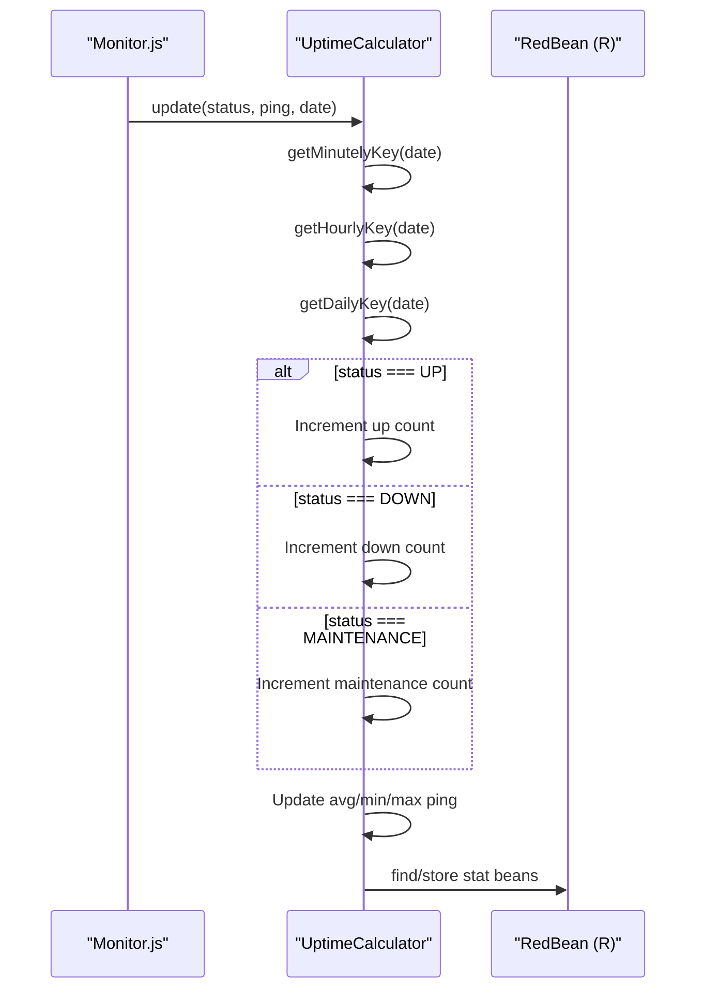

# Heartbeat System

<details>
<summary>Relevant source files</summary>

The following files were used as context for generating this wiki page:

- [db/knex_migrations/2023-12-21-0000-stat-ping-min-max.js](db/knex_migrations/2023-12-21-0000-stat-ping-min-max.js)
- [db/knex_migrations/2023-12-22-0000-hourly-uptime.js](db/knex_migrations/2023-12-22-0000-hourly-uptime.js)
- [server/model/group.js](server/model/group.js)
- [server/model/heartbeat.js](server/model/heartbeat.js)
- [server/notification-providers/nostr.js](server/notification-providers/nostr.js)
- [server/uptime-calculator.js](server/uptime-calculator.js)
- [src/assets/app.scss](src/assets/app.scss)
- [src/assets/vars.scss](src/assets/vars.scss)
- [src/components/CountUp.vue](src/components/CountUp.vue)
- [src/components/Datetime.vue](src/components/Datetime.vue)
- [src/components/HeartbeatBar.vue](src/components/HeartbeatBar.vue)
- [src/components/PingChart.vue](src/components/PingChart.vue)
- [src/components/Status.vue](src/components/Status.vue)
- [src/components/Uptime.vue](src/components/Uptime.vue)
- [src/pages/Dashboard.vue](src/pages/Dashboard.vue)
- [src/pages/DashboardHome.vue](src/pages/DashboardHome.vue)
- [src/pages/Details.vue](src/pages/Details.vue)
- [test/backend-test/README.md](test/backend-test/README.md)
- [test/backend-test/test-ping-chart.js](test/backend-test/test-ping-chart.js)
- [test/backend-test/test-uptime-calculator.js](test/backend-test/test-uptime-calculator.js)

</details>


The heartbeat system in Uptime Kuma is the core data pipeline that records monitor check results, calculates uptime statistics, and provides real-time visualizations. Heartbeats are the fundamental units of data that track a monitor's status history, response times, and error messages.

## Overview

Each monitor execution cycle generates a **heartbeat** record. This record captures the outcome of a check at a specific point in time. These records flow through the system to be stored, aggregated, and visualized.

### Data Flow Diagram



Sources: [server/uptime-calculator.js:10-15](), [server/model/heartbeat.js:13-13]()

## Heartbeat Data Structure

Heartbeats are represented by the `Heartbeat` model, extending `BeanModel` for database persistence.

### Database Schema
The `heartbeat` table stores individual check results with the following key fields:

| Field | Type | Description |
| :--- | :--- | :--- |
| `monitor_id` | Integer | Foreign key to the monitor |
| `status` | Integer | 0=DOWN, 1=UP, 2=PENDING, 3=MAINTENANCE |
| `time` | DateTime | UTC timestamp of the check |
| `ping` | Integer | Response time in milliseconds |
| `msg` | String | Status message or error details |
| `important` | Boolean | True if status changed (triggers notifications) |
| `duration` | Integer | Time since last beat (used for Push monitors) |
| `response` | Text | Compressed (Brotli) response body (if configured) |

### Model Implementation
The `Heartbeat` class handles serialization and decompression of stored data. The `toJSON` method provides a standard representation for the frontend. [server/model/heartbeat.js:32-44]()

The `decodeResponseValue` static method offloads Brotli decompression to the libuv thread pool to avoid blocking the main event loop. [server/model/heartbeat.js:70-81]()

Sources: [server/model/heartbeat.js:7-13](), [server/model/heartbeat.js:32-44](), [server/model/heartbeat.js:70-81]()

## Uptime Calculation and Statistics

Uptime Kuma uses the `UptimeCalculator` class to aggregate raw heartbeats into time-series statistics for long-term reporting.

### Stat Tables
To avoid scanning millions of heartbeats for a 30-day uptime report, the system maintains three aggregation tables:
1. **`stat_minutely`**: 1-minute intervals (kept for 24 hours). [server/uptime-calculator.js:34-34]()
2. **`stat_hourly`**: 1-hour intervals (kept for 30 days). [server/uptime-calculator.js:41-41]()
3. **`stat_daily`**: 1-day intervals (kept for 365 days). [server/uptime-calculator.js:47-47]()

### Aggregation Logic
The `UptimeCalculator.update()` method is called for every new heartbeat. It updates the current bucket for all three time scales. [server/uptime-calculator.js:212-215]()



Sources: [server/uptime-calculator.js:212-230](), [server/uptime-calculator.js:246-260](), [db/knex_migrations/2023-12-22-0000-hourly-uptime.js:1-10]()

## Visualization Components

### HeartbeatBar (Canvas Rendering)
The `HeartbeatBar` component provides a high-performance visualization of recent status history. It uses an HTML5 Canvas for rendering to handle high-density data efficiently. [src/components/HeartbeatBar.vue:4-18]()

**Key Features:**
- **Dynamic Sizing**: The `shortBeatList` computed property manages data slicing based on the `maxBeat` limit. [src/components/HeartbeatBar.vue:139-173]()
- **Status Coloring**: Standard status constants (UP, DOWN, PENDING, MAINTENANCE) determine the visual output. [src/components/HeartbeatBar.vue:43-43]()
- **Interaction**: Implements `handleMouseMove` to detect which beat index is hovered and update `tooltipVisible`. [src/components/HeartbeatBar.vue:81-88]()

Sources: [src/components/HeartbeatBar.vue:4-18](), [src/components/HeartbeatBar.vue:104-110](), [src/components/HeartbeatBar.vue:139-173]()

### PingChart (Chart.js)
The `PingChart` component visualizes response times over time using `vue-chartjs`. [src/components/PingChart.vue:46-46]()

**Data Flow:**
1. Component provides period options (3h, 6h, 24h, 1w). [src/components/PingChart.vue:79-85]()
2. It renders a `Line` chart for response times (`y` axis) and filters tooltips to hide bar datasets. [src/components/PingChart.vue:147-156](), [src/components/PingChart.vue:178-181]()
3. The chart scales automatically adjust based on the theme (light/dark). [src/components/PingChart.vue:143-143]()

Sources: [src/components/PingChart.vue:26-27](), [src/components/PingChart.vue:79-85](), [src/components/PingChart.vue:178-181]()

### Uptime Component
The `Uptime.vue` component displays the percentage calculation. It retrieves values from `$root.uptimeList`, which is populated by the server using the `UptimeCalculator` results. [src/components/Uptime.vue:35-43]()

```javascript
// src/components/Uptime.vue
uptime() {
    let key = this.monitor.id + "_" + this.type;
    if (this.$root.uptimeList[key] !== undefined) {
        let result = Math.round(this.$root.uptimeList[key] * 10000) / 100;
        // Sanity check for status pages
        if (this.$route.path.startsWith("/status") && result > 100) {
            return "100%";
        } else {
            return result + "%";
        }
    }
    return this.$t("notAvailableShort");
}
```

Sources: [src/components/Uptime.vue:28-46](), [src/components/Uptime.vue:68-76]()

## Real-time Communication
The system relies on Socket.IO to push heartbeats to the frontend.

1. **Reception**: The frontend listens for updates and populates `$root.heartbeatList`.
2. **Dashboard Integration**: `DashboardHome.vue` displays important events (status changes) in a paginated table. [src/pages/DashboardHome.vue:49-58](), [src/pages/DashboardHome.vue:143-144]()
3. **Status Badges**: `Status.vue` provides pill-shaped badges for the current state (primary for UP, danger for DOWN, etc.). [src/components/Status.vue:16-34]()

Sources: [src/pages/DashboardHome.vue:49-58](), [src/components/Status.vue:1-4](), [src/components/Status.vue:16-34]()
