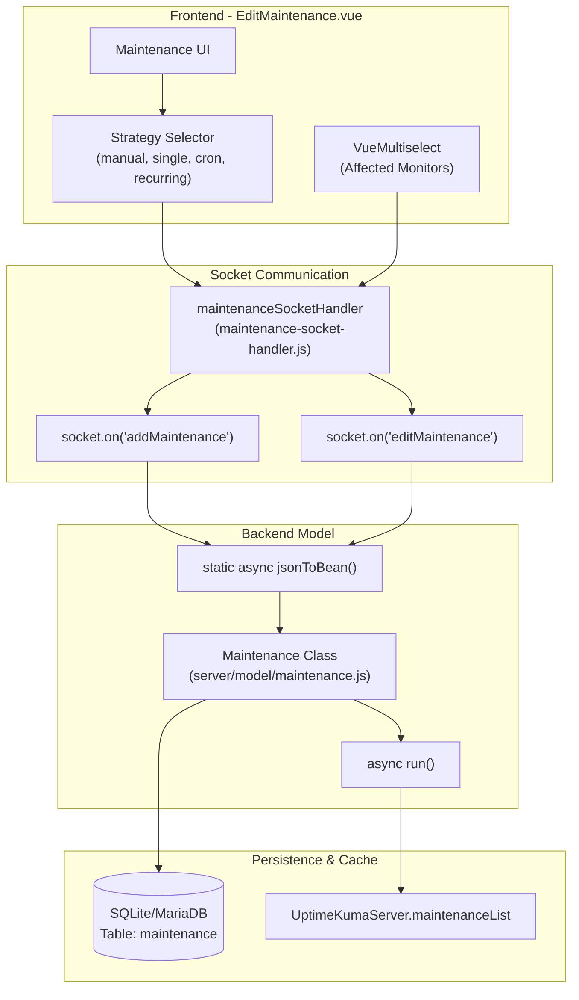

# Maintenance Windows

<details>
<summary>Relevant source files</summary>

The following files were used as context for generating this wiki page:

- [server/model/maintenance.js](server/model/maintenance.js)
- [server/socket-handlers/maintenance-socket-handler.js](server/socket-handlers/maintenance-socket-handler.js)
- [src/pages/EditMaintenance.vue](src/pages/EditMaintenance.vue)
- [src/pages/ManageMaintenance.vue](src/pages/ManageMaintenance.vue)

</details>


## Purpose and Scope

Maintenance Windows provide a system for scheduling planned downtime periods for monitors. During an active maintenance window, affected monitors are marked with a `MAINTENANCE` status instead of `DOWN`, preventing false alerts and providing transparency about planned service interruptions on status pages.

This system manages complex scheduling logic including manual toggles, single windows, and recurring patterns (cron, interval, weekly, monthly).

---

## Overview

Maintenance Windows allow administrators to define time periods when monitors should not trigger `DOWN` notifications. This is essential for planned maintenance activities, system upgrades, or scheduled downtime where services are expected to be unavailable.

**Key capabilities:**
- **Scheduling Strategies:** Manual, Single Window, Cron, Recurring Interval, Recurring Weekday, and Recurring Day of Month [src/pages/EditMaintenance.vue:111-122]().
- **Multi-Monitor Targeting:** Assign multiple monitors to a single maintenance window via the `monitor_maintenance` table [src/pages/EditMaintenance.vue:42-65](), [server/socket-handlers/maintenance-socket-handler.js:77-106]().
- **Status Page Integration:** Choose to display maintenance alerts on specific status pages or all of them [src/pages/EditMaintenance.vue:74-101]().
- **Notification Suppression:** Automatically suppresses alerts while the window is active by setting the monitor state to maintenance.

**Sources:** [src/pages/EditMaintenance.vue:111-123](), [server/model/maintenance.js:153-156](), [server/socket-handlers/maintenance-socket-handler.js:77-106]()

---

## System Architecture

### Maintenance Data Flow

The following diagram illustrates how a maintenance window is defined in the UI and propagated to the backend engine.



**Sources:** [server/socket-handlers/maintenance-socket-handler.js:16-74](), [server/model/maintenance.js:146-194](), [src/pages/EditMaintenance.vue:108-124]()

---

## Data Model

### Maintenance Bean (RedBean Model)

The `Maintenance` class extends `BeanModel` and handles the lifecycle and JSON serialization of maintenance windows. It integrates with `croner` for scheduling.

| Field | Description |
|-------|-------------|
| `title` | The display name of the window [server/model/maintenance.js:151]() |
| `strategy` | Scheduling type: `manual`, `single`, `cron`, `recurring-interval`, `recurring-weekday`, `recurring-day-of-month` [server/model/maintenance.js:153]() |
| `active` | Boolean toggle for the maintenance entry [server/model/maintenance.js:156]() |
| `start_date` / `end_date` | Date range for `single` strategy [server/model/maintenance.js:164-175]() |
| `start_time` / `end_time` | Time of day for recurring strategies [server/model/maintenance.js:187-188]() |
| `cron` | Cron expression for complex schedules [server/model/maintenance.js:182]() |
| `duration` | Length of the window in seconds [server/model/maintenance.js:181]() |

### Status State Machine

The maintenance UI and backend use a specific set of statuses to track the window's lifecycle, managed in `ManageMaintenance.vue` for sorting and display:

| Status | Order Priority | Description |
|--------|----------------|-------------|
| `under-maintenance` | 1000 | The window is currently active and affecting monitors [src/pages/ManageMaintenance.vue:126]() |
| `scheduled` | 900 | The window is active but the start time has not been reached [src/pages/ManageMaintenance.vue:127]() |
| `inactive` | 800 | The maintenance entry is manually paused/disabled [src/pages/ManageMaintenance.vue:128]() |
| `ended` | 700 | The window was a `single` type and the end time has passed [src/pages/ManageMaintenance.vue:129]() |

**Sources:** [src/pages/ManageMaintenance.vue:125-131](), [server/model/maintenance.js:51]()

---

## Scheduling Strategies

### 1. Manual Strategy
The window is active as long as the `active` bit is set to true. No specific time slots are calculated [server/model/maintenance.js:54-55]().

### 2. Single Maintenance Window
A one-time event defined by `start_date` and `end_date`. The `timeslotList` contains exactly one entry representing this period [server/model/maintenance.js:56-60]().

### 3. Cron & Recurring Strategies
These strategies use the `croner` library to calculate execution times and manage the job lifecycle.
- **Cron:** Uses a standard cron expression provided by the user [server/model/maintenance.js:180-184]().
- **Recurring:** The system generates a cron expression internally via `bean.generateCron()` based on selected weekdays, days of month, or intervals [server/model/maintenance.js:186-193]().

**Timezone Handling:** Maintenance windows support specific timezones or "Same as Server". The `toPublicJSON` method calculates the `timezoneOffset` and `timezone` for frontend display to ensure times are rendered correctly for the user [server/model/maintenance.js:48-50]().

---

## Implementation Details

### The `toPublicJSON()` Function
This function prepares the maintenance object for the frontend, calculating active and upcoming timeslots (`MaintenanceTimeslot`).

```javascript
// Logic from server/model/maintenance.js:15-94
async toPublicJSON() {
    let obj = { ...fields, timeslotList: [] };
    
    if (this.strategy === "single") {
        obj.timeslotList.push({ startDate: this.start_date, endDate: this.end_date });
    } else if (this.strategy !== "manual") {
        if (this.beanMeta.job) {
            let runningTimeslot = this.getRunningTimeslot();
            if (runningTimeslot) obj.timeslotList.push(runningTimeslot);
            
            let nextRunDate = this.beanMeta.job.nextRun();
            if (nextRunDate) {
                // ... calculate next startDate/endDate based on duration
            }
        }
    }
    return obj;
}
```

### Socket Handlers
The `maintenanceSocketHandler` manages the link between the UI and the database via Socket.io events.
- `addMaintenance`: Creates the bean, stores it, and calls `bean.run(true)` to initialize the cron job [server/socket-handlers/maintenance-socket-handler.js:16-43]().
- `addMonitorMaintenance`: Updates the `monitor_maintenance` join table and clears `apicache` [server/socket-handlers/maintenance-socket-handler.js:77-106]().
- `pauseMaintenance` / `resumeMaintenance`: Toggles the `active` state in the database and restarts/stops the schedule [server/socket-handlers/maintenance-socket-handler.js:246-285]().

**Sources:** [server/socket-handlers/maintenance-socket-handler.js:14-285](), [server/model/maintenance.js:9-94]()

---

## UI Components

### EditMaintenance.vue
The primary form for creating/editing windows. It uses `VueMultiselect` for monitor and status page assignment [src/pages/EditMaintenance.vue:42-101](). It dynamically renders input fields (like `cron` or `interval_day`) based on the selected `maintenance.strategy` [src/pages/EditMaintenance.vue:126-250]().

### ManageMaintenance.vue
A list view of all maintenance windows. It sorts them using `sortedMaintenanceList` based on status priority (active windows at the top) and provides controls for cloning, editing, or deleting [src/pages/ManageMaintenance.vue:23-86](), [src/pages/ManageMaintenance.vue:135-148]().

### MaintenanceTime.vue
A utility component used in the list and edit views to display the calculated start and end times for a window, adjusted for the selected timezone [src/pages/ManageMaintenance.vue:32]().

**Sources:** [src/pages/EditMaintenance.vue:1-250](), [src/pages/ManageMaintenance.vue:1-148](), [server/model/maintenance.js:15-94]()
