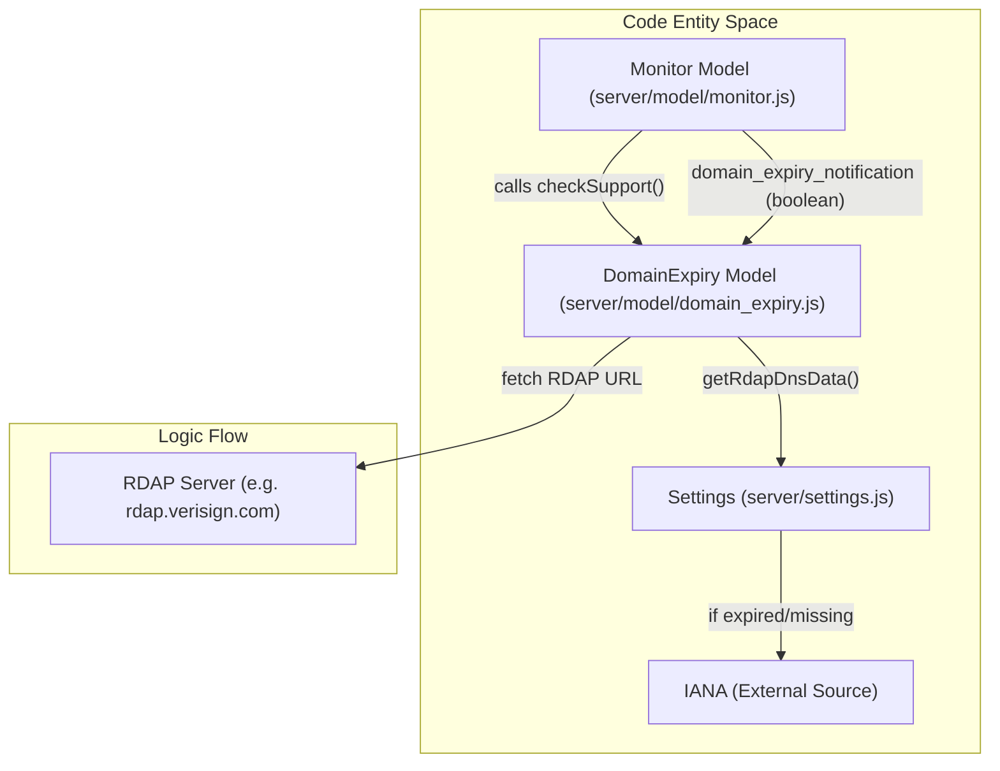
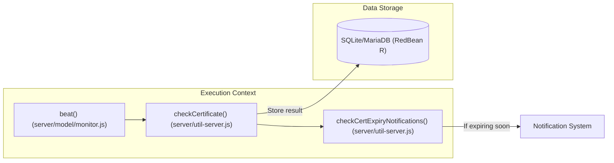

# Domain and Certificate Expiry Monitoring

Relevant source files

The following files were used as context for generating this wiki page:

- [.github/workflows/autofix.yml](.github/workflows/autofix.yml)
- [.github/workflows/release-nightly.yml](.github/workflows/release-nightly.yml)
- [db/knex_migrations/2026-02-07-0000-disable-domain-expiry-unsupported-tlds.js](db/knex_migrations/2026-02-07-0000-disable-domain-expiry-unsupported-tlds.js)
- [extra/rdap-dns.json](extra/rdap-dns.json)
- [server/model/domain_expiry.js](server/model/domain_expiry.js)
- [test/backend-test/notification-providers/mock-webhook.js](test/backend-test/notification-providers/mock-webhook.js)
- [test/backend-test/test-domain.js](test/backend-test/test-domain.js)
- [test/backend-test/test-util.js](test/backend-test/test-util.js)
- [test/e2e/specs/domain-expiry-notification.spec.js](test/e2e/specs/domain-expiry-notification.spec.js)

Uptime Kuma provides integrated monitoring for both SSL/TLS certificate expiration and domain name registration expiration. While certificate monitoring is performed during standard monitor heartbeats, domain expiry monitoring utilizes the Registration Data Access Protocol (RDAP) to query registration databases.

## Domain Expiry Monitoring (RDAP)

Domain expiry monitoring allows Uptime Kuma to notify users before a domain registration expires. This feature is distinct from standard uptime checks and is managed through the `DomainExpiry` model [server/model/domain_expiry.js:170-170]().

### RDAP Protocol and IANA Data Flow
Uptime Kuma uses the RDAP protocol to fetch registration data. To locate the correct RDAP server for a specific Top-Level Domain (TLD), the system fetches and caches the official DNS service directory from IANA [server/model/domain_expiry.js:54-54]().

**Data Flow for RDAP Lookup:**
1.  **IANA Update:** The system attempts to download `https://data.iana.org/rdap/dns.json` [server/model/domain_expiry.js:54-54]().
2.  **Caching:** Data is cached in the database `settings` table under the key `rdapDnsData` [server/model/domain_expiry.js:70-70]() and refreshed weekly [server/model/domain_expiry.js:69-69]().
3.  **TLD Parsing:** The system uses the `tldts` library via `DomainExpiry.parseTld` to extract the public suffix from the monitor's target [server/model/domain_expiry.js:111-111]().
4.  **Server Discovery:** The function `getRdapServer(tld)` matches the TLD against the IANA service list to find the authoritative RDAP base URL [server/model/domain_expiry.js:20-33]().
5.  **Query:** A GET request is sent to the discovered server at `${rdapServer}domain/${domain}` [server/model/domain_expiry.js:117-117]().
6.  **Extraction:** The system parses the JSON response for an event where `eventAction` is `expiration` [server/model/domain_expiry.js:134-138]().

### Implementation Logic
The `DomainExpiry` class extends `BeanModel` and provides the core logic for checking support and retrieving dates.

| Function | Description |
| --- | --- |
| `checkSupport(monitor)` | Validates if a monitor type supports domain expiry and ensures the target is a valid ICANN domain [server/model/domain_expiry.js:211-236](). |
| `getRdapDomainExpiryDate(domain)` | Performs the network request to the RDAP server [server/model/domain_expiry.js:110-140](). |
| `sendDomainNotificationByTargetDays(...)` | Triggers notifications when the remaining days fall below configured thresholds [server/model/domain_expiry.js:150-168](). |
| `getRdapDnsData()` | Orchestrates the retrieval of RDAP server lists from IANA with fail-safe logic [server/model/domain_expiry.js:39-82](). |

### Domain Expiry Architecture
This diagram illustrates the relationship between the Monitor model and the RDAP infrastructure.

**Monitor to RDAP Mapping**

Sources: [server/model/domain_expiry.js:20-54](), [server/model/domain_expiry.js:211-211](), [db/knex_migrations/2026-02-07-0000-disable-domain-expiry-unsupported-tlds.js:68-71]()

---

## SSL/TLS Certificate Monitoring

Certificate monitoring is performed during the execution of monitors that utilize TLS (primarily `HTTP` and `Port` types).

### Certificate Expiry Logic
When a monitor performs a check, it can optionally retrieve certificate information. The `Monitor` class provides a `getCertExpiry` method that calculates the remaining validity period.

**Key Components:**
*   **Verification:** The system checks if the certificate is valid and matches the hostname.
*   **Notification Triggers:** Notifications are triggered based on the `expiryNotification` setting in the monitor configuration.
*   **UI Integration:** The `toPublicJSON` method includes `certExpiryDaysRemaining` and `validCert` fields for consumption by status pages.

### Certificate Data Flow

Sources: [server/model/domain_expiry.js:1-10](), [test/backend-test/test-domain.js:9-12]()

---

## Configuration and Notification

### Supported Monitor Types
Domain expiry monitoring is restricted to specific monitor types that define a clear "target" domain (e.g., a URL or a Hostname). This mapping is defined in `TYPES_WITH_DOMAIN_EXPIRY_SUPPORT_VIA_FIELD` [server/model/domain_expiry.js:3-3]().

| Monitor Type | Target Field |
| --- | --- |
| `http` | `url` [db/knex_migrations/2026-02-07-0000-disable-domain-expiry-unsupported-tlds.js:13-13]() |
| `port` | `hostname` [db/knex_migrations/2026-02-07-0000-disable-domain-expiry-unsupported-tlds.js:18-18]() |
| `ping` | `hostname` [db/knex_migrations/2026-02-07-0000-disable-domain-expiry-unsupported-tlds.js:19-19]() |
| `keyword` | `url` [db/knex_migrations/2026-02-07-0000-disable-domain-expiry-unsupported-tlds.js:14-14]() |
| `dns` | `hostname` [db/knex_migrations/2026-02-07-0000-disable-domain-expiry-unsupported-tlds.js:21-21]() |
| `websocket-upgrade` | `url` [db/knex_migrations/2026-02-07-0000-disable-domain-expiry-unsupported-tlds.js:17-17]() |

### Notification Flow
1.  **Thresholds:** The system checks for expiry at predefined intervals.
2.  **Notification Providers:** If a domain or certificate is nearing expiry, the system iterates through the notification list associated with that monitor [server/model/domain_expiry.js:154-155]().
3.  **Dispatch:** The `Notification.send()` function is called with a formatted message containing the domain name and the number of days remaining [server/model/domain_expiry.js:157-160]().

Sources: [server/model/domain_expiry.js:3-3](), [server/model/domain_expiry.js:150-168](), [db/knex_migrations/2026-02-07-0000-disable-domain-expiry-unsupported-tlds.js:12-30]()
