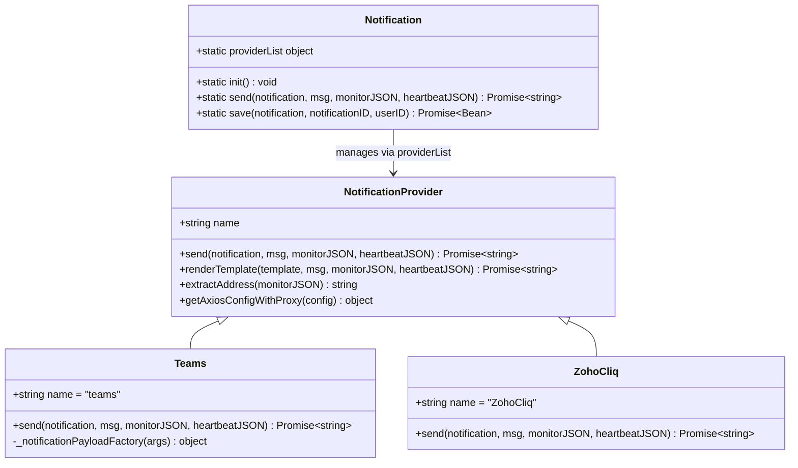
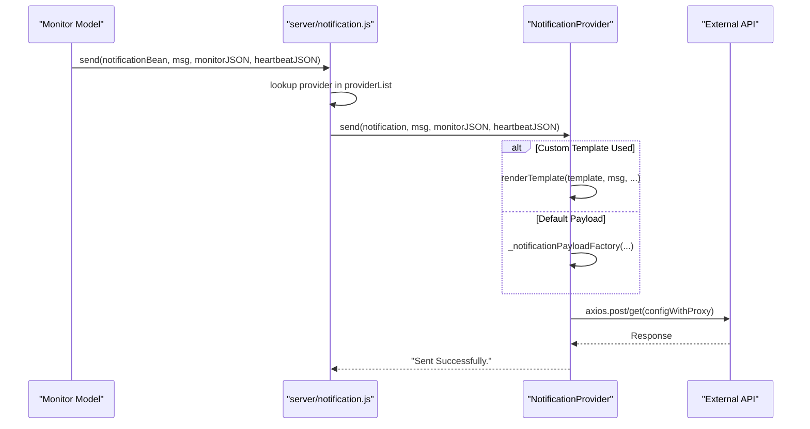

# Notification System

<details>
<summary>Relevant source files</summary>

The following files were used as context for generating this wiki page:

- [server/notification-providers/egosms.js](server/notification-providers/egosms.js)
- [server/notification-providers/notification-provider.js](server/notification-providers/notification-provider.js)
- [server/notification-providers/sevenio.js](server/notification-providers/sevenio.js)
- [server/notification-providers/signl4.js](server/notification-providers/signl4.js)
- [server/notification-providers/squadcast.js](server/notification-providers/squadcast.js)
- [server/notification-providers/teams.js](server/notification-providers/teams.js)
- [server/notification-providers/vkteams.js](server/notification-providers/vkteams.js)
- [server/notification-providers/zoho-cliq.js](server/notification-providers/zoho-cliq.js)
- [server/notification.js](server/notification.js)
- [src/components/NotificationDialog.vue](src/components/NotificationDialog.vue)
- [src/components/notifications/EgoSMS.vue](src/components/notifications/EgoSMS.vue)
- [src/components/notifications/Squadcast.vue](src/components/notifications/Squadcast.vue)
- [src/components/notifications/Teams.vue](src/components/notifications/Teams.vue)
- [src/components/notifications/VKTeams.vue](src/components/notifications/VKTeams.vue)
- [src/components/notifications/ZohoCliq.vue](src/components/notifications/ZohoCliq.vue)
- [src/components/notifications/index.js](src/components/notifications/index.js)
- [src/lang/en.json](src/lang/en.json)

</details>


## Purpose and Scope

The Notification System delivers alerts when monitor status changes or other events occur in Uptime Kuma. The system supports 90+ notification providers [server/notification.js:113-200]() organized into categories: email services, chat platforms, SMS services, push notification services, incident management platforms, home automation systems, and regional services [src/components/NotificationDialog.vue:16-96](). Each notification method is implemented as a separate provider class extending `NotificationProvider` [server/notification-providers/notification-provider.js:7-7]().

Notifications are triggered by several primary events:
- Monitor status changes (DOWN → UP or UP → DOWN) [server/notification-providers/teams.js:17-21]()
- Certificate expiry warnings [server/notification-providers/sevenio.js:30-34]()
- Manual test notifications [src/components/NotificationDialog.vue:144-146]()

For provider-specific details, see [Notification Providers](#4.1). For configuration and templating details, see [Notification Configuration](#4.2).

## System Architecture

The notification system is built around a central `Notification` class that manages a registry of notification providers. Each provider implements a common interface for sending messages with monitor and heartbeat context.

### Core Architecture Diagram

```mermaid
graph TB
    subgraph "Frontend Configuration"
        NotificationDialog["NotificationDialog.vue<br/>Modal component"]
        NotificationFormList["NotificationFormList<br/>src/components/notifications/index.js"]
        DiscordVue["Discord.vue"]
        SMTPVue["SMTP.vue"]
        TeamsVue["Teams.vue"]
        OtherForms["90+ other .vue forms"]
    end
    
    subgraph "Backend Core - server/notification.js"
        NotificationInit["Notification.init()<br/>line 108"]
        NotificationSend["Notification.send()<br/>line 235"]
        NotificationSave["Notification.save()<br/>line 250"]
        ProviderListObj["this.providerList{}<br/>Registry object"]
    end
    
    subgraph "Provider Base - notification-provider.js"
        ProviderBase["NotificationProvider<br/>Base class"]
        ProviderSend["send(notification, msg,<br/>monitorJSON, heartbeatJSON)"]
    end
    
    subgraph "Provider Implementations"
        SMTPProvider["SMTP<br/>server/notification-providers/smtp.js"]
        DiscordProvider["Discord<br/>server/notification-providers/discord.js"]
        TeamsProvider["Teams<br/>server/notification-providers/teams.js"]
        OtherProviders["90+ other providers"]
    end
    
    subgraph "Database Layer - RedBean"
        NotificationTable["notification table<br/>R.dispense('notification')"]
    end
    
    NotificationDialog --> NotificationFormList
    NotificationFormList --> DiscordVue
    NotificationFormList --> SMTPVue
    NotificationFormList --> TeamsVue
    NotificationFormList --> OtherForms
    
    NotificationDialog -.->|"socket.emit('addNotification')"| NotificationSave
    NotificationDialog -.->|"socket.emit('testNotification')"| NotificationSend
    
    NotificationInit --> ProviderListObj
    NotificationSend --> ProviderListObj
    ProviderListObj --> ProviderBase
    
    ProviderBase <|-- SMTPProvider
    ProviderBase <|-- DiscordProvider
    ProviderBase <|-- TeamsProvider
    
    NotificationSave --> NotificationTable
```

**Sources:** [server/notification.js:108-250](), [src/components/NotificationDialog.vue:1-112](), [src/components/notifications/index.js:100-195](), [server/notification-providers/notification-provider.js:7-25]()

## Notification Provider Pattern

All notification providers inherit from the `NotificationProvider` base class. The system uses a static registry pattern through the `Notification` class to instantiate and register providers at server startup [server/notification.js:108-111]().

### Provider Class Hierarchy



**Sources:** [server/notification-providers/notification-provider.js:7-113](), [server/notification-providers/teams.js:6-62](), [server/notification-providers/zoho-cliq.js:5-72](), [server/notification.js:99-235]()

### Provider Categories

Providers are grouped in the UI to help users navigate the extensive list of integrations:

| Category | Description | Implementation Examples |
|----------|-------------|-------------------------|
| **Universal** | Multi-service gateways | [Apprise](), [Webhook]() |
| **Chat Platforms** | Real-time messaging | [Discord](), [Slack](), [Telegram](), [Teams]() |
| **Push Services** | Mobile/Desktop push | [Gotify](), [Pushover](), [Bark]() |
| **Email** | Standard mail services | [SMTP](), [Resend](), [SendGrid](), [Brevo]() |
| **Incident Management** | On-call and ticketing | [PagerDuty](), [Opsgenie](), [Squadcast]() |
| **Regional** | Country-specific services | [AliyunSms](), [Feishu](), [WeCom](), [SevenIO]() |

**Sources:** [src/components/NotificationDialog.vue:16-96](), [src/components/notifications/index.js:100-195]()

## Notification Lifecycle and Message Flow

The notification system is triggered when monitor status changes or when testing configurations. The flow involves multiple steps from heartbeat processing to external service delivery.

### Notification Trigger Flow



**Sources:** [server/notification.js:235-241](), [server/notification-providers/notification-provider.js:75-113](), [server/notification-providers/teams.js:62-187](), [server/notification-providers/vkteams.js:10-41]()

### Retry and Resend Logic

Monitors support a `resendInterval` setting ("Resend Notification if Down X times consecutively") [src/lang/en.json:94-94](). If configured, the system will re-trigger notifications at the specified heartbeat count while a monitor remains in a DOWN state [src/lang/en.json:98-98]().

## Provider Registration and Initialization

The system initializes all available providers at startup through `Notification.init()` [server/notification.js:108](). This method populates the `providerList` with instances of every supported provider [server/notification.js:113-200]().

Each provider must be registered in two places:
1. **Backend**: Added to the list in `Notification.init()` [server/notification.js:113-200]().
2. **Frontend**: Added to `NotificationFormList` in `src/components/notifications/index.js` [src/components/notifications/index.js:100-195]().

**Sources:** [server/notification.js:108-201](), [src/components/notifications/index.js:100-195]()

## Frontend Configuration Interface

The `NotificationDialog.vue` component provides the interface for creating and editing notifications. It dynamically renders the correct configuration form based on the selected type using the `<component :is="currentForm" />` pattern [src/components/NotificationDialog.vue:112-112]().

### Configuration Components

- **Friendly Name**: A unique identifier for the notification within Uptime Kuma [src/components/NotificationDialog.vue:101-109]().
- **Default Enabled**: If checked, this notification is automatically added to all new monitors [src/components/NotificationDialog.vue:117-123]().
- **Apply to Existing**: A one-time action to link this notification to all current monitors [src/components/NotificationDialog.vue:127-131]().

**Sources:** [src/components/NotificationDialog.vue:1-131](), [src/lang/en.json:79-80]()
