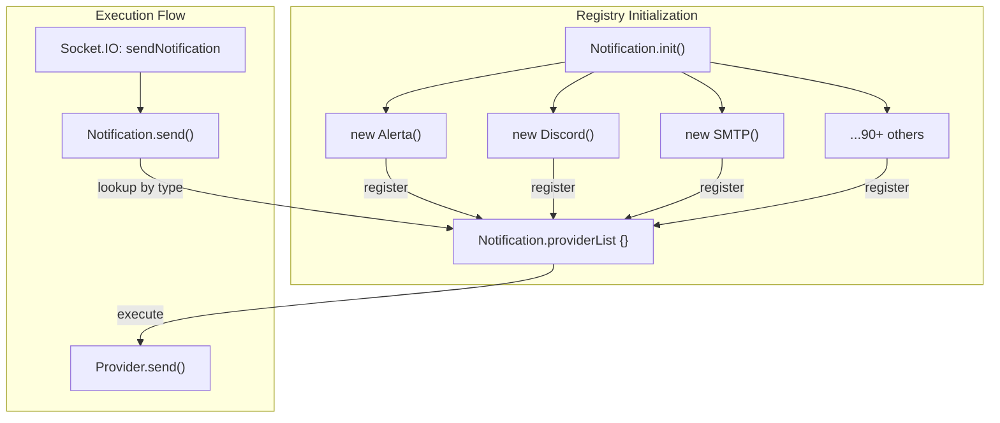

# Notification Providers

<details>
<summary>Relevant source files</summary>

The following files were used as context for generating this wiki page:

- [.github/workflows/npm-update.yml](.github/workflows/npm-update.yml)
- [server/notification-providers/alerta.js](server/notification-providers/alerta.js)
- [server/notification-providers/alertnow.js](server/notification-providers/alertnow.js)
- [server/notification-providers/aliyun-sms.js](server/notification-providers/aliyun-sms.js)
- [server/notification-providers/bark.js](server/notification-providers/bark.js)
- [server/notification-providers/clicksendsms.js](server/notification-providers/clicksendsms.js)
- [server/notification-providers/dingding.js](server/notification-providers/dingding.js)
- [server/notification-providers/discord.js](server/notification-providers/discord.js)
- [server/notification-providers/feishu.js](server/notification-providers/feishu.js)
- [server/notification-providers/flashduty.js](server/notification-providers/flashduty.js)
- [server/notification-providers/fluxer.js](server/notification-providers/fluxer.js)
- [server/notification-providers/goalert.js](server/notification-providers/goalert.js)
- [server/notification-providers/google-chat.js](server/notification-providers/google-chat.js)
- [server/notification-providers/gorush.js](server/notification-providers/gorush.js)
- [server/notification-providers/gotify.js](server/notification-providers/gotify.js)
- [server/notification-providers/heii-oncall.js](server/notification-providers/heii-oncall.js)
- [server/notification-providers/kook.js](server/notification-providers/kook.js)
- [server/notification-providers/line.js](server/notification-providers/line.js)
- [server/notification-providers/lunasea.js](server/notification-providers/lunasea.js)
- [server/notification-providers/matrix.js](server/notification-providers/matrix.js)
- [server/notification-providers/mattermost.js](server/notification-providers/mattermost.js)
- [server/notification-providers/ntfy.js](server/notification-providers/ntfy.js)
- [server/notification-providers/octopush.js](server/notification-providers/octopush.js)
- [server/notification-providers/onebot.js](server/notification-providers/onebot.js)
- [server/notification-providers/opsgenie.js](server/notification-providers/opsgenie.js)
- [server/notification-providers/pagerduty.js](server/notification-providers/pagerduty.js)
- [server/notification-providers/pagertree.js](server/notification-providers/pagertree.js)
- [server/notification-providers/promosms.js](server/notification-providers/promosms.js)
- [server/notification-providers/pushbullet.js](server/notification-providers/pushbullet.js)
- [server/notification-providers/pushdeer.js](server/notification-providers/pushdeer.js)
- [server/notification-providers/pushover.js](server/notification-providers/pushover.js)
- [server/notification-providers/pushy.js](server/notification-providers/pushy.js)
- [server/notification-providers/resend.js](server/notification-providers/resend.js)
- [server/notification-providers/rocket-chat.js](server/notification-providers/rocket-chat.js)
- [server/notification-providers/signal.js](server/notification-providers/signal.js)
- [server/notification-providers/slack.js](server/notification-providers/slack.js)
- [server/notification-providers/smsc.js](server/notification-providers/smsc.js)
- [server/notification-providers/smtp.js](server/notification-providers/smtp.js)
- [server/notification-providers/splunk.js](server/notification-providers/splunk.js)
- [server/notification-providers/stackfield.js](server/notification-providers/stackfield.js)
- [server/notification-providers/telegram.js](server/notification-providers/telegram.js)
- [server/notification-providers/webhook.js](server/notification-providers/webhook.js)
- [server/notification-providers/wecom.js](server/notification-providers/wecom.js)
- [server/notification-providers/whapi.js](server/notification-providers/whapi.js)
- [src/components/notifications/AliyunSms.vue](src/components/notifications/AliyunSms.vue)
- [src/components/notifications/Apprise.vue](src/components/notifications/Apprise.vue)
- [src/components/notifications/Bark.vue](src/components/notifications/Bark.vue)
- [src/components/notifications/ClickSendSMS.vue](src/components/notifications/ClickSendSMS.vue)
- [src/components/notifications/DingDing.vue](src/components/notifications/DingDing.vue)
- [src/components/notifications/Discord.vue](src/components/notifications/Discord.vue)
- [src/components/notifications/Feishu.vue](src/components/notifications/Feishu.vue)
- [src/components/notifications/FlashDuty.vue](src/components/notifications/FlashDuty.vue)
- [src/components/notifications/Fluxer.vue](src/components/notifications/Fluxer.vue)
- [src/components/notifications/GoAlert.vue](src/components/notifications/GoAlert.vue)
- [src/components/notifications/GoogleChat.vue](src/components/notifications/GoogleChat.vue)
- [src/components/notifications/Gorush.vue](src/components/notifications/Gorush.vue)
- [src/components/notifications/Gotify.vue](src/components/notifications/Gotify.vue)
- [src/components/notifications/HeiiOnCall.vue](src/components/notifications/HeiiOnCall.vue)
- [src/components/notifications/HomeAssistant.vue](src/components/notifications/HomeAssistant.vue)
- [src/components/notifications/Kook.vue](src/components/notifications/Kook.vue)
- [src/components/notifications/Line.vue](src/components/notifications/Line.vue)
- [src/components/notifications/LunaSea.vue](src/components/notifications/LunaSea.vue)
- [src/components/notifications/Matrix.vue](src/components/notifications/Matrix.vue)
- [src/components/notifications/Mattermost.vue](src/components/notifications/Mattermost.vue)
- [src/components/notifications/Ntfy.vue](src/components/notifications/Ntfy.vue)
- [src/components/notifications/Octopush.vue](src/components/notifications/Octopush.vue)
- [src/components/notifications/Opsgenie.vue](src/components/notifications/Opsgenie.vue)
- [src/components/notifications/PromoSMS.vue](src/components/notifications/PromoSMS.vue)
- [src/components/notifications/PushDeer.vue](src/components/notifications/PushDeer.vue)
- [src/components/notifications/Pushbullet.vue](src/components/notifications/Pushbullet.vue)
- [src/components/notifications/Pushover.vue](src/components/notifications/Pushover.vue)
- [src/components/notifications/Pushy.vue](src/components/notifications/Pushy.vue)
- [src/components/notifications/Resend.vue](src/components/notifications/Resend.vue)
- [src/components/notifications/RocketChat.vue](src/components/notifications/RocketChat.vue)
- [src/components/notifications/SMSC.vue](src/components/notifications/SMSC.vue)
- [src/components/notifications/SMSManager.vue](src/components/notifications/SMSManager.vue)
- [src/components/notifications/SMTP.vue](src/components/notifications/SMTP.vue)
- [src/components/notifications/Signal.vue](src/components/notifications/Signal.vue)
- [src/components/notifications/Slack.vue](src/components/notifications/Slack.vue)
- [src/components/notifications/Telegram.vue](src/components/notifications/Telegram.vue)
- [src/components/notifications/WeCom.vue](src/components/notifications/WeCom.vue)
- [src/components/notifications/Webhook.vue](src/components/notifications/Webhook.vue)
- [src/components/notifications/Whapi.vue](src/components/notifications/Whapi.vue)

</details>


Notification providers in Uptime Kuma enable the system to send alerts through various external services when monitor status changes. The system includes over 90 different notification providers, ranging from email services and messaging platforms to webhooks and SMS gateways. This document details the notification system architecture, available providers, and implementation details.

## Architecture Overview

The notification system is built around two main components:

1.  The `Notification` class in `server/notification.js` - Manages all provider registrations and handles notification operations [server/notification.js:96-224]().
2.  The `NotificationProvider` base class - Defines the interface that all notification providers implement.

### Class Relationship Diagram
This diagram bridges the "Natural Language Space" of notification concepts to the "Code Entity Space" of classes and methods.

```mermaid
classDiagram
    class NotificationProvider {
        <<abstract>>
        +name: string
        +send(notification, msg, monitorJSON, heartbeatJSON): Promise
        #renderTemplate(template, msg, monitorJSON, heartbeatJSON): string
        #getAxiosConfigWithProxy(config): object
    }
    
    class Notification {
        +providerList: object
        +static init(): void
        +static send(notification, msg, monitorJSON, heartbeatJSON): Promise
        +static checkApprise(): boolean
    }
    
    class SMTP {
        +name: "smtp"
        +send(notification, msg, monitorJSON, heartbeatJSON): Promise
    }
    
    class Telegram {
        +name: "telegram"
        +send(notification, msg, monitorJSON, heartbeatJSON): Promise
    }
    
    class Discord {
        +name: "discord"
        +send(notification, msg, monitorJSON, heartbeatJSON): Promise
    }
    
    NotificationProvider <|-- SMTP
    NotificationProvider <|-- Telegram
    NotificationProvider <|-- Discord
    NotificationProvider <|-- "90+ Other Providers..."
    
    Notification o-- NotificationProvider : "manages in providerList"
```
Sources: [server/notification.js:96-108](), [server/notification-providers/discord.js:6-7](), [server/notification-providers/smtp.js:5-6](), [server/notification-providers/telegram.js:4-5]()

## Provider Registration and Management

Notification providers are registered during the server initialization phase via `Notification.init()`. This method instantiates every provider class and stores them in a central registry [server/notification.js:105-184]().

### Provider Initialization Flow
The following diagram illustrates how the `Notification` singleton prepares the provider registry.


Sources: [server/notification.js:108-184](), [server/notification.js:186-192]()

## System Integration and UI

The frontend utilizes a dynamic component system to render specific configuration forms for each provider.

1.  **NotificationDialog.vue**: The primary modal for managing notifications. It uses a `<select>` to switch between provider types [src/components/NotificationDialog.vue:15-97]().
2.  **NotificationFormList**: A mapping in `src/components/notifications/index.js` that associates provider keys with Vue components [src/components/notifications/index.js:97-189]().
3.  **Templated Components**: Fields that support Liquid templates use `TemplatedInput.vue` or `TemplatedTextarea.vue` [src/components/notifications/Ntfy.vue:126-142]().

### Provider Categories
Providers are organized into categories in the UI for better discoverability:
*   **Universal**: Apprise, Webhook [src/components/NotificationDialog.vue:16-24]().
*   **Chat Platforms**: Telegram, Discord, Slack, Matrix, Mattermost [src/components/NotificationDialog.vue:25-33]().
*   **Push Services**: Pushover, Pushbullet, Gotify, Ntfy [src/components/NotificationDialog.vue:34-42]().
*   **SMS Services**: Twilio, AliyunSMS, ClickSend [src/components/NotificationDialog.vue:43-51]().
*   **Incident Management**: PagerDuty, Opsgenie, Alerta [src/components/NotificationDialog.vue:61-69]().

Sources: [src/components/NotificationDialog.vue:16-96](), [src/components/notifications/index.js:97-189]()

## Implementation Details for Major Providers

### Telegram
The Telegram provider communicates with the Telegram Bot API. It supports an "Auto Get" feature to retrieve the `Chat ID` from recent bot updates [src/components/notifications/Telegram.vue:30-33]().
*   **Key Fields**: `telegramBotToken`, `telegramChatID`, `telegramMessageThreadID` [src/components/notifications/Telegram.vue:4-57]().
*   **Features**: Supports custom templates, MarkdownV2/HTML parsing modes, and silent notifications [src/components/notifications/Telegram.vue:71-131]().
*   **Escaping**: Implements `escapeMarkdownV2` and `escapeObjectRecursive` to ensure template data doesn't break Telegram's formatting [server/notification-providers/telegram.js:12-46]().

### Discord
Discord utilizes webhooks to send rich embeds.
*   **Message Formats**: Supports `normal`, `minimalist` (text-only status), and `custom` (Liquid template) [server/notification-providers/discord.js:38-40]().
*   **Rich Content**: Automatically generates embeds with color coding (Green for UP, Red for DOWN) and timestamps [server/notification-providers/discord.js:122-131]().
*   **Threading**: Supports posting to specific threads or creating new forum posts [server/notification-providers/discord.js:24-26](), [server/notification-providers/discord.js:59-61]().

### Slack
Slack integration supports both plain text and rich "Block Kit" messages [server/notification-providers/slack.js:196-200]().
*   **Interactivity**: Can include buttons to "Visit Uptime Kuma" or "Visit site" directly in the message [server/notification-providers/slack.js:36-69]().
*   **Rich Layout**: Uses `buildBlocks` to construct structured JSON for Slack's Block Kit API [server/notification-providers/slack.js:81-135]().

### SMTP (Email)
The SMTP provider uses `nodemailer` for mail delivery [server/notification-providers/smtp.js:1]().
*   **Security**: Supports STARTTLS, implicit TLS (SMTPS), and the ability to ignore TLS errors for self-signed certificates [server/notification-providers/smtp.js:22-36]().
*   **Authentication**: Supports standard username/password and DKIM signing [server/notification-providers/smtp.js:39-56]().
*   **Recipients**: Allows multiple `To`, `CC`, and `BCC` addresses [src/components/notifications/SMTP.vue:113-147]().

### Ntfy
Ntfy is a simple HTTP-based pub-sub notification service.
*   **Priority**: Allows setting different priorities for UP and DOWN events (1-5) [src/components/notifications/Ntfy.vue:20-41]().
*   **Authentication**: Supports Username/Password or Access Tokens [src/components/notifications/Ntfy.vue:67-87]().
*   **Features**: Supports voice calls via `X-Call` header and monitor tag inclusion in notification tags [server/notification-providers/ntfy.js:27-29](), [server/notification-providers/ntfy.js:78-88]().

### Google Chat
Google Chat utilizes webhooks to send card-based notifications [server/notification-providers/google-chat.js:122-130]().
*   **Rate Limiting**: Implements a retry mechanism with exponential backoff specifically for 429 status codes [server/notification-providers/google-chat.js:16-36]().
*   **Formatting**: Supports both basic text templates and structured `cardsV2` layouts with widgets [server/notification-providers/google-chat.js:41-117]().

### Aliyun SMS (Regional)
A specialized provider for the Chinese market.
*   **Compliance**: Implements a `removeIpAndDomain` helper to strip IPs and URLs from messages to comply with Aliyun's strict SMS content regulations [server/notification-providers/aliyun-sms.js:150-175]().
*   **Signing**: Implements the complex HMAC-SHA1 request signing required by the Aliyun API [server/notification-providers/aliyun-sms.js:95-127]().

## Notification Lifecycle

When a monitor "beat" results in a status change, the following data flow occurs:

1.  **Detection**: The monitor logic determines a status change (e.g., UP to DOWN).
2.  **Formatting**: A message string is generated (e.g., `[Monitor Name] [Down] Connection Timeout`).
3.  **Dispatch**: `Notification.send()` is called with the notification bean, message, and monitor/heartbeat JSON data [server/notification.js:186]().
4.  **Templating**: If the provider supports templates, `this.renderTemplate()` (inherited from `NotificationProvider`) processes the user's Liquid template using the provided JSON context [server/notification-providers/notification-provider.js]().
5.  **Transport**: The provider uses `axios` (for webhooks/APIs) or specialized libraries (like `nodemailer`) to reach the external service [server/notification-providers/discord.js:65](), [server/notification-providers/smtp.js:93]().

Sources: [server/notification.js:186-192](), [server/notification-providers/discord.js:12-67](), [server/notification-providers/smtp.js:11-102](), [server/notification-providers/google-chat.js:12-137]()
