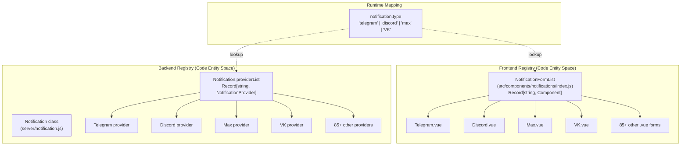
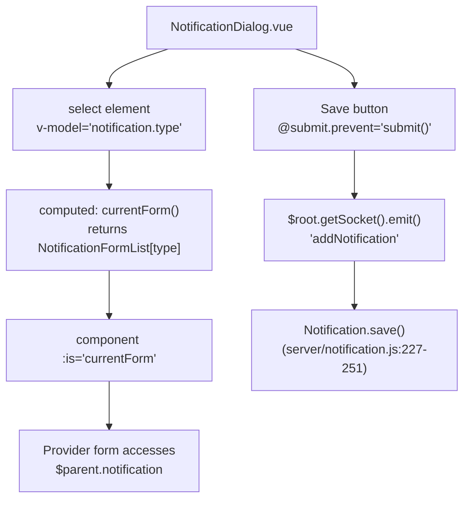
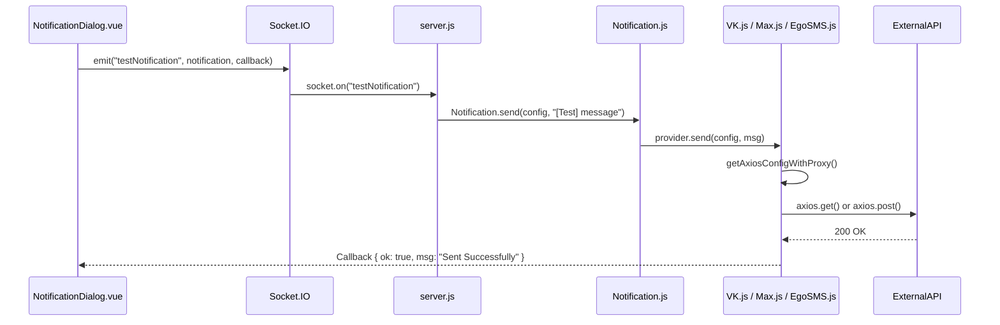

# Notification Configuration

<details>
<summary>Relevant source files</summary>

The following files were used as context for generating this wiki page:

- [db/knex_migrations/2023-10-16-0000-create-remote-browsers.js](db/knex_migrations/2023-10-16-0000-create-remote-browsers.js)
- [server/model/remote_browser.js](server/model/remote_browser.js)
- [server/notification-providers/egosms.js](server/notification-providers/egosms.js)
- [server/notification-providers/vkteams.js](server/notification-providers/vkteams.js)
- [server/notification.js](server/notification.js)
- [server/remote-browser.js](server/remote-browser.js)
- [server/socket-handlers/remote-browser-socket-handler.js](server/socket-handlers/remote-browser-socket-handler.js)
- [src/components/ActionInput.vue](src/components/ActionInput.vue)
- [src/components/ActionSelect.vue](src/components/ActionSelect.vue)
- [src/components/NotificationDialog.vue](src/components/NotificationDialog.vue)
- [src/components/notifications/EgoSMS.vue](src/components/notifications/EgoSMS.vue)
- [src/components/notifications/VKTeams.vue](src/components/notifications/VKTeams.vue)
- [src/components/notifications/index.js](src/components/notifications/index.js)
- [src/components/settings/Notifications.vue](src/components/settings/Notifications.vue)
- [src/components/settings/RemoteBrowsers.vue](src/components/settings/RemoteBrowsers.vue)
- [src/lang/en.json](src/lang/en.json)

</details>


This page documents the notification configuration system in Uptime Kuma, including the `NotificationDialog.vue` component, the `NotificationFormList` registry, provider registration, the Liquid template engine for custom messages, and Socket.IO-based CRUD operations.

---

## Notification Setup Overview

Notifications are configured through the `NotificationDialog` component, which dynamically renders provider-specific forms from the `NotificationFormList` registry. The system supports 90+ providers organized into categories.

### Provider Registration System Architecture

The system maintains a parallel registry between the Vue.js frontend and the Node.js backend. When a user selects a "Notification Type", the frontend lookups the UI component while the backend uses the type string to instantiate the correct logic class.

**Data Flow and Entity Mapping**



**Sources:** [src/components/notifications/index.js:100-195](), [server/notification.js:108-201]()

### Notification Dialog Flow

The `NotificationDialog` acts as a wrapper that manages common metadata (Name, Is Default) while hosting dynamic sub-forms.



**Sources:** [src/components/NotificationDialog.vue:15-112](), [src/components/NotificationDialog.vue:434-449](), [server/notification.js:227-251]()

---

## NotificationFormList Registry

The `NotificationFormList` object in `src/components/notifications/index.js` maps provider type strings to Vue components.

### Category Organization
The `NotificationDialog` groups providers into categories to improve UX using the `notificationNameList` object.

| Category | Translation Key | Examples |
|----------|-----|----------|
| Universal | `notificationUniversal` | Apprise, Webhook |
| Chat Platforms | `notificationChatPlatforms` | Telegram, Discord, Slack, Mattermost, VKTeams |
| Push Services | `notificationPushServices` | Pushover, Gotify, Ntfy, Bark |
| SMS Services | `notificationSmsServices` | Twilio, AliyunSMS, SMSIR, EgoSMS |
| Email | `notificationEmail` | SMTP, Resend, SendGrid |
| Incident Management | `notificationIncidentManagement` | PagerDuty, Opsgenie, HaloPSA |
| Home Automation | `notificationHomeAutomation` | Home Assistant |
| Other | `notificationOther` | Google Sheets, Splunk |
| Regional | `regional` | WeCom, DingDing, Feishu |

**Sources:** [src/components/NotificationDialog.vue:16-96](), [src/components/notifications/index.js:100-195]()

---

## Custom Messages with Liquid Templates

Uptime Kuma uses the `liquidjs` engine to allow users to customize notification content for supported providers (e.g., Webhook, Max, VKTeams).

### Template Engine Integration
The `NotificationProvider` base class provides a `renderTemplate` method that populates a Liquid context with monitor and heartbeat data.

**Variables available in templates:**
*   `status`: Status string (e.g., "✅ Up" or "🔴 Down")
*   `name`: Monitor friendly name
*   `hostnameOrURL`: The address being monitored
*   `msg`: The specific error or status message
*   `monitorJSON`: Full monitor object
*   `heartbeatJSON`: Full heartbeat object

**Implementation Detail:**
The `renderTemplate` function is invoked by individual providers like `VKTeams` when `vkteamsUseTemplate` is enabled.

**Sources:** [server/notification-providers/vkteams.js:21-32](), [server/notification-providers/egosms.js:10-21]()

---

## Testing Notifications

The "Test" button allows immediate validation of provider settings without waiting for a monitor event.



**Sources:** [src/components/NotificationDialog.vue:455-461](), [server/notification.js:212-218](), [server/notification-providers/vkteams.js:10-45](), [server/notification-providers/egosms.js:10-31]()

---

## Notification Settings and Expiry

Global notification behaviors are managed in `src/components/settings/Notifications.vue`.

### Toast Configuration
Users can configure the duration of UI toast messages for successes and errors. These values are persisted in `localStorage`.
*   `toastSuccessTimeoutSecs`: Default 20s. [src/components/settings/Notifications.vue:149]()
*   `toastErrorTimeoutSecs`: Default -1 (infinite). [src/components/settings/Notifications.vue:150]()

### Certificate and Domain Expiry
Uptime Kuma triggers notifications when SSL certificates or domains are nearing expiration.
*   **TLS Expiry:** Users add specific "days before" thresholds via `tlsExpiryNotifyDays`. [src/components/settings/Notifications.vue:63]()
*   **Domain Expiry:** Similar threshold system using `domainExpiryNotifyDays`. [src/components/settings/Notifications.vue:101]()

**Sources:** [src/components/settings/Notifications.vue:25-55](), [src/components/settings/Notifications.vue:58-131](), [src/components/settings/Notifications.vue:173-184]()

---

## Creating and Saving Notifications

### Save Logic
When a notification is saved, it is stored as a JSON blob in the `config` column of the `notification` table.

```javascript
// server/notification.js:227-251
static async save(notification, notificationID, userID) {
    let bean;
    if (notificationID) {
        bean = await R.findOne("notification", " id = ? AND user_id = ? ", [ notificationID, userID ]);
    } else {
        bean = R.dispense("notification");
    }
    bean.name = notification.name;
    bean.config = JSON.stringify(notification);
    bean.is_default = notification.isDefault || false;
    // ... store and apply to monitors
}
```

### Batch Application
If `applyExisting` is checked in the UI, the backend iterates through all existing monitors and associates the new notification ID in the `monitor_notification` junction table.

**Sources:** [server/notification.js:231-251](), [server/notification.js:284-300](), [src/components/NotificationDialog.vue:127-131]()
