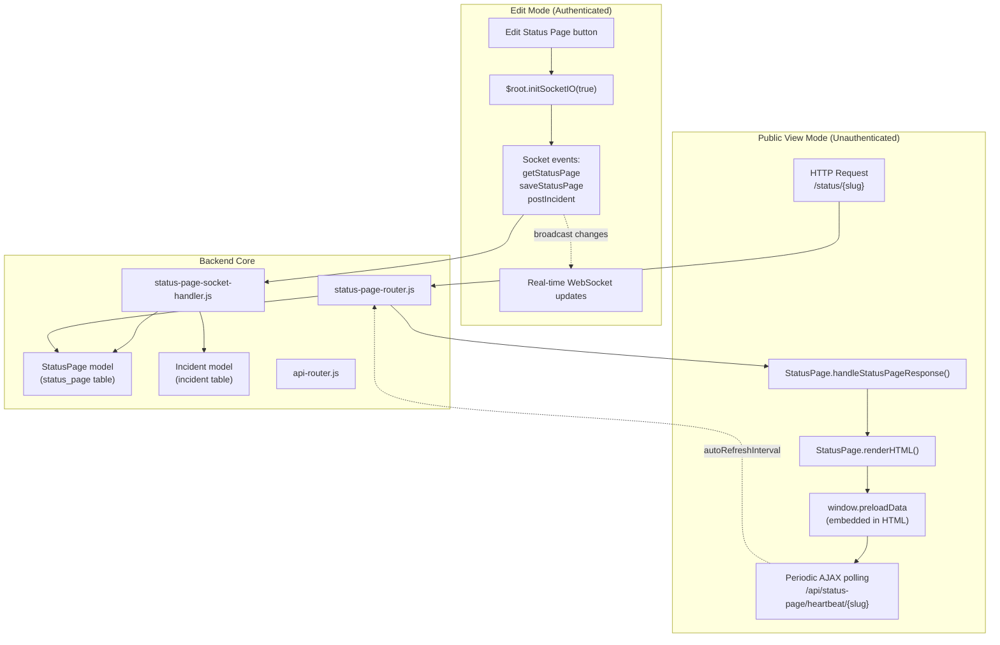
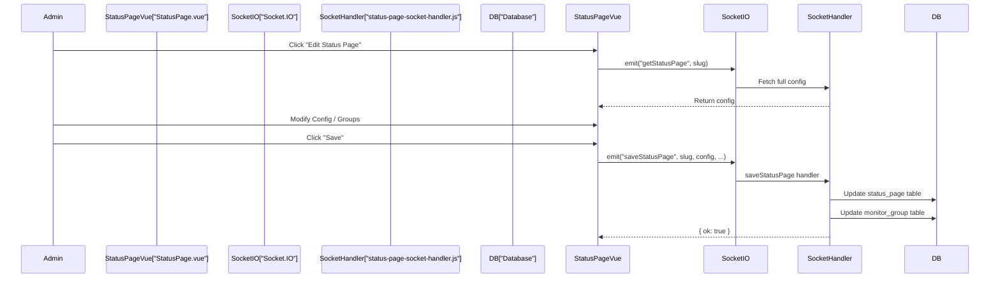

# Status Pages

<details>
<summary>Relevant source files</summary>

The following files were used as context for generating this wiki page:

- [server/model/status_page.js](server/model/status_page.js)
- [server/routers/api-router.js](server/routers/api-router.js)
- [server/routers/status-page-router.js](server/routers/status-page-router.js)
- [server/socket-handlers/status-page-socket-handler.js](server/socket-handlers/status-page-socket-handler.js)
- [src/pages/AddStatusPage.vue](src/pages/AddStatusPage.vue)
- [src/pages/ManageStatusPage.vue](src/pages/ManageStatusPage.vue)
- [src/pages/StatusPage.vue](src/pages/StatusPage.vue)

</details>


Status pages provide a public-facing interface for displaying the operational status of monitored services without requiring authentication. They serve as the primary public communication channel for service availability, designed to be accessed by end users, customers, or stakeholders who need visibility into system health.

## Purpose and Use Cases

Status pages in Uptime Kuma serve several key purposes:

1.  **Public Service Status Display**: Present real-time operational status of monitored services to external users.
2.  **Incident Communication**: Display active incidents and maintenance windows with markdown-formatted descriptions.
3.  **Historical Visibility**: Show uptime history through heartbeat bars (typically 100-beat windows in the UI).
4.  **Multi-Tenancy Support**: Create separate branded status pages for different products, teams, or customers.
5.  **SEO-Optimized Access**: Server-side rendered HTML ensures search engine indexability and fast initial page loads.

Each status page is identified by a unique `slug` and accessible at `/status/{slug}`. The system supports unlimited status pages, each with independent configuration, monitor groups, and customization options.

For detailed configuration options, see [Status Page Configuration](#5.1).
For incident management, see [Incident Management](#5.2).

**Sources:** [src/pages/StatusPage.vue:1-50](), [server/model/status_page.js:13-62](), [server/routers/status-page-router.js:85-95]()

## Key Concepts

| Concept | Description |
| :--- | :--- |
| **Slug** | Unique URL identifier (e.g., `/status/my-service`) using only `a-z`, `0-9`, and `-`. [src/pages/AddStatusPage.vue:23-53]() |
| **Public Groups** | Collections of monitors displayed together on the status page. [server/routers/status-page-router.js:75-83]() |
| **Overall Status** | Aggregated status calculated from all public monitors (All Up, Partial Down, All Down, Maintenance). [src/util.js:14-22]() |
| **Edit Mode** | Authenticated mode allowing real-time configuration via WebSocket. [src/pages/StatusPage.vue:4-148]() |
| **View Mode** | Public mode with periodic AJAX updates (no authentication required). [src/pages/StatusPage.vue:1200-1250]() |
| **SSR** | Server-side rendering with preloaded data embedded as `window.preloadData`. [server/model/status_page.js:160-196]() |

**Sources:** [src/pages/StatusPage.vue:4-148](), [server/model/status_page.js:160-196](), [src/util.js:14-22]()

## Architecture Overview

### Component Structure

Status pages operate in two distinct modes with different data flows:

**Title: Status Page Dual-Mode Architecture**



**Sources:** [src/pages/StatusPage.vue:1150-1200](), [server/model/status_page.js:57-71](), [server/socket-handlers/status-page-socket-handler.js:32-82](), [server/routers/status-page-router.js:16-43]()

## Server-Side Rendering (SSR)

Status pages use server-side rendering to ensure fast initial page loads and SEO compatibility. The SSR process embeds all initial data directly in the HTML response.

### SSR Request Flow

**Title: Server-Side Rendering Data Flow**

```mermaid
sequenceDiagram
    participant Browser
    participant ExpressRouter["Express Router<br/>(status-page-router.js)"]
    participant SSRHandler["StatusPage.handleStatusPageResponse()"]
    participant DataMethod["StatusPage.getStatusPageData()"]
    participant DB["SQLite/MariaDB"]
    participant Cheerio["cheerio HTML parser"]
    
    Browser->>ExpressRouter: GET /status/{slug}
    ExpressRouter->>SSRHandler: Route to handler
    SSRHandler->>DB: R.findOne("status_page", "slug = ?")
    DB-->>SSRHandler: status_page record
    
    SSRHandler->>DataMethod: getStatusPageData(statusPage)
    DataMethod->>DB: Load config, public groups, incidents
    DB-->>DataMethod: All status page data
    DataMethod-->>SSRHandler: Complete data object
    
    SSRHandler->>Cheerio: Load index.html template
    SSRHandler->>Cheerio: Set title and meta tags
    SSRHandler->>Cheerio: Embed window.preloadData = jsesc(data)
    Cheerio-->>SSRHandler: Modified HTML
    
    SSRHandler-->>ExpressRouter: HTML response
    ExpressRouter-->>Browser: Fully rendered HTML
```

**Sources:** [server/model/status_page.js:57-71](), [server/model/status_page.js:160-196](), [server/routers/status-page-router.js:16-20]()

### Data Preloading

The `getStatusPageData()` method aggregates all necessary data for the initial render, including configuration, the current incident, maintenance windows, and the list of public monitor groups with their current status.

**Sources:** [server/model/status_page.js:258-297]()

## Public vs. Edit Mode

### View Mode (Public Access)

In view mode, status pages refresh via periodic AJAX polling to `/api/status-page/heartbeat/:slug`. The frequency is determined by the `autoRefreshInterval` configuration.

**Sources:** [src/pages/StatusPage.vue:1200-1250](), [server/routers/status-page-router.js:64-110]()

### Edit Mode (Authenticated)

Edit mode uses WebSocket for real-time updates and configuration changes. When an admin enters edit mode, the frontend initializes a Socket.IO connection to handle events like `saveStatusPage`, `postIncident`, and `deleteStatusPage`.

**Title: Edit Mode WebSocket Communication**



**Sources:** [src/pages/StatusPage.vue:830-873](), [server/socket-handlers/status-page-socket-handler.js:32-82](), [server/socket-handlers/status-page-socket-handler.js:230-300]()

## Overall Status Calculation

The status page displays an overall status based on the aggregation of all monitors in its public groups. This is calculated by checking the latest heartbeat of every monitor associated with the status page.

| Status Constant | Code Value | Logic |
| :--- | :--- | :--- |
| `STATUS_PAGE_ALL_UP` | `1` | All public monitors are UP. |
| `STATUS_PAGE_ALL_DOWN` | `0` | All public monitors are DOWN. |
| `STATUS_PAGE_PARTIAL_DOWN` | `2` | Some monitors are UP, some are DOWN. |
| `STATUS_PAGE_MAINTENANCE` | `3` | One or more monitors are in MAINTENANCE. |

**Sources:** [src/util.js:14-22](), [server/routers/status-page-router.js:195-219]()
