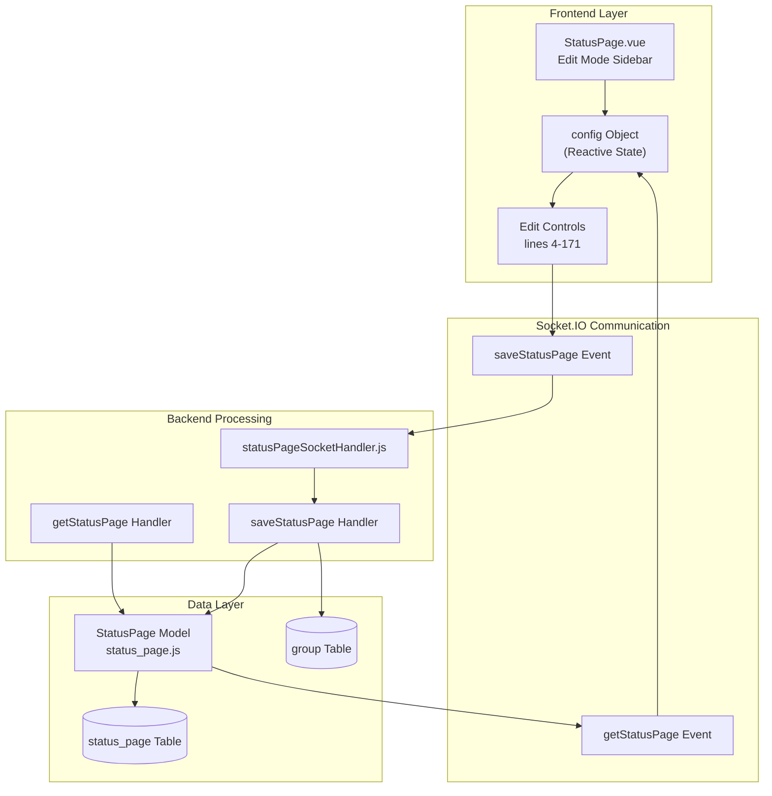
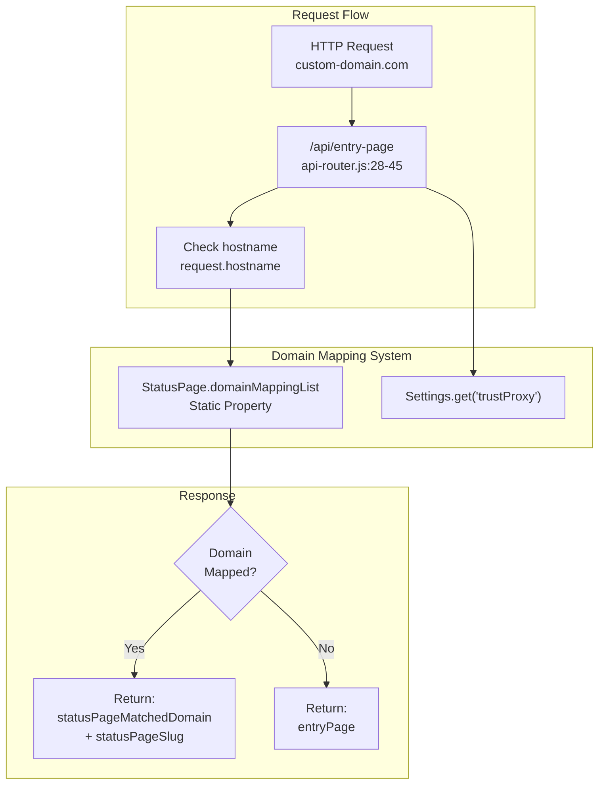

# Status Page Configuration

Relevant source files

The following files were used as context for generating this wiki page:

- [db/knex_init_db.js](db/knex_init_db.js)
- [db/knex_migrations/2025-02-17-2142-generalize-analytics.js](db/knex_migrations/2025-02-17-2142-generalize-analytics.js)
- [db/knex_migrations/2026-06-19-1411-add-rybbit-analytics-type.js](db/knex_migrations/2026-06-19-1411-add-rybbit-analytics-type.js)
- [db/old_migrations/patch-fix-kafka-producer-booleans.sql](db/old_migrations/patch-fix-kafka-producer-booleans.sql)
- [db/old_migrations/patch-monitor-tls-info-add-fk.sql](db/old_migrations/patch-monitor-tls-info-add-fk.sql)
- [server/analytics/analytics.js](server/analytics/analytics.js)
- [server/analytics/google-analytics.js](server/analytics/google-analytics.js)
- [server/analytics/matomo-analytics.js](server/analytics/matomo-analytics.js)
- [server/analytics/plausible-analytics.js](server/analytics/plausible-analytics.js)
- [server/analytics/rybbit-analytics.js](server/analytics/rybbit-analytics.js)
- [server/analytics/umami-analytics.js](server/analytics/umami-analytics.js)
- [server/model/status_page.js](server/model/status_page.js)
- [server/routers/api-router.js](server/routers/api-router.js)
- [server/routers/status-page-router.js](server/routers/status-page-router.js)
- [server/socket-handlers/status-page-socket-handler.js](server/socket-handlers/status-page-socket-handler.js)
- [src/pages/AddStatusPage.vue](src/pages/AddStatusPage.vue)
- [src/pages/ManageStatusPage.vue](src/pages/ManageStatusPage.vue)
- [src/pages/StatusPage.vue](src/pages/StatusPage.vue)
- [test/backend-test/test-status-page.js](test/backend-test/test-status-page.js)
- [test/e2e/specs/status-page.spec.js](test/e2e/specs/status-page.spec.js)

## Purpose and Scope

This document describes the configuration system for Uptime Kuma status pages, covering customization options, appearance settings, domain mapping, and monitor group organization. For information about the overall status page architecture and rendering system, see [Status Pages](). For managing incidents on status pages, see [Incident Management]().

---

## Configuration Architecture

Status page configuration is managed through a combination of a frontend editing interface, Socket.IO event handlers, and database persistence. The configuration is stored in the `status_page` table and related tables for domain mappings and monitor groups.

**Sources:** [src/pages/StatusPage.vue:1-171](), [server/socket-handlers/status-page-socket-handler.js:32-262](), [server/model/status_page.js:24-149]()

---

## Basic Configuration Fields

### Slug

The **slug** is the URL-safe identifier for the status page, accessible at `/status/{slug}`. The slug must follow specific validation rules.

| Property | Validation Rule |
|----------|----------------|
| Character Set | `a-z`, `0-9`, `-` (dash) only |
| Format | No consecutive dashes |
| Case | Automatically converted to lowercase |
| Special | `default` slug is reserved for the default status page |

**Sources:** [src/pages/StatusPage.vue:7-12](), [server/routers/status-page-router.js:16-20](), [src/pages/AddStatusPage.vue:36-52]()

### Title and Description

The **title** appears as the page heading and browser tab title. The **description** supports markdown formatting and is displayed below the overall status indicator.

- **Field:** `config.title` → `status_page.title`
- **Field:** `config.description` → `status_page.description`
- **SEO:** First 155 characters of description (HTML stripped) used for `<meta name="description">` tag during Server-Side Rendering (SSR).

**Sources:** [src/pages/StatusPage.vue:14-29](), [server/model/status_page.js:160-169]()

---

## Appearance Customization

### Theme Selection

Status pages support three theme modes configured via the `config.theme` property:

| Theme Value | Behavior |
|------------|----------|
| `auto` | Follows system/browser preference |
| `light` | Forces light theme |
| `dark` | Forces dark theme |

**Sources:** [src/pages/StatusPage.vue:59-65]()

### Custom CSS

Status pages support custom CSS injection for advanced appearance customization. The CSS editor provides a text area for raw CSS input.

- **Field:** `config.customCSS` → `status_page.custom_css`
- **Injection:** Rendered server-side into the `<head>` of the status page.

**Sources:** [src/pages/StatusPage.vue:165-171](), [server/model/status_page.js:160-177]()

### Analytics Integrations

Uptime Kuma supports multiple analytics providers. The integration logic is abstracted into the `server/analytics/` directory.

| Provider | Configuration Fields | Code Implementation |
|----------|----------------------|---------------------|
| Google | GA4 Measurement ID | [server/analytics/google-analytics.js:1-12]() |
| Umami | Script URL, Website ID | [server/analytics/umami-analytics.js:1-15]() |
| Plausible | Script URL, Domains | [server/analytics/plausible-analytics.js:11-32]() |
| Matomo | Matomo URL, Site ID | [server/analytics/matomo-analytics.js:1-15]() |
| Rybbit | Rybbit URL, Site ID | [server/analytics/rybbit-analytics.js:1-15]() |

The `getAnalyticsScript` function in `server/analytics/analytics.js` determines which provider script to inject based on the `statusPage.analyticsType`.

**Sources:** [server/analytics/analytics.js:13-31](), [src/pages/StatusPage.vue:151-163](), [test/e2e/specs/status-page.spec.js:25-31]()

---

## Domain Name Mapping

Status pages can be accessed via custom domain names instead of the default `/status/{slug}` path. The system uses a mapping list to resolve hostnames to specific status pages.

### Domain Mapping Architecture

**Sources:** [server/routers/api-router.js:28-45](), [server/model/status_page.js:24-29]()

---

## Display Options

The status page configuration includes several boolean flags that control what information is displayed:

| Configuration Field | Description |
|--------------------|-------------|
| `config.showTags` | Display monitor tags on status page |
| `config.showPoweredBy` | Show "Powered by Uptime Kuma" footer |
| `config.showCertificateExpiry` | Display SSL certificate expiry info for monitors |
| `config.showOnlyLastHeartbeat` | Toggle between full history and current status only |

**Sources:** [src/pages/StatusPage.vue:67-115]()

---

## Monitor Group Organization

Status pages organize monitors into groups. These groups are stored in the `group` table and linked to specific status pages via `status_page_id`.

### Group Properties

| Field | Description |
|-------|-------------|
| `name` | The display name of the group |
| `weight` | Display order (lower values appear first) |
| `public` | Boolean flag for visibility on the status page |
| `status_page_id` | Foreign key linking the group to a status page |

**Sources:** [db/knex_init_db.js:26-34](), [server/routers/status-page-router.js:75-83]()

---

## Badge Generation

Uptime Kuma provides dynamic SVG badges for status pages and individual monitors. These are generated using the `badge-maker` library.

### Badge Endpoints

- **Status Page Overall Badge:** `/api/status-page/:slug/badge`
- **Monitor Status Badge:** `/api/badge/:id/status`

### Customization Parameters

Badges can be customized via query parameters:
- `label`: Custom text for the left side of the badge.
- `upColor`, `downColor`: Hex colors for different states.
- `style`: Badge style (e.g., `flat`, `plastic`, `for-the-badge`).

**Sources:** [server/routers/api-router.js:148-181](), [server/routers/status-page-router.js:170-182](), [server/routers/api-router.js:13-16]()

---

## Data Flow and Persistence

### Real-time Updates

Status pages use Socket.IO to receive real-time heartbeat updates. When a monitor's status changes, the server emits a `heartbeat` event to all connected clients.

**Sources:** [server/routers/api-router.js:127-129](), [server/routers/status-page-router.js:64-110]()

### Database Schema

The configuration is persisted across several tables:
- `status_page`: Main configuration settings.
- `group`: Monitor group definitions.
- `monitor_group`: Junction table linking monitors to groups.
- `incident`: Incident logs associated with the status page.

**Sources:** [db/knex_init_db.js:26-34](), [db/knex_init_db.js:151-161]()
