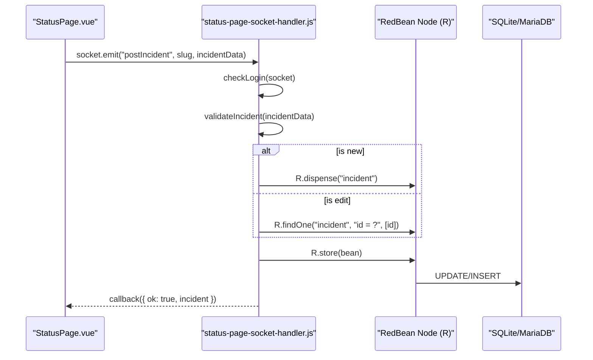
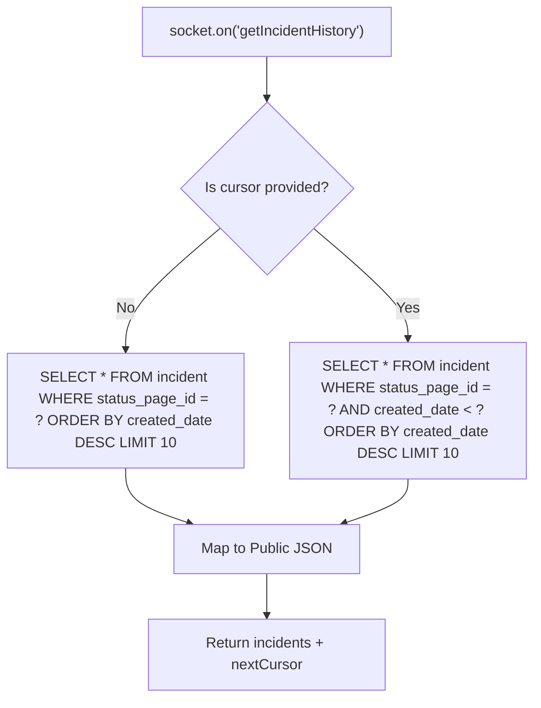

# Incident Management

<details>
<summary>Relevant source files</summary>

The following files were used as context for generating this wiki page:

- [extra/remove-2fa.js](extra/remove-2fa.js)
- [extra/reset-password.js](extra/reset-password.js)
- [server/2fa.js](server/2fa.js)
- [server/config.js](server/config.js)
- [server/model/incident.js](server/model/incident.js)
- [server/model/proxy.js](server/model/proxy.js)
- [server/model/status_page.js](server/model/status_page.js)
- [server/model/tag.js](server/model/tag.js)
- [server/model/user.js](server/model/user.js)
- [server/password-hash.js](server/password-hash.js)
- [server/routers/api-router.js](server/routers/api-router.js)
- [server/routers/status-page-router.js](server/routers/status-page-router.js)
- [server/socket-handlers/status-page-socket-handler.js](server/socket-handlers/status-page-socket-handler.js)
- [src/pages/StatusPage.vue](src/pages/StatusPage.vue)

</details>


Incident management in Uptime Kuma allows status page administrators to create, edit, and display incident reports on public status pages. This system provides real-time communication about service disruptions, maintenance events, or other notable occurrences to status page viewers.

For information about status page configuration and display, see [Status Page Configuration](#5.1). For information about maintenance windows (scheduled planned downtime), see [Maintenance Windows](#3.4).

---

## Purpose and Scope

The incident management system handles:
- Creation, editing, and deletion of incident records via Socket.IO events.
- Lifecycle management including active, pinned, and resolved states.
- Display of active incidents at the top of status pages.
- Chronological display of past incidents grouped by date in the UI.
- Cursor-based pagination for incident history to optimize performance.
- Public REST API access to incident data and RSS feed generation.

Incidents are distinct from maintenance windows: incidents represent unplanned or reactive communication about service status, while maintenance windows represent scheduled planned downtime managed by the `Maintenance` model.

---

## Incident Data Model

### Database Schema

Incidents are stored in the `incident` table. The backend uses RedBean ORM to manage these records through the `Incident` model class.

| Column | Type | Description |
|--------|------|-------------|
| `id` | INTEGER | Primary key. |
| `status_page_id` | INTEGER | Foreign key to `status_page` table. |
| `title` | TEXT | Incident title (required). |
| `content` | TEXT | Incident description in Markdown format (required). |
| `style` | TEXT | Bootstrap alert style: `info`, `warning`, `danger`, `primary`, `light`, `dark`. |
| `pin` | BOOLEAN | Whether the incident is pinned to the top of the status page. |
| `active` | BOOLEAN | Whether the incident is currently active/ongoing. |
| `created_date` | DATETIME | ISO timestamp of incident creation. |
| `last_updated_date` | DATETIME | ISO timestamp of the last update. |

**Sources:** [server/socket-handlers/status-page-socket-handler.js:52-69](), [server/model/incident.js:21-33](), [server/model/status_page.js:512-518]()

---

## Incident Lifecycle

### State Machine

The incident lifecycle is managed by toggling the `active` and `pin` flags.

```mermaid
stateDiagram-v2
    [*] --> ActivePinned : "socket.emit('postIncident')"
    ActivePinned --> ActivePinned : "socket.emit('editIncident')"
    ActivePinned --> ActiveUnpinned : "socket.emit('unpinIncident')"
    ActivePinned --> Resolved : "socket.emit('resolveIncident')"
    ActiveUnpinned --> ActivePinned : "editIncident (pin=true)"
    ActiveUnpinned --> Resolved : "resolveIncident()"
    Resolved --> [*] : "socket.emit('deleteIncident')"
    
    state ActivePinned {
        direction LR
        Note: "active=true, pin=true"
    }
    state ActiveUnpinned {
        direction LR
        Note: "active=true, pin=false"
    }
    state Resolved {
        direction LR
        Note: "active=false, pin=false"
    }
```

**Incident States:**

| State | `active` | `pin` | Display Location | Description |
|-------|----------|-------|------------------|-------------|
| **Active + Pinned** | `true` | `true` | Top of status page | Currently ongoing incident prominently displayed. |
| **Active + Unpinned** | `true` | `false` | Past incidents section | Active but not highlighted at the top. |
| **Resolved** | `false` | `false` | Past incidents section | Incident marked as resolved/completed. |

**Sources:** [server/model/incident.js:10-15](), [server/socket-handlers/status-page-socket-handler.js:60-61](), [server/socket-handlers/status-page-socket-handler.js:235-236]()

### State Transitions

#### Creating an Incident
When a new incident is created via the `postIncident` event, the server dispenses a new bean and sets initial values.
- `pin` is set to `true` [server/socket-handlers/status-page-socket-handler.js:60]().
- `active` is set to `true` [server/socket-handlers/status-page-socket-handler.js:61]().
- `created_date` is set using `R.isoDateTime(dayjs.utc())` [server/socket-handlers/status-page-socket-handler.js:67]().

#### Resolving an Incident
The `Incident.resolve()` method updates the record to a terminal state.
- Sets `active = false` and `pin = false` [server/model/incident.js:11-12]().
- Updates `last_updated_date` [server/model/incident.js:13]().
- The incident is then moved to the historical section in the UI.

#### Unpinning an Incident
The `unpinIncident` event allows batch unpinning. It executes a direct SQL update to set `pin = 0` for all currently pinned incidents associated with the specific status page ID [server/socket-handlers/status-page-socket-handler.js:90]().

---

## Implementation Detail: Creation and Editing

### Backend Processing

The backend logic resides in `statusPageSocketHandler.js`, which validates the user session and payload before persisting.



**Sources:** [server/socket-handlers/status-page-socket-handler.js:34-82](), [server/socket-handlers/status-page-socket-handler.js:124-185]()

### Validation Rules
The `validateIncident` helper function ensures data integrity:
- **Title**: Rejects if empty or whitespace [server/socket-handlers/status-page-socket-handler.js:19-21]().
- **Content**: Rejects if empty or whitespace [server/socket-handlers/status-page-socket-handler.js:22-24]().
- **Style**: Whitelists Bootstrap styles: `info`, `warning`, `danger`, `primary`, `light`, `dark` [server/socket-handlers/status-page-socket-handler.js:159-162]().

---

## Incident History and Pagination

### Pagination Logic
Uptime Kuma uses cursor-based pagination for incident history to handle large datasets efficiently.

- **Page Size**: Defined by the constant `INCIDENT_PAGE_SIZE` (default is 10) [src/util.js:21]().
- **Cursor**: The `created_date` of the last retrieved incident is used as the cursor for the next batch [server/model/status_page.js:512-551]().



**Sources:** [server/model/status_page.js:512-551](), [server/socket-handlers/status-page-socket-handler.js:103-122]()

---

## RSS Feed Generation

Status pages generate an RSS feed containing both manual incidents and automatic monitor failure events.

- **Endpoint**: `/status/:slug/rss` [server/routers/status-page-router.js:22]().
- **Generation**: The `StatusPage.renderRSS` function uses the `feed` library [server/model/status_page.js:79-120]().
- **Content**:
    - **Incidents**: Items from the `incident` table [server/model/status_page.js:98-107]().
    - **Heartbeats**: Automatic items generated when a monitor is detected as down [server/model/status_page.js:109-117]().

**Sources:** [server/model/status_page.js:38-48](), [server/model/status_page.js:79-120](), [server/routers/status-page-router.js:22-26]()

---

## Key Functions and Classes

### `Incident` Model ([server/model/incident.js]())
- `resolve()`: Updates the bean to a resolved state and stores it [server/model/incident.js:10-15]().
- `toPublicJSON()`: Sanitizes internal database fields for public consumption, converting bit fields to booleans [server/model/incident.js:21-33]().

### `StatusPage` Model ([server/model/status_page.js]())
- `getIncidentHistory(statusPageID, cursor, isPublic)`: Core database logic for retrieving paginated incidents [server/model/status_page.js:512-551]().
- `renderRSS(statusPage, feedUrl)`: SSR logic for generating the XML feed [server/model/status_page.js:79-120]().

### `statusPageSocketHandler` ([server/socket-handlers/status-page-socket-handler.js]())
- `postIncident`: Entry point for creating or updating incidents via Socket.IO [server/socket-handlers/status-page-socket-handler.js:34-82]().
- `resolveIncident`: Entry point for resolving an incident [server/socket-handlers/status-page-socket-handler.js:227-265]().

**Sources:** [server/model/incident.js:1-36](), [server/model/status_page.js:24-120](), [server/socket-handlers/status-page-socket-handler.js:32-265]()
