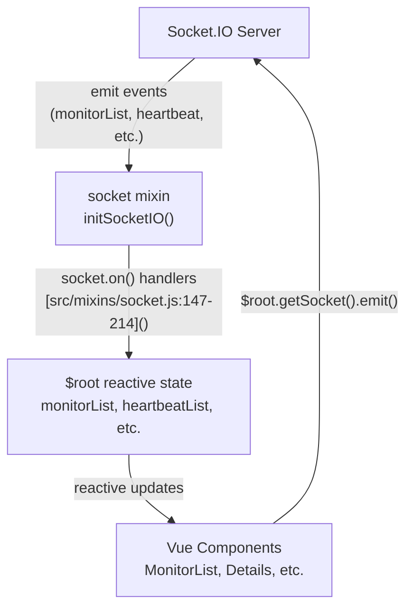
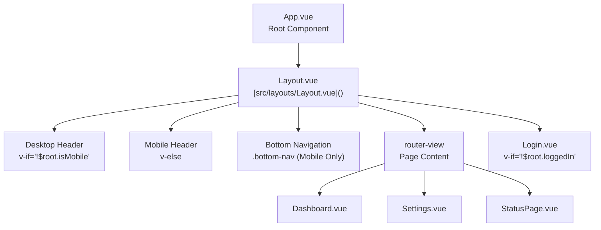

# User Interface Components

Relevant source files

The following files were used as context for generating this wiki page:

- [src/assets/app.scss](src/assets/app.scss)
- [src/assets/vars.scss](src/assets/vars.scss)
- [src/components/HeartbeatBar.vue](src/components/HeartbeatBar.vue)
- [src/components/PublicGroupList.vue](src/components/PublicGroupList.vue)
- [src/icon.js](src/icon.js)
- [src/layouts/Layout.vue](src/layouts/Layout.vue)
- [src/main.js](src/main.js)
- [src/mixins/socket.js](src/mixins/socket.js)
- [src/pages/Dashboard.vue](src/pages/Dashboard.vue)
- [src/pages/DashboardHome.vue](src/pages/DashboardHome.vue)
- [src/pages/Details.vue](src/pages/Details.vue)
- [src/pages/Settings.vue](src/pages/Settings.vue)
- [src/router.js](src/router.js)

This document describes the Vue.js component architecture used throughout the Uptime Kuma frontend. It covers the global state management pattern, layout structure, page components, shared UI components, and styling system.

For information about real-time communication between frontend and backend, see [Real-Time Communication](#2.3). For details on monitor management UI workflows, see [Dashboard and Monitor Details](#6.1). For settings configuration, see [Settings Interface](#6.2).

---

## Global State Management via `$root`

Uptime Kuma uses a centralized global state pattern where reactive properties are stored on the Vue root instance (`$root`) and updated via Socket.IO events. This pattern avoids the need for heavy state management libraries like Vuex while providing reactive data access to all components via the `socket` mixin [src/mixins/socket.js:29-71]().

### State Properties

The global state is defined in [src/mixins/socket.js:30-71]() and includes:

| Property | Type | Description |
|----------|------|-------------|
| `monitorList` | Object | Map of monitor ID to monitor data [src/mixins/socket.js:44]() |
| `heartbeatList` | Object | Map of monitor ID to array of heartbeat objects [src/mixins/socket.js:48]() |
| `avgPingList` | Object | Map of monitor ID to average ping value [src/mixins/socket.js:49]() |
| `uptimeList` | Object | Map of `${monitorID}_${type}` to uptime percentage [src/mixins/socket.js:50]() |
| `tlsInfoList` | Object | Map of monitor ID to TLS certificate information [src/mixins/socket.js:51]() |
| `domainInfoList` | Object | Map of monitor ID to domain expiry data [src/mixins/socket.js:52]() |
| `notificationList` | Array | List of notification configurations [src/mixins/socket.js:53]() |
| `maintenanceList` | Object | Map of maintenance schedules [src/mixins/socket.js:46]() |
| `apiKeyList` | Object | Map of API keys [src/mixins/socket.js:47]() |
| `statusPageList` | Array | List of status pages [src/mixins/socket.js:57]() |
| `proxyList` | Array | List of proxy configurations [src/mixins/socket.js:58]() |
| `dockerHostList` | Array | List of Docker hosts [src/mixins/socket.js:54]() |
| `remoteBrowserList` | Array | List of remote browser configurations [src/mixins/socket.js:55]() |
| `loggedIn` | Boolean | User authentication state [src/mixins/socket.js:43]() |
| `username` | String | Current username [src/mixins/socket.js:40]() |
| `emitter` | mitt | Event bus for cross-component communication [src/mixins/socket.js:70]() |

### State Update Flow

**Sources:** [src/mixins/socket.js:30-214](), [src/main.js:28-36]()

---

## Application Layout Architecture

The application uses a hierarchical layout structure with a root layout component that provides the shell for all pages.

### Layout Component Hierarchy

### Desktop Header Components

The desktop header [src/layouts/Layout.vue:16-118]() includes:
- Application logo and title linked to `/dashboard` [src/layouts/Layout.vue:17-23]()
- "New Update" button if `hasNewVersion` is true [src/layouts/Layout.vue:25-33]()
- Navigation pills: "Status Pages", "Dashboard" [src/layouts/Layout.vue:35-47]()
- Profile dropdown with username, Maintenance, Settings, and Logout [src/layouts/Layout.vue:48-115]()

### Mobile Bottom Navigation

The mobile bottom navigation [src/layouts/Layout.vue:135-155]() provides four tabs:
- **Home** (`/dashboard`)
- **List** (`/list`)
- **Add** (`/add`)
- **Settings** (`/settings`)

**Sources:** [src/layouts/Layout.vue:1-155](), [src/main.js:1-45]()

---

## Page Components

### Settings Page Architecture

The Settings page uses a two-column layout with a navigation menu on the left and dynamic content on the right loaded via `<router-view>` [src/pages/Settings.vue:19-51]().

The settings menu is defined in the `subMenus` computed property [src/pages/Settings.vue:86-125]():

| Route | Translation Key | Description |
|-------|----------------|-------------|
| `/settings/general` | "General" | Server settings, data retention [src/pages/Settings.vue:88]() |
| `/settings/appearance` | "Appearance" | Theme, language, display options [src/pages/Settings.vue:91]() |
| `/settings/notifications` | "Notifications" | Notification provider configuration [src/pages/Settings.vue:94]() |
| `/settings/security` | "Security" | 2FA, authentication settings [src/pages/Settings.vue:112]() |
| `/settings/api-keys` | "API Keys" | API key management [src/pages/Settings.vue:115]() |

For details, see [Settings Interface](#6.2).

**Sources:** [src/pages/Settings.vue:1-125](), [src/router.js:87-139]()

### Dashboard Page Layout

The Dashboard page provides a two-column layout with the `MonitorList` on the left and dynamic content on the right [src/pages/Dashboard.vue:4-18]().

The left column is hidden on mobile [src/pages/Dashboard.vue:4](), where users access the monitor list via the mobile-specific `/list` route [src/router.js:83]().

**Sources:** [src/pages/Dashboard.vue:1-38](), [src/router.js:44-85]()

### Details Page Structure

The Details page displays comprehensive information about a single monitor, including real-time status, heartbeat history, and statistics [src/pages/Details.vue:1-144]().

Key elements:
- **Monitor Header**: Name, ID, and Tags [src/pages/Details.vue:7-27]()
- **Action Buttons**: Pause/Resume, Edit, Clone, Delete [src/pages/Details.vue:118-144]()
- **Monitor URL/Info**: Displays type-specific connection details [src/pages/Details.vue:28-116]()

For details, see [Dashboard and Monitor Details](#6.1).

**Sources:** [src/pages/Details.vue:1-144]()

### DashboardHome Component

The `DashboardHome` page shows quick statistics and a global event log [src/pages/DashboardHome.vue:4-101]().

- **Quick Stats**: Displays counts for Up, Down, Maintenance, Unknown, and Paused monitors [src/pages/DashboardHome.vue:8-37]().
- **Event Table**: A paginated list of important heartbeats across all monitors [src/pages/DashboardHome.vue:49-90]().

**Sources:** [src/pages/DashboardHome.vue:1-113](), [src/mixins/socket.js:215-235]()

---

## Shared UI Components

### HeartbeatBar Component (Canvas Rendering)

The `HeartbeatBar` component visualizes monitor status history using HTML5 Canvas for optimal performance [src/components/HeartbeatBar.vue:4-18]().

- **Beat List**: Data is sourced from `$root.heartbeatList[monitorId]` [src/components/HeartbeatBar.vue:104-110]().
- **Tooltips**: Custom tooltip displays details on hover [src/components/HeartbeatBar.vue:31-37]().
- **Aggregation**: Supports both "auto" mode and fixed day ranges (e.g., 24h, 30d) [src/components/HeartbeatBar.vue:145-156]().

**Sources:** [src/components/HeartbeatBar.vue:1-227]()

### PublicGroupList Component

Used primarily in status pages, this component handles the display and ordering of monitor groups [src/components/PublicGroupList.vue:3-30](). It utilizes `vuedraggable` for the edit mode interface [src/components/PublicGroupList.vue:3, 40]().

**Sources:** [src/components/PublicGroupList.vue:1-121]()

---

## Styling System

### Theme Architecture

Uptime Kuma supports light and dark themes. Themes are managed via the `theme` mixin [src/main.js:15]() and applied as a CSS class on the root element [src/layouts/Layout.vue:2]().

### SCSS Variable System

Core variables and Bootstrap overrides are defined in `app.scss`.
- **Shadow Box**: The primary UI container pattern [src/assets/app.scss:109-118]().
- **Dark Theme**: Extensive overrides for dark mode [src/assets/app.scss:253-360]().
- **Buttons**: Custom `.btn-normal` and `.btn-outline-normal` classes [src/assets/app.scss:146-157, 185-203]().

**Sources:** [src/assets/app.scss:1-360](), [src/main.js:7-15]()

---

## Component Communication Patterns

### Event Emitter Pattern

Cross-component communication uses the `mitt` event emitter stored in `$root.emitter` [src/mixins/socket.js:70](). For example, `DashboardHome` listens for `newImportantHeartbeat` to refresh its list [src/pages/DashboardHome.vue:171]().

### Socket.IO Communication

Components access the socket via `$root.getSocket()` to emit events like `getSettings` [src/pages/Settings.vue:156]() or `setSettings` [src/pages/Settings.vue:211]().

**Sources:** [src/mixins/socket.js:70](), [src/pages/DashboardHome.vue:171](), [src/pages/Settings.vue:156, 211]()
