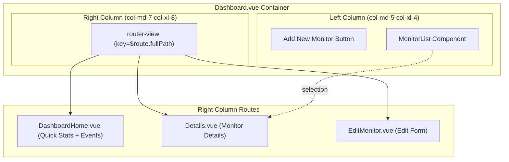
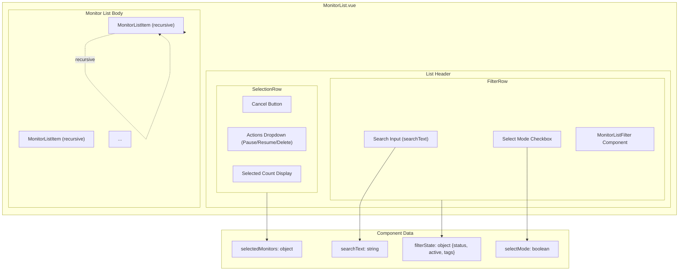
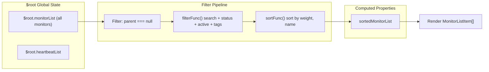
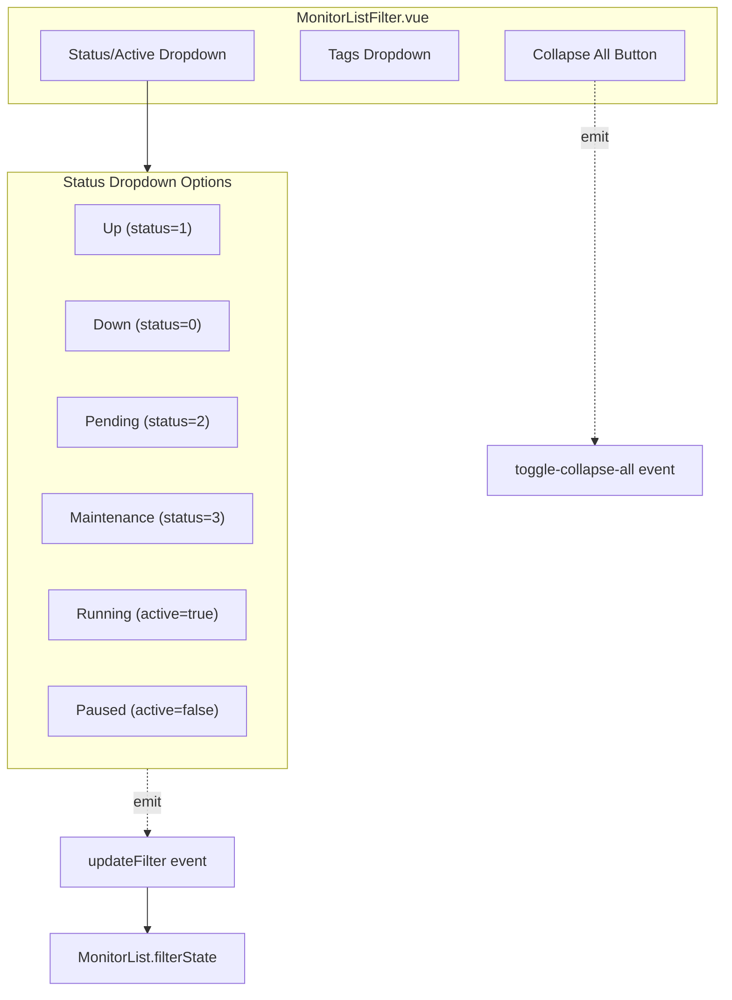
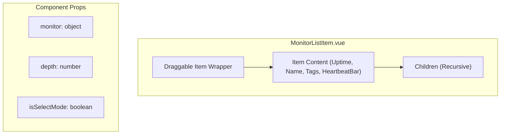
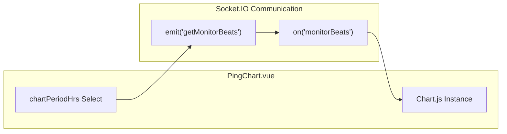
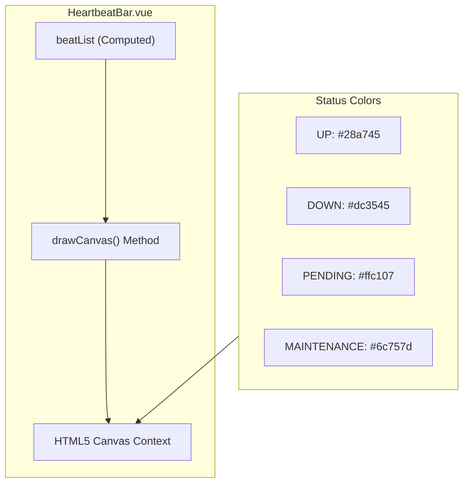
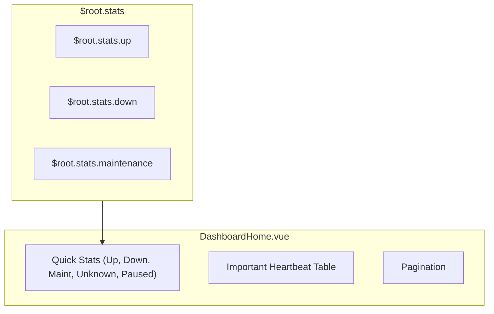

# Dashboard and Monitor Details

Relevant source files

The following files were used as context for generating this wiki page:

- [src/assets/app.scss](src/assets/app.scss)
- [src/assets/multiselect.scss](src/assets/multiselect.scss)
- [src/assets/vars.scss](src/assets/vars.scss)
- [src/components/HeartbeatBar.vue](src/components/HeartbeatBar.vue)
- [src/components/MonitorList.vue](src/components/MonitorList.vue)
- [src/components/MonitorListFilter.vue](src/components/MonitorListFilter.vue)
- [src/components/MonitorListFilterDropdown.vue](src/components/MonitorListFilterDropdown.vue)
- [src/components/MonitorListItem.vue](src/components/MonitorListItem.vue)
- [src/components/PingChart.vue](src/components/PingChart.vue)
- [src/components/Tag.vue](src/components/Tag.vue)
- [src/components/TagEditDialog.vue](src/components/TagEditDialog.vue)
- [src/components/TagsManager.vue](src/components/TagsManager.vue)
- [src/components/settings/Tags.vue](src/components/settings/Tags.vue)
- [src/pages/Dashboard.vue](src/pages/Dashboard.vue)
- [src/pages/DashboardHome.vue](src/pages/DashboardHome.vue)
- [src/pages/Details.vue](src/pages/Details.vue)
- [test/backend-test/test-ping-chart.js](test/backend-test/test-ping-chart.js)

This page documents the dashboard interface where users view and manage their monitors. It covers the two-column dashboard layout, the `MonitorList` component with filtering and sorting capabilities, drag-and-drop grouping, the detailed monitor view, and specialized visualization components like `PingChart` and `HeartbeatBar`.

## Dashboard Layout Architecture

The dashboard uses a responsive two-column layout implemented in `Dashboard.vue`. On desktop, the left column displays the monitor list while the right column shows dynamic content via Vue Router.

Title: Dashboard Component Hierarchy

**Sources:** [src/pages/Dashboard.vue:1-20](), [src/pages/Dashboard.vue:22-38]()

The layout is hidden on mobile devices where a bottom navigation bar provides access to different views. The `Dashboard.vue` component tracks the container height in the `height` data property, which is passed to child components via the `calculatedHeight` prop [src/pages/Dashboard.vue:29-36]().

## MonitorList Component Structure

The `MonitorList` component manages the display, filtering, and selection of monitors. It maintains its own state for search, filters, and selection mode.

Title: MonitorList Component Internal Structure

**Sources:** [src/components/MonitorList.vue:1-129](), [src/components/MonitorList.vue:149-165]()

### Data Flow and Computed Properties

The component uses several computed properties to transform the global monitor list:

Title: Monitor Filtering Pipeline

**Sources:** [src/components/MonitorList.vue:189-205](), [src/components/MonitorList.vue:522-569]()

The `filterFunc` method implements hierarchical filtering where group monitors pass the filter if any of their children match. It filters by `searchText` (name, tags), `status` (UP, DOWN, PENDING, MAINTENANCE), and `active` (Running, Paused) [src/components/MonitorList.vue:522-569]().

## Monitor Filtering System

The filtering UI is implemented through `MonitorListFilter` and `MonitorListFilterDropdown` components.

Title: Filter UI Interaction

**Sources:** [src/components/MonitorListFilter.vue:1-149](), [src/components/MonitorListFilterDropdown.vue:1-40]()

Filters are stored in the `filterState` object [src/components/MonitorList.vue:158-163](). The `MonitorListFilter` component renders status pills and checkmarks for active filters [src/components/MonitorListFilter.vue:2-106]().

## MonitorListItem Component

The `MonitorListItem` component is recursive, supporting nested monitor groups. It handles its own collapsed state, which is persisted to `localStorage` under the key `monitorCollapsed` [src/components/MonitorListItem.vue:189-200]().

Title: MonitorListItem Logic

**Sources:** [src/components/MonitorListItem.vue:1-80](), [src/components/MonitorListItem.vue:95-136]()

### Drag and Drop Grouping

Monitors can be reorganized by dragging one monitor onto another (which acts as a parent). The component uses `onDragStart`, `onDragEnter`, `onDragLeave`, and `onDrop` handlers [src/components/MonitorListItem.vue:221-300](). Visual feedback is provided via the `drag-over` class when `dragOverCount > 0` [src/components/MonitorListItem.vue:6]().

## Monitor Details View

The `Details.vue` component displays comprehensive information about a selected monitor. It integrates statistics, event history, and specialized charts.

### Tags Management
The `TagsManager.vue` component allows users to add and remove tags from monitors. It uses `vue-multiselect` for tag selection and supports creating new tags with custom colors [src/components/TagsManager.vue:45-122](). Tags can also be edited globally or associated with monitors via the `TagEditDialog.vue` [src/components/TagEditDialog.vue:73-118]().

## PingChart Visualization

The `PingChart.vue` component uses `chart.js` to visualize response times over selected periods (recent, 3h, 6h, 24h, 1w) [src/components/PingChart.vue:79-85]().

Title: PingChart Data Flow

**Sources:** [src/components/PingChart.vue:25-27](), [src/components/PingChart.vue:32-60](), [src/components/PingChart.vue:182-188]()

The chart is highly responsive, adjusting its height based on screen width via the `onResize` callback in `chartOptions` [src/components/PingChart.vue:96-107]().

## HeartbeatBar Visualization

The `HeartbeatBar.vue` component renders monitor status history using an HTML5 Canvas for high-performance visualization of many "beats" [src/components/HeartbeatBar.vue:4-18]().

Title: HeartbeatBar Rendering Process

**Sources:** [src/components/HeartbeatBar.vue:104-110](), [src/components/HeartbeatBar.vue:472-617]()

The component calculates `timeSinceFirstBeat` and `timeSinceLastBeat` to provide context for the timeline [src/components/HeartbeatBar.vue:227-248](). It also includes a custom `Tooltip` component that appears when hovering over specific beats on the canvas [src/components/HeartbeatBar.vue:31-37]().

## DashboardHome Quick Stats

When no specific monitor is selected, `DashboardHome.vue` displays overall system health.

Title: Quick Stats Visualization

**Sources:** [src/pages/DashboardHome.vue:8-37](), [src/pages/DashboardHome.vue:49-90]()

DashboardHome uses the `v-pagination-3` library to handle large event histories [src/pages/DashboardHome.vue:93-99](). It listens for the `newImportantHeartbeat` event to update the event list in real-time [src/pages/DashboardHome.vue:171]().

**Sources:**
- [src/pages/Dashboard.vue:1-44]()
- [src/components/MonitorList.vue:1-165]()
- [src/components/MonitorListItem.vue:1-141]()
- [src/components/MonitorListFilter.vue:1-149]()
- [src/components/PingChart.vue:1-107]()
- [src/components/HeartbeatBar.vue:1-110]()
- [src/components/HeartbeatBar.vue:472-617]()
- [src/pages/DashboardHome.vue:1-102]()
- [src/components/TagsManager.vue:1-122]()
- [src/components/TagEditDialog.vue:1-118]()
- [src/components/Tag.vue:1-127]()
