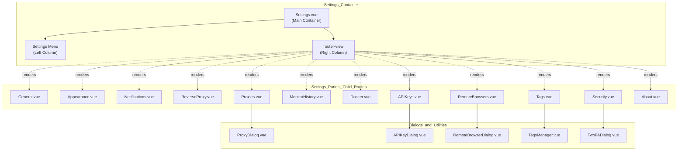
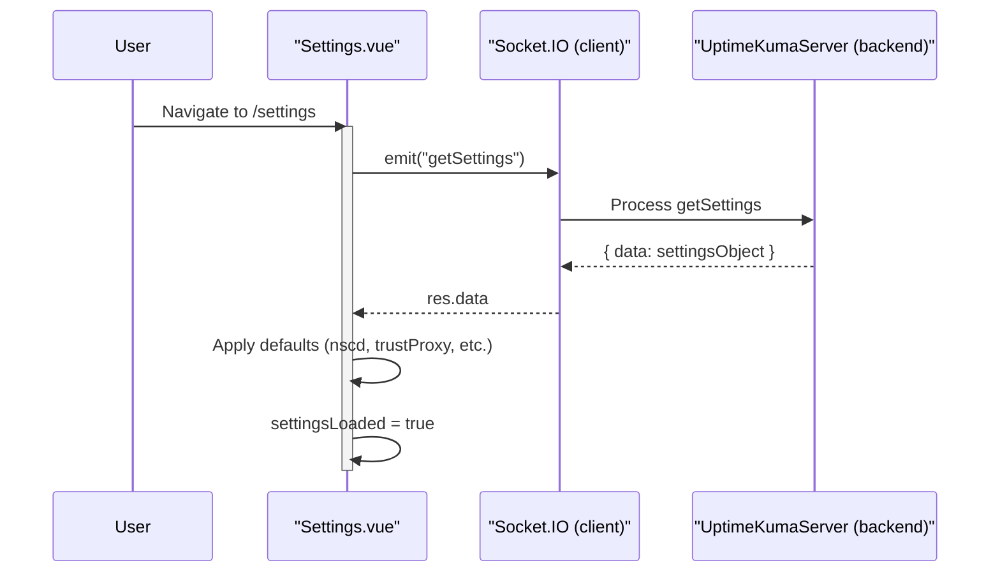

# Settings Interface

<details>
<summary>Relevant source files</summary>

The following files were used as context for generating this wiki page:

- [server/check-version.js](server/check-version.js)
- [server/client.js](server/client.js)
- [server/docker.js](server/docker.js)
- [server/model/docker_host.js](server/model/docker_host.js)
- [server/proxy.js](server/proxy.js)
- [server/socket-handlers/docker-socket-handler.js](server/socket-handlers/docker-socket-handler.js)
- [src/components/APIKeyDialog.vue](src/components/APIKeyDialog.vue)
- [src/components/BadgeLinkGeneratorDialog.vue](src/components/BadgeLinkGeneratorDialog.vue)
- [src/components/CertificateInfo.vue](src/components/CertificateInfo.vue)
- [src/components/CertificateInfoRow.vue](src/components/CertificateInfoRow.vue)
- [src/components/CreateGroupDialog.vue](src/components/CreateGroupDialog.vue)
- [src/components/DockerHostDialog.vue](src/components/DockerHostDialog.vue)
- [src/components/Login.vue](src/components/Login.vue)
- [src/components/MonitorSettingDialog.vue](src/components/MonitorSettingDialog.vue)
- [src/components/ProxyDialog.vue](src/components/ProxyDialog.vue)
- [src/components/PublicGroupList.vue](src/components/PublicGroupList.vue)
- [src/components/RemoteBrowserDialog.vue](src/components/RemoteBrowserDialog.vue)
- [src/components/ScreenshotDialog.vue](src/components/ScreenshotDialog.vue)
- [src/components/TwoFADialog.vue](src/components/TwoFADialog.vue)
- [src/components/settings/APIKeys.vue](src/components/settings/APIKeys.vue)
- [src/components/settings/About.vue](src/components/settings/About.vue)
- [src/components/settings/Appearance.vue](src/components/settings/Appearance.vue)
- [src/components/settings/General.vue](src/components/settings/General.vue)
- [src/components/settings/MonitorHistory.vue](src/components/settings/MonitorHistory.vue)
- [src/components/settings/Proxies.vue](src/components/settings/Proxies.vue)
- [src/components/settings/Security.vue](src/components/settings/Security.vue)
- [src/i18n.js](src/i18n.js)
- [src/icon.js](src/icon.js)
- [src/layouts/Layout.vue](src/layouts/Layout.vue)
- [src/main.js](src/main.js)
- [src/mixins/lang.js](src/mixins/lang.js)
- [src/mixins/mobile.js](src/mixins/mobile.js)
- [src/mixins/socket.js](src/mixins/socket.js)
- [src/pages/Settings.vue](src/pages/Settings.vue)
- [src/router.js](src/router.js)

</details>


The Settings Interface provides a centralized location for configuring application-wide preferences, security options, and system behaviors. This document covers the structure and implementation of the settings UI, including the main Settings container, tab-based navigation, and individual settings panels.

For information about the Dashboard and monitor-specific configuration, see [Dashboard and Monitor Details](6.1). For authentication mechanisms and security implementation details, see [Authentication and Security](8).

---

## Overview

The Settings interface is implemented as a tabbed navigation system with a two-column layout on desktop and a drill-down navigation pattern on mobile [src/pages/Settings.vue:19-52](). The main container component [src/pages/Settings.vue:59-242]() manages the routing and provides a consistent layout shell, while individual settings panels are rendered as child routes defined in the router configuration [src/router.js:89-138]().

### Settings Categories

| Category | Route | Component | Purpose |
|----------|-------|-----------|---------|
| General | `/settings/general` | `General.vue` | Primary server configuration, entry page, NSCD [src/router.js:91-93]() |
| Appearance | `/settings/appearance` | `Appearance.vue` | Theme and UI customization [src/router.js:95-97]() |
| Notifications | `/settings/notifications` | `Notifications.vue` | Global notification defaults [src/router.js:99-101]() |
| Reverse Proxy | `/settings/reverse-proxy` | `ReverseProxy.vue` | Cloudflare Tunnel and Trust Proxy configuration [src/router.js:103-105]() |
| Tags | `/settings/tags` | `Tags.vue` | Global tag management for monitors [src/router.js:107-109]() |
| Monitor History | `/settings/monitor-history` | `MonitorHistory.vue` | Data retention and database maintenance [src/router.js:111-113]() |
| Docker Hosts | `/settings/docker-hosts` | `Docker.vue` | Docker daemon connections [src/router.js:115-117]() |
| Remote Browsers | `/settings/remote-browsers` | `RemoteBrowsers.vue` | Playwright/Browserless endpoints [src/router.js:119-121]() |
| Security | `/settings/security` | `Security.vue` | Password, 2FA, authentication toggle [src/router.js:123-125]() |
| API Keys | `/settings/api-keys` | `APIKeys.vue` | API key lifecycle management [src/router.js:127-129]() |
| Proxies | `/settings/proxies` | `Proxies.vue` | HTTP/HTTPS/SOCKS proxy configuration [src/router.js:131-133]() |
| About | `/settings/about` | `About.vue` | Version information and updates [src/router.js:135-137]() |

**Sources:** [src/pages/Settings.vue:86-125](), [src/router.js:89-138]()

---

## Component Architecture

### Component Hierarchy
The following diagram illustrates how the `Settings.vue` container hosts various sub-components via the Vue Router.



**Sources:** [src/pages/Settings.vue:1-54](), [src/router.js:23-33](), [src/router.js:89-138](), [src/components/settings/Security.vue:148-154]()

---

## Settings Data Flow

### Loading and Initialization
Settings are synchronized with the backend via Socket.IO. On mount, the `Settings.vue` component requests the current configuration from the server [src/pages/Settings.vue:135]().



**Sources:** [src/pages/Settings.vue:155-193](), [src/mixins/socket.js:120-125]()

### Persistence Logic
When a user modifies a setting, the `saveSettings` method handles validation and persistence. For sensitive operations like disabling authentication, the user's current password must be provided [src/pages/Settings.vue:208]().

1. **Validation**: `validateSettings()` checks constraints (e.g., `keepDataPeriodDays >= 0`) [src/pages/Settings.vue:229-234]().
2. **Emission**: The `setSettings` event is emitted with the updated settings object [src/pages/Settings.vue:211]().
3. **Synchronization**: After a successful save, `loadSettings()` is called to refresh the local state from the server [src/pages/Settings.vue:213]().

**Sources:** [src/pages/Settings.vue:208-222]()

---

## Individual Settings Panels

### Security and Authentication
The Security panel [src/components/settings/Security.vue]() handles user credentials and 2FA settings.

- **Password Updates**: Uses the `changePassword` socket event to update the current user's password [src/components/settings/Security.vue:194]().
- **Two-Factor Authentication**: Integrates `TwoFADialog.vue` for TOTP configuration [src/components/settings/Security.vue:109]().
- **Authentication Toggle**: Allows disabling the login system. This requires providing the `currentPassword` for verification before the `disableAuth` setting is saved [src/components/settings/Security.vue:111-142]().

**Sources:** [src/components/settings/Security.vue:1-107](), [src/components/settings/Security.vue:190-200]()

### Docker Hosts
The Docker panel [src/components/settings/Docker.vue]() manages connections to Docker daemons used for container monitoring.

- **Connection Types**: Supports local Unix sockets and remote TCP connections [server/docker.js:78-80]().
- **TLS Configuration**: For TCP connections, the system looks for certificates (`ca.pem`, `cert.pem`, `key.pem`) in the `data/docker-tls/` directory, mapped by the hostname of the daemon [server/docker.js:142-168]().
- **Validation**: The `testDockerHost` function verifies the connection by attempting to list containers on the target host [server/docker.js:68-110]().

**Sources:** [server/docker.js:9-42](), [server/docker.js:142-175]()

### Proxy Management
The Proxies panel [src/components/settings/Proxies.vue]() allows defining outbound proxies for monitors.

- **Protocols**: Supports `http`, `https`, `socks`, `socks5`, `socks5h`, and `socks4`.
- **Backend Storage**: Proxies are stored in the `proxy` table and linked to monitors [server/client.js:104-116]().
- **Default Proxy**: A single proxy can be set as the system default, which is then automatically applied to new monitors [src/mixins/socket.js:190]().

**Sources:** [server/client.js:104-116](), [src/mixins/socket.js:186-195]()

### API Keys
Programmatic access is managed through the API Keys panel [src/components/settings/APIKeys.vue]().

- **Lifecycle**: Keys can be created, enabled, disabled, or deleted.
- **Security**: If `disableAuth` is enabled, the API key system is effectively bypassed as the server does not enforce session/token validation [src/components/settings/Security.vue:89-105]().
- **Socket Events**: Uses `apiKeyList` to receive the list of keys from the server [src/mixins/socket.js:173-175]().

**Sources:** [src/components/settings/Security.vue:89-105](), [src/mixins/socket.js:47]()

---

## Technical Implementation Details

### Parent-Child Communication Pattern
Sub-settings panels access the global settings state hosted in `Settings.vue` via a recursive parent reference pattern. This avoids prop drilling for the deeply nested router-view structure.

```javascript
// Example from Security.vue
computed: {
    settings() {
        return this.$parent.$parent.$parent.settings;
    },
    saveSettings() {
        return this.$parent.$parent.$parent.saveSettings;
    },
    settingsLoaded() {
        return this.$parent.$parent.$parent.settingsLoaded;
    },
}
```

**Sources:** [src/components/settings/Security.vue:167-177]()

### Mobile Navigation Logic
The Settings interface adapts its layout for mobile devices using the `mobile` mixin [src/main.js:29]().

- **Sub-menu Visibility**: On mobile, the sidebar menu is hidden if a specific sub-page is being viewed (`currentPage` is not null) [src/pages/Settings.vue:78-84]().
- **Mobile Redirects**: If a user navigates to `/settings` on desktop, it auto-redirects to `/settings/general`. On mobile, it stays on the menu index [src/pages/Settings.vue:145-149]().

**Sources:** [src/pages/Settings.vue:128-132](), [src/main.js:28-36]()

### Real-Time Updates
The interface listens for various list updates via the global Socket.IO mixin [src/mixins/socket.js:29-72]().

| Code Entity | Socket Event | Purpose |
|-------------|--------------|---------|
| `proxyList` | `proxyList` | Updates the local list of outbound proxies [src/mixins/socket.js:186-195]() |
| `dockerHostList` | `dockerHostList` | Updates available Docker daemon connections [src/mixins/socket.js:196-198]() |
| `remoteBrowserList` | `remoteBrowserList` | Updates Playwright/Browserless endpoints [src/mixins/socket.js:200-202]() |
| `apiKeyList` | `apiKeyList` | Updates the list of active API keys [src/mixins/socket.js:173-175]() |

**Sources:** [src/mixins/socket.js:147-202]()
