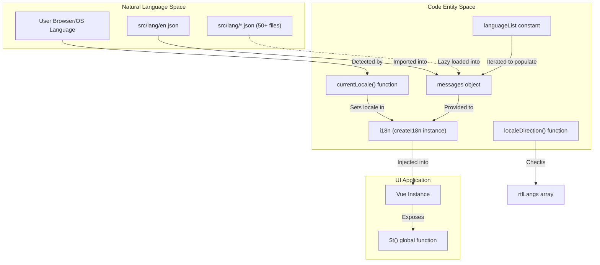
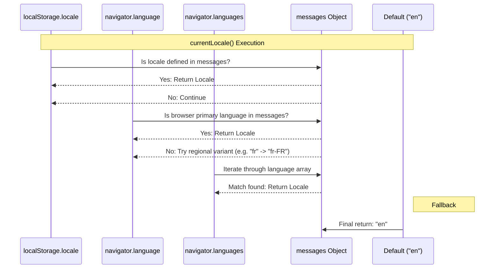

# Internationalization

Relevant source files

The following files were used as context for generating this wiki page:

- [server/check-version.js](server/check-version.js)
- [server/translatable-error.js](server/translatable-error.js)
- [src/components/Login.vue](src/components/Login.vue)
- [src/components/TwoFADialog.vue](src/components/TwoFADialog.vue)
- [src/components/settings/About.vue](src/components/settings/About.vue)
- [src/components/settings/General.vue](src/components/settings/General.vue)
- [src/components/settings/MonitorHistory.vue](src/components/settings/MonitorHistory.vue)
- [src/components/settings/Security.vue](src/components/settings/Security.vue)
- [src/i18n.js](src/i18n.js)
- [src/lang/ar-SY.json](src/lang/ar-SY.json)
- [src/lang/bg-BG.json](src/lang/bg-BG.json)
- [src/lang/ca.json](src/lang/ca.json)
- [src/lang/cs-CZ.json](src/lang/cs-CZ.json)
- [src/lang/de-CH.json](src/lang/de-CH.json)
- [src/lang/de-DE.json](src/lang/de-DE.json)
- [src/lang/es-ES.json](src/lang/es-ES.json)
- [src/lang/fa.json](src/lang/fa.json)
- [src/lang/fr-FR.json](src/lang/fr-FR.json)
- [src/lang/hu.json](src/lang/hu.json)
- [src/lang/ja.json](src/lang/ja.json)
- [src/lang/ko-KR.json](src/lang/ko-KR.json)
- [src/lang/nl-NL.json](src/lang/nl-NL.json)
- [src/lang/pa.json](src/lang/pa.json)
- [src/lang/pa_PK.json](src/lang/pa_PK.json)
- [src/lang/pl.json](src/lang/pl.json)
- [src/lang/pt-BR.json](src/lang/pt-BR.json)
- [src/lang/pt.json](src/lang/pt.json)
- [src/lang/ru-RU.json](src/lang/ru-RU.json)
- [src/lang/tr-TR.json](src/lang/tr-TR.json)
- [src/lang/uk-UA.json](src/lang/uk-UA.json)
- [src/lang/ur.json](src/lang/ur.json)
- [src/lang/vls.json](src/lang/vls.json)
- [src/lang/xh.json](src/lang/xh.json)
- [src/lang/yue.json](src/lang/yue.json)
- [src/lang/zh-CN.json](src/lang/zh-CN.json)
- [src/lang/zh-HK.json](src/lang/zh-HK.json)
- [src/lang/zh-TW.json](src/lang/zh-TW.json)
- [test/backend-test/check-translations.test.js](test/backend-test/check-translations.test.js)

This page documents the internationalization (i18n) system in Uptime Kuma, covering locale detection, language file structure, RTL language support, and integration with Vue components. The system supports over 50 languages with automatic locale detection and fallback mechanisms.

---

## System Overview

Uptime Kuma's internationalization system is built on **vue-i18n** and provides multi-language support throughout the application. The system includes automatic locale detection, fallback to English, RTL language handling, and a structured approach to loading translation files.

### i18n Data Flow Diagram

The following diagram bridges the "Natural Language Space" (user preferences and JSON files) to the "Code Entity Space" (the `i18n` instance and detection functions).

**Sources:** [src/i18n.js:1-110]()

---

## Core i18n Configuration

The internationalization system is initialized in `src/i18n.js`, which sets up the `vue-i18n` instance and defines the supported languages.

### Language List and Messages

The `languageList` object maps locale codes to their native display names [src/i18n.js:4-53](). The `messages` object is initialized with the full English translation [src/i18n.js:55-57]() and then stubbed with the `languageName` for all other supported locales [src/i18n.js:59-63]().

Supported language categories include:
- **European**: German (`de-DE`) [src/lang/de-DE.json:2-2](), French (`fr-FR`) [src/lang/fr-FR.json:2-2](), Spanish (`es-ES`) [src/lang/es-ES.json:2-2](), Dutch (`nl-NL`) [src/lang/nl-NL.json:2-2]().
- **Asian**: Simplified Chinese (`zh-CN`) [src/lang/zh-CN.json:2-2](), Japanese (`ja`) [src/i18n.js:27-27](), Korean (`ko-KR`) [src/i18n.js:34-34]().
- **Middle Eastern (RTL)**: Arabic (`ar-SY`), Farsi (`fa`), Hebrew (`he-IL`), Urdu (`ur`) [src/i18n.js:65-65]().
- **Slavic**: Russian (`ru-RU`) [src/lang/ru-RU.json:2-2](), Bulgarian (`bg-BG`) [src/lang/bg-BG.json:2-2](), Czech (`cs-CZ`) [src/lang/cs-CZ.json:2-2]().

### i18n Instance Creation

The `i18n` constant is the exported instance of `createI18n` [src/i18n.js:104-110]().

| Property | Value / Source | Description |
| :--- | :--- | :--- |
| `locale` | `currentLocale()` | The active language determined at runtime. |
| `fallbackLocale` | `"en"` | Defaults to English if a key is missing. |
| `messages` | `messages` | The dictionary of translation strings. |
| `silentFallbackWarn`| `true` | Suppresses console warnings for fallbacks. |

**Sources:** [src/i18n.js:104-110]()

---

## Locale Detection Logic

The `currentLocale()` function implements a priority-based detection mechanism [src/i18n.js:72-98]().

### Detection Sequence Diagram

This diagram shows how `currentLocale()` traverses system entities to find a match.

**Sources:** [src/i18n.js:72-98]()

---

## RTL Language Support

Uptime Kuma supports Right-to-Left (RTL) text direction for specific locales.

- **RTL Array**: The `rtlLangs` array contains `["he-IL", "fa", "ar-SY", "ur"]` [src/i18n.js:65-65]().
- **Direction Helper**: The `localeDirection()` function checks if the `currentLocale()` is present in the `rtlLangs` array and returns either `"rtl"` or `"ltr"` [src/i18n.js:100-102]().

---

## Translation File Structure

Translations are stored as JSON objects in `src/lang/*.json`. Each file must contain a `languageName` key [src/lang/de-DE.json:2-2]().

### Key Translation Categories

| Category | Example Keys | Source File (Sample) |
| :--- | :--- | :--- |
| **Navigation** | `Settings`, `Dashboard`, `Home`, `Add` | [src/lang/de-DE.json:3-14]() |
| **Status** | `Up`, `Down`, `Pending`, `Unknown` | [src/lang/zh-CN.json:61-64]() |
| **Time Units** | `day`, `hour`, `-day`, `-hour` | [src/lang/fr-FR.json:77-80]() |
| **Forms** | `Friendly Name`, `URL`, `Hostname`, `Port` | [src/lang/pt-BR.json:66-69]() |
| **Actions** | `Save`, `Edit`, `Delete`, `Pause`, `Resume` | [src/lang/tr-TR.json:50-85]() |
| **Security** | `Two Factor Authentication`, `Verify Token` | [src/lang/es-ES.json:138-143]() |

### Variable Interpolation
Uptime Kuma uses curly brace syntax for dynamic values:
- `checkEverySecond`: `"Check every {0} seconds"` [src/lang/de-DE.json:40-40]()
- `recurringIntervalMessage`: `"Once a day | Every {0} days"` [src/lang/zh-CN.json:22-22]()
- `needPushEvery`: `"You should call this URL every {0} seconds."` [src/lang/nl-NL.json:99-99]()

---

## Implementation in UI Components

The `$t()` function is used globally in Vue templates to render translated strings.

### Component Integration Examples

- **Settings Page**: Uses `$t` for labels like `Language`, `Appearance`, and `Theme` [src/lang/de-DE.json:6-8]().
- **Monitor Creation**: Labels for `Monitor Type`, `Heartbeat Interval`, and `Retries` are fetched via `$t` [src/lang/cs-CZ.json:84-91]().
- **Auth Flow**: The `Login` component and `TwoFADialog` use keys like `Username`, `Password`, and `twoFAVerifyLabel` [src/lang/bg-BG.json:110-111](), [src/lang/bg-BG.json:25-25]().

### Error Handling
Server-side errors that need to be displayed to the user are wrapped in the `TranslatableError` class, allowing the frontend to look up the appropriate translation key [server/translatable-error.js]().

---

## Weblate Integration

Uptime Kuma uses **Weblate** for community-driven translations. 
- Translation files are automatically synchronized between the GitHub repository and the Weblate instance.
- Developers should generally not modify `src/lang/*.json` files directly for existing languages to avoid merge conflicts with Weblate.
- New keys must first be added to the base English file to become available for translation in other languages.
- Translation consistency is verified via automated tests [test/backend-test/check-translations.test.js]().

**Sources:** [src/i18n.js:1-110](), [test/backend-test/check-translations.test.js](), [server/translatable-error.js]()
