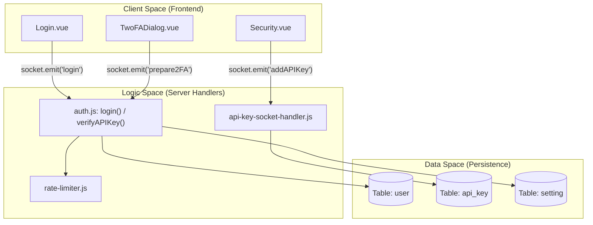

# Authentication and Security

Relevant source files

The following files were used as context for generating this wiki page:

- [server/auth.js](server/auth.js)
- [server/check-version.js](server/check-version.js)
- [server/image-data-uri.js](server/image-data-uri.js)
- [server/jobs.js](server/jobs.js)
- [server/jobs/clear-old-data.js](server/jobs/clear-old-data.js)
- [server/jobs/incremental-vacuum.js](server/jobs/incremental-vacuum.js)
- [server/prometheus.js](server/prometheus.js)
- [server/rate-limiter.js](server/rate-limiter.js)
- [server/socket-handlers/api-key-socket-handler.js](server/socket-handlers/api-key-socket-handler.js)
- [src/components/Login.vue](src/components/Login.vue)
- [src/components/TwoFADialog.vue](src/components/TwoFADialog.vue)
- [src/components/settings/About.vue](src/components/settings/About.vue)
- [src/components/settings/General.vue](src/components/settings/General.vue)
- [src/components/settings/MonitorHistory.vue](src/components/settings/MonitorHistory.vue)
- [src/components/settings/Security.vue](src/components/settings/Security.vue)
- [src/i18n.js](src/i18n.js)

This document provides a high-level overview of the authentication and security mechanisms in Uptime Kuma. It covers user login processes, session management via JWT, two-factor authentication (2FA), and programmatic access via API keys.

---

## Overview

Uptime Kuma implements a multi-layered security architecture designed for self-hosted environments. The system defaults to requiring authentication but provides flexibility for integration with external auth providers via the `disableAuth` setting.

**Key Security Components:**
- **Identity Management:** User accounts with bcrypt-hashed passwords. The system automatically upgrades legacy hashes to bcrypt upon login [server/auth.js:22-29]().
- **Session Security:** JWT-based stateless authentication. Tokens are tied to the password hash; changing a password invalidates all existing sessions [src/components/settings/Security.vue:194-200]().
- **Multi-Factor Auth:** TOTP-based 2FA for enhanced account security, managed via the `TwoFADialog` component [src/components/TwoFADialog.vue:8-11]().
- **Programmatic Access:** Scoped API keys with expiration and status management, allowing access to protected endpoints [server/auth.js:37-63]().
- **Rate Limiting:** Built-in protection against brute-force attacks on login, 2FA, and API endpoints [server/auth.js:81-96]().

**Sources:** [server/auth.js](), [src/components/settings/Security.vue](), [server/socket-handlers/api-key-socket-handler.js]()

---

## Authentication Architecture

The following diagram bridges high-level security concepts to the specific code entities that implement them, illustrating the flow from client request to data persistence.

**Sources:** [server/auth.js:15-34](), [server/socket-handlers/api-key-socket-handler.js:16-52](), [src/components/Login.vue:114-122](), [src/components/TwoFADialog.vue:179-181]()

---

## Authentication Flow

Uptime Kuma uses a dual-layered approach for web access: an initial login via username and password, followed by token-based session management.

- **Initial Login:** Credentials entered in `Login.vue` are verified against the `user` table [src/components/Login.vue:4-29](). The server checks if the user is `active` and validates the password hash [server/auth.js:20-22]().
- **JWT Management:** Upon successful authentication, a JWT is generated. The frontend stores this token to maintain the session. If `Remember me` is checked, the session persistence is adjusted accordingly [src/components/Login.vue:50-61]().
- **Rate Limiting:** The `userAuthorizer` uses a rate limiter to prevent excessive login attempts, logging warnings if limits are exceeded [server/auth.js:106-123]().

For details, see [Authentication Flow](#8.1).

**Sources:** [server/auth.js:15-34](), [src/components/Login.vue:4-29](), [server/auth.js:106-123]()

---

## Two-Factor Authentication (2FA)

Security can be hardened by enabling TOTP (Time-based One-Time Password) 2FA via the Security settings panel.

- **Setup:** The `TwoFADialog` component handles the setup, displaying a QR code generated from a URI [src/components/TwoFADialog.vue:22-29]().
- **Verification:** Users must verify a token before 2FA is fully enabled [src/components/TwoFADialog.vue:85-88]().
- **Login Integration:** If 2FA is active, the login process requires a `tokenRequired` step where the user must provide the 6-digit code [src/components/Login.vue:31-46]().

For details, see [Two-Factor Authentication](#8.2).

**Sources:** [src/components/TwoFADialog.vue:1-125](), [src/components/Login.vue:31-46]()

---

## API Keys

API keys allow secure, programmatic access to Uptime Kuma without sharing user credentials.

- **Structure:** Keys are generated with a `uk` prefix followed by the database ID and a 40-character `nanoid` [server/socket-handlers/api-key-socket-handler.js:22-32]().
- **Security:** The clear-text key is only shown once to the user upon creation. The server stores only the hashed version [server/socket-handlers/api-key-socket-handler.js:23-45]().
- **Lifecycle:** Keys can be enabled or disabled via Socket.IO events, which also clears the `apicache` to ensure immediate enforcement [server/socket-handlers/api-key-socket-handler.js:95-118]().

For details, see [API Keys](#8.3).

**Sources:** [server/socket-handlers/api-key-socket-handler.js:16-144](), [server/auth.js:41-63]()

---

## Security Hardening Features

### Disable Auth Option
The `disableAuth` setting (found in `Security.vue`) allows administrators to bypass internal authentication [src/components/settings/Security.vue:97-104](). This is intended for environments where a reverse proxy handles authentication. When active, `basicAuth` and `apiAuth` middlewares pass requests through without credential checks [server/auth.js:139-146]().

### Rate Limiting Summary
The system employs multiple limiters to protect various entry points:

| Limiter | Purpose | Implementation |
| :--- | :--- | :--- |
| `loginRateLimiter` | Protects standard web and basic auth login | [server/auth.js:108-123]() |
| `apiRateLimiter` | Restricts API requests (default ~60/min) | [server/auth.js:81-96]() |

### Session Management
Users can log out via the Security settings, which triggers the `$root.logout` method, clearing local session data [src/components/settings/Security.vue:7-15]().

**Sources:** [server/auth.js:132-176](), [src/components/settings/Security.vue:88-106](), [server/rate-limiter.js]()
