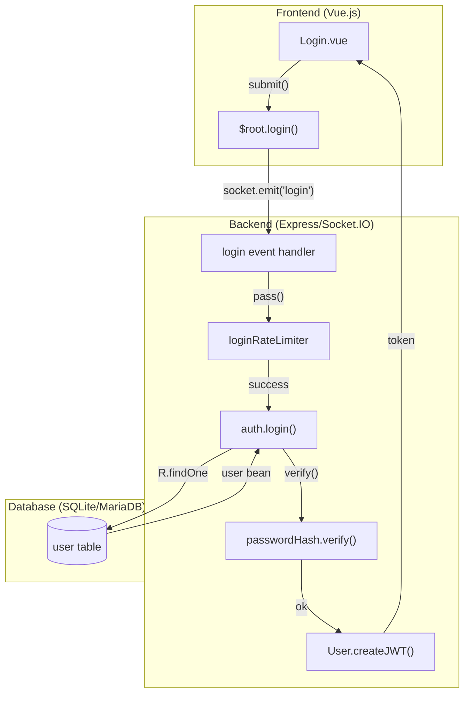
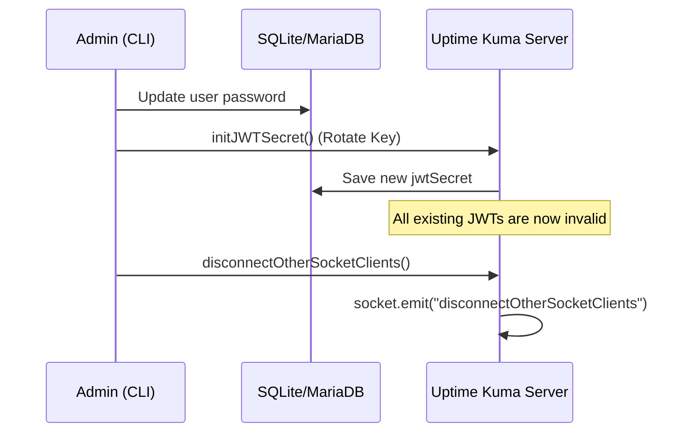

# Authentication Flow

Relevant source files

The following files were used as context for generating this wiki page:

- [extra/remove-2fa.js](extra/remove-2fa.js)
- [extra/reset-password.js](extra/reset-password.js)
- [server/2fa.js](server/2fa.js)
- [server/auth.js](server/auth.js)
- [server/check-version.js](server/check-version.js)
- [server/config.js](server/config.js)
- [server/image-data-uri.js](server/image-data-uri.js)
- [server/jobs.js](server/jobs.js)
- [server/jobs/clear-old-data.js](server/jobs/clear-old-data.js)
- [server/jobs/incremental-vacuum.js](server/jobs/incremental-vacuum.js)
- [server/model/incident.js](server/model/incident.js)
- [server/model/proxy.js](server/model/proxy.js)
- [server/model/tag.js](server/model/tag.js)
- [server/model/user.js](server/model/user.js)
- [server/password-hash.js](server/password-hash.js)
- [server/prometheus.js](server/prometheus.js)
- [server/rate-limiter.js](server/rate-limiter.js)
- [server/socket-handlers/api-key-socket-handler.js](server/socket-handlers/api-key-socket-handler.js)
- [src/components/Login.vue](src/components/Login.vue)
- [src/components/TwoFADialog.vue](src/components/TwoFADialog.vue)
- [src/components/settings/About.vue](src/components/settings/About.vue)
- [src/components/settings/General.vue](src/components/settings/General.vue)
- [src/components/settings/MonitorHistory.vue](src/components/settings/MonitorHistory.vue)
- [src/components/settings/Security.vue](src/components/settings/Security.vue)
- [src/i18n.js](src/i18n.js)

This page details the authentication mechanisms in Uptime Kuma, including the login process, JWT token generation using `shake256`, password verification, rate limiting, and session management.

## Overview

Uptime Kuma implements a secure authentication system primarily through Socket.IO. It supports traditional username/password login, persistent sessions via JWT tokens, and optional Two-Factor Authentication (2FA). All authentication attempts are governed by rate limiters to prevent brute-force attacks.

**Sources:** [server/auth.js:1-123](), [server/rate-limiter.js:1-30]()

## Authentication Architecture

The system uses a dual-layered approach for verifying identity:
1.  **Credential Verification**: Initial identity proofing via `user` table lookups and password hash comparisons.
2.  **Session Tokenization**: Subsequent requests use a JSON Web Token (JWT) that includes a partial hash of the user's password to ensure tokens are invalidated if the password changes.

### Login Data Flow

**Sources:** [src/components/Login.vue:108-126](), [server/auth.js:9-34](), [server/rate-limiter.js:5-15]()

## Password Verification and Hashing

Uptime Kuma utilizes `bcrypt` for secure password storage. The `password-hash` module manages the generation and verification of these hashes.

### The `auth.login` Function
The core login logic resides in `server/auth.js`. It performs the following steps:
1.  **Sanitization**: Trims the username input [server/auth.js:20]().
2.  **Lookup**: Queries the `user` table for an active user matching the trimmed username [server/auth.js:20]().
3.  **Verification**: Compares the provided plain-text password against the stored hash using `passwordHash.verify()` [server/auth.js:22]().
4.  **Rehash**: If the existing hash uses an older algorithm or parameters, it automatically upgrades the hash to the latest standard [server/auth.js:24-29]().

**Sources:** [server/auth.js:15-34](), [server/password-hash.js:1-40]()

## JWT Token Generation and `shake256`

When a user logs in successfully, the server generates a JWT. To ensure security, the token includes a "password version" fingerprint.

### Token Structure
The JWT payload typically includes:
*   `username`: The user's unique identifier.
*   `h`: A short hash derived from the user's current password hash using the `shake256` algorithm.

### Automatic Invalidation
If a user changes their password, the `user.password` hash in the database changes. Consequently, the `shake256` result will no longer match the `h` value stored in existing JWTs, effectively logging out all other sessions.

**Sources:** [server/auth.js:22-30](), [extra/reset-password.js:65-66]()

## Rate Limiting

To mitigate brute-force and credential stuffing attacks, Uptime Kuma employs two primary rate limiters:

| Limiter | File | Purpose |
| :--- | :--- | :--- |
| `loginRateLimiter` | `server/rate-limiter.js` | Limits the number of login attempts from a specific IP address. |
| `apiRateLimiter` | `server/rate-limiter.js` | Limits requests to the REST API and API key verification. |

### Implementation in Auth Flow
Before processing any credentials, the `userAuthorizer` and `apiAuthorizer` check the rate limiter:
1.  Call `loginRateLimiter.pass()` [server/auth.js:108]().
2.  If it returns `false`, the request is rejected with a "Rate limit exceeded" log entry [server/auth.js:119-122]().
3.  On a failed login attempt, `removeTokens(1)` is called to decrease the remaining attempts for that IP [server/auth.js:115]().

**Sources:** [server/auth.js:106-123](), [server/rate-limiter.js:5-20]()

## Session Management

Uptime Kuma manages sessions using a combination of server-side Socket.IO state and client-side storage.

### Client-Side Storage
*   **localStorage**: Used for persistent sessions if "Remember Me" is checked [src/components/Login.vue:50-62]().
*   **sessionStorage**: Used for temporary sessions that expire when the browser tab is closed.

### Resetting Sessions
The `reset-password.js` tool allows administrators to force a logout of all users by calling `initJWTSecret()`, which rotates the server's signing key, invalidating all issued tokens [extra/reset-password.js:65-66]().

**Sources:** [extra/reset-password.js:18-86](), [server/auth.js:132-146](), [extra/reset-password.js:126]()

## API Key Authentication

In addition to user sessions, Uptime Kuma supports API Keys for programmatic access.

1.  **Key Generation**: Keys are generated using `nanoid(40)` and stored as a bcrypt hash [server/socket-handlers/api-key-socket-handler.js:22-25]().
2.  **Key Format**: Formatted as `uk{id}_{clearKey}` [server/socket-handlers/api-key-socket-handler.js:32]().
3.  **Verification**: The `verifyAPIKey` function extracts the ID from the string (index between `uk` and `_`), fetches the hash from the `api_key` table, and verifies the `clearKey` against it [server/auth.js:41-63]().
4.  **Expiry and Status**: Keys are checked against their `expires` column and `active` status [server/auth.js:56-60]().

**Sources:** [server/auth.js:41-63](), [server/socket-handlers/api-key-socket-handler.js:16-52]()

## Disabling Authentication

Uptime Kuma provides an option to disable authentication for specific environments (e.g., local development or internal networks). This is controlled via the `disableAuth` setting [server/auth.js:139-141]().

*   When `disableAuth` is enabled, the `basicAuth` and `apiAuth` middlewares skip the authorizer and call `next()` immediately [server/auth.js:141-145](), [server/auth.js:173-175]().
*   The UI provides a warning and confirmation dialog before allowing a user to disable authentication [src/components/settings/Security.vue:111-142]().

**Sources:** [server/auth.js:132-176](), [src/components/settings/Security.vue:88-105]()
