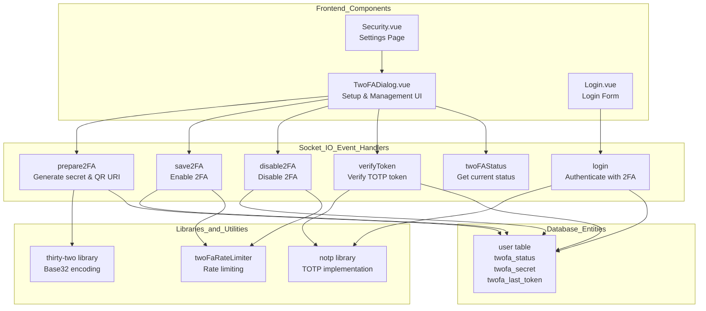
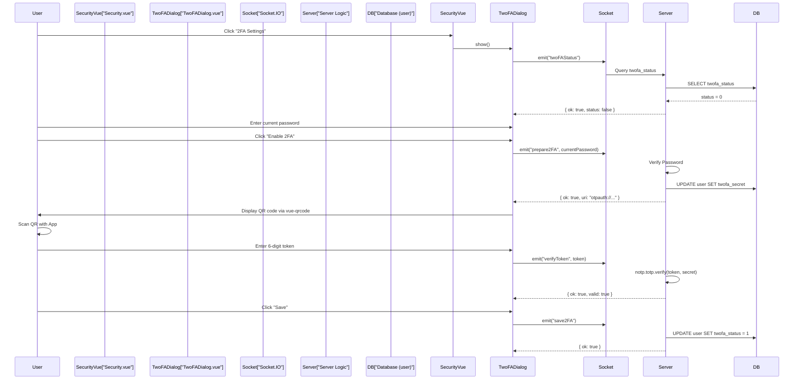
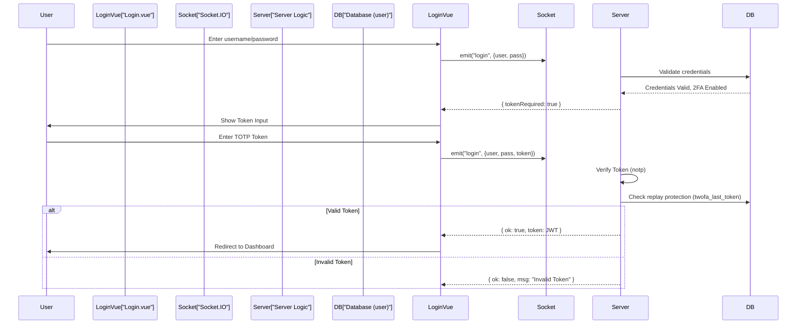

# Two-Factor Authentication

Relevant source files

The following files were used as context for generating this wiki page:

- [extra/remove-2fa.js](extra/remove-2fa.js)
- [extra/reset-password.js](extra/reset-password.js)
- [server/2fa.js](server/2fa.js)
- [server/check-version.js](server/check-version.js)
- [server/config.js](server/config.js)
- [server/model/incident.js](server/model/incident.js)
- [server/model/proxy.js](server/model/proxy.js)
- [server/model/tag.js](server/model/tag.js)
- [server/model/user.js](server/model/user.js)
- [server/password-hash.js](server/password-hash.js)
- [src/components/Login.vue](src/components/Login.vue)
- [src/components/TwoFADialog.vue](src/components/TwoFADialog.vue)
- [src/components/settings/About.vue](src/components/settings/About.vue)
- [src/components/settings/General.vue](src/components/settings/General.vue)
- [src/components/settings/MonitorHistory.vue](src/components/settings/MonitorHistory.vue)
- [src/components/settings/Security.vue](src/components/settings/Security.vue)
- [src/i18n.js](src/i18n.js)

## Purpose and Scope

This document describes the Two-Factor Authentication (2FA) implementation in Uptime Kuma. The system provides an additional security layer using Time-based One-Time Passwords (TOTP) compatible with authenticator apps like Google Authenticator, Authy, and Microsoft Authenticator.

This document covers the 2FA setup process, login flow, token verification, and management operations. For general authentication mechanisms, see [Authentication Flow](8.1).

---

## Architecture Overview

Uptime Kuma's 2FA system uses the TOTP (Time-based One-Time Password) standard defined in RFC 6238, implemented via the `notp` library. The implementation includes QR code generation for easy setup, token replay protection, and rate limiting to prevent brute-force attacks.

### Core 2FA Components

The following diagram illustrates the interaction between frontend components, Socket.IO handlers, and backend logic.

**Sources:** [src/components/TwoFADialog.vue:1-125](), [src/components/settings/Security.vue:73-82](), [src/components/Login.vue:31-46]()

---

## TOTP Implementation

The system uses TOTP with the following parameters:

| Parameter | Value | Description |
|-----------|-------|-------------|
| Algorithm | SHA-1 | HMAC hashing algorithm (Standard TOTP) |
| Time step | 30 seconds | Token refresh interval |
| Token length | 6 digits | Standard TOTP format |
| Window | 1 | Allows ±1 time step tolerance (prevents clock drift issues) |

### Secret Generation and Encoding

When 2FA is initiated, the system:
1. Generates a random secret.
2. Base32-encodes the secret using the `thirty-two` library.
3. Removes padding characters (`=`) for Google Authenticator compatibility.
4. Creates an `otpauth://` URI for QR code generation, formatted as `otpauth://totp/Uptime%20Kuma:{username}?secret={encodedSecret}&issuer=Uptime%20Kuma`.

**Sources:** [src/components/TwoFADialog.vue:142-146](), [src/components/TwoFADialog.vue:22-39]()

---

## 2FA Setup Flow

The following sequence diagram shows how a user enables 2FA through the settings interface.

**Sources:** [src/components/settings/Security.vue:78-81](), [src/components/TwoFADialog.vue:149-160](), [src/components/TwoFADialog.vue:74-92](), [src/components/TwoFADialog.vue:112-115]()

### Setup Process Details

1. **Initial Status Check**: The `TwoFADialog` calls `getStatus()` on mount to determine if the user already has 2FA enabled. [src/components/TwoFADialog.vue:149-152]()
2. **Secret Generation**: Initiated by `prepare2FA()`. The server generates a secret and returns an `otpauth` URI. [src/components/TwoFADialog.vue:56-62]()
3. **Token Verification**: Before saving, users must verify a token using `verifyToken()`. This ensures the authenticator app is correctly configured. [src/components/TwoFADialog.vue:85-88]()
4. **Finalization**: `save2FA()` sends the final instruction to the server to set `twofa_status` to active in the database. [src/components/TwoFADialog.vue:112-115]()

---

## Login Flow with 2FA

When 2FA is enabled, the `Login.vue` component handles a multi-stage authentication process.

**Sources:** [src/components/Login.vue:31-46](), [src/components/Login.vue:111-123]()

### Login Component Logic

- **tokenRequired State**: A boolean in `Login.vue` that toggles the UI between password and TOTP token entry. [src/components/Login.vue:84]()
- **Auto-focus**: When `tokenRequired` becomes true, the UI automatically focuses the `otpInput` field via a watcher. [src/components/Login.vue:88-95]()
- **Submission**: The `submit()` method in `Login.vue` sends the `token` along with credentials if `tokenRequired` is active. [src/components/Login.vue:111-123]()

---

## Security Features

### Token Replay Protection
The system prevents the reuse of a TOTP token within the same time window by storing the `twofa_last_token` in the database. If a submitted token matches the last used token, authentication is rejected even if the token is mathematically valid for the current time step.

### Rate Limiting
Authentication attempts and 2FA management operations (like `save2FA` or `disable2FA`) are subject to rate limiting to prevent brute-force attacks on either the password or the 6-digit TOTP token.

### Password Verification
Management operations (enabling or disabling 2FA) require the user's current password to be re-entered, protecting against session hijacking. [src/components/TwoFADialog.vue:41-53]()

---

## Management Operations

### Disabling 2FA
Users can disable 2FA via the `TwoFADialog`. This triggers a confirmation modal (`confirmDisableTwoFA`) and requires the current password. [src/components/TwoFADialog.vue:64-72](). 

### Emergency Recovery
If a user is locked out, the `extra/remove-2fa.js` utility can be used via the command line to reset 2FA status for a user directly in the database.
Additionally, the password reset tool `extra/reset-password.js` can reset user credentials and re-initialize the JWT secret, which facilitates regaining access and invalidating old sessions. [extra/reset-password.js:63-69]()

---

## User Interface Components

### TwoFADialog Component
The primary interface for 2FA management.
- **QR Code**: Rendered using `vue-qrcode`. [src/components/TwoFADialog.vue:23-29]()
- **Status Indicators**: Displays "Active" or "Inactive" badges based on `twoFAStatus`. [src/components/TwoFADialog.vue:9-10]()
- **Verification**: Provides a real-time feedback message `tokenValidSettingsMsg` when a token is successfully verified during setup. [src/components/TwoFADialog.vue:89-91]()

### Security Settings
The 2FA configuration is housed within the Security tab of the settings page. [src/components/settings/Security.vue:73-82]()

**Sources:** [src/components/TwoFADialog.vue:1-125](), [src/components/settings/Security.vue:1-109]()
