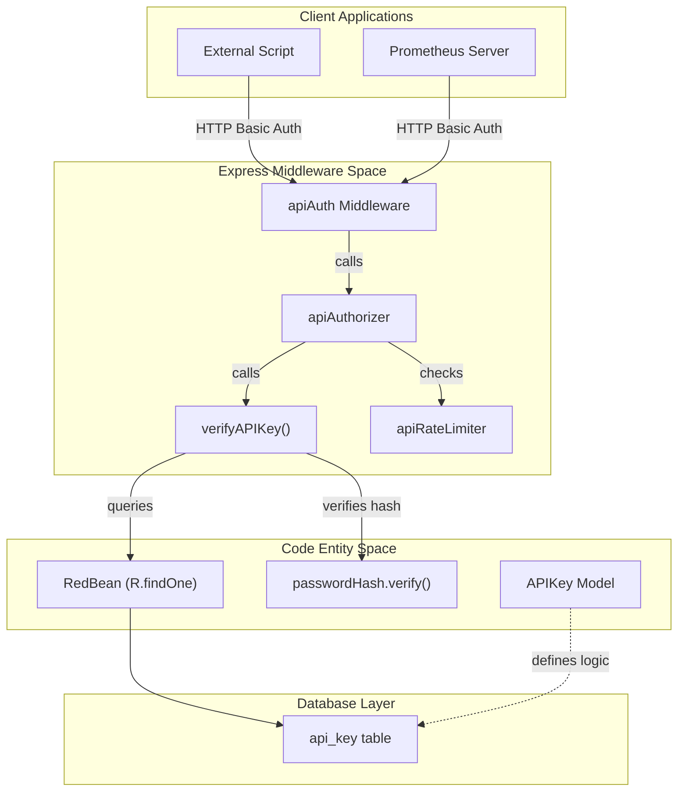
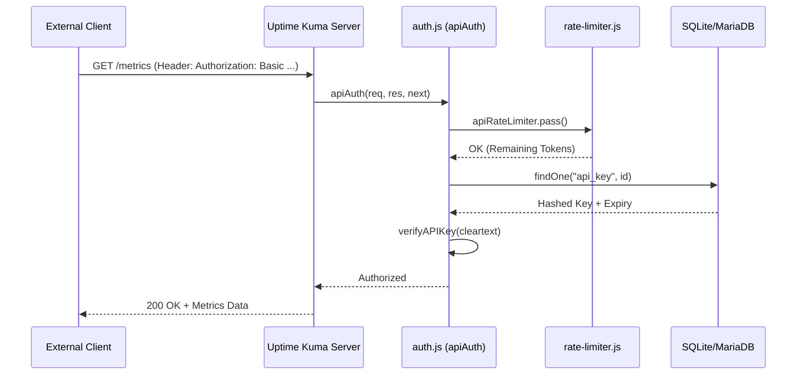

# API Keys

Relevant source files

The following files were used as context for generating this wiki page:

- [server/auth.js](server/auth.js)
- [server/image-data-uri.js](server/image-data-uri.js)
- [server/jobs.js](server/jobs.js)
- [server/jobs/clear-old-data.js](server/jobs/clear-old-data.js)
- [server/jobs/incremental-vacuum.js](server/jobs/incremental-vacuum.js)
- [server/prometheus.js](server/prometheus.js)
- [server/rate-limiter.js](server/rate-limiter.js)
- [server/socket-handlers/api-key-socket-handler.js](server/socket-handlers/api-key-socket-handler.js)
- [src/components/APIKeyDialog.vue](src/components/APIKeyDialog.vue)
- [src/components/CertificateInfo.vue](src/components/CertificateInfo.vue)
- [src/components/CertificateInfoRow.vue](src/components/CertificateInfoRow.vue)
- [src/components/RemoteBrowserDialog.vue](src/components/RemoteBrowserDialog.vue)
- [src/components/settings/APIKeys.vue](src/components/settings/APIKeys.vue)

## Purpose and Scope

This document describes the API Key authentication system in Uptime Kuma, which provides programmatic access control for API endpoints without requiring traditional username/password authentication. API keys enable external applications, scripts, and services to interact with Uptime Kuma's HTTP endpoints securely via Basic Authentication headers.

For information about user authentication via JWT tokens and 2FA, see [Authentication Flow](8.1) and [Two-Factor Authentication](8.2). For Socket.IO event-based communication, see [Socket.IO Events](9.1).

---

## Overview

API keys in Uptime Kuma are authentication tokens that grant access to specific HTTP API endpoints. They provide an alternative to session-based JWT authentication and are particularly useful for:

- **Prometheus metrics endpoint** (`/metrics`) - External monitoring systems [server/prometheus.js:38-97]()
- **Programmatic access** - Automated scripts and tools using the REST API [server/auth.js:155-176]()

Unlike JWT tokens which expire or are invalidated on password changes, API keys have independent lifecycle management with optional expiry dates. They are implemented as a specialized form of Basic Authentication where the "password" field contains the API key [server/auth.js:79-97]().

**Sources:** [server/auth.js:41-63](), [server/auth.js:155-176](), [server/socket-handlers/api-key-socket-handler.js:16-52]()

---

## System Architecture

The following diagram illustrates the flow from programmatic clients through the authentication middleware to the database.

### API Key Authentication Data Flow

**Sources:** [server/auth.js:41-63](), [server/auth.js:79-97](), [server/auth.js:155-176](), [server/rate-limiter.js:57-62]()

---

## Data Model

API keys are represented by the `APIKey` model and stored in the `api_key` table.

| Column | Description |
|--------|-------------|
| `id` | Primary key used as part of the key prefix (`uk{id}_`) [server/auth.js:47]() |
| `key` | Hashed version of the random token [server/socket-handlers/api-key-socket-handler.js:23-24]() |
| `name` | User-defined label [src/components/APIKeyDialog.vue:14-17]() |
| `user_id` | Owner of the key [server/socket-handlers/api-key-socket-handler.js:76]() |
| `expires` | ISO timestamp or NULL for "Never" [src/components/APIKeyDialog.vue:20-47]() |
| `active` | Boolean flag (1 = Enabled, 0 = Disabled) [server/socket-handlers/api-key-socket-handler.js:101]() |

**Sources:** [server/socket-handlers/api-key-socket-handler.js:22-32](), [server/auth.js:47-50](), [src/components/APIKeyDialog.vue:14-47]()

---

## API Key Lifecycle

### Creation and Formatting

When a user creates a key via the UI, the server performs the following steps:
1. Generates a 40-character random string using `nanoid(40)` [server/socket-handlers/api-key-socket-handler.js:22]().
2. Hashes the string using `passwordHash.generate()` [server/socket-handlers/api-key-socket-handler.js:23]().
3. Saves the hash and metadata to the database via `APIKey.save()` [server/socket-handlers/api-key-socket-handler.js:25]().
4. Formats the final key as `uk{bean.id}_{clearKey}` [server/socket-handlers/api-key-socket-handler.js:32]().
5. Automatically enables API key authentication by setting the `apiKeysEnabled` setting to `true` [server/socket-handlers/api-key-socket-handler.js:37]().

### Validation Logic

The `verifyAPIKey(key)` function in `server/auth.js` parses the incoming token:
1. It extracts the ID from the prefix (between `uk` and `_`) [server/auth.js:47]().
2. It fetches the hashed record from the database by ID [server/auth.js:50]().
3. It checks if the key is `active` and not expired using `dayjs` [server/auth.js:56-60]().
4. It performs a hash verification of the provided cleartext against the stored hash [server/auth.js:62]().

**Sources:** [server/auth.js:41-63](), [server/socket-handlers/api-key-socket-handler.js:18-52]()

---

## Programmatic Usage

### Programmatic Access Flow

**Sources:** [server/auth.js:79-97](), [server/auth.js:155-176](), [server/rate-limiter.js:57-62]()

### Rate Limiting
API access is protected by the `apiRateLimiter`, which allows **60 requests per minute** [server/rate-limiter.js:57-62](). Each authentication attempt via `apiAuthorizer` consumes 1 token [server/auth.js:90]().

---

## Socket.IO Management Events

The management of keys is handled in `server/socket-handlers/api-key-socket-handler.js`.

| Event | Logic | Source |
|-------|-------|--------|
| `addAPIKey` | Generates new nanoid, hashes it, saves the bean, and enables `apiKeysEnabled` setting. | [server/socket-handlers/api-key-socket-handler.js:18-52]() |
| `getAPIKeyList` | Fetches all keys for the current user and sends them to the client. | [server/socket-handlers/api-key-socket-handler.js:54-68]() |
| `deleteAPIKey` | Removes the record and clears `apicache`. | [server/socket-handlers/api-key-socket-handler.js:70-93]() |
| `disableAPIKey` | Sets `active = 0` and clears `apicache`. | [server/socket-handlers/api-key-socket-handler.js:95-118]() |
| `enableAPIKey` | Sets `active = 1` and clears `apicache`. | [server/socket-handlers/api-key-socket-handler.js:120-143]() |

**Sources:** [server/socket-handlers/api-key-socket-handler.js:1-144]()

---

## UI Components

### APIKeyDialog (`src/components/APIKeyDialog.vue`)
This component handles the creation interface.
- **Fields**: Name and Expiry Date [src/components/APIKeyDialog.vue:14-47]().
- **Expiry**: Uses `@vuepic/vue-datepicker`. Supports "Don't expire" which sets the database value to `null` [src/components/APIKeyDialog.vue:109-143]().
- **One-time Display**: The cleartext key is only shown once in a `CopyableInput` after successful generation [src/components/APIKeyDialog.vue:67-74]().

### APIKeys Settings (`src/components/settings/APIKeys.vue`)
The main management list in the settings panel.
- **Visibility**: If `disableAuth` is true, the UI displays a disabled message [src/components/settings/APIKeys.vue:3-5]().
- **State Display**: Keys are styled based on status: `active`, `inactive`, or `expired` [src/components/settings/APIKeys.vue:189-209]().
- **Actions**: Provides buttons to Enable, Disable, or Delete keys via Socket.IO emits [src/components/settings/APIKeys.vue:38-55]().

**Sources:** [src/components/APIKeyDialog.vue:1-171](), [src/components/settings/APIKeys.vue:1-152]()
